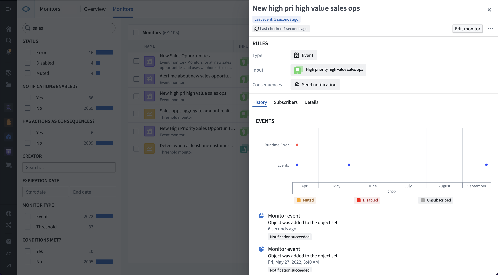
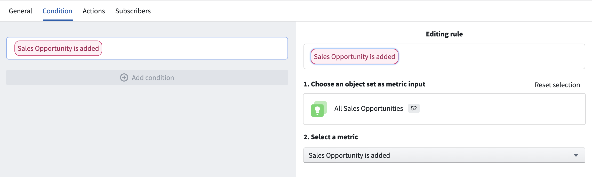
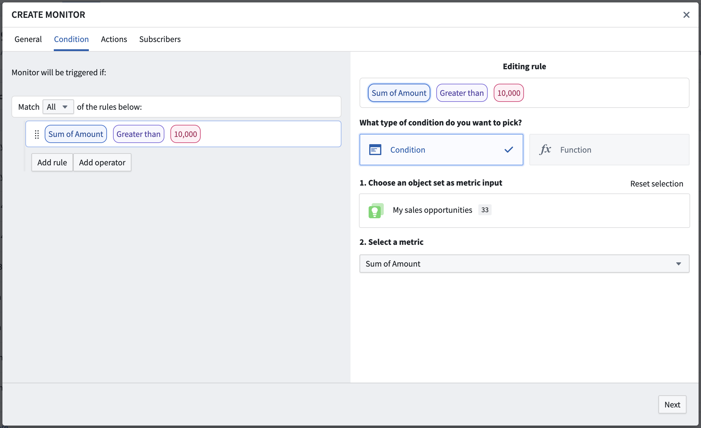
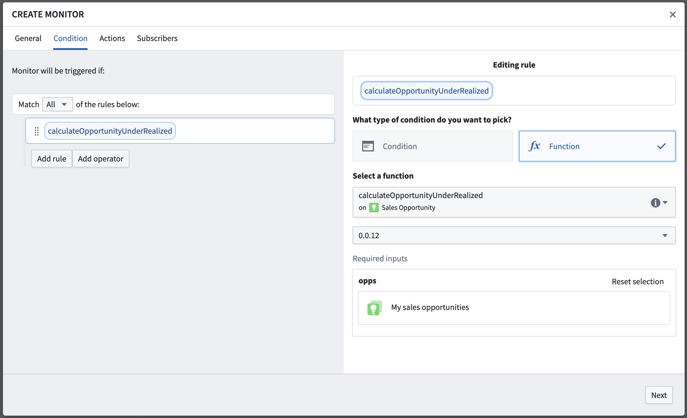

<!-- source: https://palantir.com/docs/foundry/object-monitors/condition/ · mirrored 2026-08-18 from Palantir Foundry docs -->

# Condition

:::callout{theme="warning"}
Object Monitors are superseded by [Automate](/docs/foundry/automate/overview/). Automate is a fully backward-compatible product that offers a single entry point for all business automation in the platform.
:::

Object monitor conditions define when new monitored activity will be detected and recorded. **Threshold** conditions result in a continuous true or false status, while **event** conditions produce discrete events. Conditions may include several sub-conditions and may reference multiple [input](/docs/foundry/object-monitors/input/) object sets. Object monitors support the following condition types:

## Event

Event conditions are the most common condition type. Event conditions include objects added or removed from the input and metric increase or decrease conditions. Each event takes place at a specific time and is a discrete event. As such, they display as dots in the activity graph:



In the example below, the event condition uses a single input exploration and checks for when new objects are used in that exploration. Objects may be added because they were newly created or changed to match the filters used to define the input.



Some event conditions may require a threshold sub-condition. In these cases, both the primary condition and sub-condition must be true for an event to be detected. For example, a threshold sub-condition may be used to detect when the count of input objects increases, but only if the primary condition of having at least `N` objects already in the input set is met.

## Threshold

Threshold conditions are run on the inputs to produce a status of `true` or `false` over time. Activity is recorded when the threshold is crossed in either direction. Conditions using a threshold may include any number of nested sub-conditions.

An example threshold condition in the Object Monitors application is shown below. In this example, the condition checks for when the sum of `amount` across a custom cohort of Sales Opportunities is greater than `10,000`.



:::callout{theme="neutral"}
Threshold conditions do not support [realtime evaluation](/docs/foundry/object-monitors/evaluation/#realtime-evaluation).
:::

## Function-backed

Function-backed conditions are designed to allow more complex condition definitions, including anything not supported by the event or threshold rule options. Function-backed conditions work by defining and publishing a function that returns a Boolean value of `true` or `false`. The function will be called when the monitor is evaluated, and the response must indicate the result for that execution. If the status has changed, an event will be recorded.

The Function should take an `ObjectSet<>` of the object type being monitored and return a Boolean value indicating if the condition is met. Learn more about [authoring a Function](/docs/foundry/functions/use-functions/) to use with Object Monitors.

The example below uses a Function to compute when the sum of `realized_amount` is less than the sum of `expected_amount` for an input set of Sales Opportunity objects.



```
@Function()
/**
 * This function calculates if the realized amount for a set of sales opportunities is smaller than
 * the sum of all the opportunity amounts.
 */
public async calculateOpportunityUnderRealized(opportunities: ObjectSet<SalesOpportunity>): Promise<boolean> {
    let amount = await opportunities.sum(o => o.amount)
    let amountRealized = await opportunities.sum(o => o.amountRealized)
    if (amount !== null && amountRealized !== null && amountRealized < amount) {
        return true
    } else {
        return false
    }
}
```

:::callout{theme="neutral"}
Function-backed conditions do not support [realtime evaluation](/docs/foundry/object-monitors/evaluation/#realtime-evaluation). Additionally, Function-backed conditions may only be used with threshold conditions and only by outputting a single Boolean value.
:::
