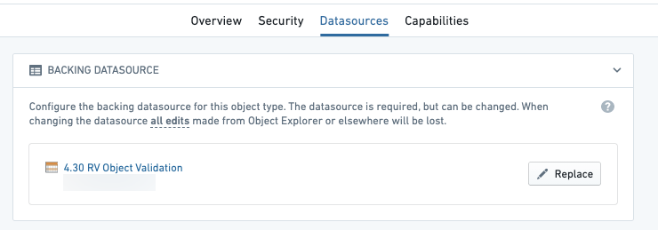
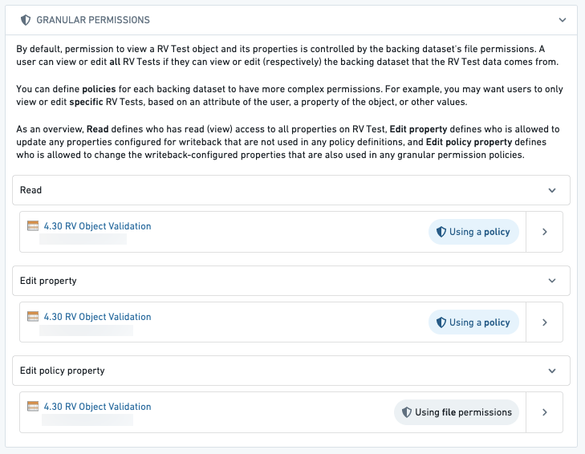

<!-- source: https://palantir.com/docs/foundry/object-permissioning/configuring-rv-access-controls/ · mirrored 2026-08-05 from Palantir Foundry docs -->

# Configure restricted-view-backed object types

[Restricted views (RVs)](/docs/foundry/platform-security-management/manage-restricted-views/#use-restricted-views-to-back-object-types) enable row-level access controls for ontology data. This allows for finer-grained access control than simply granting access to an entire dataset or all objects of a certain type.

Restricted views are similar to datasets but restrict access to *specific rows* in datasets. Restricted views are configured at the dataset level, and ontology objects inherit the granular permissions defined in the restricted view policy.

## Use restricted views to back object types

Backing an object type with a restricted view will control the specific objects a user can see. For example, if a user meets the requirements for a policy and can see a specific row in the restricted view, then they will be able to see the corresponding ontology object.

To view objects of an object type backed by a dataset, you must also be able to view the dataset.

* To view objects of an object type backed by a restricted view in Object Storage v1 (Phonograph), you must be able to view the object type itself; you do not necessarily need to see the restricted view. Rather, you only need to satisfy the restricted view's [markings](/docs/foundry/security/restricted-views/#create-marking-backed-restricted-views) and its read policy for that row.
* In Object Storage v2, you must be able to see a restricted view to see objects of the object type backed by that restricted view.

When restricting specific objects from a user, only select restricted views in the Ontology Manager as an object type’s backing datasource.

## Ontology edits

:::callout{theme="warning"}
Access to an ontology object can be affected by user edits, since it is possible to edit a property that is referenced in the object's security. In such cases, a user might be able to see a row in the backing restricted view but not see the corresponding object in the ontology, or vice versa.
:::

For example, consider a `Ticket` object type with the following data, where the policy on the restricted view requires you to be a member of the group in the `Assignee` column to see the row.

| Ticket ID  | Title      | Assignee         |
|------------|------------|------------------|
| 101        | Ticket One | palantir-support |

If an action were applied to change the `Assignee` on this object to `customer-support`, then members of `palantir-support` who are not also members of `customer-support` will lose access to the object within the ontology. However, they will retain visibility of the row in the restricted view, which is unaffected by the action. Members of `customer-support` who are not also members of `palantir-support` would gain access to the ontology object, but still not be able to see the row in the restricted view.

## Security configuration

The **Datasources** tab in the Ontology Manager will show additional configuration options to edit **Granular Policies**. The **Granular Policies** section allows you to configure permissions for editing objects of this type.

:::callout{theme="warning"}
Granular Policies for edits can only be configured for object types using Object Storage v1 which do not have the **Only allow edits via actions** option selected. For all other object types, edit permissions are controlled via action types editing the object types. [Learn more about action permissions.](/docs/foundry/action-types/permissions/)
:::

You can configure these policies to accommodate cases where you want users to view or edit only specific objects based on their attributes (like a property of the object). For example, you may only want users from `Europe` (found in the `region` column) to see and edit European objects, which may differ from the restricted view’s policy.

There are three policies that can define who can access the properties on an object:

* **Read:** This policy defines who can view all properties on the Restricted View. Using the example above, this might be a policy that compares the `region` column with what is in the user’s attributes (`Europe`) to determine what objects the user can see.
* **Edit property:** This policy defines who is allowed to update any of the properties configured for writeback that are not used in any granular permissions policy definitions. Using the example above, this policy would control who can edit the `name` property, but not who can edit the `region` property, since the `region` property is used in the policy.
* **Edit policy property:** This policy defines who is allowed to update any of the properties configured for writeback that are also used in any granular permissions policy definitions. Using the example above, this policy would control who can edit the `region` property.

:::callout{theme="warning"}
If view policies are changed after the object type was registered with Object Storage v1 (Phonograph), the registration must be updated through the **Update** button in the Phonograph section of the object type's **Datasources** tab in **Ontology Manager**. If the registration is not updated, the latest data of the restricted view may be made available based on previously registered policies. Automatic policy propagation is available by default in Object Storage v2.
:::
