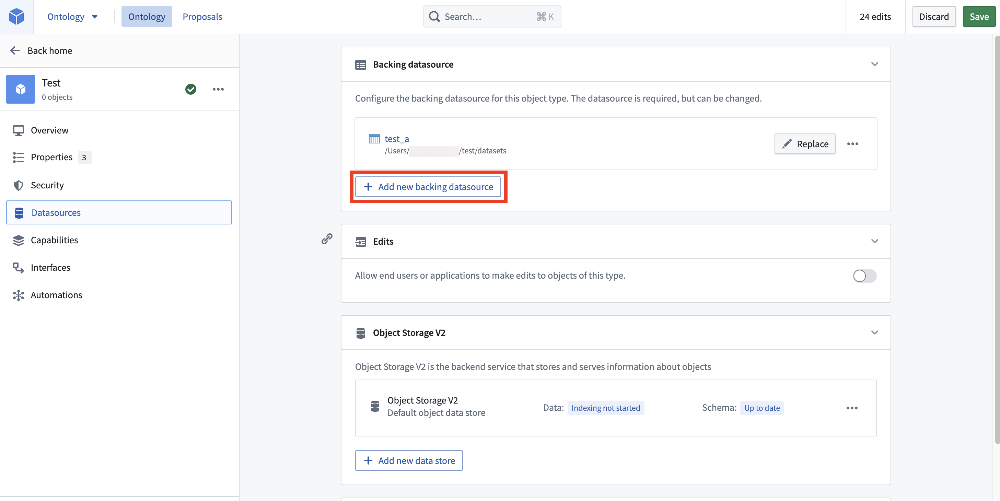
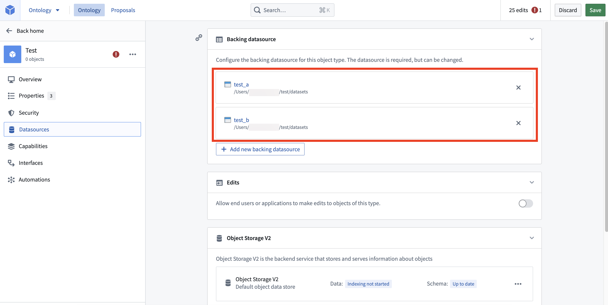

<!-- source: https://palantir.com/docs/foundry/object-permissioning/multi-datasource-objects/ · mirrored 2026-08-18 from Palantir Foundry docs -->

# Multi-datasource object types (MDOs)

:::callout{theme="neutral"}
Multi-datasource object types (MDOs) are only available in Object Storage v2.
:::

A multi-datasource object type (MDO) is backed by multiple datasources in the Ontology. At this time, only [Foundry datasets](/docs/foundry/data-integration/datasets/) or [restricted views](/docs/foundry/security/restricted-views/) can be used for MDOs. Streaming sources are not supported.

## Types of multi-datasource object types (MDOs)

There are two distinct categories of MDOs:

* **Column-wise MDO:** A join-like MDO case where distinct subsets of properties for an object type can be integrated from different datasources. Column-wise MDOs can be used to support use cases where there is a need for column-level access controls.
* **Row-wise MDO:** A union-like MDO case where full objects (an object with all of its properties) can be integrated from multiple datasources sharing the same schema. Row-wise MDOs can be used to support use cases where there is a need for row-level access controls. In Foundry, [restricted views](/docs/foundry/object-permissioning/configuring-rv-access-controls/) provide support for use cases in which you might use row-wise MDOs. Row-wise MDOs themselves are not available.

:::callout{theme="warning"}
Foundry only supports column-wise MDOs and does not support row-wise MDOs. Most row-wise MDO use cases can be accomplished with [restricted views](/docs/foundry/object-permissioning/configuring-rv-access-controls/). If you have a use case for row-wise MDOs that **cannot** be enabled via restricted views, contact your Palantir representative for assistance.
:::

## Configure a multi-datasource object type

After [creating an object type](/docs/foundry/object-link-types/create-object-type/#create-a-new-object-type-manually) in Ontology Manager using Object Storage v2, navigate to the **Datasource** metadata section of the object type from the left sidebar. Then, select **Add new backing datasource** to choose a dataset.

The **Map primary key** helper will appear and prompt you for a column with values matching the primary key of the object type. Once you choose a column, multiple backing datasets will appear under the **Backing datasource** section.

Navigate to the **Properties** metadata section from the left sidebar to add new fields to the newly added dataset.

## FAQ

### Are multi-datasource object types available for an object type indexed into Object Storage v1 (Phonograph)?

No. MDOs are only supported in Object Storage v2 and are not available for Object Storage v1 (Phonograph).

### Are both column-wise MDO and row-wise MDO supported?

Only column-wise MDOs are currently available. If you have a use case for row-wise MDOs that cannot be enabled via restricted views, contact your Palantir representative for assistance.

### Are user edits and materializations supported for MDO?

Yes, [user edits](/docs/foundry/object-edits/overview/) and [materializations](/docs/foundry/object-edits/materializations/) are supported for MDO.

### What happens if a user cannot view some of the input datasources for a given object type? What will the user experience be like?

If a user lacks `Viewer` permission on some of the input datasources, the properties mapped from those datasources will appear as `null` when displaying an object to the user. However, the user will still be able to view the schema of that object type (such as seeing property names), since access to the object type is controlled separately from the input datasource.

[Learn more about permissions for object types.](/docs/foundry/object-permissioning/ontology-permissions/)

### Is property multiplicity supported?

Property multiplicity refers to multiple input datasources feeding overlapping columns/properties of an object type in the column-wise MDO case. Property multiplicity is currently not supported. This means that a specific property of an object type must come from one—and only one—of the input datasources (except for the primary key property, which must exist in every input datasource to join all datasources).

### Can a property corresponding to a restricted view policy be mapped to multiple restricted view datasources if they share the same policy?

No, this is not supported; each restricted view datasource should have a separate policy property on the object type. Some of these properties can be marked as hidden in the [Ontology Manager](/docs/foundry/ontology-manager/overview/#property-editor-view) to avoid cluttering front-end applications.

### What is the difference between MDOs and linking two distinct object types with a foreign key relation? How should users decide between these options?

MDOs are intended to provide a user-friendly way to configure the same setup as a single object type to build an organization's digital twin. Multiple object types with links between them can also be used for cases in which that is how users understand and interact with their data. Note that querying and traversing links between multiple object types is a more expensive operation than filtering on a property on the same object type.

### Which objects appear if two column-wise datasources for an object have different sets of primary keys?

If two column-wise datasources for an object have different sets of primary keys, the behavior will be similar to the case in which some users do not have access to some input datasources. In these cases, primary keys that do not exist in a datasource will have the properties that are mapped from that particular input datasource displayed as `null`.

### Is there a limit to the number of datasources an object type can have?

Object types are limited to a maximum of 70 datasources. Only datasources that are synced to object storage count towards this limit, so it does not include media sets or time series syncs.

### Can I use MDOs with streaming object types?

No, MDOs are not supported with streaming object types. This is a known limitation of Object Storage v2.
