<!-- source: https://palantir.com/docs/foundry/object-permissioning/object-security-policies/ · mirrored 2026-08-05 from Palantir Foundry docs -->

# Object and property security policies

Object security policies allow you to configure view permissions on an object instance by configuring security policies on the object type, independently of the permissions on the backing data source. These are used to achieve *row-level security*.

The visibility of specific properties can be guarded using additional *property security policies*. These are identical to object security policies, except they only apply to a selection of properties. These are used to achieve *column-level security*.

By default, object security policies are applied to all properties. When a property security policy includes a property, the user must pass both the object security policy and the property security policy to view the property value. The combination of object and property security policies is used to achieve *cell-level security*. If a user does not pass the object security policy, the object instance will not be viewable to that user. If they pass the object security policy but do not pass the property security policy, they will see a *null* value in place of the property value.

## Configure object and property security policies

Access to an object instance and its properties is determined by the following conditions:

* `Viewer` access to the object type.
* Passing a granular policy, if configured.
* Passing any [marking](/docs/foundry/security/markings/), [organization](/docs/foundry/security/orgs-and-spaces/#organizations), or [classification](/docs/foundry/security/classification-based-access-controls/) checks.

When an object or property security policy is configured, users do not need `Viewer` permissions to the object type's backing data sources to view object instances.

:::callout{theme="warning"}
If your enrollment uses the legacy [datasource-derived permissions model](/docs/foundry/object-permissioning/ontology-permissions-legacy/#datasource-derived-permissions), users still require `Viewer` permissions on the backing data source to view the object type and its instances. This requirement applies even when an object security policy is configured. Because datasource-derived permissions defeat the decoupling that object security policies provide, we recommend [migrating to project-based permissions](/docs/foundry/object-permissioning/ontology-permissions/) before configuring object security policies.
:::

Consider an example where a `Passenger` object type has the properties `User ID`, `Flight Number`, `Seat Assignment`, `Name`, `Address`, and `Phone Number`. Some passengers are VIPs, whose information can only be seen by users who have access to a `VIP` marking. Additionally, some properties, such as `Name`, `Address`, and `Phone Number`, should be visible only to users who have the `PII` marking, and are authorized to view personally identifiable information. Since the backing dataset consists of sensitive data, it should be marked with `PII` and `VIP`. However, users without sensitive markings should still be able to access a passenger’s flight details.

The following steps can be taken to secure the `Passenger` object type using object security policies.

1. Navigate to the **Security** tab of the object type.    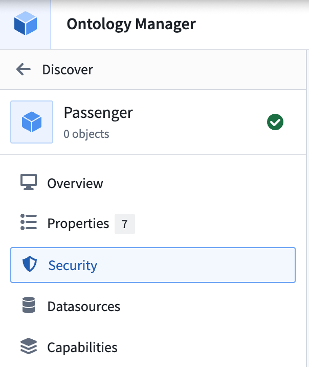   
2. Select **Create** under the **Security policies** section to override data source policies with object security policies.   
   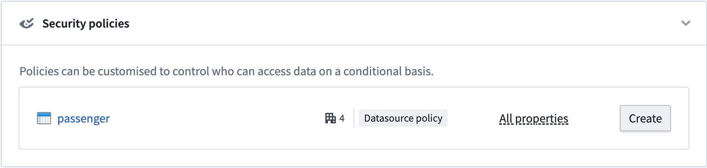   
3. Create the object security policy that edits view permissions for object instances. You have the option to add a granular policy and edit the organization and markings.   
   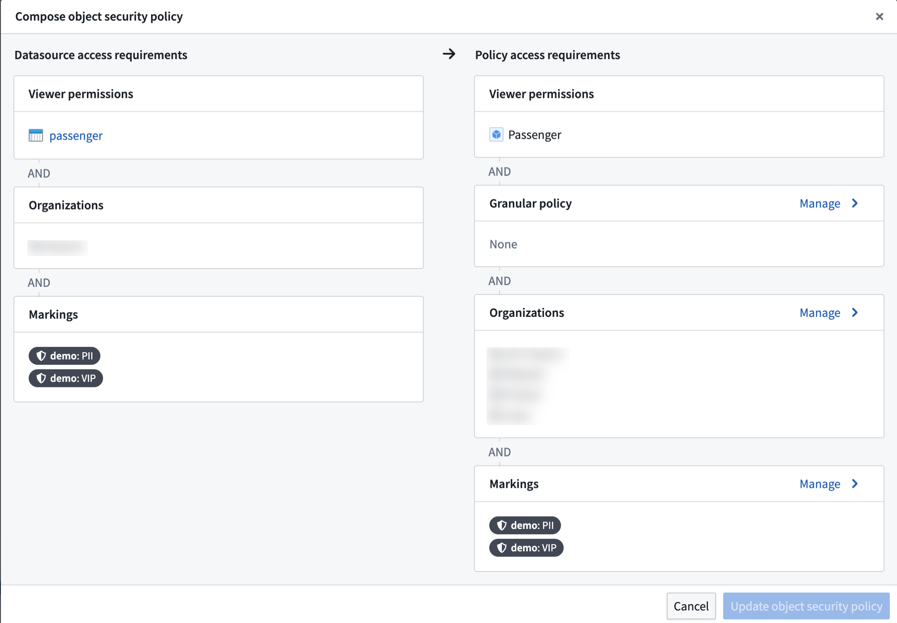   
4. In the **Markings** configuration, stop inheriting the `PII` and `VIP` markings so that users without those markings can see object instances.   
   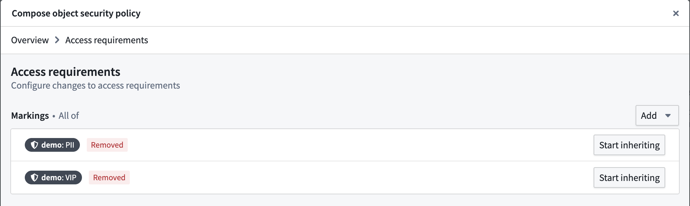   
5. Add a **Granular policy** to limit access to VIPs. The `VIP` marking is added as a [mandatory control property](/docs/foundry/object-link-types/mandatory-control-properties/). Every row has a set of markings in the mandatory control property that need to be satisfied by a user to access that object instance.   
   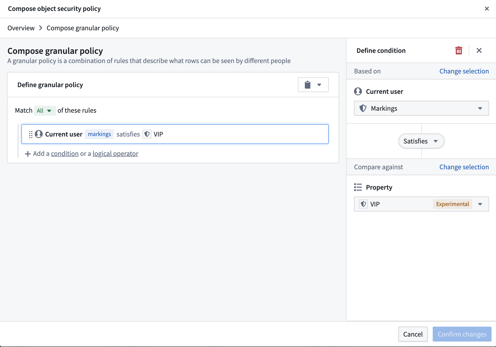   

:::callout{theme="warning"}
Avoid using `NOT` conditions with group, marking, or organization memberships. Using a `NOT` condition in these circumstances is a misconfiguration. The platform supports scoped tokens, which carry only a subset of a user's permissions. These tokens may lack the attribute the `NOT` condition checks against, causing the condition to pass and grant more access than intended.
:::

6. This creates the object security policy. Now, we need to secure the `PII` properties with the `PII` marking. We can do this by adding a property security policy.   
   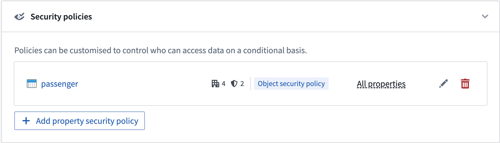   
7. Select the properties that need to be secured and give the policy a name. Then, add the `PII` marking in the **Manage markings** setting. The configuration settings for property security policies are identical to object security policies.   
   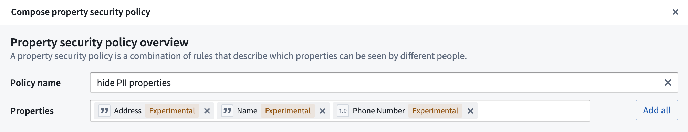   
   Select **Manage markings** for the property security policy and add the `PII` marking.   
   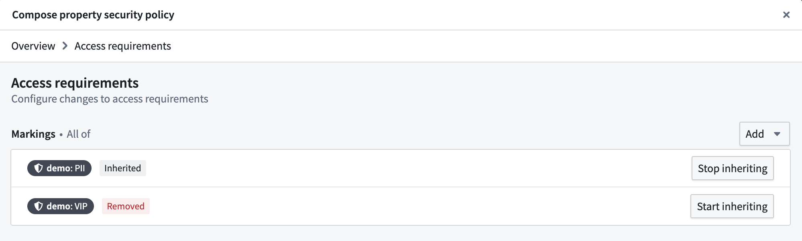   
8. This will create the property security policy. The properties included in the policy are now secured by the object security policy and the new property security policy. Properties not included in any property security policy will still be secured by the object security policy.   
   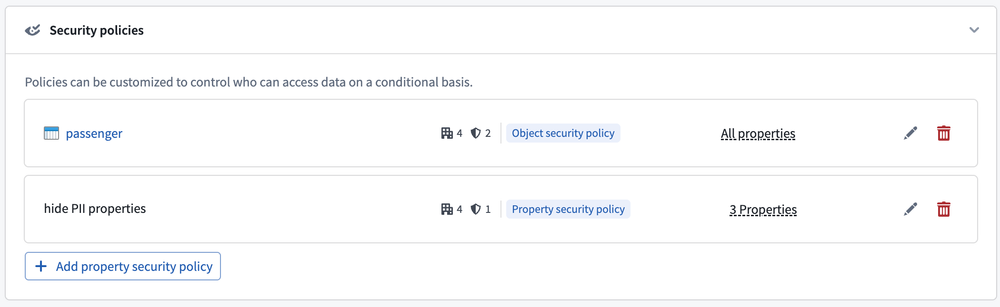   
   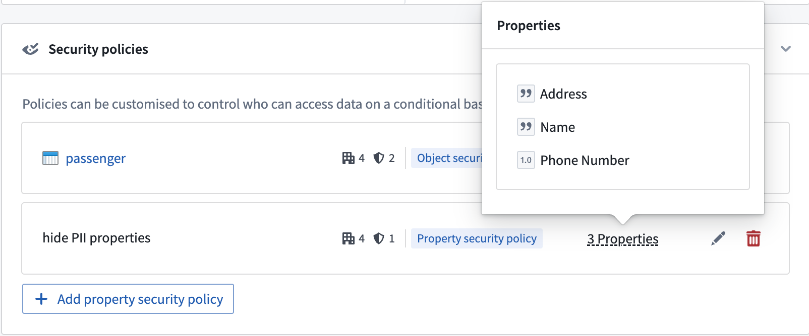

### Permissions to edit security policies

To create or edit an object or property security policy, you must be an **Owner** of the object type. If your enrollment uses [project-based permissions](/docs/foundry/object-permissioning/ontology-permissions/), this means you must hold the `Owner` role on the project that contains the object type.

:::callout{theme="warning"}
If your enrollment uses the legacy [datasource-derived permissions model](/docs/foundry/object-permissioning/ontology-permissions-legacy/#datasource-derived-permissions), this means you must be an `Owner` on the Ontology to create or edit object security policies. Once security policies are configured on an object type, adding or removing properties also requires `Owner` on the Ontology. This makes many common workflows highly restrictive, and is a further reason we recommend [migrating to project-based permissions](/docs/foundry/object-permissioning/ontology-permissions/) before configuring object security policies.
:::

### Property security policy restrictions

The following restrictions apply when configuring one or more property security policies:

* An object security policy must already be configured.
* The primary key property cannot be a member of any property security policy.
* A non-primary key property can be a member of at most one property security policy.

## Configure access to object types

Access to object types can be configured in the [ontology metadata permissions](/docs/foundry/object-permissioning/ontology-permissions/). The user needs to be able to [view the object type definition and instances](/docs/foundry/object-permissioning/ontology-permissions/#viewing-object-types-and-objects).

## Configure a granular policy

[Learn more about configuring granular policies for row-level security](/docs/foundry/platform-security-management/manage-granular-policies/).

### Granular policy limits for property security policies

For granular policies configured on property security policies, the combined [comparison weights](/docs/foundry/platform-security-management/manage-granular-policies/#policy-limitations) of the property security policy's granular policy and the object security policy's granular policy must stay under the granular policy comparison limit of 10,000.

## Configure mandatory controls

By default, an object security policy will inherit all mandatory controls from its data sources. These include [markings](/docs/foundry/security/markings/), [organizations](/docs/foundry/security/orgs-and-spaces/#organizations), and [classifications](/docs/foundry/security/classification-based-access-controls/).

The object security policy can then be further customized to add new mandatory controls and remove inherited mandatory controls that are no longer necessary.

## Materializations with object security policies

Object security policies also determine the permissions for viewing [materialized](/docs/foundry/object-edits/materializations/) data in the object type.

Currently, object types with object security policies can only be materialized to Foundry datasets. The most restrictive permissions are applied to materialized data. This includes the following:

* All markings from the backing data sources.
* Additional markings applied on object or property security policies.
* Markings from all mandatory controls properties used in the granular policies of all object and property security policies.

:::callout{theme="warning"}
Transactions on materialized datasets are secured by the security policies generated at the time of the materialized dataset build. When users add or remove a marking in their object or property security policies, the marking will only be reflected in the transactions committed at the time that the marking is present. Transactions are committed when the materialization is [scheduled to build](/docs/foundry/object-edits/materializations/#build-schedules-in-writeback-and-materialized-datasets), which is configured by the user.
After adding a marking to an object or property security policy, make sure to do the following:

* Build the materialization dataset if the markings need to propagate to the materialization dataset immediately.
* Mark the materialization or backing dataset with the marking to secure all historical transactions on the materialization dataset.
:::

## Test object security policies

When configuring object security policies, you can test a specific user's ability to view the properties of an indexed object type based on your unsaved object security policy. You can also edit the values of properties referenced in granular policies to test hypothetical object instances and determine if your policy is correctly configured. Select **Test policies** from the **Security policies** section to launch the **Test security policies** modal.

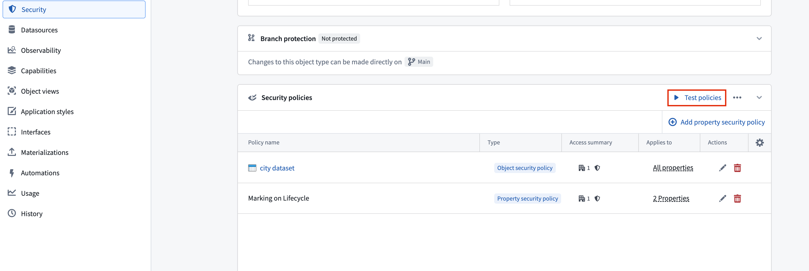

In the **Test security policies** modal, use the **Configure test** panel to select a **User** whose visibility access you wish to test on a given **Object**. The **Results** section indicates which properties on the object the user can view based on the current security policy configuration.

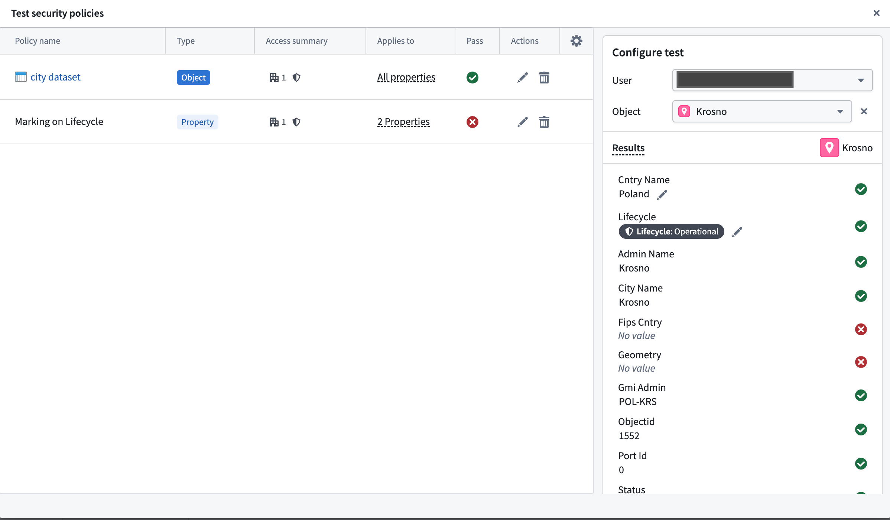

### Current object security policy testing limitations

* You cannot test [derived property](/docs/foundry/ontology/derived-properties/) visibility, as this also relies on the user's visibility on the derived property's source object.
* If you are neither a member nor administrator of an organization that is referenced in the security policy, then guest memberships and secondary organizations will not be taken into account during testing. Foundry indicates this by displaying a warning callout that enumerates the organizations you do not have permissions on.

## Migrate from restricted views to object security policies

Object security policies are recommended over [restricted views](/docs/foundry/security/restricted-views/) for most use cases built on the Ontology. They provide unified cell-level security, near-instantaneous policy updates, and support for streaming and branching. [Learn more about the benefits of object and property security policies.](/docs/foundry/object-permissioning/managing-object-security/#benefits-of-object-and-property-security-policies)

If you previously set up object types backed by restricted views and want to migrate to object security policies, you can use the migration tool described below. [Learn more about object and property policies versus data source policies.](/docs/foundry/object-permissioning/managing-object-security/#object-and-property-policies-vs-data-source-policies)

You can migrate an object type's data source from a restricted view to the backing dataset of the restricted view, secured by object security policies, using the migration tool in the **Security** tab. The tool configures security policies to match the policies defined on the restricted view.

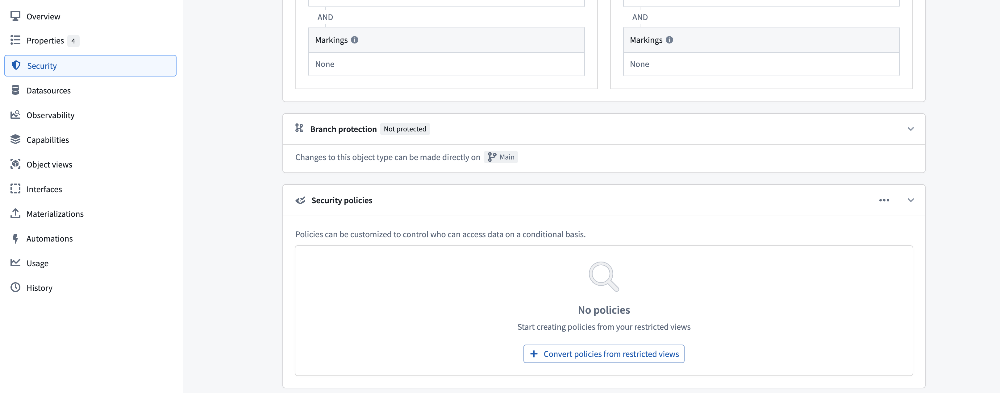

### Limitations

:::callout{theme="warning"}
The migration tool does not support all restricted view configurations. The following configurations are not supported:

* Object types with multiple data sources (MDOs).
* Object types with multiple materializations or a single restricted view materialization.
* Restricted views with [granular policies](/docs/foundry/platform-security-management/manage-granular-policies/) that use unsupported comparison operators, including greater than, greater than or equal, less than, and less than or equal.
* Restricted views with granular policies that reference numeric constant values, such as integer, long, or double.
* Restricted views with granular policies that reference authorized group IDs, organization marking IDs, or static marking IDs as user properties. Consider using a [mandatory control property](/docs/foundry/object-link-types/mandatory-control-properties/) to achieve equivalent security.
:::

### Preserve discretionary security

To preserve project viewing constraints on the data (security configurations inherited from the project the restricted view is in), you can move the object type into the same project as the restricted view using the migration tool.

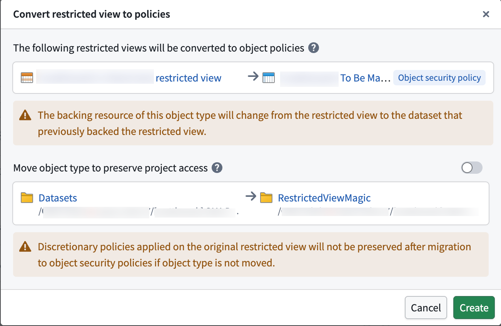
