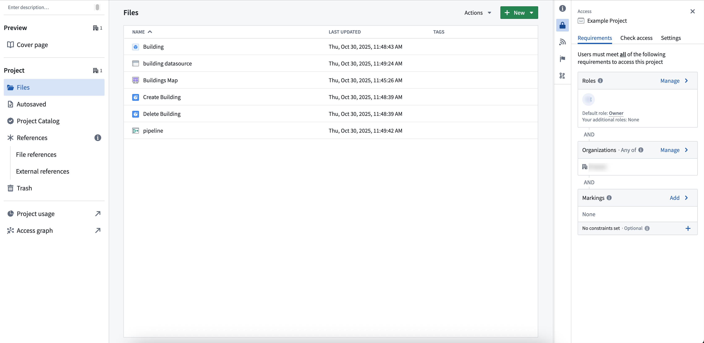
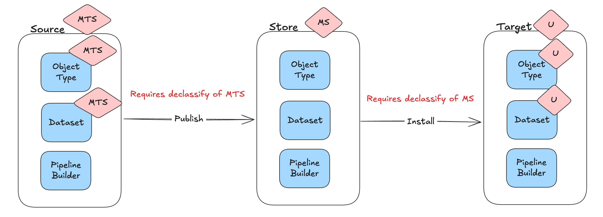

<!-- source: https://palantir.com/docs/foundry/object-permissioning/ontology-permissions/ · mirrored 2026-08-18 from Palantir Foundry docs -->

# Ontology permissions

The permissions to view, edit, and manage ontology resources are managed through [Compass](/docs/foundry/compass/overview/), the Palantir platform's filesystem. Ontology resources are saved into a project, and the selected project determines who can view, edit, and manage them.

This capability is enabled for new ontologies. For existing ontologies, an ontology owner must [enable the capability manually, and existing ontology resources require migration](/docs/foundry/ontology-manager/migrate-to-project-based-permissions/). This capability is not yet available for Default Ontologies. If you are unsure of your ontology type, contact Palantir Support.

This project-based permissions approach replaces the previous permission models: [ontology roles and datasource-derived permissions](/docs/foundry/object-permissioning/ontology-permissions-legacy/). It comes with multiple benefits:

* **Unified permission model:** Ontology resources use the same permission system as other resource types, so you only need to learn and manage permissions in one place.
* **Bulk management:** Set permissions at the project or folder level to control access across multiple resources at once, eliminating the need to set permissions on individual items.
* **Permissions explainability:** The **Security** tab displays the required permissions to view and edit an object type, and the required permissions to see instances or run actions.
* **Additional privacy controls:** Hide sensitive ontology resources by applying a marking or by placing them in a project where the user lacks a role grant.
* **Compass curation primitives:** Use portfolios and tags to organize ontology resources, and role grants or markings to hide irrelevant resources from users.

Migrating to projects does not change who has access to the backing datasource. To see objects, users continue to need permissions on both the object type and the datasource.

## Example of project-based permission

Consider an object type called `Building` saved as a file in project `A`. Your ability to view, edit, or manage `Building` depends on your role in project `A`. If you are an `Editor` in project `A`, you can edit the `Building` object type. To view specific `Building` objects (like `Empire State Building`), you need the `Viewer` role on the object type and either access to the backing datasource or access granted through [object and property security policies](/docs/foundry/object-permissioning/managing-object-security/#object-and-property-security-policies), depending on how the object type's security is configured.

If you only have viewing rights for the object type, you can only see information such as schema and contact information, not the actual data. If you need help understanding the permissions required, review the Compass project side panel.

## Viewing object types and objects

Object types are permissioned differently from objects. To see an object type, you must have View permissions on the object type, but do not need View permissions for the backing datasource.

To see objects, you must hold View permissions on the object type and access to the data. Access to the underlying data is determined by the object type's security configuration:

* **[Object and property security policies](/docs/foundry/object-permissioning/managing-object-security/#object-and-property-security-policies):** Object visibility is governed by policies configured directly on the object type, independent of the backing datasource permissions.
* **[Data source policies](/docs/foundry/object-permissioning/managing-object-security/#data-source-policies):** Object visibility is governed by the permissions on the backing data source. You must hold View permissions on the backing data source to see the objects.

For more information on configuring object security, review the [documentation on managing object security](/docs/foundry/object-permissioning/managing-object-security/). For more information on the distinction between object types (schema) and objects (data), review the [documentation on object permissions](/docs/foundry/object-permissioning/overview/).

When objects are in projects, the backing datasource must be imported into the project for the object to index. If the backing datasource is not already in the project, you are prompted to import it during object creation.

## Edit permissions for links and actions

You will need the appropriate edit permissions depending on the resource you would like to edit:

* **For links:** You must hold edit permissions on both the link type and the linked object types.
* **For actions:** You must hold edit permissions on the action type and on all ontology resource types edited by the action.

## Packaging and installing with different permission models

A Marketplace product installs using the same permission model it was packaged with. The **Require new ontology resources be saved in a project** toggle in **Ontology configuration** only affects creation of new ontology resources — it does not change how Marketplace installs a product on the **target environment** (where the product is installed) relative to the **source environment** (where it was packaged).

* **Packaged with Ontology roles:** installs using Ontology roles.
* **Packaged with project permissioning:** installs using project permissioning.
* **Source migrated to project permissioning after publishing:** the target's ontology resources are migrated to project permissioning on the next upgrade.

## Classification-based access controls (CBAC)

When ontology resources are saved in projects governed by
[classification-based access controls (CBAC)](/docs/foundry/security/classification-based-access-controls/),
the following rules apply:

* You must specify a file classification when creating the resource.
* The file classification must be equal to or lower than the
  [project maximum classification](/docs/foundry/security/classification-based-access-controls/#project-maximum-classification).
* Object type materializations fail if no classification is specified.

### Marketplace and file classifications

File classifications are not ontology-specific — they apply to all files. The rules below are called out here because they affect how project permissioning interacts with [classification-based access controls](/docs/foundry/security/classification-based-access-controls/). Marketplace does not carry file classifications inside the product itself.

* **At publish time:** Marketplace does not track file classifications. If the classification of the Marketplace store is lower than any of the classifications that will be dropped, it checks that the user has declassify permissions on those markings.
* **At install time:** each installed file takes the classification of the target project. If the target project's classification is lower than the classification of the Marketplace store, the installing user must hold declassify permissions on those markings.
* **On upgrade:** file classifications are not changed. The classifications set at install time can be edited manually, and those manual edits persist through later upgrades.

## Previous permission models

Previously, permissioning ontology resources varied based on your ontology authorization model. The table below summarizes how resources are currently managed for each model. Refer to the [documentation to learn more about these legacy permission systems](/docs/foundry/object-permissioning/ontology-permissions-legacy/).

| Legacy Ontology permission models | Description                                                                                                                                                                                       |
| ---------------------------- | ------------------------------------------------------------------------------------------------------------------------------------------------------------------------------------------------- |
| **Ontology roles**           | - Ontology resources are permissioned in Ontology Manager using ontology specific roles (Ontology `viewer`, Ontology `editor`, and Ontology `owner`). They are not a resource of a project.             |
| **Datasource-derived**       | - Ontology resources derive their permissions from the backing datasource of the object. For example, you have `editor` on the object type if and only if you are editor on the backing datasource. |
