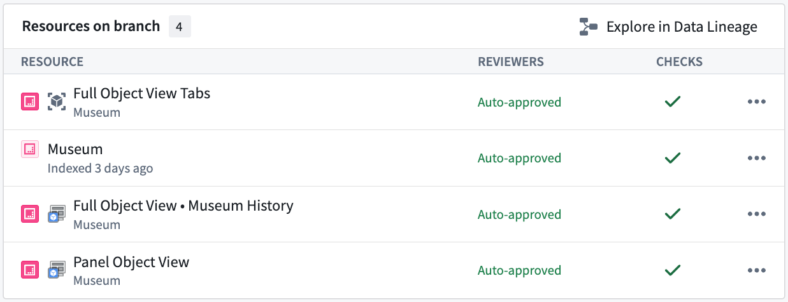
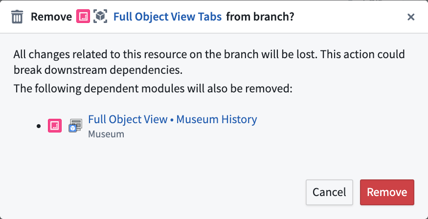
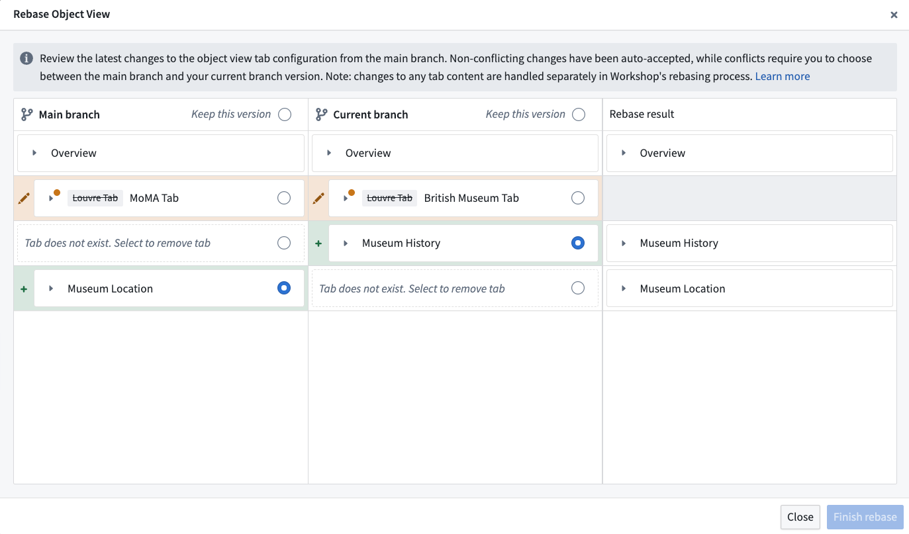
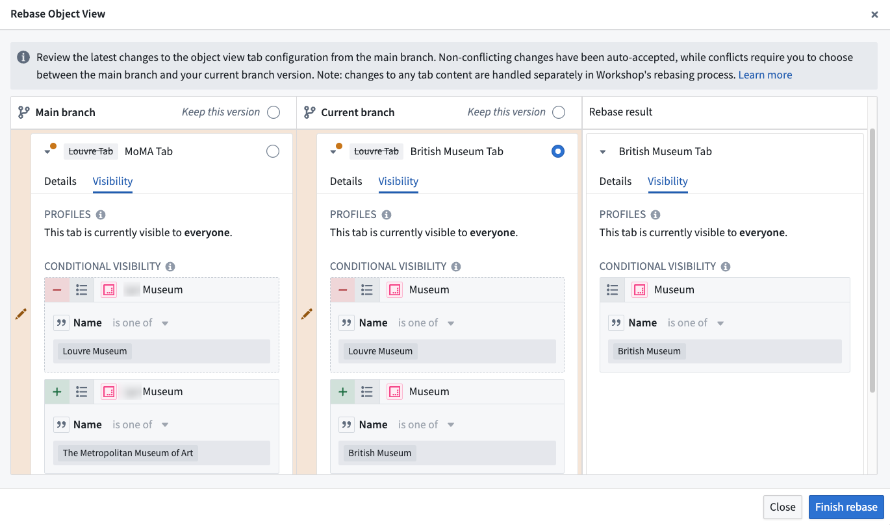

<!-- source: https://palantir.com/docs/foundry/object-views/branching-object-views/ · mirrored 2026-08-22 from Palantir Foundry docs -->

# Branching object views

## Overview

Object Views integrates with Global Branching to enable safe, isolated development of object view configurations. This documentation covers how to work with object views on branches, including adding and modifying resources, cross-application compatibility, merge requirements, rebasing, and known limitations.

For general information on Global Branching concepts and workflows, refer to the [Global Branching documentation](/docs/foundry/global-branching/overview/).

## Adding, removing, and modifying resources

To add an object view to a branch, save an object view version while on a branch in the [Object View editor](/docs/foundry/object-views/config-object-views/#use-the-object-view-editor).

Object views support two types of branch-compatible resources:

* **OV-managed modules:** Capture Workshop content changes made to an object view on a branch. A separate OV-managed module is created for each full object view tab, the object instance panel, and the object set panel. All branch-aware features available in Workshop applications are also available inside object views.
* **Full object view tabs:** Capture structural changes to object view tabs, including additions, deletions, renames, profile changes, and visibility condition modifications.

The example below shows different resources on a branch for the `Museum` object type. From top to bottom: the full object view tabs resource, the `Museum` object type itself, the **Museum History** tab of the full object view, and the [panel object view](/docs/foundry/object-views/config-panel-views/#object-instance-panels).

You can remove any object view resource from a branch individually using the branch taskbar. Removing a full object view tabs resource automatically removes all of its associated tabs from the branch.

## Cross-application compatibility

Object views can be edited for the latest state of the ontology on a branch, including object types and action types created on a branch. The Object View widget can also be used to embed a branched object view inside a standalone Workshop application. An object view can be previewed on a branch within the **Object views** tab in Ontology Manager.

## Merge requirements

### Deployability checks

Before deploying an object view to `main` from a branch, the following deployability checks must succeed:

* **User has publish permissions:** [Permissions to edit the object view](/docs/foundry/object-views/config-overview/#permissions) is required. This is the same permission check that is done when publishing a new object view version on `main`.

* **Object view must be rebased with main:** Before merging, rebase each object view resource on the branch with the latest changes on `main`.

* **No Legacy fields modified:** Verifies that no features unsupported by the new Object View editor have been modified on the branch. This check should always pass. If it fails, contact Palantir Support.

### Approvals checks

Object views use [approvals](/docs/foundry/global-branching/resource-protection-and-approval-policies/) to determine whether the user making changes on a branch has the permissions required to merge those changes. The specific permissions required depend on the [permission model](/docs/foundry/object-permissioning/ontology-permissions/) of the object type that the object view is linked to.

#### Object type uses datasource-derived permissions

When the object type uses [datasource-derived permissions](/docs/foundry/object-permissioning/ontology-permissions-legacy/#datasource-derived-permissions), the contributor or an approving reviewer must have:

* `View` access on the object type and `Editor` access on **all** of its backing datasources.
* The `Object View Admin` application permission in [Control Panel](/docs/foundry/administration/enrollments-and-organizations-permissions/), which is required to publish object views in Object Explorer. This is the same application permission required when [publishing a new object view version](/docs/foundry/object-views/config-overview/#permissions) on `main`.

:::callout{theme="neutral" title="Datasource permissions are stricter at merge time"}
The datasource permission requirement above is stricter than the standard edit-permissions check used outside of branching. Editing an object view on `main` only requires the `Editor` role on **any** of the object type's backing datasources. Merging changes from a branch requires the `Editor` role on **every** backing datasource.
:::

#### Object type uses ontology roles or project-based permissions

When the object type uses [ontology roles](/docs/foundry/object-permissioning/ontology-permissions-legacy/#ontology-roles) or [project-based permissions](/docs/foundry/object-permissioning/ontology-permissions/), the contributor or an approving reviewer only needs edit access on the object type. This is typically granted through the `Ontology Editor` role under ontology roles, or through the `Editor` project role under project-based permissions. Edit access on the object type already covers publishing object views in Object Explorer, so no separate `Object View Admin` application permission is required.

#### Inherited project approval policies

Object views and the Workshop modules that make up object view tabs and panels are logical children of the parent object type. If the object type is [protected](/docs/foundry/global-branching/resource-protection-and-approval-policies/#resource-protection) and lives in a project with a [project approval policy](/docs/foundry/global-branching/resource-protection-and-approval-policies/#project-approval-policies), that policy applies to the object view and its modules. Approval requests for both must satisfy the policy before the proposal can be merged.

:::callout{theme="neutral" title="Inherited protection from the parent object type"}
Inherited resource protection is under development and will be released soon. Once available, it will prevent direct edits to `main` for an object view or its modules whenever the parent object type is protected. Until then, an object view and the modules that make up its tabs and panels can still be edited directly on `main` even if the parent object type is protected.
:::

## Rebasing and conflict resolution

Each object view resource on a branch must be rebased with main before being deployed. Object view module resources can be rebased using [Workshop rebasing](/docs/foundry/workshop/branching-integration/#rebasing-and-conflict-resolution). Tab configuration changes on a [full object view tabs resource](/docs/foundry/object-views/use-full-views-in-platform/) must be rebased separately from tab content changes. When rebasing is required for full object view, a notification message will appear below the object view section in the [Object View editor](/docs/foundry/object-views/config-object-views/#edit-object-view-tabs).

The object view rebase dialog displays three columns:

* The main branch state
* Your branch state
* The proposed rebase result

Non-conflicting changes between `main` and your branch are automatically accepted and included in the result. If there is a conflict, you must choose whether to keep the version from `main` or from your branch for each affected tab. The result column shows a preview of the final state after rebasing. You can modify any auto-accepted changes before completing the rebase.

Below is an example of the object view rebase dialog. The example demonstrates two non-conflicting changes that have been auto-accepted. A conflict was detected between the two edits of the `Louvre` tab.

To resolve the conflict, choose either the branch or `main` version. This enables a successful rebase. You can expand the conflicting row to view visibility details.

## Known limitations

[Legacy object view tabs](/docs/foundry/object-views/config-legacy-object-views/) cannot be edited on a branch.
