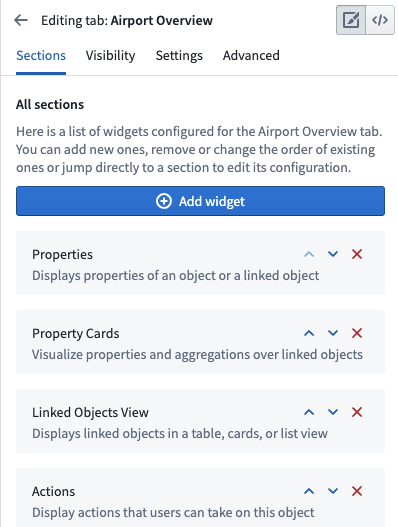
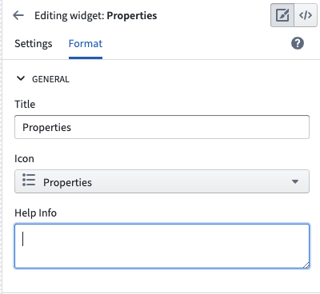
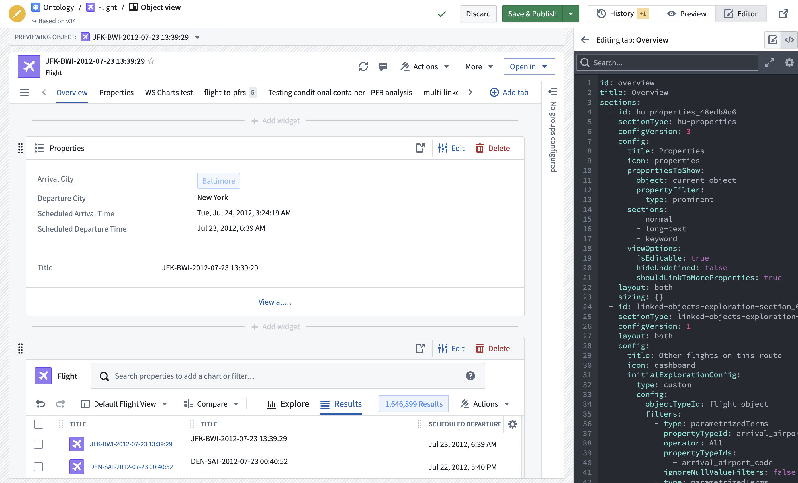

<!-- source: https://palantir.com/docs/foundry/object-views/config-legacy-object-views/ · mirrored 2026-08-22 from Palantir Foundry docs -->

# Configure legacy Object Views

:::callout{theme="neutral"}
To access legacy Object View configuration, navigate to the Object View editor for an object type, select the **Manage tabs** cog icon, and hover over a tab to select the **Open in legacy editor** icon.
:::

## Configure tabs

A legacy widget-based tab displays a list of widgets organized into sections. You can add, delete, and re-order widgets or navigate to other settings from within the tab settings.

## Configure widgets

The building blocks of legacy Object View tabs are called **widgets**. Widgets are sometimes referred to as *Sections* or *Plugins*. Widgets are the primary way to display some form of data on an Object View. Use them to visualize data as KPIs or charts, arrange the layout of an entire Object View, and manipulate displayed data.

There are a several widget types available in Object View:

* [Properties and links](/docs/foundry/object-views/widgets-properties-links/)
* [Visualize](/docs/foundry/object-views/widgets-visualization/)
* [Filters](/docs/foundry/object-views/widgets-filtering/)
* [Layout](/docs/foundry/object-views/widgets-layout/)
* [Embed other applications and files](/docs/foundry/object-views/widgets-apps-files/)

## Widget-specific settings

Widgets are used to visualize or manipulate data related to an object.
Widgets typically access one of the following:

* Properties of the current object
* Objects linked to the current object
* Aggregations on properties of objects linked to the current object

When you configure a widget on an Object View, determine which object and what property you want to visualize. You must set up the relevant objects and define links in advance within the Ontology metadata.

The specific settings for each widget are unique to the functionality it provides. In general, there are two major components to widget-specific configuration:

* The **object model** configuration requires selecting the object or linked object and which properties should be used. For example, when configuring a chart, you may need to aggregate all Flights in an Airport per Destination.
* The **visual** configuration requires selecting options such as chart types, colors, formats, text labels, etc.

## Widget format settings

All widgets have default format settings:

**General**

* **Title:** Add a title to display in the widget header. By default, this is either the widget name an empty space. You must add a title to the widget to save it.
* **Icon:** Choose an icon to display in the top left of the widget header. Each widget has a default icon.
* **Help Info:** Empty by default, you can add text to explain the widget to users.

**Layout**

* **Alignment:** You can choose whether a widget should be the full width of the Object View or have a right or left alignment to place two widgets side-by-side. Alignment is set to full width by default.
* **Sizing:** The sizing setting does not exist on all widgets. When it is available, you can control the minimum and maximum height of the section within the Object View.

## Reuse widget configurations

You can reuse the configuration of a previously created widget by copying the YAML configuration. Access the configuration by selecting the code icon in the upper right corner of the Object View editing screen. Then, copy and paste the configuration into the YAML configuration of a new widget.

