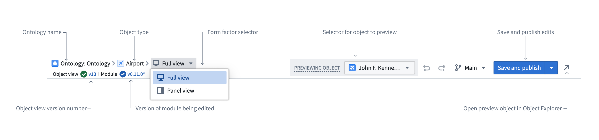
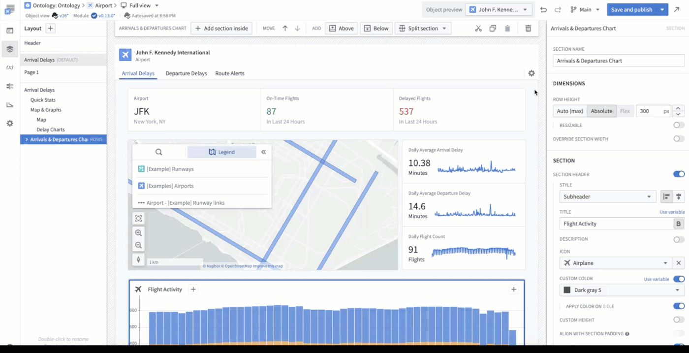

<!-- source: https://palantir.com/docs/foundry/object-views/config-object-views/ · mirrored 2026-08-08 from Palantir Foundry docs -->

# Configured full Object View

## Edit configured full Object Views

The default configured full Object View for all object types shows a single [Property List widget](/docs/foundry/workshop/widgets-property-list/) displaying prominent properties of the object type, and a [Links widget](/docs/foundry/workshop/widgets-links/) that displays the object's links, if any exist. To make changes to the configured full Object View, use one of the [edit entry points](/docs/foundry/object-views/config-overview/#edit-configured-object-views) to navigate to the configured Object View editor. Once in the editor, the content of each tab of a configured full Object View can be configured just like a regular Workshop module.

### Edit Object View tabs

There are two parts of a full Object View that can be edited: the tabs and the tab content. Each Object View tab is backed by a Workshop module, which enables you to use [Workshop](/docs/foundry/workshop/overview/) to create Object View content with advanced capabilities and features. You can use Workshop tabs to:

* Have full flexibility over the [layout](/docs/foundry/workshop/concepts-layouts/)
* Flexibly and dynamically load information using Workshop [variables](/docs/foundry/workshop/concepts-variables/)
* Display simulations or model-backed results using [Scenarios](/docs/foundry/workshop/scenarios-overview/)

### Use the Object View editor

There are three main sections within the Object View editor: the **header**, the **object title bar**, and the **Workshop module**.

The breadcrumbs in the header display the Ontology name, object type, and form factor. The form factor is a dropdown that can be used to switch between editing the full and panel Object View. Below this, version numbers are displayed for the Object View and the current workshop module. On the right, you can select different objects to preview, save and publish your edits, and open the object in Object Explorer.

In the object title bar, you can manage tabs by selecting the gear icon. Each tab corresponds to a single workshop module. If only one tab is configured, the tab title will be hidden when viewing the Object View, even though it appears in edit mode.

Selecting the gear icon opens a dialog that allows you to add, reorder, rename, and delete Object View tabs. Deleting a tab also deletes the Workshop module that the tab contains.

This dialog also allows you to configure a tab's [visibility settings](/docs/foundry/object-views/config-tabs/#tab-visibility), or access the legacy Object View editor if you need to edit other [legacy configuration options](/docs/foundry/object-views/config-legacy-object-views/).

The content of the tab can be edited just like a regular Workshop module. Once edits are complete, the **Save and publish** button will save and publish both tab edits and edits to the current module, [unless automatic publishing is disabled](/docs/foundry/object-views/manage-versions/#save-new-versions).
