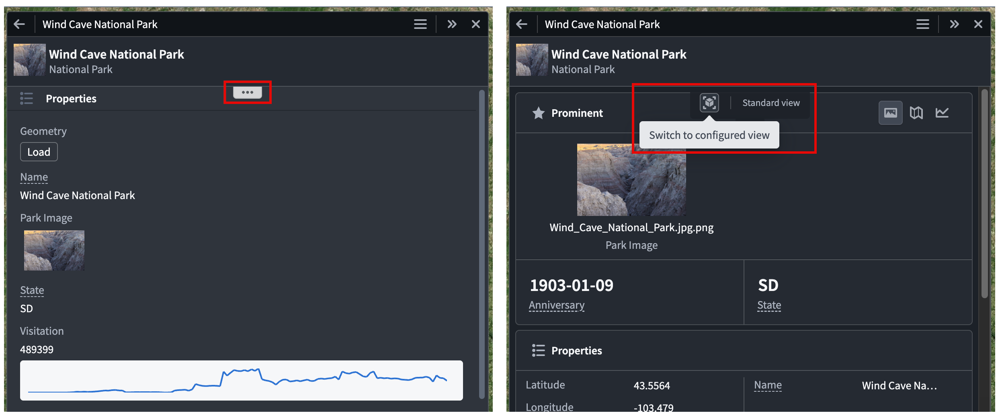
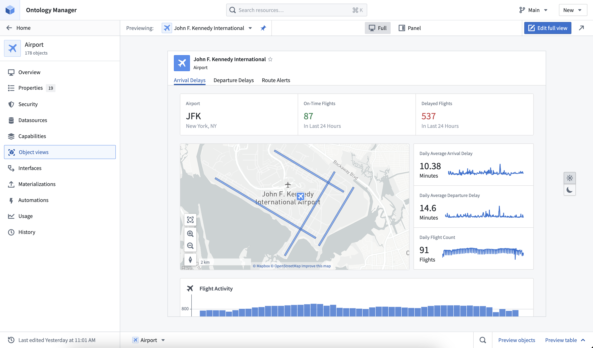
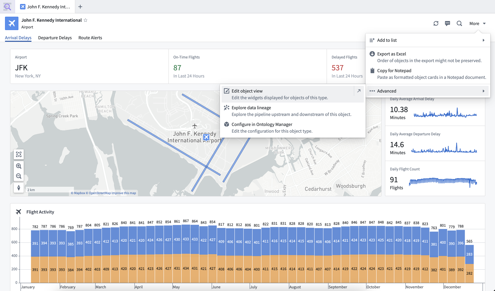
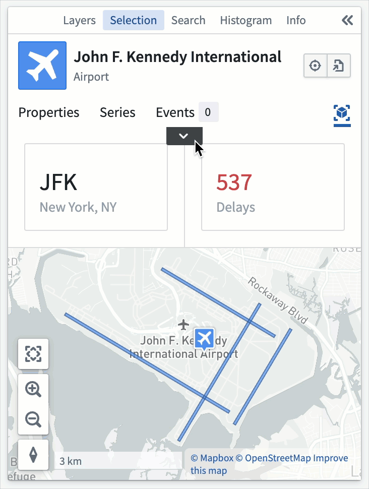

<!-- source: https://palantir.com/docs/foundry/object-views/config-overview/ · mirrored 2026-08-22 from Palantir Foundry docs -->

# Configured Object View overview

Configured Object Views are customizable, reusable representations of object data. You can build both [full](/docs/foundry/object-views/use-full-views-in-platform/) and [panel](/docs/foundry/object-views/use-panel-views-in-platform/) Object Views for an object type through [Workshop modules](/docs/foundry/workshop/overview/), enabling flexibility in how objects are represented across the platform.

Foundry creates a [standard Object View](/docs/foundry/object-views/standard-object-views/) for all object types by default. When you create a configured Object View, it becomes the default view for users, though they can switch back to the standard Object View through a toggle button packaged with the Object View. Additionally, users can hover over the ellipsis drawer icon in an Object View rendered in Palantir applications that use their own custom header, such as Gaia or Vertex, to toggle between standard and configured views.

:::callout{theme="neutral"}
The ability to toggle between standard and configured Object Views is not yet available in Workshop.
:::

## Default configurations

Default configured Object Views are automatically created for each object type. The default full Object View contains a list of prominent properties, or all non-hidden properties if none are prominent, and a list of the object's links. The default panel contains the same list of properties. The default views will dynamically update to reflect changes made to the object type, such as new properties or property renames, but once an Object View is edited it becomes user-managed and all further updates must be made manually.

### Permissions

The permissions required to edit the Object View for an object type depend on whether the object type uses [Ontology roles](/docs/foundry/ontology-manager/ontology-roles-migration/):

* If the object type does not use Ontology roles, a user must have the `Object View Admin` application permission in [Control Panel](/docs/foundry/administration/enrollments-and-organizations-permissions/), as well as the `Editor` role on any of the object type's input datasources.
* If the object type uses Ontology roles, the user only requires the `Ontology Editor` role on the object type.

Unless you manually convert the Workshop module for an Object View tab to a standalone module through legacy configuration options, the Workshop module's permissions will be managed by the object type. This ensures that permissions between the module and the object type are kept aligned, so users with permission to edit or view the object type will also be able to edit or view all modules inside the Object View.

### Edit configured Object Views

There are many ways to access configured Object View configuration.

The Object Views for an object type can be previewed in the **Object views** tab in Ontology Manager. In the header, you can select and pin a default display object to preview. You can also preview the full and panel form factors, and test how the Object View appears in light and dark mode. Editing the configured Object View can be accessed using the **Edit** option in the right side of the header.

In Object Explorer, an object type's configured Object View can be accessed when viewing an object by selecting **More > Advanced > Edit object view**.

When viewing a panel Object View within an application, configuration can be accessed by hovering over the dropdown ellipsis and selecting **Edit**. The dropdown only appears for users with permission to edit the Object View.

These edit entry points lead to the configured Object View editor, where the Object View tabs can be managed, and content can be edited with all the standard features of a Workshop module. Once published, edits will apply to all objects of the object type. For more editing information, refer to the [full Object View configuration](/docs/foundry/object-views/config-object-views/) and [panel Object View configuration](/docs/foundry/object-views/config-panel-views/).
