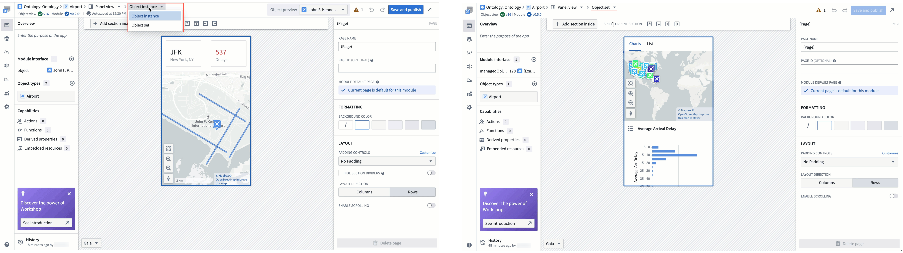

<!-- source: https://palantir.com/docs/foundry/object-views/config-panel-views/ · mirrored 2026-08-22 from Palantir Foundry docs -->

# Configured panel Object View

There are two types of configured panel Object Views you can build to display one or multiple objects of an object type: [*object instance panels*](#object-instance-panels) display individual objects, while [*object set panels*](#object-set-panels) display multiple objects as an object set. Both types of configured Object Views share the same [edit entry points](/docs/foundry/object-views/config-overview/#edit-configured-object-views) and configuration experience.

## Object instance panels

The default object instance panel view shows a single [Property List widget](/docs/foundry/workshop/widgets-property-list/) that displays [prominent properties](/docs/foundry/object-link-types/property-metadata/#metadata-reference) of a single instance of the object type.

## Object set panels

The object set panel displays an aggregated view of multiple instances of the same object type. The default object set panel provides a tabbed layout with two interfaces to explore object collections:

* The **Charts** tab displays up to five [XY Charts](/docs/foundry/workshop/widgets-chart/) that visualize object aggregations grouped by property values.
* The **List** tab shows an [Object List widget](/docs/foundry/workshop/widgets-object-list/) displaying up to three properties per object, including the object's title, prominent properties, and media when present.

## Edit configured panel Object Views

To make changes to either type of configured panel Object View, use one of the [edit entry points](/docs/foundry/object-views/config-overview/#edit-configured-object-views) to navigate to the configured Object View editor. Once in the editor, you can customize the configured panel Object View's content as you would customize a [Workshop module](/docs/foundry/workshop/overview/).

If you are configuring an object instance panel view but want to switch to an object set, select **Object instance** from the top ribbon before choosing **Object set** from the dropdown menu. You can use the same menu to switch *from* **Object set** *to* **Object instance**, as well.

In the settings section of the left-side panel, the **Module Type** section allows you to configure the size of the editing canvas to ease building a compact module.

* **Edit display size:** Selecting an option in the dropdown will adjust the preview size of the panel on the canvas. The actual size of the panel will vary between devices and applications, so this is just a tool for builders to use to approximate the available space within different workflows.
  * Display options include **application presets** that match the size of the panel in different platform applications, common **resolution presets**, and **manual entry** of the module's height and width in pixels.
* **Show resolution picker in canvas:** When enabled, a resolution picker will be shown in the bottom left corner of the editor, allowing builders to edit the display size of the module directly on the canvas.
* **Fit to canvas:** When the resolution size exceeds the canvas size, a button will appear next to the resolution picker that toggles between fitting the entire panel in view or viewing the panel at standard zoom.

