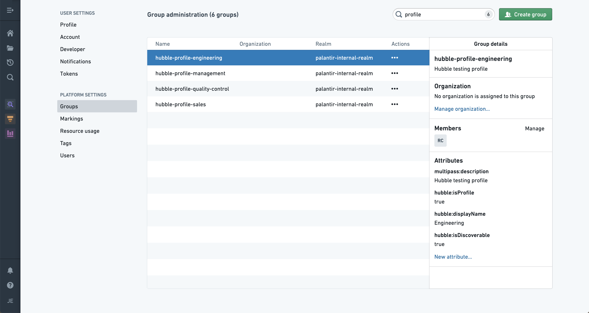
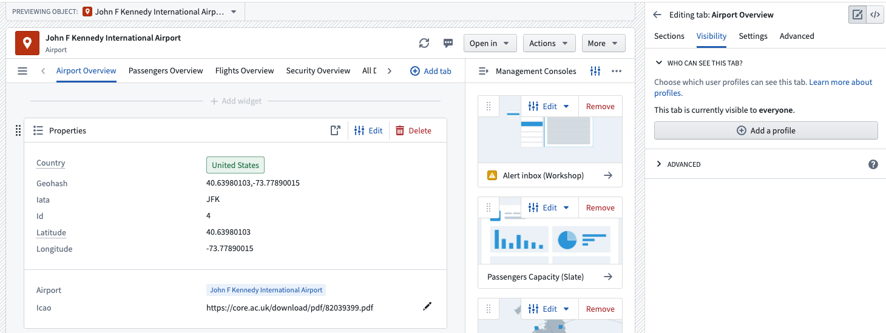
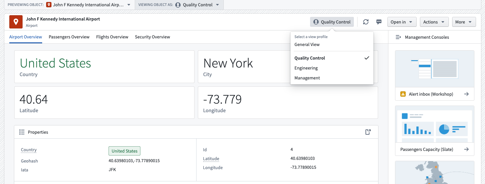
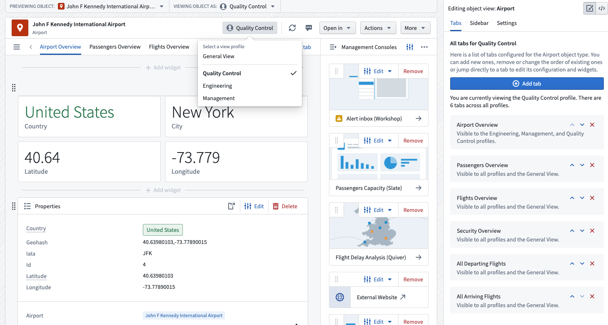

<!-- source: https://palantir.com/docs/foundry/object-views/config-profiles/ · mirrored 2026-08-22 from Palantir Foundry docs -->

# Configure profiles

**Profiles** enable you to configure how Object Views should be surfaced to users with different roles. You can use profiles to control the visibility of Object View [tabs](/docs/foundry/object-views/config-tabs/) for different users so they see views specific to their needs.

### Configure a profile

Object Explorer is powered by a service called `Hubble`. To use a group as a profile in Object View, add the following Hubble attributes from within the [**Groups** tab](/docs/foundry/security/users-and-groups/) in Platform Settings:

* `hubble:isProfile` : `true`
* `hubble:displayName` : `Set a name you want end user to see`
* \[OPTIONAL] `hubble:isDiscoverable` : `true`
  * Setting the `hubble:isDiscoverable` attribute to `true` will make the profile visible to users who are not members of the group itself. Omitting this attribute means that only users who are in the group can access views assigned to this specific profile.

:::callout{theme="neutral"}
Newly-created profiles may take up to five minutes to become available in the Object View editor.
:::

### Assign a profile to an Object View

Profiles are assigned on a tab level, meaning that for each tab you can assign specific profiles. To add a profile to a tab, access the editor sidebar, click on a tab in the **Tab** settings, select **Visibility**, and click **Add a profile**.

### Switch profiles as a user

Once you add a profile to an Object View, you can switch between profiles. Select the profile type in the Object View header to access a dropdown menu containing available profiles. You can find the same dropdown menu by clicking **Viewing Object As:** at the top of the Object View.

### Switch profiles as an editor

You can also access different profiles when editing an Object View. Doing so will allow you to see which tabs are visible to each profile.

### Set a default profile for a user

To set a default profile for a user or user group, add them as a member to the group backing the profile. This action will work only if a user is a member of a single profile.

:::callout{theme="neutral"}
You can add a maximum of ten profiles to each Object View.
:::
