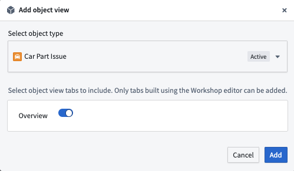

<!-- source: https://palantir.com/docs/foundry/object-views/marketplace-object-views/ · mirrored 2026-08-08 from Palantir Foundry docs -->

# Add Object Views to a Marketplace product

Use [Foundry DevOps](/docs/foundry/devops/overview/) to include your Object Views in [Marketplace products](/docs/foundry/devops/core-concepts/#product) for other users to install and reuse. [Learn how to create your first product.](/docs/foundry/foundry-devops/create-products/)

## Supported features

Marketplace products only support [Object View tabs](/docs/foundry/object-views/config-tabs/) that use the [Workshop tab](/docs/foundry/object-views/config-object-views/) builder. The legacy Object View builder is not supported. If you would like to package an Object View tab that leverages the legacy builder, you should first rebuild the tab with the Workshop tab builder.

## Add Object Views to products

To add an Object View to a product, first [create a product](/docs/foundry/foundry-devops/create-products/). [Add outputs](/docs/foundry/foundry-devops/create-products/#add-outputs) and then select the **Add ontology entities** option.

Once you have selected an Object View, you can select which tabs you would like to include in your product.

