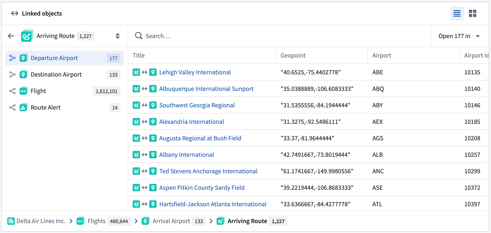
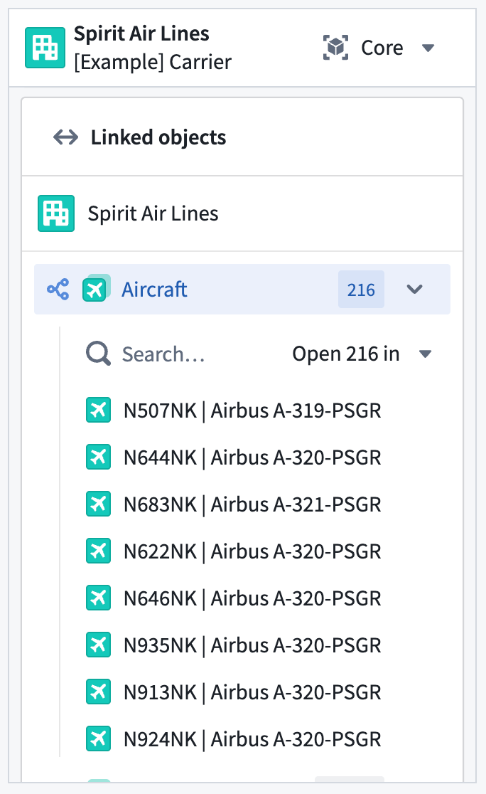

<!-- source: https://palantir.com/docs/foundry/object-views/standard-object-views/ · mirrored 2026-08-08 from Palantir Foundry docs -->

# Standard Object Views

When you create and configure an [object type](/docs/foundry/object-link-types/object-types-overview/) in your Ontology, Foundry automatically creates a standard Object View to provide a standardized representation of all its objects, ensuring other users have a holistic understanding of its schema and links. The standard Object View matches the object type's configuration by spotlighting prominent properties in either a dedicated table or in other visual formats if the property's [base type](/docs/foundry/object-link-types/base-types/) is a time series, media reference, or geospatial property. Normal properties are displayed in a regular table, and hidden properties are not visible.

While standard Object Views are available for all object types, you can create [configured views](/docs/foundry/object-views/config-object-views/) to provide a contextualized and curated Object View experience for any object type based on its function in your Ontology. When you create a configured Object View, Foundry makes it available as the default view for a user; however, users can choose to select the standard view to see object data in its standard format.

## Prominent property displays

Foundry surfaces [prominent properties](/docs/foundry/object-link-types/property-metadata/#metadata-reference) at the top of the standard Object View to provide immediate context about an object's most important information.

### Display behavior

Properties marked as prominent receive enhanced visual treatment based on their type:

* **[Media reference properties](/docs/foundry/object-link-types/base-types/#media-references):** Rendered with a dedicated media viewer for viewing all supported media types.
* **[Time series properties](/docs/foundry/time-series/time-series-properties/):** Displayed as interactive charts showing temporal data patterns.
* **[Geospatial properties](/docs/foundry/geospatial/ontology/):** Objects with prominent geohash, geoshape, or geotemporal series reference (GTSR) properties will render on a [Map](/docs/foundry/map/overview/). Time series properties that [represent an object's latitude and longitude over time](/docs/foundry/map/integrate-objects/#track-objects) are also displayed on a Map.
* **Other property types:** All other prominent properties are displayed using a larger, card-style format elevated above a table displaying the remaining standard properties.

## Linked objects component

The **Linked objects** component enables you to traverse across [linked objects](/docs/foundry/object-link-types/link-types-overview/) directly within the standard Object View.

Use the **Linked objects** component of a standard Object View to:

* View linked objects grouped by link type.
* Preview properties of linked objects inline without leaving the current view.
* Open a subset of linked objects in a new tab for further exploration.
* Preview a selected linked object in the side panel of the standard Object View.

## Panel standard Object View display behavior

You can also interact with all of a standard Object View's functionality in its [panel](/docs/foundry/object-views/config-panel-views/) form factor.

