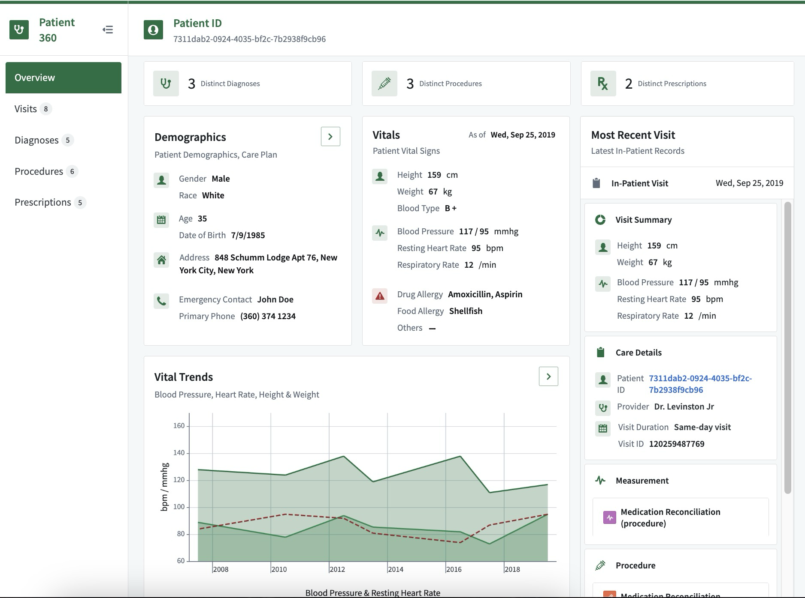
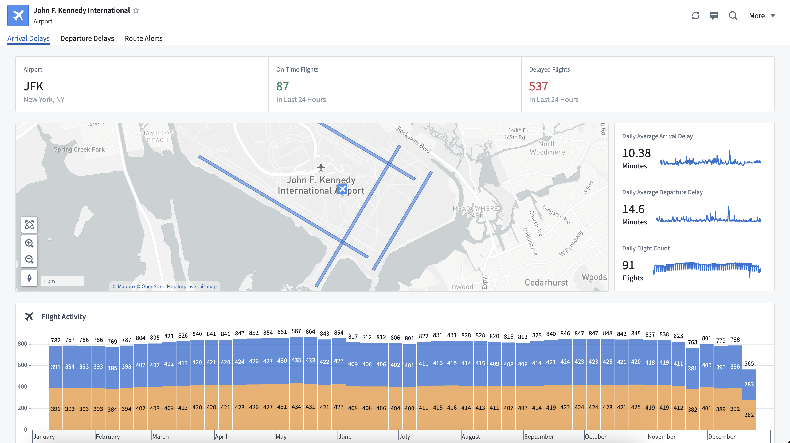
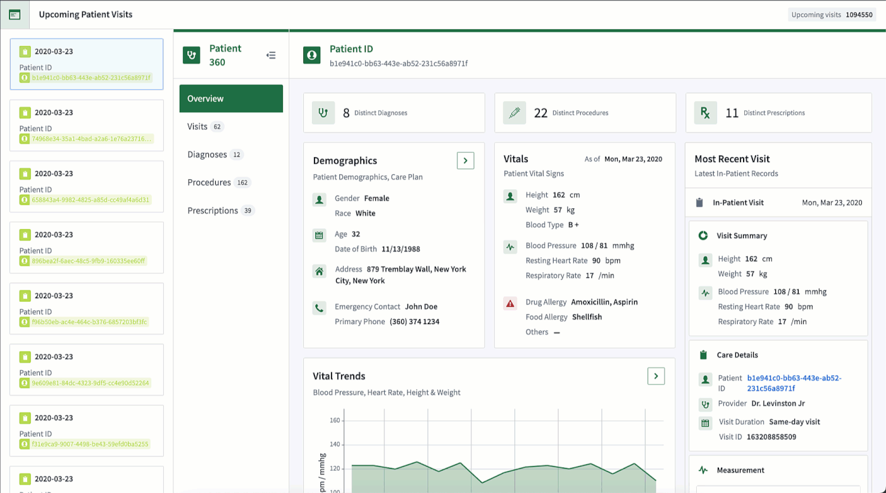
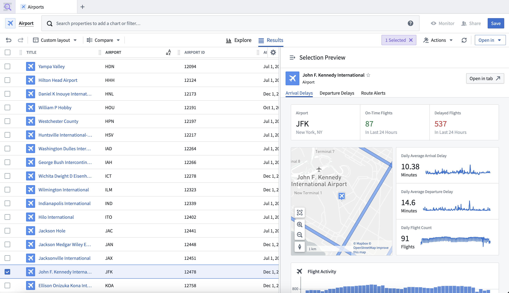
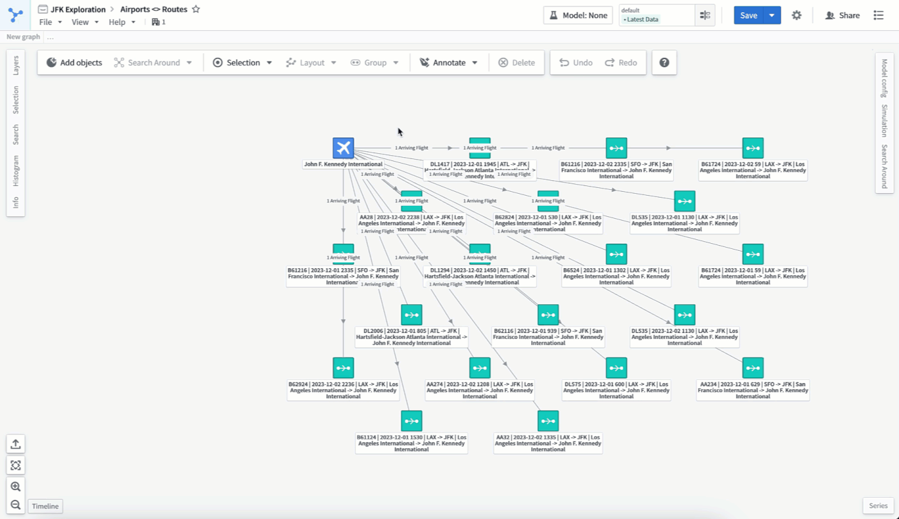

<!-- source: https://palantir.com/docs/foundry/object-views/use-full-views-in-platform/ · mirrored 2026-08-08 from Palantir Foundry docs -->

# Use full Object Views

Full Object Views provide comprehensive displays of an object's data. They are the primary view for the object in-platform and can be accessed within platform applications or embedded into custom Workshop applications.

An example of a full `Patient` Object View:

An example of a full `Rental` Object View:

## Workshop

[Workshop’s Object View widget](/docs/foundry/workshop/widgets-object-view/) can display a detailed Object View inside custom Workshop applications. When configured to display the full Object View, this widget is often used within an overlay or modal to accommodate the full page resolution.

## Object Explorer

In [Object Explorer](/docs/foundry/object-explorer/overview/), you can search for an object, then select it to open the full Object View, providing detailed information about the objects defined in the Ontology.

## Platform applications

Applications like Vertex, Maps, and Gaia use panel Object Views to provide a customizable, compact view of the selected object. Within the panel, selecting the object’s title will open the full Object View in a moveable and resizable modal.

