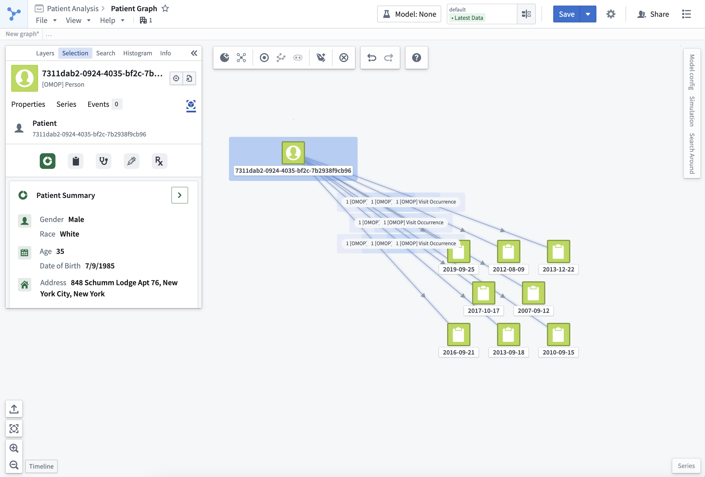
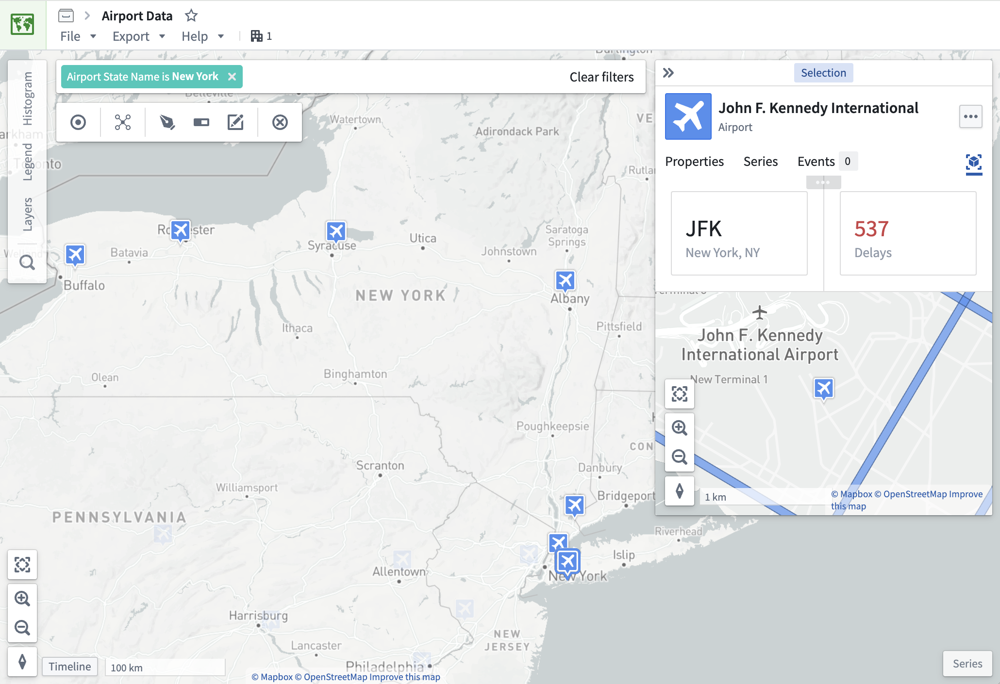
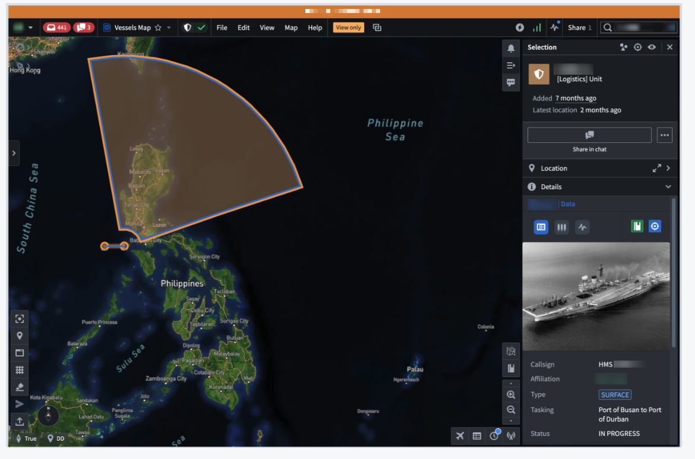
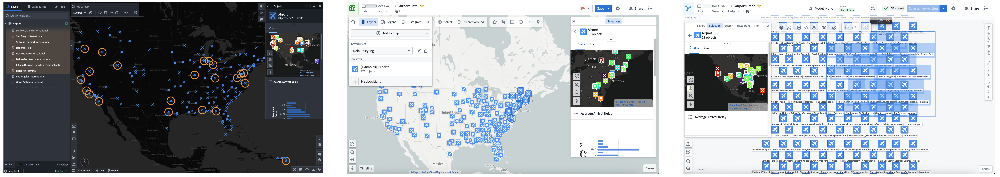
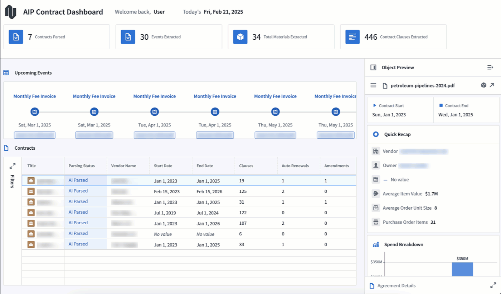

<!-- source: https://palantir.com/docs/foundry/object-views/use-panel-views-in-platform/ · mirrored 2026-08-22 from Palantir Foundry docs -->

# Use panel Object Views

Panel Object Views are embedded into applications across the Palantir platform to provide users with a consistent experience of object data across workflows. All object types have a [standard Object View](/docs/foundry/object-views/standard-object-views/) panel available by default, and you can build [configured panel Object Views](/docs/foundry/object-views/config-panel-views/) to display either an *object instance* or an *object set*.

## Panel Object Views in platform applications

Panel object views can appear across Palantir platform applications, such as [Vertex](/docs/foundry/vertex/overview/), [Map](/docs/foundry/map/overview/), and Gaia.

### Object instance panels

Object instance panels display a single instance of an object type and appear in an application's selection panel.

### Object set panels

Object set panels display an aggregated view of multiple instances of a single object type. They appear in applications when you select an object set comprised of several instances of the same object type.

## Panels in Workshop applications

Panels can be used in custom Workshop applications to provide a compact view of object data. To enable this, use Workshop's [Object View widget](/docs/foundry/workshop/widgets-object-view/), configured to show the panel form factor.

