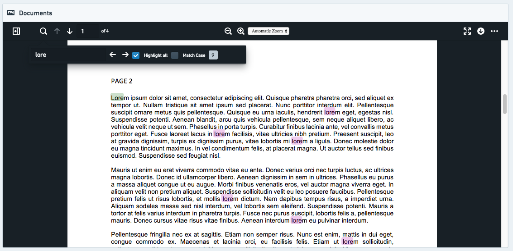
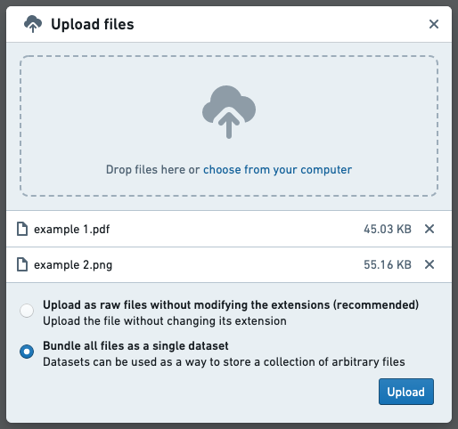
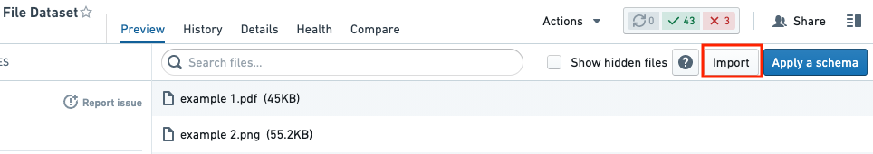
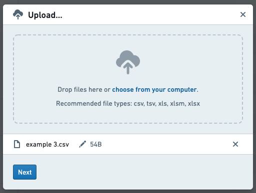
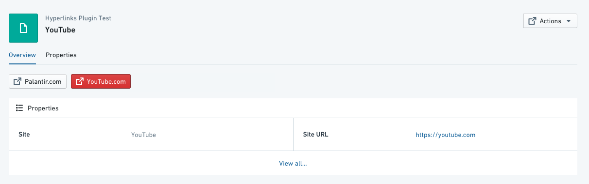
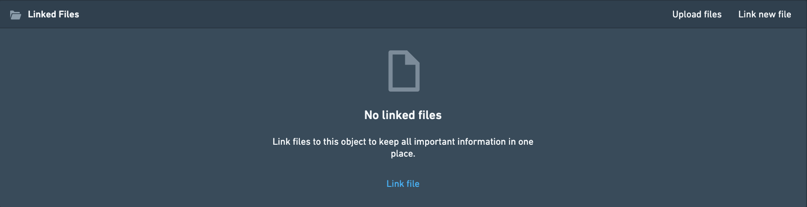

<!-- source: https://palantir.com/docs/foundry/object-views/widgets-apps-files/ · mirrored 2026-08-22 from Palantir Foundry docs -->

# Apps and Files

**Apps and Files widgets** enable embedding, displaying, and linking other Foundry apps within the current Object View. These Embedded Widgets can support assets built in other apps, such as [Quiver](/docs/foundry/quiver/overview/) or [Slate](/docs/foundry/slate/overview/). Additionally, they enable the Object View to display media, upload files, add hyperlinks or allow comments and conversations on that object.

If you are interested in building a more sophisticated object view, consider creating a [Workshop-backed tab](/docs/foundry/object-views/config-object-views/).

Some of the widgets below are not object-aware. This means interaction with other widgets in the Object View is limited.
\* Example 1: Using the Comments Widget is only saved within that specific Object View, and does not write back to the actual object. If these comments might be useful outside the context of the specific object, consider using Actions to capture them.
\* Example 2: Adding files using “Linked Files” is saved in Foundry, but it is not linked to the object. If you wish to have these files re-usable, consider using [Actions attachments](/docs/foundry/action-types/upload-attachments/).
\* Example 3: Embedding Slate or Contour does allow you to pass parameters, but it does not publish or consume filters and does not allow cross-filtering with other widgets such as the Charts Widget.

## Quiver Dashboard

For detailed steps on how to embed a Quiver dashboard in an Object View, see the [Quiver dashboards documentation](/docs/foundry/quiver/dashboards-object-view/).

## Slate Application

This widget displays a [Slate application](/docs/foundry/slate/overview/) within an object view and supports state sharing and interactivity between the two applications. From the object view to the Slate application, the current object context and the active filter state are made available. From the Slate application to the object view, a set of events are provided within Slate which map to behaviors within Object Explorer, such as opening new Object or Exploration tabs and updating the object view filters.

### Configuration

**Slate Resource**
Chose a Slate resource to display. Ensure that all users with permission to view the object can also view the application.

A "responsive" design for the Slate resources will give the best results as the application will resize based on the object view layout and the available screen dimensions.

**Default Parameters**
By default the IDs of the current object and its object type are passed to the Slate dashboard and can be mapped to variables. These can be toggled off or have their target variables changed. The default variable names are `objectId` and `objectTypeId`. In the Slate application, ensure that the matching Variables are manually created in the Variable tab.

**Custom Parameters**
Use additional custom parameters to pass either property values or static, pre-defined values into the Slate application. Create a matching Variable in the Slate application to capture these parameters and use them in the application.

### Using Parameters in Slate

The configured parameters are passed into the Slate application when it loads. When configuring your Slate application, each parameter must have a corresponding Variable created in the Variable panel. [Learn more about how to use variables.](/docs/foundry/slate/concepts-variables/) To check the keys and values of the parameters being passed from Object Explorer to Slate, you can select “View parameters” from the debugging toolbar within the object view editor.

### Accessing object view filters

The object view filters are shared in the IObjectSetFilter format for easy use with the Object Set APIs available within Slate. They are automatically sent to Slate using a cross-frame `postMessage` when they change and can also be requested manually using an event sent from Slate to Object Explorer. This request event can be used to trigger sending the filters when your Slate dashboard is first ready to receive them.

To capture the filters within Slate you should configure a `slate.getMessage` event handler which takes the post message payload, parses it as JSON and then sets the result in a variable. [Learn more about events.](/docs/foundry/slate/concepts-events/) The following should be enough to capture the filters in a variable:

```js
const payload = {{slEventValue}}["payload"]
return JSON.parse(payload);
```

There are two formats that the filters can be consumed in. One format contains all filters without the origin object type they may be based on, the other format contains the filters grouped by object type as well as a separate list for filters which are not based on a specific object type.

The payload for all filters has the following shape:

```json
{
    "type": "HUBBLE_SLATE_WIDGET // ACTIVE_FILTERS_UPDATED",
    "payload": <IObjectSetFilter[]>
}
```

The payload for filters grouped by object type has the following shape:

```json
{
    "type": "HUBBLE_SLATE_WIDGET // ACTIVE_FILTERS_BY_OBJECT_TYPE_ID_UPDATED",
    "payload": {
        "filtersByObjectType": {
            [objectTypeId]: <IObjectSetFilter[]>
        },
        "globalFilters": <IObjectSetFilter[]>
    }
}
```

### Triggering events from Slate

Event types available for Slate to trigger events within Object Explorer include:

* Open a new object tab in Object Explorer (using object RID)
* Open a new object tab in Object Explorer (using object primary key)
* Open a new exploration tab in Object Explorer for a given object set
* Publish object set filters to the object view
* Clear object set filters on the object view
* Refresh the data on the current object view
* Request resending the object view filters to Slate

Trigger these events using the `slate.sendMessage` action. From this action, return the event message object from the custom logic. [Learn more about events.](/docs/foundry/slate/concepts-events/) The expected format for each event is listed below. For help debugging your event integrations, use the object view editor’s debugging toolbar. This will show a warning when a post message is captured but the event payload is incorrect in some way.

**Open a new object tab in Object Explorer (using object RID)**
This event primarily relies on the `objectRid` parameter but can optionally take a `tabId` if the object view should be opened on a specific tab.

```json
{
    "type": "HUBBLE_SLATE_WIDGET // OPEN_OBJECT_BY_RID",
    "payload": {
        "objectRid": "...",
    },
}
```

**Open a new object tab in Object Explorer (using object primary key)**
If the object RID is not known then the object view can also be loaded using the object’s primary key properties along with its object type ID.

```json
{
    "type": "HUBBLE_SLATE_WIDGET // OPEN_OBJECT_BY_PRIMARY_KEY",
    "payload": {
        "objectTypeId": "...",
        "primaryKey": {
            ...
        },
    },
}
```

**Open a new exploration tab in Object Explorer for a given object set**
A new search/exploration tab can be opened by providing an Object Set. These object sets should be of limited complexity in order to avoid issues with representing them within the exploration UI.

```json
{
    "type": "HUBBLE_SLATE_WIDGET // OPEN_NEW_SEARCH_FOR_OBJECT_SET",
    "payload": {
        "objectSet": {
            ...
        }
    },
}
```

**Publish object set filters to the object view**
Many object view widgets can publish filters which effect other widgets in the view. The Slate widget can do this by sending the filters to be published using this event. The latest published filters will replace any filters previously published by the same Slate widget so the state of these filters should be managed internally within Slate. The filters should be filtered as Object Set Filters, the same format used with requests to the Object Set Service APIs. Filters can be provided for specific object types (`filtersByObjectType`) or for global properties (`globalFilters`).

```json
{
    "type": "HUBBLE_SLATE_WIDGET // PUBLISH_OBJECT_SET_FILTER",
    "payload": {
        "filtersByObjectType": {
            ...
        },
        "globalFilters": {
            ...
        }
    },
}
```

**Clear object set filters on the object view**
The published filters present on the object view can be quickly cleared using this event. It requires no payload.

```json
{
    "type": "HUBBLE_SLATE_WIDGET // CLEAR_PUBLISHED_FILTERS"
}
```

**Refresh the data on the current object view**
If updates have been applied to the data present within the object view it may be required to trigger a refresh of the data. This event can be used to do so. It requires no payload.

```json
{
    "type": "HUBBLE_SLATE_WIDGET // REFRESH_OBJECT_VIEW"
}
```

**Request resending the object view filters to Slate**
As described above in the “Accessing object view filters” section, the filters present on the object view published by other widgets are sent to Slate using a post message. When the Slate dashboard has initialized and is ready to handle the filters is should fire this event to request them. A separate event will be sent from Hubble containing the filters. There are two types of filters you can request, one format contains all filters regardless of their origin object type, the other contains the filters grouped by their origin object type. These requests require no payload.

For all filters send:

```json
{
    "type": "HUBBLE_SLATE_WIDGET // REQUEST_ACTIVE_FILTERS"
}
```

For filters grouped by object type send:

```json
{
    "type": "HUBBLE_SLATE_WIDGET // REQUEST_ACTIVE_FILTERS_BY_OBJECT_TYPE"
}
```

## Media Preview

This widget shows a single large inline preview of a media file, given an attachment property or a property that is a URL of some type of media (image, PDF, etc.).



### Configuration

To use the Media Preview widget, you will need to configure the current object in view to include an attachment property. Attachment properties store the relevant media within Foundry and ensure that the media is correctly permissioned by inheriting the permissions from the object they have been added to. See [this page](/docs/foundry/action-types/upload-attachments/) to learn how to add media to your attachment property.

Alternatively, the Media Preview widget can also be used to display existing media on Foundry using URLs stored in a property. Users viewing the object view will require access to both the object and the location the media is stored. To add media to your object views, follow these steps:

1. **Upload media to Foundry:** Datasets can be used as a way to store a collection of arbitrary files. To create such a dataset, you can begin by uploading the files to a folder and, in the pop-up that appears, selecting **Bundle all files as a single dataset**. If you are only uploading a single file, this option will appear as **Upload to a dataset without a schema**.



Once this dataset has been created, you can add additional files as needed. To do so, click **Import** on the top right of the dataset preview.



In the dialog that appears, select additional files to upload.



2. **Add a URL column:** In the backing dataset of the current object in view, add a new column that contains the URL of the media file for each corresponding row. The URL should be of the format: `https://{my-foundry-url}/foundry-data-proxy/api/web/dataproxy/datasets/{dataset rid}/transactions/{transaction rid}/{filename}` OR `https://{my-foundry-url}/foundry-data-proxy/api/web/dataproxy/datasets/{dataset rid}/views/{branch name}/{filename}`
   * Example: `https://{my-foundry-url}/foundry-data-proxy/api/web/dataproxy/datasets/ri.foundry.main.dataset.39ce332b-1d74-40ca-be35-5a5b48459a9a/transactions/ri.foundry.main.transaction.00000000-0000-30d2-8067-4b5d9c819f4c/sample-doc.pdf`
   * Note: If you are using PDFs, the URL should start with `/foundry-data-proxy/api/dataproxy` and NOT `/foundry-data-proxy/api/web/dataproxy`
3. **Mark the column as a `hubble:media_url` in the Ontology:** Create a property for the column in the Ontology, and give it a Typeclass with kind = `hubble` and name = `media_url`.
   * Other Media Typeclasses: Other possibilities are `hubble:icon` and `hubble:thumbnail`. These will use this URL as the icon for an object or as a thumbnail in the search results cards, respectively.
4. **Add a media widget to the object view in Object Explorer:** There are currently two types of built-in media widgets: *Media Preview* and *Media Thumbnails*. If you edit your object view and click **Add Section** you can see a description for each type of section. The widget requires set-up of the **Media Property**, the property containing the URL for the media you wish to preview.

Other parameters to configure:

* Title (required): The title to be displayed on the widget header.
* Icon (required): The header to be displayed on the widget header.
* Help Info: Display additional help information in a tooltip.
* Height: Height (in pixels) to render the media widget.

## Hyperlink

The Hyperlinks widget creates a button that works as a simple link to a webpage. You can add any number of links to an object view and each can be either static (that is, the same link for all objects instances) or dynamic per-object link.



### Configuration

1. *Open Link In* - select whether to open on the same tab at the browser (default) on a different tab or in a pop-up window. Pop-ups are less reliable; may cause issues/get blocked depending on browser/installed extensions. This would apply across all objects
2. *Link Intent* - 5 link “intents” to determine the color of the link button. [Blueprint Intent ↗](https://blueprintjs.com/docs/#core/components/button.css) CSS class applied to the button (default is none):
   1. “None” - grey
   2. “Primary“ - blue
   3. “Success” - green
   4. “Warning” - orange
   5. “Danger” - red
3. *URL Type* - 3 types of URL configurations:
   1. Property - a dynamic property containing a URL to use as your hyperlink destination.
      1. To configure: (1) select the object type (usually the object currently in view); (2) select the property column that the link should be taken from. There is a toggle option to hide the hyperlink button if the value is null.
      2. For example, you could have 2 "Website" objects, both with the field `site_URL` defined in your ontology, where object 1 has the `site_URL` set to `https://palantir.com` and object 2 has the `site_URL` set to `https://palantir.com/uk`.
   2. Hardcoded - a static URL to appear across all objects. Just copy-paste the url, and make sure it has `https://`
   3. Templated - Templated URL allows you to customize the link based on a property of the object. You can bring any property in the URL by encapsulating between single curly brackets `{ }`.
      1. For example, if you have a report RID saved as a property `report_rid`, you could have a button to open the report associated with each object by using the URL template `/workspace/report/{report_rid}`.
4. *Link Title* - the text label displayed on the hyperlink button. This will be the same for all objects.

**Common issues and notes:**

* If the hyperlink is broken, the user will be re-directed to the landing page of Object Explorer.

## Linked Files

The Linked Files widget enables users to link the object in view to a file, either by browsing with a resource selector to select a file already in Foundry, or by uploading a new file to Foundry from their local machine.



### Configuration

This section has no customization options. You can still change the title and other general formatting under the Format tab.

**Common issues and notes:**

* Files uploaded through this widget are not written-back as a part of the ontology, i.e. they are not saved as a property on the current object. In order to achieve that, consider using Foundry Forms with writeback instead.
* There is currently no way to hide one of the two options, so it always shows both “Upload files” and “Link new file”.
* There is currently no way to set up a default destination for file uploads, so the user has to browse for a destination location in Foundry every time they make an upload.

## Iframe

You can embed an inline frame of a Slate dashboard or other Foundry application in the Object View as a "webpage within a webpage". Using an iframe enables you to pass values from the current object to filter variables in Slate or parameters in Contour.

### Configuration

To embed an iframe, you need to configure the link to the correct Foundry address using Handlebar syntax as described below.

1. **Required:** Copy the full link to the page you wish to embed, and remove all text before `/workspace/`.
   * Report example: For `https://EXAMPLE.palantirfoundry.com/workspace/report/ri.report.main.report.ABCDEF-1234-5678`, you should keep `/workspace/report/ri.report.main.report.ABCDEF-1234-5678`.
   * Slate example: For `https://EXAMPLE.palantirfoundry.com/workspace/slate/documents/SLATE_DOCUMENT_NAME`, you should keep `/workspace/slate/documents/SLATE_DOCUMENT_NAME`.
2. **Required:** Add `embedded=true` to simply show the full view. Add a prefix of `/?` if `embedded=true` is the only statement, or `&` if `embedded=true` is attached to other statements.
   * Report example: `/workspace/report/ri.report.main.report.ABCDEF-1234-5678/?embedded=true`
   * Slate example: `/workspace/slate/documents/SLATE_DOCUMENT_NAME/latest?&embedded=true`
3. **Optional:** Pass values to Slate to filter for specific variables/parameters. Use the object type ID, a specific object ID, or a specific property ID in Object Explorer. Use `&` and state which values you wish to inject to Slate within curly brackets, like `{{propertyID}}`. This is based on Handlebar syntax.
   * Report example: `/workspace/report/ri.report.main.report.ABCDEF-1234-5678/?PARAMETER_NAME={{propertyID}}&embedded=true`
   * Slate example: `/workspace/slate/documents/SLATE_DOCUMENT_NAME/latest?VARIABLE_NAME={{propertyID}}&embedded=true`

#### Other configurations

* The difference between a standard iframe and a headerless iframe is that a headerless iframe hides the header of the widget; the widget header normally contains an icon, a title, and the option to add a title to the widget under the **Format** tab in the configuration.
* The iframe widget enables you to set the height of the widget. The default is 500, and it is adjusted manually.
* Once you set up the iframe, you will see a helper window underneath the widget in the object view (only displayed when in editing mode). The helper window includes object-specific hints and shows which properties and IDs you can pass on to Slate and other Foundry applications.
* Hiding the report header is possible by adding the following to the URL: `&__rp_headerBar=hidden`.
* Embedding external websites outside of Foundry may be possible subject to security and policy requirements. Contact your Palantir representative if you think this is necessary for your use case.

## Comments

This widget enables a local dialog box for users collaborating on an object, with the option to mention other users (by tagging `@user_name`).

These comments are not captured on the object itself and do not enable any future search or reuse of this conversation across Foundry.

### Configuration

This section has no customization options. You can still change the title and other general formatting under the **Format** tab.

### Comment behavior when the source dataset changes

If the source dataset for an object type is changed, the corresponding comment feed will disappear.

### Writeback for comments

Comments added through this widget are not written back as part of the Ontology; that is, these comments are not saved as a property on the current object. If your commenting use case includes search, analysis, or learning from comments, consider using Actions.
