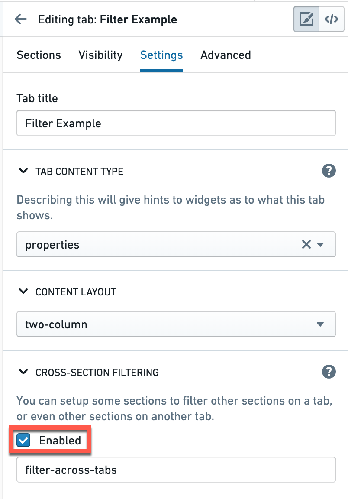
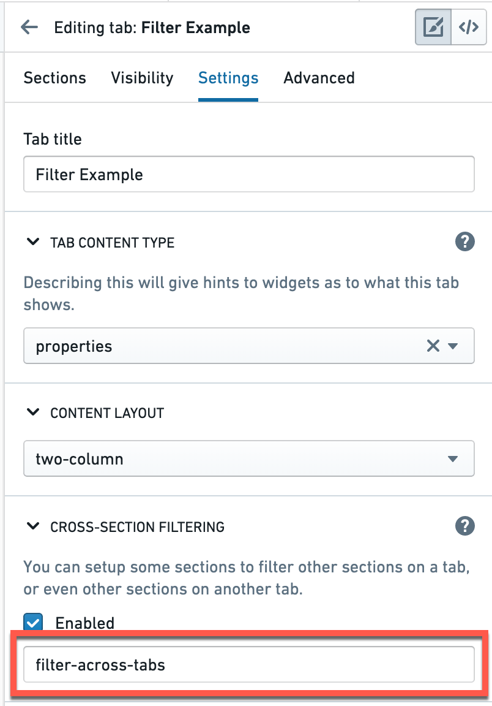
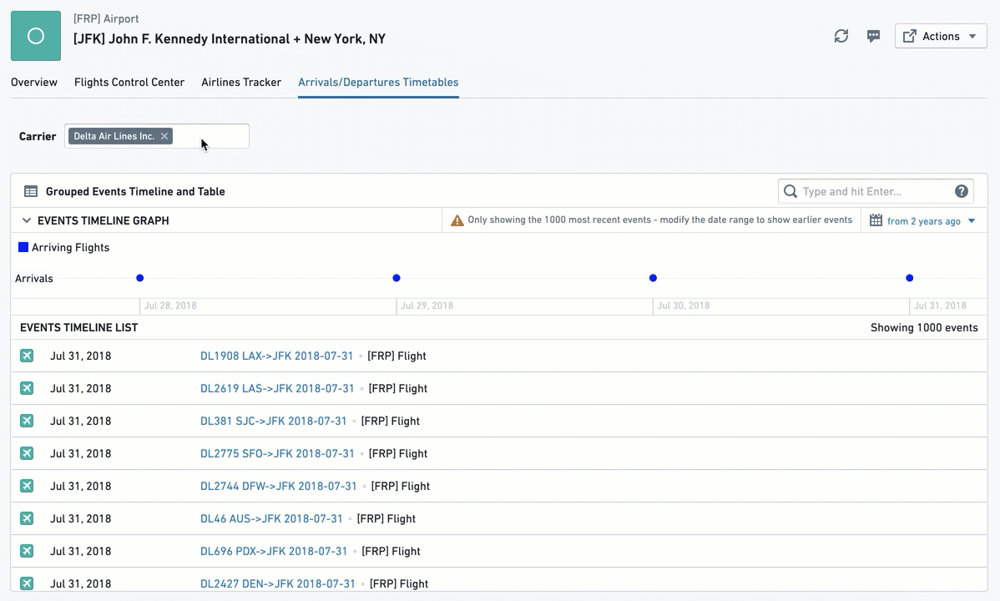
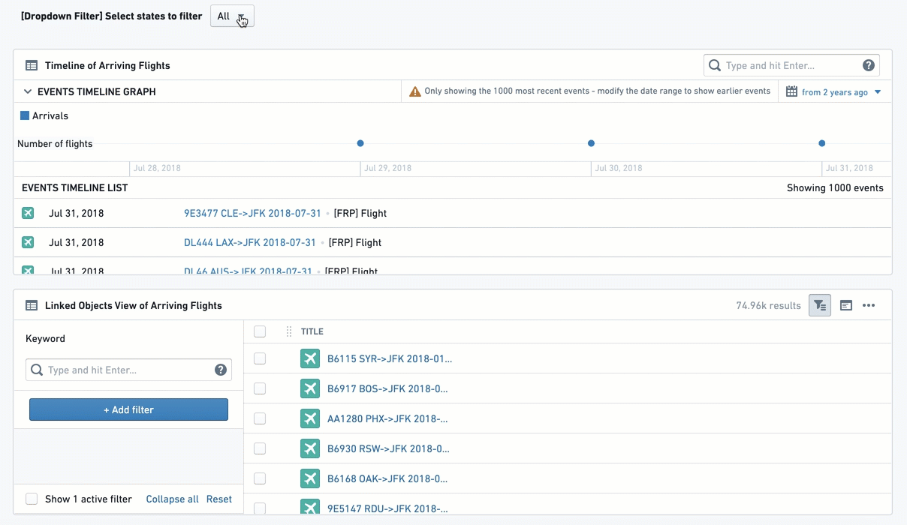
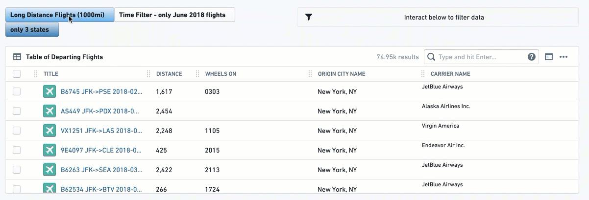
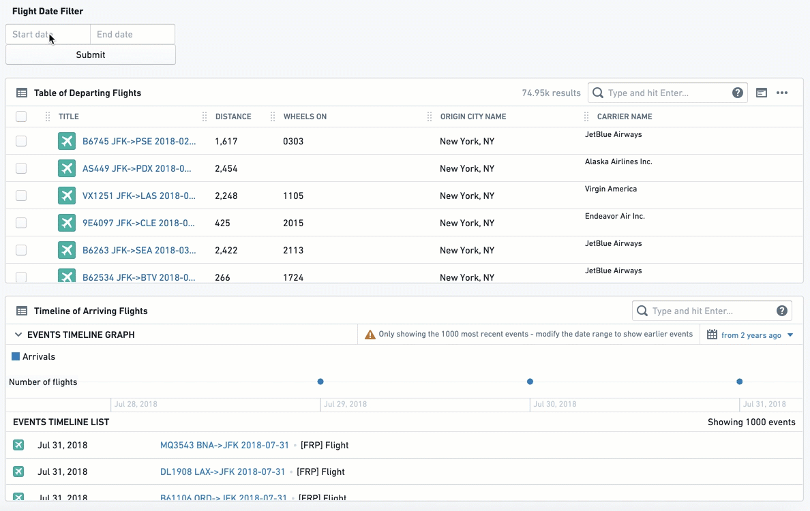
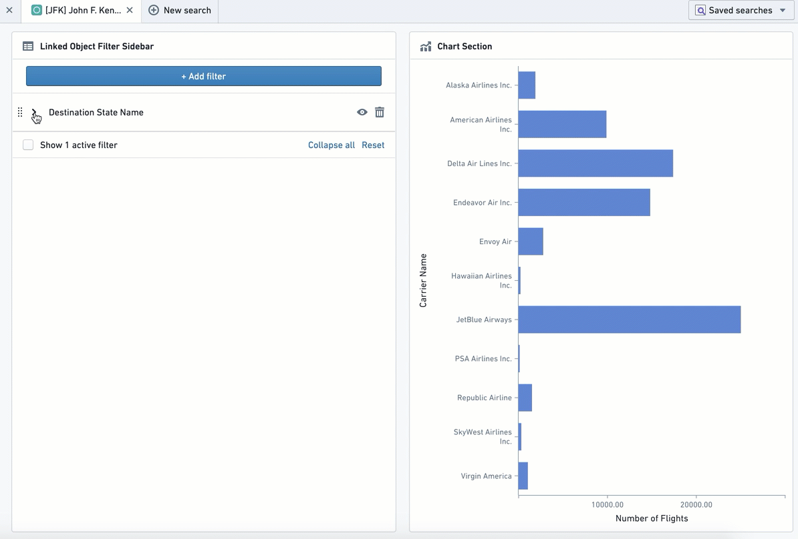
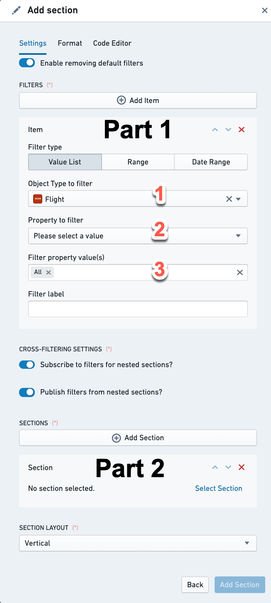
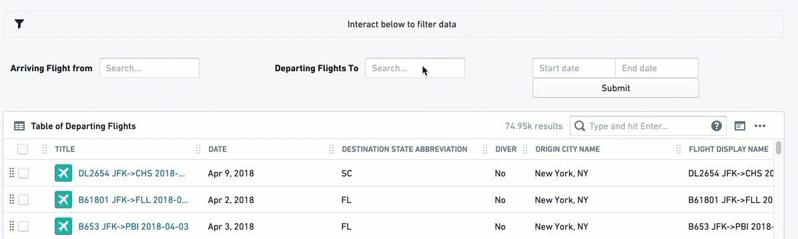

<!-- source: https://palantir.com/docs/foundry/object-views/widgets-filtering/ · mirrored 2026-08-22 from Palantir Foundry docs -->

# Filtering

Many Object Views require the user to filter on visual components such as charts, tables, aggregative metrics and KPIs, and so on. **Filter Widgets** allow users to apply different types of filters in order to drill-down into a specific subset of Linked Objects on that Object View.

This category includes several Filter Widgets:

* Filter by pre-defined properties, including strings, numerical values, and dates by using the [Multiselect Filter](#multiselect-filter), [Dropdown Filter](#dropdown-filter), [Button Filter](#button-filter), or [Date Range Filter](#date-range-filter).
  * Use the [Linked Object Filter Sidebar](#linked-object-filter-sidebar) for more flexible filtering functionality
* Use the [Filter Sandbox Container](#filter-sandbox-container) to have certain filters applied only on part of the current view.
* Use the [Filter Container](#filter-container) for pre-defined filters applied only on a subset of widgets within the Object View.
* Use the [Active Filters](#active-filters) for a summary of all filters currently applied on your Object View.

Apart from these core Filtering Widgets, which are dedicated to filtering only, there are additional widgets that are dedicated to visualization, but also allow some filtering, such as Charts. The [Conditional Container](/docs/foundry/object-views/widgets-layout/#conditional-container) enables displaying/hiding content according to filters that the user interacts with.

**Common Issues and Notes:**

* In order to activate filters to apply across different widgets on a single tab of an Object View, or even across tabs, **you have to mark the checkbox of “cross-filtering”** on the right-bar editor, under “Settings”. Filters will not apply in tabs that were not marked with this checkbox.  

* In order to have a filter applied **across different tabs**, make sure that the “filterSet value“ under the tab Settings has an identical text value across all tabs you wish to filter across. This value is case-sensitive.
  * In that case, the filters that use the same filterSet value will be affected by the same active filters. For example, if Tab A and Tab B share the same filterSet value, any filters applied on Tab A will be applied on Tab B and vice versa.  

* In all filter configurations, you will select a Linked Object to the object that you are currently editing, and not the object that you are editing itself.
  * Example: If you are configuring the Object View of an “Airport”, with “Flights” connected to it, you would probably have different visuals on flights (timelines, charts, list of all flights in a table), and would want to set your filters on different properties of “Flights” (e.g. filter per airline, filter per date, filter per origin city).
  * Therefore, before you configure a filter, your current object needs to be linked to another object. Setting up the links is done in the Ontology Manager.

* Most Filter Widgets only add an optional functionality that allows the user to apply filters locally for the current view of the object they currently browse.
  * Most of the Filter Widgets do not enable you to pre-configure filters to be active by default, such that would narrow down the view for the user (Filter Container is an exception, as it does allow you to set up pre-configured filters).
  * The user would be able to activate filters on their current view of the current object, but once they move to a different object or refresh, these filters would not apply.

## Multiselect Filter

The multiselect filter allows users to filter the Object View by multiple values, with an “OR” statement between them. It keeps all entries that satisfy at least one of the chosen values.

Once configured, this is how it looks:

### Configuration

Note: Each setting that is always required is signed with a (\*) sign next to it.

* \[Required] **Linked Object to Filter:** Choose the Linked Object for this filter to apply on. The widget configuration would offer you only objects linked to the object you are currently configuring (as defined in the Ontology Manager).
  * Example: In an *Airport* Object View, which includes views of *Flights* objects, involving both types of links to the *Airport*: “*Arriving Flights*” and “*Departing Flights*”. If you set up the Multiselect Filter with the Linked Object “*Arriving Flights*”, it would apply to all other widgets that are also involving that same object “*Arriving Flights*”.
* \[Required] **Property to Filter:** Choose the property you want to filter down by: (1) you first need to choose the object type for the filter; and then (2) choose the property of that object by which you want to filter.
  * Once selected, this list of values will be available to users in the Object View, in a filter box with a multi-select dropdown. All other widgets affected by this filter and sharing the object with this filter, would be filtered down to only object instances that have the property values (one or many) chosen.
  * Example: Looking at an airport object with arriving flights from 20 origins, a user has an additional widget showing a table of all flights arriving from these origins. The user chooses a multiselect filter for the object `Arriving flights`, and then chooses the property `Origin City` for the `Flights` object. The dropdown filter would present to the user all 20 origins. Once the user chooses a subset of origins, the table widget would only show arriving flights from this subset of origins.
* \[Optional] **Label For Filter:** will be displayed to users in the Object View, next to the filter box.
* \[Optional] **Maximum Number Of Filter Options:** determines how many distinct values of the property to filter will be displayed. Set by default to 100.

**Common Issues and Notes:**

* Once configured, you would need to mark the checkbox “allow cross-filtering” in the configuration editor settings on the right side (see details above) in order for the filter to affect the Object View.

## Dropdown Filter

This filter enables having one or more filters with a single-selection dropdown of a single property, allowing the user to filter other widgets in the Object View using a dropdown of values.

Once configured, this is how it looks:

### Configuration

For each dropdown filter option you would like to configure, you need to first click on “Add Item”. You will be able to add several dropdown filters under a single widget by just clicking “Add Item” again (they will all appear one next to the other).

Once an item is added, the configuration menu offers two options of "Filter Type":

**Option 1 - Dynamic List:**

This is the simpler option, allowing an easy selection of an object and a property for the dropdown like most filter widgets:

* \[Required] **Linked Object to Filter:** Select the Linked Object for this filter to apply on. The widget configuration would offer you only objects linked to the object you are currently configuring (as defined in the Ontology Manager).
* \[Required] **Property to Filter:** Select the property you want to filter down by: (I) you first need to select the object type for the filter; and then (II) select the property of that object that you wish to filter by.
  * Once selected, all other widgets affected by this filter and related to the same object type as this filter, would filter down from all Linked Objects to only those where their property has the same value as selected in the dropdown.
* \[Optional] **Label For Filter:** Will be displayed to users in the Object View, next to the filter box.
* **Enable 'All' filter option toggle:** If the filter needs to be mandatory, keep this toggle off, to force users to select one value. If it can have all values selected (do not filter by any of them), turn the toggle on. If you wish to select multiple values, select the Multiselect Filter widget instead.

**Option 2 - Value List:**

This is the more complex option, specifically for cases where you wish to define an exact list of values to filter from, which would be a sub-list of the full dropdown list. You would need to manually type each and every value you wish to include in the Dropdown Filter for the user. How to configure this:

* \[Required] **Linked Object to Filter:** Select the Linked Object for this filter to apply on.
* \[Required] **Property to Filter:** Select the property you want to filter down by: (I) you first need to select the object type for the filter; and then (II) select the property of that object that you wish to filter by.
  * Once selected, all other widgets affected by this filter and related to the same object type as this filter, would filter down from all Linked Objects to only those where their property has the same value as selected in the dropdown.
* \[Required] **Filter property value(s):** You need to manually type down each and every value that you wish to include in this dropdown filter for the user, and click on “Create” to add it.
  * Values entered are case-sensitive and will appear in the order they are entered; once entered, values cannot be re-arranged except by removing values (click on the ‘X’) and re-entering them.
  * The number of displayed values is limited to 100.
  * The ‘All’ option is offered by default. You can remove this option and re-add it if desired (“All”, case-sensitive).
* \[Optional] **Label For Filter:** will be displayed to users in the Object View, next to the filter box.

**Common Issues and Notes:**

* Consider using the Multiselect filter instead of the Dropdown filter if (a) you want the functionality of selecting more than a single option; (b) you do not need multiple dropdowns (though this could also be solved with a filter container).
* The interaction of the Dropdown widget with the “Active Widget” is limited. Even if “Enable 'All' filter option” is toggled and enabled, users will still not be able to “Clear filter”, unless they explicitly select “All” under the Multiselect filter.
* Once configured, you would need to mark the checkbox “allow cross-filtering” in the configuration editor settings on the right side (see details above) in order for the filter to affect the Object View.
* There is a limit to the number of dropdown filter boxes the UI is able to present under a single dropdown filter widget (around 7-8 different dropdowns). In the unlikely event that you need more dropdown filters for a single Object View, use an additional Dropdown filter or use a Filter Container.

## Button Filter

This widget creates a button that with a single click filters to a pre-defined set of values: either text (string) values, a range of numerical values, or a range of dates. A second click on the button un-filters the selection.

This is a rigid filter; once configured by the Object View Editor, there is no configuration choice available to end users.

Note that the button changes color as you select or unselect it. You can add an [Active Filters](#active-filters) to make the state visually clear.

Once configured, this is how it looks:

### Configuration

First, select a button filter type:

* Value List: To filter text properties (strings).
* Range: To filter numerical properties (like integers or doubles).
* Date Range: To filter down to a list of date properties.

For all 3 types of button filters, you will have the following:

* \[Required] **Object to Filter:** Select the Linked Object for this filter to apply on.

* \[Required] **Property to Filter:** select the property you want to filter down by: (I) you first need to select the object type for the filter; and then (II) select the property of that object that you wish to filter by.
  * Once selected, all other widgets affected by this filter and related to the same object type as this filter, would filter down from all Linked Objects to only those objects with properties value that the filter condition applies to.

* \[Required] From this point, the setting of the button is different per button type:
  * **Value List:** manually type in the exact list of values you wish to filter by, with an “OR” statement between them. Note that it is case-sensitive and the order cannot be simply re-arranged. The way to re-arrange values is by deleting and re-writing the entire list of values. Note that if you apply both the “All” option as well as another specific value X, then the filter will only apply on value X.
  * **Range:** offers both lower and upper boundary of numerical values. Enter a value to at least one of them:
    * Lowerbound = greater or equal to;
    * Upperbound = lower or equal to;
    * Fill both to have a range filter.
    * Make sure to delete the 0 from the Upperbound if you wish to have a “greater than”, and vice versa for “lower than”.
  * **Date Range:** offers a toggle with 2 options - exact dates (“from 1\1\2019 to 31\12\2019”) or relative to current time (“Last Month” or “Between two years ago and one year ago”). The configuration itself is done with a standard calendar date picker.

* \[Optional] **Button Label:** the text to display on the button. It is optional, but it is best practice to create a button with a label.

* \[Optional] **Button color:** The default color is grey. To select a different color for the button, use the Blueprint standard colors (see https://blueprintjs.com/docs/#core/colors) or use the internal Palantir Blueprint library. Basic colors (“Blue”, “Red”, “Yellow”, etc.) would also work.
  * An un-selected button would have a faded color. Only once clicked, it would change to the chosen color.
  * The Date Range Button does not have an option to pick a Button Color.

**Common Issues and Notes:**

* To grant users with more flexibility, consider using:
  * “Date Range Filter” instead of the “Date Range Button Filter”;
  * “Multiselect Filter” or the “Dropdown Filter” instead of the “Value List Button Filter”.
* Note that there are 2 ways to indicate what a button filter does: (I) label the button well; (II) add an “Active Filter” widget, which shows all filters, including the actual values filtered by clicking on the button filters.
* The Button Filter is off by default, so that it has to be clicked for the filter to apply.
* Once configured, you would need to mark the checkbox “allow cross-filtering” in the configuration editor settings on the right side (see details above) in order for the filter to affect the Object View.

## Date Range Filter

The Date Range Filter allows users to filter down their Object View to a range of dates, based on a specific date property.
Once configured, any widget in the Object View is affected once a date range is chosen and the user selects **Submit**. Views will only display object instances where the date in the chosen date property is within the range.

Note that you should insert the object ID of the object that you want to filter down, which is usually a Linked Object to the object that you are currently configuring.

Once configured, this is how it looks:

### Configuration

* \[Required] **Object to Filter:** Select the Linked Object for this filter to apply on.
* \[Required] **Property to Filter:** Select the property you want to filter down by: (I) you first need to select the object type for the filter; and then (II) select the property of that object that you wish to filter by.
  * Once selected, all other widgets affected by this filter and related to the same object type as this filter, would filter down from all Linked Objects to only those where the chosen date property is within this dates range.
* \[Optional] **Label For Filter:** will be displayed to users in the Object View, next to the filter box.

**Common Issues and Notes:**

* Once configured, you would need to mark the checkbox “allow cross-filtering” in the configuration editor settings on the right side (see details above) in order for the filter to affect the Object View.

## Linked Object Filter Sidebar

This widget creates a flexible filtering experience, allowing the user to filter the current Object View by any specific set of values out of all properties of that Linked Object.

This widget enables a high degree of choice, but also higher complexity for the user. It requires the user to understand and know the properties of the Linked Object, while all other Filter Widgets (e.g. Dropdown Filter, Button Filter) pre-configure them.

Once configured, this is how it looks:

### Configuration

Configuration of this widget only requires selecting the Linked Object that you wish the Object View to filter by. The rest of the configuration, i.e. choosing the specific properties and values to filter by, is completely up to the user and would apply locally on their view only. Once the user refreshes the page or turns to a different object, they would need to re-configure these filters again.

**Common Issues and Notes:**

* All values chosen for a certain property would have an “OR” statement between them. Values of different properties will have an “AND” statement between them.
  * Example: When working with an “Airport” object, the Object View Editor chose to add a Linked Object Filter Sidebar for the Linked Object “Arriving Flights”. A user can select to filter down by Property “Month” and select only January to June; as well as filter by “Carrier Name” and select Delta Airlines and United Airlines. The view would be filtered down to all arriving flights within that airport that are between January and June (January or February ... or June), and are either United or Delta.

## Filter Sandbox Container

The Filter Sandbox Container enables you to organize widgets into a container such that all filters inside it are sandboxed, meaning they only affect and are affected by other widgets inside this container.

### Configuration

Add the Filter Sandbox Container widget, then add existing widgets into the container by clicking on "Add Item".
Select the widget to add from the widget selector.

The other configuration option is the filter set identifier. By default, a new unique value is generated for every new filter sandbox. It can be changed if you want to share filters with:

* Filter Sandbox Container - set the same value of filter set identifier for both of them.
* All widgets on the other tab - enable cross-section filtering on the target tab and set the same value of filter set identifier for it.

**Common Issues and Notes:**

* Cross-filtering (filters affecting and being affected by other widgets inside the container) is always enabled for this container.
* Use this container over Filter Container widget for sandboxing if you need cross-filtering for widgets inside the container. Use the Filter Container with subscription to filters disabled if you need widgets affected only by predefined filters.
* If you need both cross-filtering inside the sandbox and predefined filters, use Filter Sandbox Container and add a Filter
  Container inside it with both publishing and subscription to filters enabled.

## Filter Container

This widget enables creating a contained subset of widgets with a *pre-defined set of filters* applied only on them.

This subset of filters can be defined on any combination of the following property types: (1) list of text (string) values; (2) numeric range; and\or (3) date range.

Do not use this widget as a filter sandbox, as it was built to only support pre-defined filters.

Note: To have a filtering sandbox container (that is, to have filters apply only within a container and not be affected by external filters), use the [Filter Sandbox Container](#filter-sandbox-container) instead.

### Configuration

The Filter Container configuration has two parts:

**Part 1 - Apply pre-configured filters on all widgets within the container**

These pre-defined filters would be applied by default *only to widgets within the container*. Pre-defined filters in the container can be any combination of the following three filter types:

* Value List - to filter text properties (i.e. string)
* Range - to filter numerical properties (i.e. integer, double)
* Date Range - to filter down to a list of date properties

For each default filter, you need to configure the following:

* \[Required] **Linked Object to Filter:** Select the Linked Object for this filter to apply on. The widget configuration only offers objects linked to the current object (as defined in the Ontology Manager).
* \[Required] **Property to Filter:** Select the property you want to filter down by: (I) you first need to select the object type for the filter; and then (II) select the property of that object that you wish to filter by.
  * Once selected, all other widgets within this container, which are related to the same object type, would filter down from all Linked Objects to only those objects with properties value that the filter condition applies to.
* \[Required] From this point, the setting is different per filter type (Text Value List, Numeric Range, Date Range):
  * **Value List:** manually type in the exact list of values you wish to filter by, with an “OR” statement between them. Note that it is case-sensitive and the order cannot be simply re-arranged. The way to re-arrange values is by deleting and re-writing the entire list of values. Note that if you apply both the “All” option as well as another specific value X, then the filter will only apply on value X.
  * **Range:** This allows you to set both the lower and upper boundary of a range of numerical values. Enter a value to at least one of them:
    * Lowerbound = greater or equal to;
    * Upperbound = lower or equal to;
    * Fill both to have a range filter.
    * Make sure to delete the 0 from the Upperbound if you wish to have a “greater than”, and vice versa for “lower than”.
  * **Date Range:** offers a toggle with 2 options - exact dates (“from 1\1\2019 to 31\12\2019”) or relative to current time (“Last Month” or “Between two years ago and one year ago”). The configuration itself is done with a standard calendar datepicker.
* \[Optional] **Filter Label:** An internal label for documentation, will not appear anywhere for the user. Optional.

**Cross-filtering settings:**

* ***Subscribe to filters for nested sections?*** If you wish the Filter Container to be affected by filters applied outside the container - both from the tab containing it, as well as other tabs sharing cross-filtering with the current tab. This would also make it consume other filter widgets within the container, e.g. Chart widget with a bar selected, or a multiselect filter.
* ***Publish filters from nested sections?*** If you wish the filters inside the Filter Container to apply outside the container - both on the tab containing it, as well as on other tabs sharing cross-filtering with the current tab. This does not apply to the predefined filters, but only to any additional filter widgets within the container.

How to use these toggles?

* Both toggles off - predefined filters apply within the container only, but it neither publishes or consumes any other filters - internal or external to the container.
* Only Subscribe toggle on - the container is affected by external filters, but filtering within the container does not work, unless it is the pre-defined filters.
* Only Publish toggle on - filters widgets within the container apply only outside the container, and not within the container. Only the predefined filters apply within the container.
* Both toggles on - all filters on the tab apply everywhere, except for the pre-defined filters in this container.

**Common Issues and Notes:**

* The pre-defined filters are only applied within the container and do not apply on any widget outside the container. This is true only for these pre-defined filters, and not for other filter widgets which could be configured within the container. Looking for a sandbox container capability? Try [Filter Sandbox Container](#filter-sandbox-container).
* The pre-defined filters in the “Filter Container” will not be visible for the user in the UI, and will not be possible to remove by users, unless your follow the following steps:
  * Add an “Active Filter” widget within the Filter Container to display it.
  * Make sure the toggle of “Enable removing default filters” is switched-on (it is on by default). Otherwise, users cannot remove these filters, even with the “Active Filter” removal option.
* Applying filters inside a filter container will also remove non-matching options in filter widgets, such as [Dropdown Filter](#dropdown-filter). If this behavior is not desired, use [Filter Sandbox Container](#filter-sandbox-container) instead.

**Part 2 - Filter Container as a Container of widgets**

Configure views within this container as with any other container. Every widget you add would be subscribed to the pre-defined filters of the Filter Container, as well as any other filter defined to affect it.

Once you click on “Add Section”, you get the same configuration experience as with any other “Add Section” on the main Object View or on other widgets with nested tabs (e.g. any Container widget).

**Section layout:**

This determines whether widgets within the Filter Container would be stacked vertically (one under the other, this is the default) or horizontally (one next to the other, from left to right).

## Active Filters

This widget displays a summary of all filters that are currently applied on the Object View, and allows the user to either remove individual filters or clear all filters. There is no configuration required for this filter.

Active Filter is a useful visual indication for the user to understand which filters are currently active on their Object View. Once your Object View contains several filtering widgets (filtering using charts included), and especially if you use Filter Container or Button Filter, the visibility of active filters is important for the user experience.

Once configured, it will look like the interactive widget below, with a filter icon to the left. In this example, it is affected by the different filter widgets:

## Configuration

There is no configuration for the Active Filter widget. Simply add it as a new section.

**Common Issues and Notes:**

* This widget will display all filters applied from all sections sharing a cross-section and cross-tabs filtering.
* Some filter widgets might not interact with this widget. Currently, it will not remove a filter applied by the Dropdown filter, and users would still need to manually change the value in the dropdown. This makes sense when the Dropdown limits you by default to one value, but it still applies even when the “All” option is enabled.
