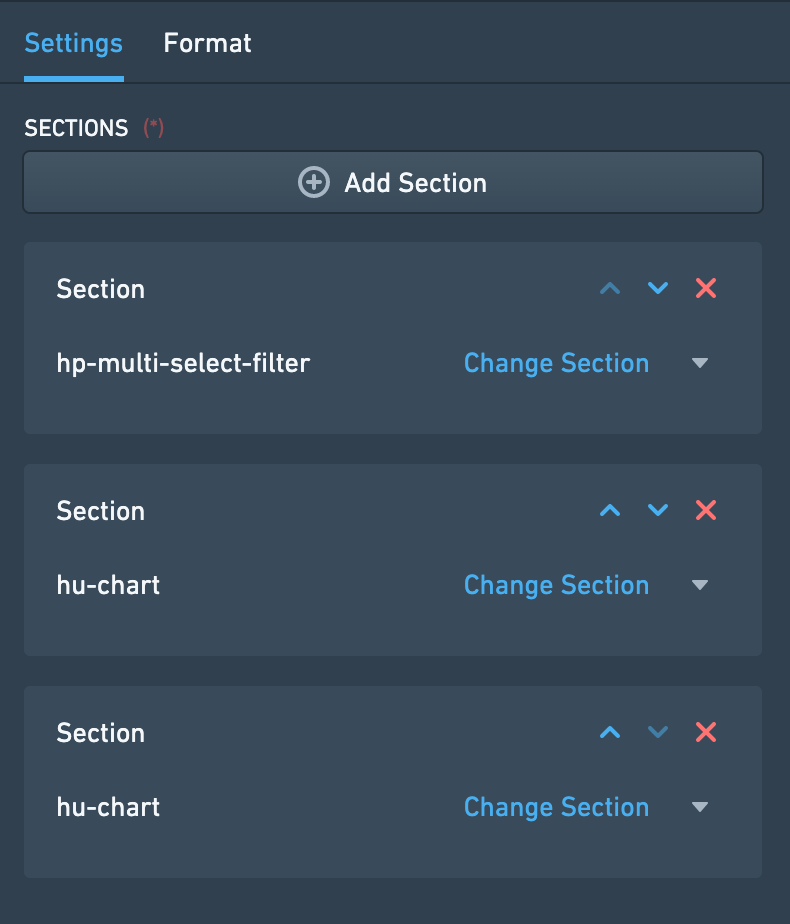
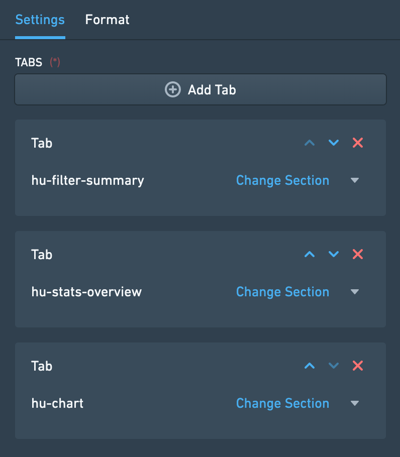
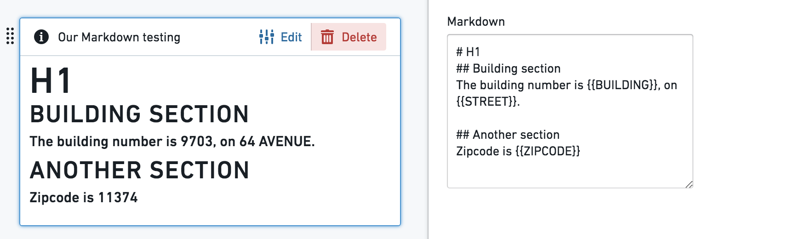
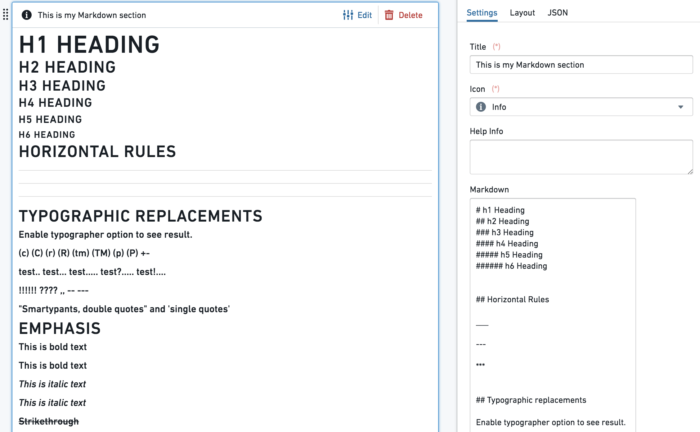

<!-- source: https://palantir.com/docs/foundry/object-views/widgets-layout/ · mirrored 2026-08-22 from Palantir Foundry docs -->

# Layout

**Layout widgets** are used to organize and structure the layout of an Object View page within a certain tab, by arranging the view into different containers.

Each Object View can have three levels of Layout control:

* Tabs, with a set of functionalities described on [Configuring Tabs](/docs/foundry/object-views/config-tabs/)
* Layout Widgets within a tab (also called Containers), enabling you to organize the Object View within boxes of content.
* All content widgets (visualization, properties and links, filters, etc.), which are the building blocks of the Object View.

These are the types of Layout containers:

* Visual design of the page - [Horizontal Distribution](#horizontal-distribution) and [Vertical Stack Container](#vertical-stack-container).
* Add another level of content nested within a tab - [Tabbed Container](#tabbed-container).
* Enable displaying/hiding content according to [filters](/docs/foundry/object-views/widgets-filtering/) that the user interacts with - [Conditional Container](#conditional-container).
* Display text, enriched with object values - [Markdown](#markdown) widget.

## Horizontal Distribution

This widget enables you to organize the layout of your Object View visually by displaying widgets distributed horizontally within a container, one next to the other. It is just a container of other widgets, and has no other functionality by itself.

### Configuration

Once you add the Horizontal Distribution widget, the configuration enables you to add different widgets within this container, by clicking on “Add Item”, which would open up the widget selector.

There are two options to determine how much width would be allocated to each widget within the container:

* Relative - choose an integer number for each widget within the container. Widgets are distributed according to their relative number. Example: 3 widgets of sizes A=1, B=3, C=2; Widget A would take 1/6 of the length and widget B would take 3/6 of the length.
* Pixel - choose an absolute number of pixels to allocate to each widget. If the sum of pixels exceeds Object View limits (about 1150 pixels), widgets will “spill out” of the page.

**Common Issues and Notes:**

* Make sure to add a title to the Horizontal Distribution widget, which is mandatory to be able to add it. The title will be displayed on the widget header.

## Vertical Stack Container

This widget enables you to organize the layout of your Object View visually by displaying widgets distributed vertically within a container, stacked one on top of the other. It is just a container of other widgets, and has no stand-alone functionality by itself.

### Configuration

Once you add the Vertical Stack Container widget, the configuration enables you to add different widgets within this container, by clicking on “Add Item”, which would open up the widget selector.

**Common Issues and Notes:**

* Make sure to add a title to the Vertical Stack Container widget, which is mandatory to be able to add it.
* To align the Vertical Stack Container next to other widgets, go to “Format” tab in the configuration and select a Left/Right alignment, instead of the default “Full Width”.
* Choose the order of the tabs by using the up/down arrows next to each tab under “Settings” in the configuration. This also allows you to delete tabs or replace the widget within each tab.

## Tabbed Container

Add another layer of tabs to your Object View, by creating a container of tabs within the current tab. Users can browse between these tabs, each one containing a single widget (which can also be a container of a number of widgets).

The Tabbed Container is just a container of other widgets, and has no stand-alone functionality by itself.

### Configuration

* Once you add the Tabbed Container widget, the configuration enables you to add different tabs of widgets within this container, by clicking on “Add Tab”, which would open up the widget selector.
* The name of each tab is the title of the widget on that tab, which appears under “Format” in the configuration.
* Choose the order of the tabs by using the up/down arrows next to each tab under “Settings” in the configuration. This also allows you to delete tabs or replace the widget within each tab.

**Common Issues and Notes:**

* Using this tab is sometimes necessary in central objects in the ontology. However, be mindful that it adds complexity to the user experience, with “tabs within a tab”.
* Make sure to add a title to the Tabbed Container widget, which is mandatory to be able to add it. The title will be displayed on the widget header.

## Conditional Container

A conditional container enables content to be displayed or hidden according to a condition. This condition can be based on:

* Filters that the user applies on the Object View
* Property values of the object or a linked object
* The existence of linked objects of a certain type

### Configuration

This widget supports adding one or several *conditional sections*. Each one of these sections includes a *condition* and one or more widgets that are *conditionally displayed* according to that condition. To set up a conditional section, you follow these three steps:

**Step 1 – Set the condition**

The first step is to define the condition according to which the contents of the container should be displayed or hidden. There are three different types of conditions:

***Condition 1 – Filters***

The *Filters* condition displays or hides the contents of the container based on whether or not filters are applied to the Object View. This condition can be configured in three different ways:

* **Specific Filter** – The contents of the container are displayed only when there is a filter applied on a specific property. That property can either be a property of the current object in view or of a linked object. This means that in order to use this condition, there must be another Filter Widget which filters specifically on the same object and property as defined in this condition.
  * *Example*: Configuring an Object View of an Airport, there is a filter to keep only Flights that were cancelled (Status = “Cancelled”). A Conditional Container, showing details on cancelled flights, is configured to be displayed only when such a specific filter is applied.
  * *Note*: In order for this condition type to work, the same object type needs to be selected in the dropdowns for "Filter linked object" and "Filter property".
* **No Filter** – The container is displayed only when no filter is applied within the current tab or any tab sharing cross-filters with this tab. This can be any type of filter, e.g. a date filter, a dropdown filter, a button filter, etc.
* **Any Filter** – The container is displayed only when at least one filter is applied within the current tab or any tab sharing cross-filters with this tab. Just as for *No Filter*, this can be any type of filter, e.g. a date filter, a dropdown filter, a button filter, etc.

***Condition 2 – Properties***

The *Properties* condition displays or hides the content of the container based on the value of a property of an object. The object in question can either be the current object in view or a linked object. In the case of a linked object, the relationship to the current object needs to be either *1-to-1* or *many-to-1*, in which case the current object needs to be on the "many" side of the relationship.

To use this condition type, you first select the property you want to use. Next, you define when the contents of the conditional container should be shown based on that property. There are four options for this:

* **Is defined** – The value of the property is not `null`.
* **Is not defined** – The value of the property is `null`.
* **Is one of** – The value of the property matches one of the values that you define.
* **Is not one of** – The value of the property *does not* match one of the values that you define.

For **is one of** and **is not one of**, the values you define are translated to match the property type (if it is integer, double, date or boolean). See below for more details on how this property comparison is done.

***Condition 3 – Linked Objects***

The *Linked Objects* condition displays or hides the contents of the container based on the existence of linked objects of a certain type. To set up this condition, you first select a link path. Then, you decide if the contents of the conditional container should be shown if linked objects of the selected path *exist* or *do not exist*.

The logic of this condition can be reasoned about by comparing it to a Linked Objects View. The contents of a container with this condition should only be shown if a Linked Objects View with the same link path would show at least one object (if linked objects should *exist*), or no objects (if linked objects should *not exist*).

**Step 2 – Add Widgets**

Once a condition has been defined, the second step is to configure the actual content to be displayed within the container. Click on the “Add Section” button and add as many widgets as needed. Note that you can order the widgets displayed within the Conditional Container by using the up/down arrows.

**Step 3 – Choose a Layout**

Finally, the third and final step is to choose the layout of the container. The layout can be either:

* **Horizontal** – Widgets are displayed from left to right, like the Horizontal Distribution Container widget
* **Vertical** – Widgets are displayed from top to bottom, like the Vertical Stack Container widget

After completing these three steps, your Conditional Container should be set up and good to go!

**Common Issues and Notes:**

* How is the property value comparison done?
  * String values are matched normally
  * For numeric properties, all input values in the widget are turned into numbers and compared to the numeric property (e.g. enter the string 3.1415 and it would turn to a double)
  * For boolean properties, if you use “true”, “yes” and “1” in the widget, they are all considered truth input values, all the rest is false.
  * Date and timestamp values are matched after string conversion
  * Arrays are currently not supported
* If several conditions are added, conditions are evaluated from top to bottom - the sections of the first condition met will be rendered, and the others ignored.
* The conditional container by property value option works on either a 1-to-1 or many-to-1 relationship, where the current object in display is on the related side (the “many”).
  * It *does not* allow conditions of many-to-many or 1-to-many where the current object is on the primary side, and it *does not* allow conditional visibility by aggregations of values in Linked objects.
  * *Example*: looking at an aircraft object, I could add a condition dependent on what airline it belongs to (assuming it belongs to only one airline), but I cannot add a condition dependent on “does it have a linked flight object with property X?”
* This widget is an extension of the tab-level optional “Visibility” configuration, but at the widget level. However, it is not a complete equivalent:
  * “Visibility” enables you to define conditional tabs according to users profiles.
  * This widget allows you to set conditional views (1) within a single tab; (2) option of conditional visibility by applied filters (dependent on user’s interaction); (3) does not include conditional view per users profiles.
* In order to enable the conditional section option to display/hide by filters applied, make sure to mark the checkbox of “cross-filtering” on the right-bar configuration editor, under “Settings”.
* The Conditional Container is only a container of other widgets, distributed either horizontally or vertically.

## Markdown

This widget enables adding rich text as a part of an Object View layout. It provides a plain text editor, based on the Markdown lightweight rich text formatting syntax (`markdown-it` library). As an addition, this widget allows templating of object properties values as part of the text.

### Configuration

* The text box is a simple text editor, and supports the standard `markdown-it` library.
* **Object properties templating** - use the {{propertyName}} format, with double curly brackets, to template your Markdown content with the current object properties values. propertyName is the exact case-sensitive name of the [property in Ontology](/docs/foundry/object-link-types/properties-overview/). The values {{objectId}}, {{objectTypeId}} and {{objectTypeRid}} are also supported.

*Additional configurations*:

* Line breaks, with 2 options:
  * Enable line breaks - when on (default), a single line breaks in the editor works as an actual line break; when off, line break in the editor does not affect the result. Using headers formats would still serve.
  * Convert "\n" to line breaks - shows `\n` as a line-break (requires the "Enable line breaks" to be on).
* Enable sanitized HTML rendering - Safe HTML rendering with markdown-it. Embedding HTML from object properties are disabled; all property values are escaped for security.

**Common Issues and Notes:**

* Currently, long texts and arrays included using the {{propertyName}} format might spill out of the text box and are not rendered by default.
