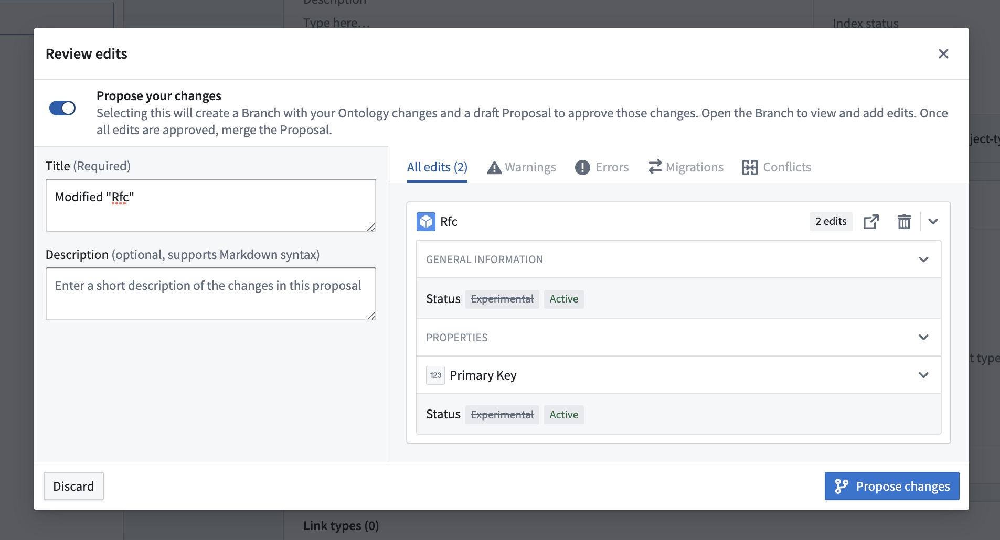
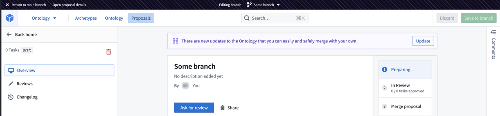

<!-- source: https://palantir.com/docs/foundry/ontologies/ontology-branches-legacy/ · mirrored 2026-09-04 from Palantir Foundry docs -->

# Ontology proposals \[Legacy]

:::callout{theme="warning"}
Ontology branches (formerly known as ontology proposals) are being sunset. On enrollments with Global Branching enabled, you can no longer create ontology branches. Instead, use [global branches](/docs/foundry/ontologies/branching-ontology/) to modify the ontology and access expanded capabilities including branching datasources, testing changes downstream in supported applications, and managing both data and ontology modifications within a unified workflow.
:::

Ontology branches allow you to make changes to an Ontology on a branch, which is based on the `Main` version of that ontology. This process ensures that all modifications are reviewed and approved before being incorporated into the main Ontology.

To create a branch, you need editor permission on the project containing the resources.

## Definitions

* **Branch:** A *branch* on the Ontology is a separate version of that Ontology, derived from the main version, designed to enable experimentation and changes without impacting the main branch. This allows users to test and refine adjustments to the Ontology in an isolated environment before merging them back into the main branch.

* **Proposal:** A *proposal* is analogous to a Pull Request in a version control system, specifically tailored for Ontology branches. A proposal is automatically created alongside a branch and contains metadata such as reviews, name, and descriptions of the changes being merged into the main branch. Proposals serve as a mechanism for reviewing and approving changes made in a separate branch before they are integrated into the main Ontology.

## Ontology branching workflow

The general ontology branching workflow has five steps:

1. [Create your branch](#1-create-your-branch)
2. [Prepare your proposal for review](#2-prepare-your-proposal-for-review)
3. [Request a review](#3-request-a-review)
4. [Review the proposal](#4-review-the-proposal)
5. [Release the proposal](#5-release-the-proposal)

Each step is outlined in the following sections.

### 1. Create your branch

You can create a branch by selecting **Create Branch** to open a dialog where you can choose a title and description for your proposal.

Alternatively, if you already have changes to the Ontology that you would like to include in your proposal, you can select save and toggle **Propose your changes** from the save dialog.

If you are on the main branch of your Ontology, and you have no changes, you can also create a branch by choosing the branch select component and typing a name for the new branch.

Proposal branches can only be created on the main Ontology configuration. You cannot create a new branch based on another proposal.

While on a branch, a branch navigation top bar located above the workspace interface reflects your current branch.

### 2. Prepare your proposal for review

At this point, depending on how you created your proposal, you may already have some changes on your branch. While on your branch, you can continue making changes to Ontological resources, including creation and deletion.

Every modified Ontological entity will constitute a separate **Task** in your proposal and made available for review.

For resources that have migrated to use [Ontology roles](/docs/foundry/object-permissioning/ontology-permissions-legacy/#ontology-roles), viewers can make changes to resources in a proposal. If the resource is on datasource derived permissions, only editors or owners can make changes to them on a proposal.

:::callout{theme="neutral"}
On a branch, you may edit resources when holding editor or owner permissions.
:::

### 3. Request a review

After making changes to the branch, you may add reviewers to your proposal. To do so, navigate to your [Proposal view](#2-prepare-your-proposal-for-review), by selecting **Open proposal details** located in the top bar.

If you exited your branch, you can go to your proposal overview either by navigating to the **Proposals** tab and selecting your proposal, or by using the branch select component.

From there, assign reviewers from the **Reviewers** section.

Reviewers are not notified until the proposal is in the `In review` stage.

:::callout{theme="neutral"}
You may also leave comments on the various tasks in your proposal to give context about the changes proposed. Access the **Comments** section of your tasks by choosing the **Reviews** tab, and then selecting the **Comments** sidebar on the far right.
:::

### 4. Review the proposal

Reviewers may approve or reject individual tasks in the **Reviews** tab, and may add comments to support their review.

Reviewers must have owner or edit permissions to be able to approve a change.

Users without permissions may still review the task, for example, to convey their opinions on the change, but this will not affect the approved status of the task.

If the creator of the proposal has owner or editor permissions on all the edited resources, they will be able to approve their own changes.

:::callout{theme="warning"}
Even if an editor or owner is not explicitly added as a reviewer, they can still approve your proposals. We recommend using the reviewers list as a way to keep track of who should review changes, but not as a way of safeguarding the Ontology. Instead, protect the Ontology by carefully assigning roles and permissions.
:::

### 5. Release the proposal

Once your changes have been reviewed and approved, the proposal can be merged into the Ontology.

:::callout{theme="neutral"}
Merging changes into the Ontology does not require special permissions. After a proposal is approved, anyone who can edit the branch can merge the proposal into the Ontology.
:::

After a proposal is merged, it is moved from the **In Review** section to the **Merged** section in the sidebar.

At any point of time before you merge the proposal, you can close the proposal by selecting **delete** from the sidebar.

Proposals can only be merged into the main ontology configuration.

Proposals cannot be reverted automatically. To undo a proposal, you must undo the different changes within it.

:::callout{theme="warning"}
Once a proposal is closed, it cannot be reopened.
:::
