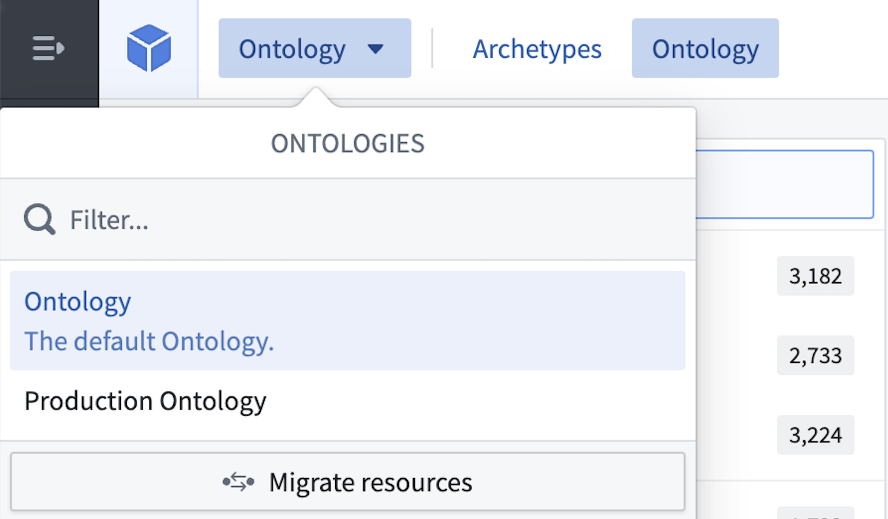
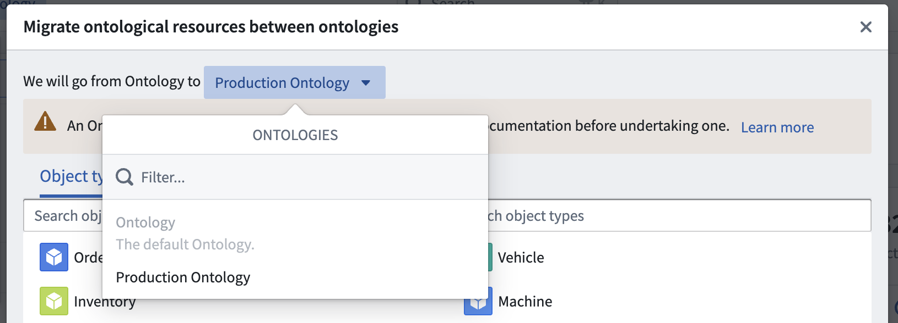
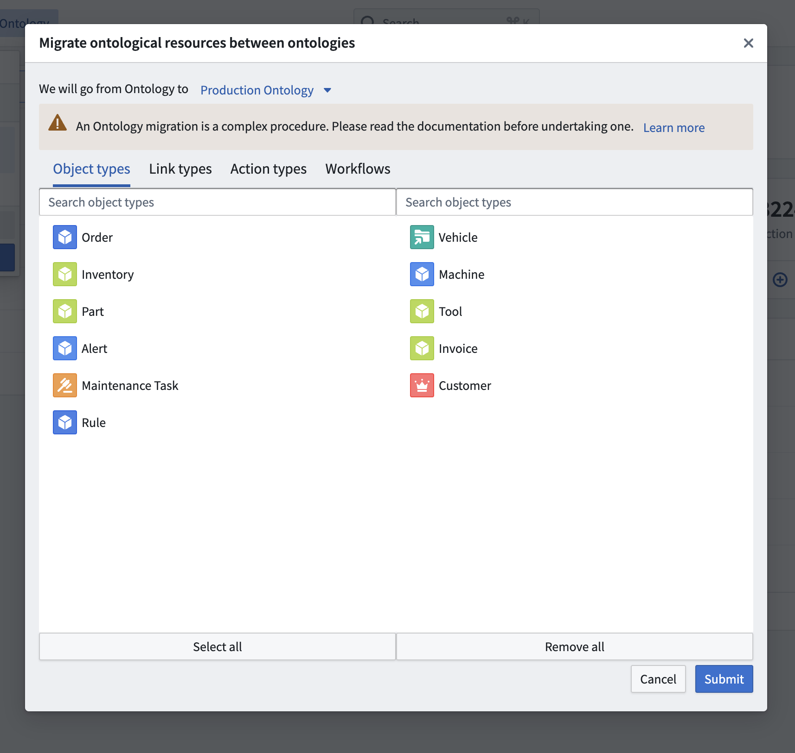

<!-- source: https://palantir.com/docs/foundry/ontologies/ontology-migration/ · mirrored 2026-08-07 from Palantir Foundry docs -->

# Migrate ontological resource between Ontologies

Every ontology resource is automatically linked to the ontology it is created in. After their creation, resources can be moved between ontologies. Migrating resources between ontologies also changes the permissions on the resources, however, it does not impact the permissions on the underlying data and the input datasources. When migrating objects between Ontologies all edits will be preserved by default.

To migrate resources from one ontology to another, do the following:

1. Navigate to the ontology that owns the resource via the Ontology switcher located in the top right corner in the **Ontology Manager**.   
      

2. Select **Migrate resources** in the same ontology to start the migration process. Then, select the target ontology in the top row using the ontology selection dropdown menu.   
      

3. Select the object types, link types, action types, and workflows to migrate. A preview of the selection of resources to be migrated are shown in their current ontology (left) and in the target ontology (right). Note that it is impossible to migrate object types from a private ontology to the default ontology unless the object type was originally created in the default ontology.   
      

:::callout{theme="warning" title="Migrating to default ontology"}
Make sure that you are migrating connected resources together. The migration fails if related ontological resources are missing in the selection.
:::

4. After completing the selection, select **Submit** to migrate the resources.
