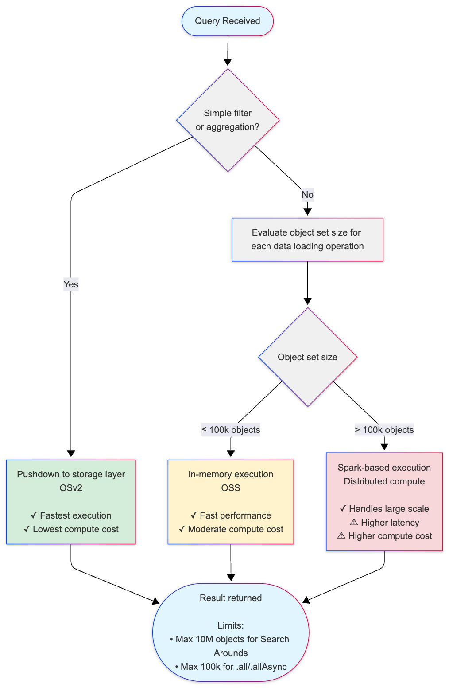

<!-- source: https://palantir.com/docs/foundry/ontologies/oss-limitations/ · mirrored 2026-09-04 from Palantir Foundry docs -->

# Object Set Service limitations

The Object Set Service (OSS) is the service responsible for querying and retrieving objects from the Ontology. OSS uses a tiered execution strategy to balance performance and scale, automatically selecting the optimal approach based on the size and complexity of your query.

This page explains how OSS handles queries of different sizes and the limitations you should be aware of when working with object sets.

## Query execution strategies

OSS uses a tiered execution strategy that automatically selects the optimal approach for processing your query:

1. **Pushdown to storage layer:** For simple queries, OSS pushes operations directly to the storage layer to take advantage of indexed data structures. This is the fastest execution path and requires minimal compute overhead.

2. **In-memory execution:** For queries with more complex operations, OSS loads data into memory for fast processing up to a certain capacity. This is optimal for moderate-scale queries.

3. **Spark-based execution:** For large-scale queries that exceed in-memory capacity, OSS automatically falls back to Spark-based distributed compute. This enables processing of much larger object sets at the cost of additional latency and compute usage.

The transition between these execution strategies is automatic and based on multiple factors:

* **Object set size:** Larger sets trigger Spark execution
* **Query complexity:** Certain advanced features (derived properties, intermediary link types, interface Search Arounds) require Spark execution regardless of size
* **Available compute resources:** OSS balances performance and resource utilization

OSS may use multiple execution strategies within a single complex query for different stages of execution. Understanding the thresholds and limitations of each approach will help you design efficient queries and understand performance characteristics.

### OSS execution flow for Object Storage v2

The following diagram illustrates how OSS selects the appropriate execution strategy based on your query. This decision process may be executed multiple times within a single query, depending on the complexity of each stage:

**Key thresholds:**

* **100,000 objects (default threshold):** Threshold for switching from in-memory to Spark-based execution for Search Arounds and derived properties.
* **Internal pagination threshold:** If any data loading step requires more than 25 pages of data from Object Storage v2, OSS falls back to Spark.
* **10,000,000 objects (default threshold):** Maximum result set size for Search Around operations (leaf limit).
* **100,000 objects (default threshold):** Maximum for loading objects into memory using `.all()` or `.allAsync()` (OSDK limitation; `getAllObjects` API can load more).

### Execution strategy comparison

| Strategy | When Used | Performance | Compute Cost | Use Cases |
|----------|-----------|-------------|--------------|-----------|
| **Pushdown to storage** | Simple filters and aggregations | Fastest | Lowest | Basic queries that can be resolved by indexed lookups |
| **In-memory execution** | Object sets ≤100k | Fast | Moderate | Most Search Arounds, moderate-scale queries |
| **Spark-based execution** | Object sets >100k | Slower (higher latency) | Higher | Large-scale Search Arounds, complex multi-step queries |

## Object set size limitations

OSS enforces different size limits depending on the storage backend and operation type. These limits ensure system stability and predictable performance.

### Object Storage v1 (Phonograph) \[Planned deprecation]

:::callout{theme="warning" title="Planned deprecation"}
Object Storage v1 (Phonograph) is in the [planned deprecation](/docs/foundry/platform-overview/development-life-cycle/) phase of development and will be unavailable after June 30, 2026. [Migrate your object types and link types](/docs/foundry/object-backend/osv1-osv2-migration/) to Object Storage v2.
:::

Object Storage v1 has the following limitations:

* **Loading objects into memory:** Maximum of **100,000 objects** can be loaded using `.all()` or `.allAsync()` methods in [Functions on Objects](/docs/foundry/functions/overview/).
* **Search Around operations:** When performing a Search Around from object set A to object set B, the result set (object set B) cannot exceed **100,000 objects**.

These limits apply to all operations in Object Storage v1. There is no automatic fallback to Spark-based execution for larger queries.

### Object Storage v2

Object Storage v2 provides greater flexibility and scale through its hybrid execution model:

* **In-memory execution:** By default, OSS processes queries in-memory for object sets up to **100,000 objects**.
* **Spark-based execution:** When a Search Around operation involves more than **100,000 objects**, OSS automatically transitions to Spark-based distributed compute.
* **Search Around result limits:** The result set from a Search Around operation (the "leaf" object set being loaded from a single datasource) cannot exceed **10 million objects** per individual Search Around operation. Additionally, the total number of objects across all datasets loaded during query execution cannot exceed **30 million objects**.
* **Loading objects into memory (OSDK limitation):** When loading objects using `.all()` or `.allAsync()` methods in the Ontology SDK, the maximum is **100,000 objects** to prevent memory exhaustion and function timeouts. You can load more objects using the `getAllObjects` API endpoints.

:::callout{theme="neutral"}
Loading more than 10,000 objects in Functions on Objects may cause execution timeouts depending on the complexity of your function logic. Consider using pagination or filtering to reduce the object set size.
:::

## Understanding Search Around result sets

When you perform a Search Around operation to traverse a link relationship between objects, OSS uses a specialized type of join operation to efficiently find related objects.

For example, when you search from a set of customer objects to find all related order objects through a link relationship:

* The **starting set** is your customer objects (the objects you are searching from)
* The **result set** is the order objects that are linked to those customers (the objects you are searching to)

OSS implements Search Around operations using a left-semi join, which returns only the objects from the result set that have matching links, without duplicating data from the starting set. The 10 million object limit applies to this result set — the total collection of distinct objects returned after traversing the link relationship.

## Best practices for working within OSS limitations

To ensure optimal performance and avoid hitting size limitations:

* **Filter early:** Apply filters to reduce object set sizes before performing joins or loading objects into memory. OSS takes advantage of indexed data structures to make filtered queries more efficient.

* **Avoid operations that cannot leverage indexes:** Filtering, aggregations, sorting, and other operations on derived properties and computed SQL columns require evaluation of all rows and cannot use internal indexes. These operations will not use the fast pushdown path and may trigger in-memory or Spark execution even for small object sets. For example, if you want to filter for all orders that happened in May 2026, avoid using `(MONTH FROM order_date) = 'May' AND (YEAR FROM order_date) = '2026'`. Instead, use a range filter: `order_date > '2026-05-01' && order_date < '2026-06-01'`.

* **Use pagination:** When working with large object sets in Functions on Objects, use pagination patterns to process objects in batches rather than loading all objects at once.

* **Monitor object set sizes:** Use aggregation queries to understand the size of your object sets before performing expensive operations like Search Arounds. Search Around operations are computationally expensive, which is why OSS enforces these size limits.

* **Optimize data models:** If you frequently hit size limitations, consider restructuring your Ontology using traditional data modeling principles. Denormalizing your Ontology by consolidating related data into object properties can reduce the need for expensive Search Around operations and make queries more efficient. You can also create more targeted object types or link relationships that naturally produce smaller result sets.

* **Consider compute costs:** Spark-based execution uses more compute resources than in-memory execution. Queries that trigger Spark fallback will consume additional [compute-seconds](/docs/foundry/ontologies/query-compute-usage/).

:::callout{theme="neutral"}
OSS uses size estimation to determine whether to execute queries. If the estimated size significantly exceeds the limit (more than 2x), the query may fail before reaching the exact threshold. This is a performance optimization to avoid expensive exact counting operations.
:::

## Related resources

* [Ontology architecture](/docs/foundry/object-backend/overview/): Learn more about the Object Set Service and other components of the Ontology backend.
* [Compute usage with Ontology queries](/docs/foundry/ontologies/query-compute-usage/): Understand how different query patterns affect compute usage.
* [Functions on Objects](/docs/foundry/functions/overview/): Learn how to write efficient functions that work with object sets.
* [Object sets API reference](/docs/foundry/functions/api-object-sets/): Detailed API documentation for working with object sets.
