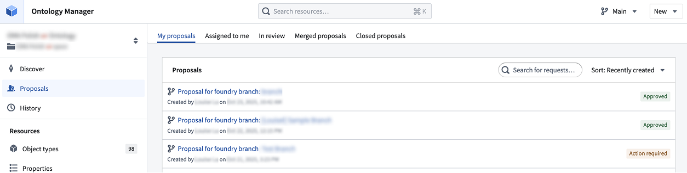
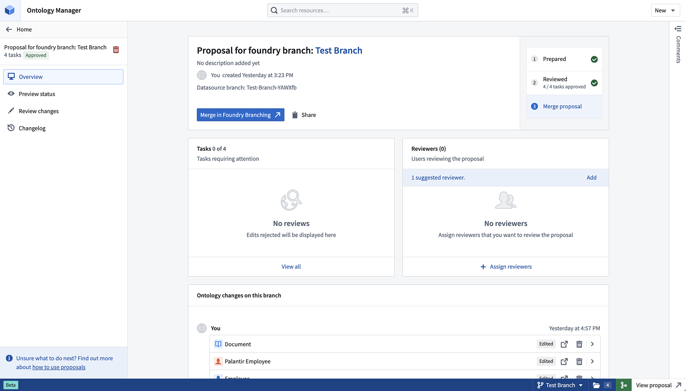
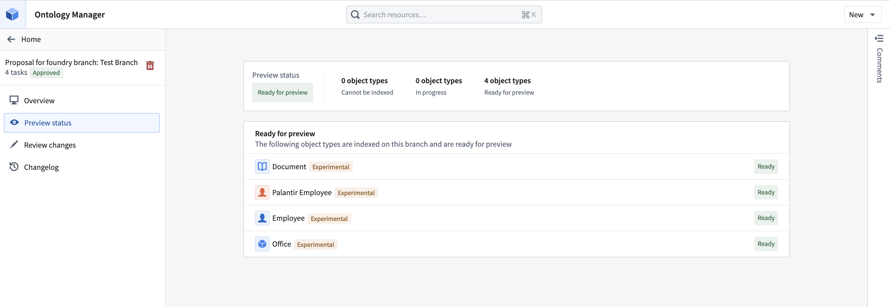
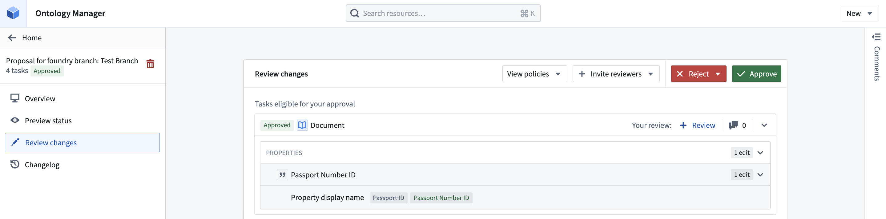
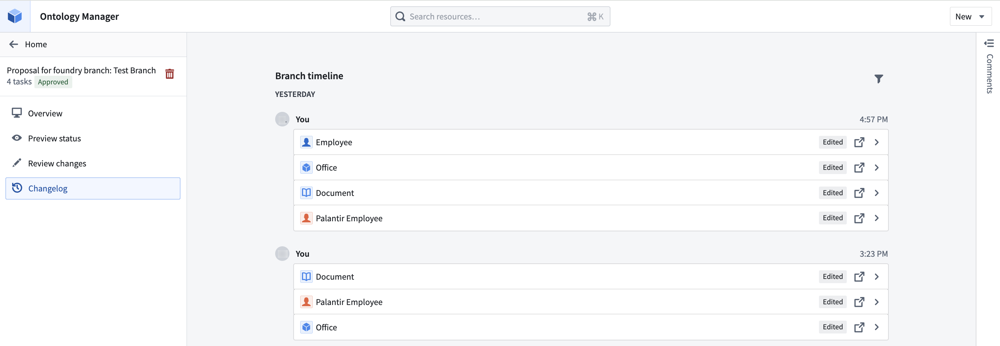

<!-- source: https://palantir.com/docs/foundry/ontologies/review-ontology-proposals/ · mirrored 2026-08-11 from Palantir Foundry docs -->

# Review ontology proposals

An ontology proposal is analogous to a Pull Request in a version control system. Proposals serve as a mechanism for reviewing and approving changes made in a separate branch before they are integrated into `main`.

For global branches, an ontology proposal is automatically created when a [Global Branching proposal](/docs/foundry/global-branching/core-concepts/#create-and-prepare-a-proposal) is created and contains metadata such as reviews, name, and descriptions of the changes being merged into `main`. For legacy ontology branches, an ontology proposal is created when the branch is created.

This page explains how to review ontology proposals, including checking resource statuses, reviewing tasks, and viewing the changes made on a branch.

## Proposals tab

Navigate to the **Proposals** page through the side tab, where you can choose to view all ontology proposals. The proposals are grouped into the following tabs:

* **My proposals:** Proposals authored by you.
* **Assigned to me:** Proposals where you have been assigned as a reviewer.
* **In review:** Proposals that are in progress or approved.
* **Merged proposals:** Proposals that have been merged to `Main` ontology.
* **Closed proposals:** Proposals that have been closed out, and were not merged.

## Proposal view

Access the **Proposal overview**, **Preview status**, **Review changes**, and **Changelog** tabs for more information about your individual proposal.

### Proposal overview page

To access an individual proposal while on a Global Branch, choose any ontology resource from the branch taskbar and select **View ontology proposal**. If you are on `Main`, navigate to the **Proposals** tab and select the proposal you wish to view. If you are on an ontology branch, select **Open proposal details** from the navigation top bar to access the proposal directly.

Within a proposal, you will see the **Proposal overview**, **Preview status**, **Review changes**, and **Changelog** tabs for more information.

The proposal overview page centralizes your proposal's stage, changes, tasks requiring review, and selected reviewers.

* **View changes on your branch:** Edits are displayed at the bottom of the overview page. Edits are categorized by author and by task, where a task corresponds to an ontology resource. You may view the change, navigate to the resource, or remove the changes from the branch. The history of changes is also accessible through the **Changelog** tab, where the exact timings of changes are also displayed.
* **View and add reviewers:** Assign specific colleagues to review your proposal.
* **View tasks that require attention:** This section will display all rejected tasks in the Review stage.
* Copy the proposal link by using the **Share** option.

### Preview status

The **Preview status** tab shows which object types have been indexed, are in progress, or cannot be indexed on your branch. Once an object type is indexed, it will be ready for preview, meaning its data is available on your branch for viewing and testing.

### Review changes

The **Review changes** tab shows all tasks in the proposal. From here, you can perform the following actions:

* Invite additional reviewers
* View the approval policies of resources that have migrated to projects
* Approve or reject each task individually or in bulk for all eligible tasks
* Leave comments at the level of a task, and collaborate with your colleagues

### Changelog

The Changelog tab shows a detailed history of changes on a branch. Tasks can be expanded to reveal edits made by a certain user at a given point in time. You may also directly navigate to the relevant ontology resource.

## Proposal permissions

* **Viewing a proposal:** A proposal's title and description are discoverable by everyone who has access to the ontology. Any user with at least `Viewer` access to some resources in the proposal can see the changes related to those resources.
* **Modifying Ontology resources:** Users with edit permissions on a resource can edit it on a branch. For resources using [ontology roles](/docs/foundry/object-permissioning/ontology-permissions-legacy/) (rather than [project permissions](/docs/foundry/object-permissioning/ontology-permissions/)), viewers can suggest changes on a branch.
* **Accepting or rejecting tasks in a proposal:** For a task to be approved, the approver must be either an editor or owner of the underlying resource by default. If the resource has been migrated to a project and is protected, the approver must have approval rights based on the project policies instead.
* **Merging an Ontology proposal:** Ontology proposals are merged through merging a Global Branching proposal. However, for legacy ontology branches, anyone who can view the branch can merge the proposal as long as all the required approvals are obtained.
