<!-- source: https://palantir.com/docs/foundry/ontologies/test-changes-in-ontology/ · mirrored 2026-09-04 from Palantir Foundry docs -->

# Branching the ontology

The ontology integrates with Global Branching to enable safe, isolated development of ontology resources. This documentation covers how to work with the ontology on branches, including adding and modifying resources, rebasing and conflict resolution, the review and merge process, and known limitations.

For general information on Global Branching concepts and workflows, refer to the [Global Branching documentation](/docs/foundry/global-branching/overview/).

## Definitions

For general definitions of branches, proposals, and rebasing, refer to the [Global Branching core concepts](/docs/foundry/global-branching/core-concepts/). The term below is specific to ontology branching:

* **Ontology proposal:** When you [create a Global Branching proposal](/docs/foundry/global-branching/core-concepts/#create-and-prepare-a-proposal) on a branch that includes ontology changes, an ontology proposal is automatically created to track the ontology-specific changes. The ontology proposal contains metadata such as reviews, name, and descriptions of the ontology changes being merged into `main`.

## Adding and modifying resources

To modify the ontology on a branch, you can either create a new branch in Ontology Manager, or access an existing branch using the branch selector.

To create a branch, open the branch selector and choose **Create new branch** to open a dialog where you can add a title and description for your branch.

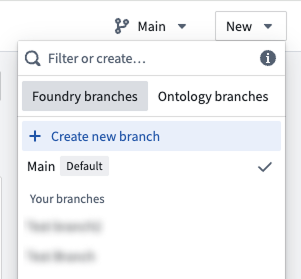

If you already have changes to the ontology that you would like to include in a branch, you can select **Save to new branch** from the save dialog to create a separate branch with those changes. Note that if you make changes to any [protected ontology resources](#resource-protection), you will be required to save to a new branch.

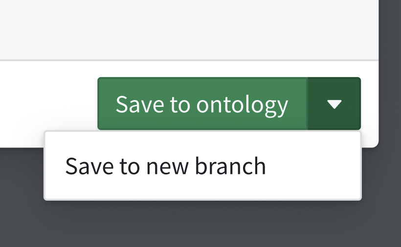

:::callout{theme="neutral"}
You can only branch from the main ontology, also known as `main` branch.
:::

While on a branch, a [branch taskbar](/docs/foundry/global-branching/branch-taskbar/) at the bottom of the interface will display your current branch name and additional metadata.

## Resource protection

The ontology resource types supported by branch protection include:

* Object types
* Action types
* Link types
* Interface types
* Shared property types

Resource protection is not supported on:

* Type groups
* Rule sets (when modifying a rule set, the protection status of the containing object type will be enforced)

Additionally, ontology resources must be migrated to use project permissions before they can be protected. For more information, review [ontology permissions](/docs/foundry/object-permissioning/ontology-permissions/).

After migrating an ontology resource to use project permissions, you can view and manage its protection status via the parent project's **Files** tab.

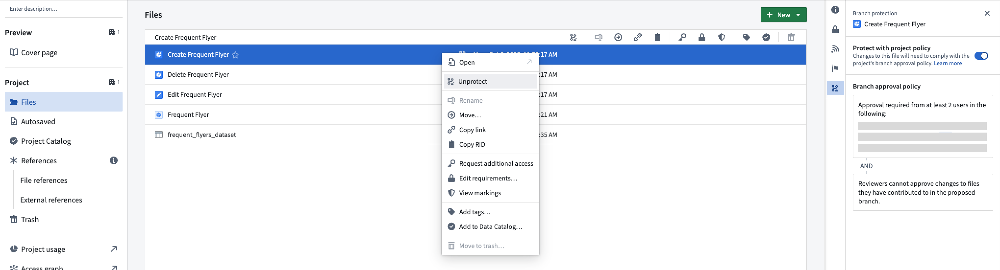

Once protection is enabled, you must make changes on a separate branch and create a proposal to merge them into the main branch.

The protection status is also visible in Ontology Manager on the **Overview** tab:

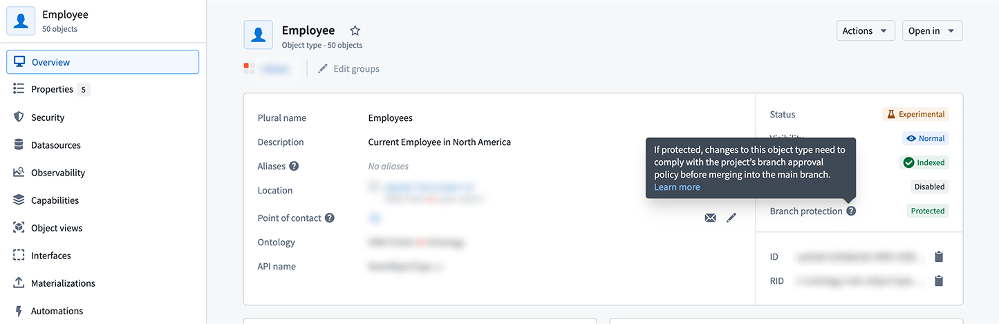

You can also review the applicable policy under the **Security** tab:

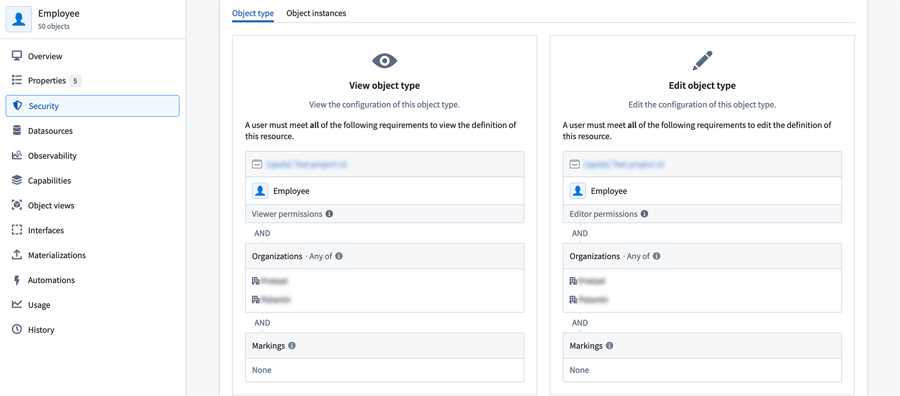

When modifying protected resources, the **Save** dialog is replaced with **Create and save to branch**, requiring you to save changes to a new branch.

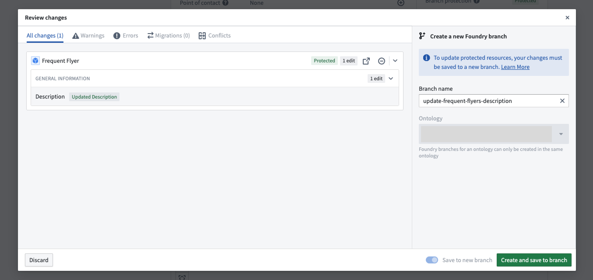

## Rebasing and conflict resolution

While you are introducing changes on your branch, `main` can also receive new changes from others. Rebasing incorporates the latest changes from `main` into your current branch to keep your current branch up to date.

:::callout{theme="neutral" title="Automatic rebasing"}
If your global branch does not contain changes to the ontology, rebasing occurs automatically. Once you introduce ontology changes to your branch, including indexing an object type, you will need to manually rebase to keep your branch up to date with `main`.
:::

### Rebase a branch

When there are new changes from `main`, a blue indicator appears on the **Main branch updates** tab in the sidebar to prompt you to review these changes.

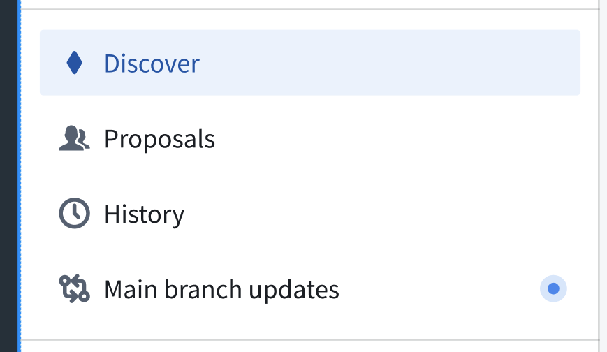

Navigate to the **Main branch updates** page to view incoming changes since your last rebase — or since branch creation, if this is your first manual rebase. Select **Rebase branch** to update your branch with the latest version of `main`.

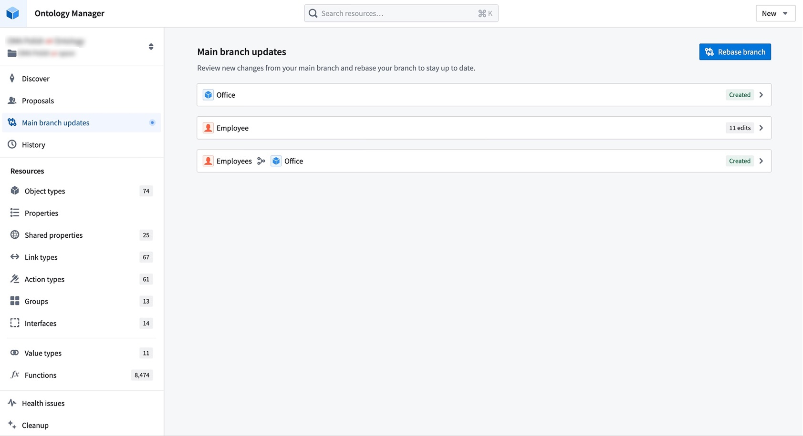

If there are no conflicts or errors, the rebase will complete automatically, and your branch will be up to date.

### Resolve merge conflicts

If there are conflicts, your rebase will remain in progress, and you will be redirected to the **Conflicts tab** to resolve any conflicting changes between your branch and `main`. If there are only errors, you will be redirected to the **Errors tab** instead.

During rebasing, changes from `main` are loaded onto your branch, while any previously saved changes from your current branch are reloaded back into the working state, which you can see in the **All changes** tab.

This state allows you to view and access changes from both `main` and your branch. When an ontology resource has changes from both branches, it will display your branch version by default.

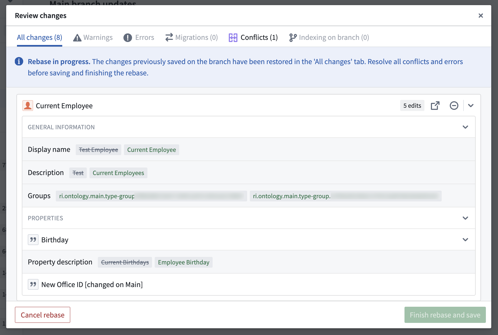

To resolve conflicts, you can choose to **Use Main branch changes** or **Keep current branch changes** for each resource. Alternatively, you can navigate directly to that resource and apply **custom changes** to resolve its conflicts.

In this example, the `Palantir employee` object type has a conflict in which the display name has been changed on both `main` branch and your branch. To resolve this conflict, choose which version of this object type to keep.

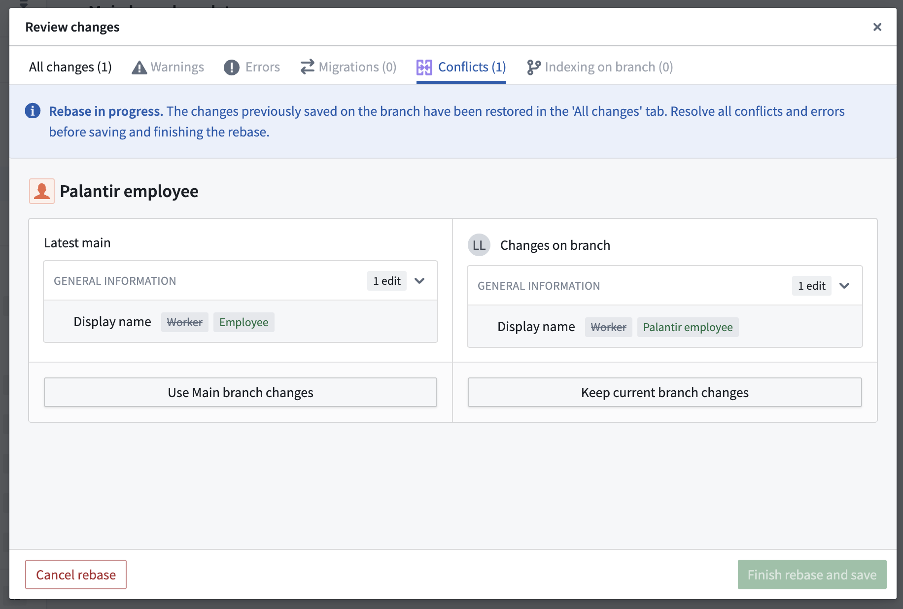

You can also resolve this conflict by making a custom change. In the example, you can navigate to the object type and change its display name from "Palantir employee" to "Current employee". The conflict will now be resolved due to this custom change.

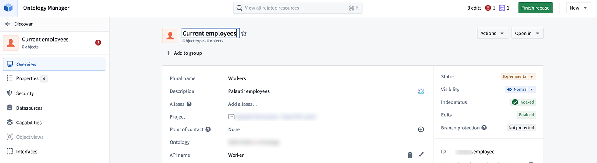

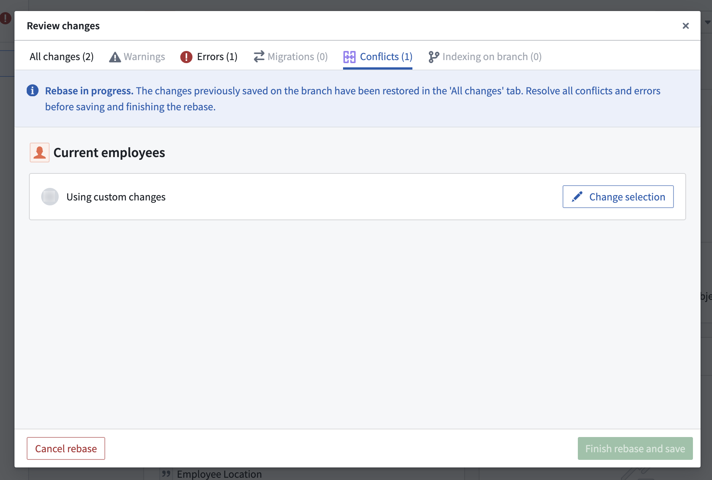

After resolving all conflicts, ensure any errors are addressed before finishing your rebase.

### Finish rebase

Once all errors and conflicts have been resolved, you can select **Finish rebase and save**, and your branch will be up to date.

You can continue working on your branch and rebasing regularly to keep your branch current with the latest version of `main` branch.

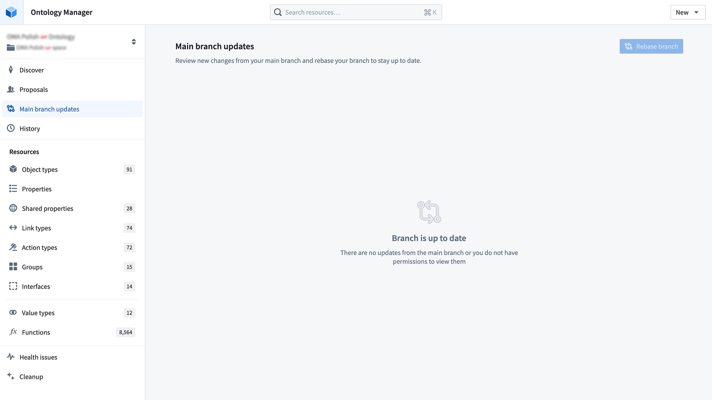

## Merge requirements

### Prepare your branch for review

When you are ready to merge your branch into `main` after making your changes, create a proposal by selecting the **Create proposal** icon in the branch taskbar. Add a name and description to set up your proposal.

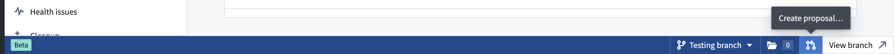

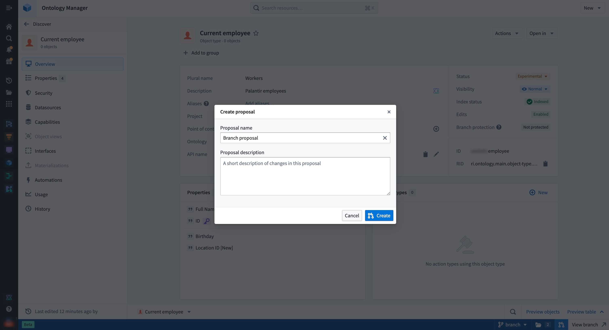

When a proposal is created, **merge checks** will run to verify whether the resources on a global branch are able to merge into the `main` branch. Failed checks can include conflicts between your branch and the `main` branch, which would require you to rebase your branch.

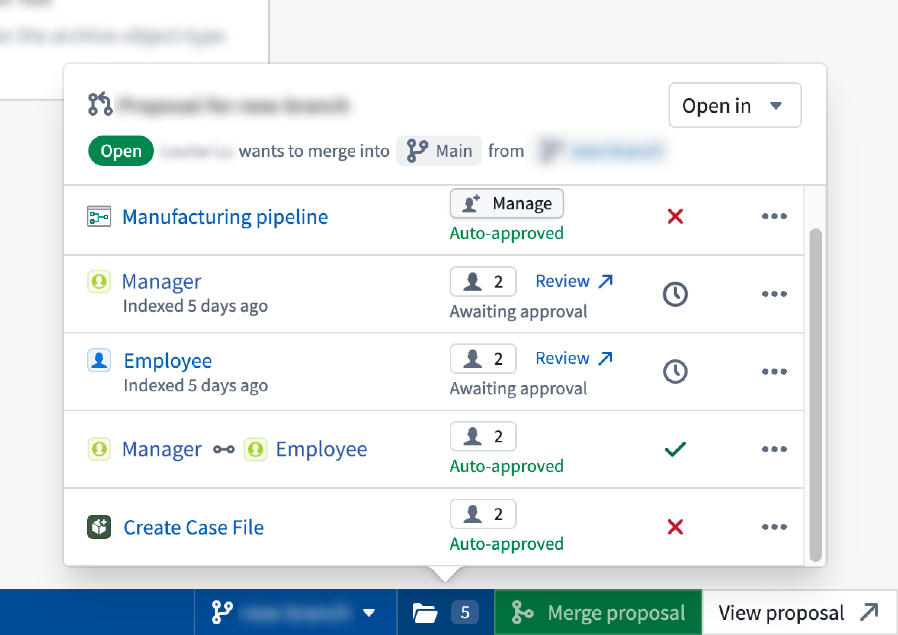

### Request a review

You can add reviewers to your proposal through the branch taskbar, the Global Branching proposal page, or the ontology proposal page.

On the ontology proposal page, go to **Review changes** and select **Invite reviewers** to add reviewers to your proposal. For ontology resources that have migrated to projects, select **View policies** to see which reviewers are required to review a resource based on the associated project policies.

Each ontology resource is considered an individual task. The status tag next to the resource name indicates the overall approval status, while the **Your review** section on the right allows you to submit a review.

:::callout{theme="neutral"}
While ontology entities are treated as separate resources in Global Branching, they are grouped under a single local ontology proposal. This means adding a reviewer to one ontology resource effectively adds that reviewer across all ontology resources.
:::

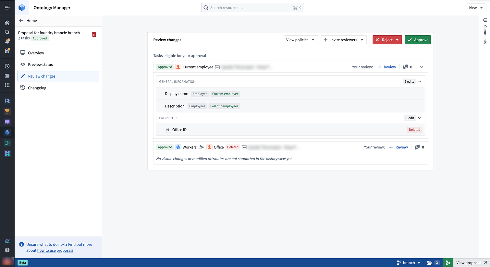

:::callout{theme="info" title="Leaving comments"}
You may also leave comments on the various tasks in your proposal to give context about the changes proposed. Access the Comments section of your tasks by selecting the Comments sidebar on the far right.
:::

### Review the proposal

In the **Review changes** tab, reviewers may approve or reject individual tasks. Users without permissions may still review the task, for example, to convey their opinions on the change, but this will not affect the approved status of the task.

:::callout{theme="warning" title="Approval rights"}
Users with approval rights can approve proposals even if not added as reviewers. Use the reviewers list to track who should review changes, not to restrict approvals.
:::

In the ontology proposal, reviewers can view the proposal details and approve or reject changes to all modified resources or to specific ontology resources.

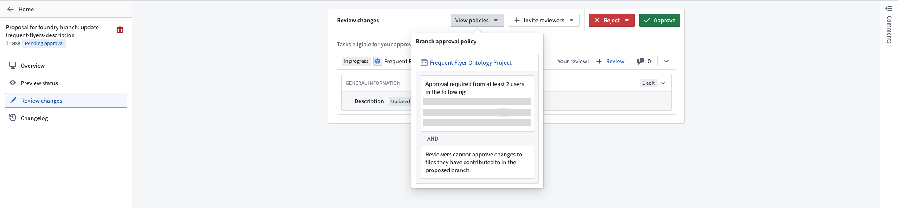

Once the policy requirements are met, approved resources change from `In Progress` to `Approved`. You can then merge the proposal if all other checks have passed.

### Merge your branch

When you are ready to merge your changes to `main`, you must merge your Global Branching proposal. This will automatically kick off the merge process for the ontology.

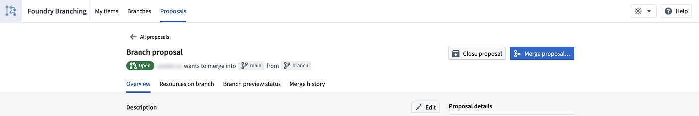

To do so, select the merge icon in the branch taskbar, or navigate to your proposal page in Global Branching and select **Merge proposal**.

## Known limitations

* **Datasource deletion:** When a conflict occurs on an object type where a backing datasource has been replaced or removed on the `main` branch, choosing to keep your branch changes will lead to a merge failure. In this case, choose the `main` branch changes.
* **Conditional formatting deletion:** When a conflict occurs on a property type where a conditional formatting rule set has been replaced or removed on the `main` branch, choosing to keep your branch changes will lead to a merge failure. In this case, choose the `main` branch changes.
* **Pipeline Builder object types:** Object types created in Pipeline Builder are not modifiable in Ontology Manager on a branch.
* **Indexing counts as a modification:** Indexing an object type is treated as a modification. If the resource is protected by a project policy, you will need policy approval to merge your branch. To bypass this requirement, remove indexing changes before merging.
* **Reviewers apply across all ontology resources:** Adding reviewers to one ontology resource adds them to the entire proposal, as ontology changes are grouped together. Only users in a resource's project policy are required to approve that specific resource.
