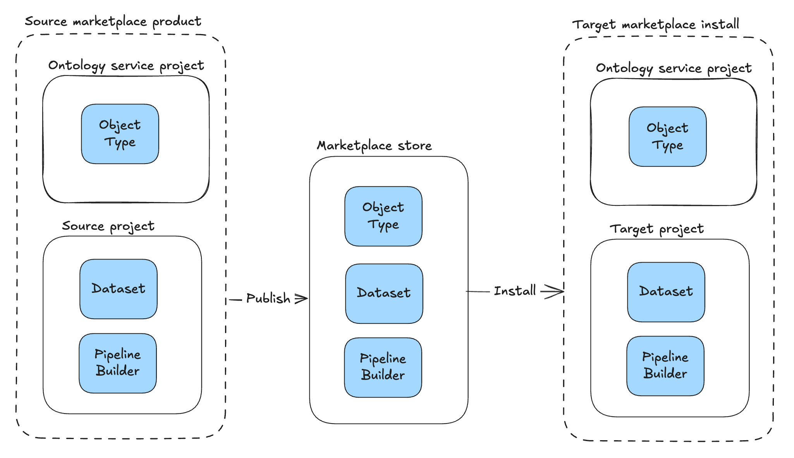
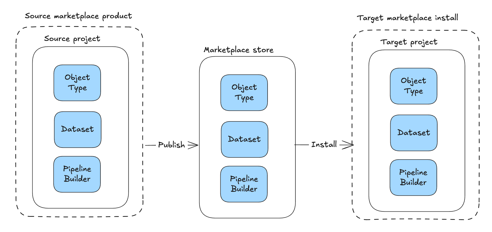
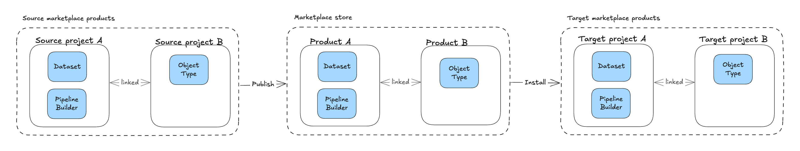
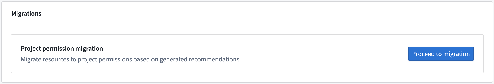
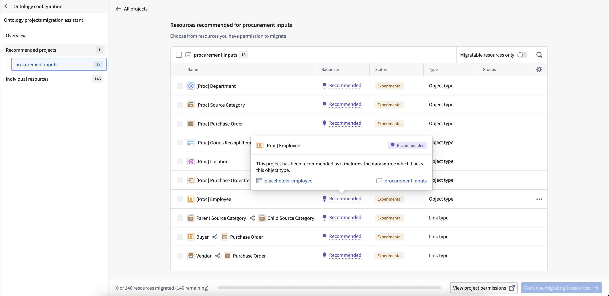
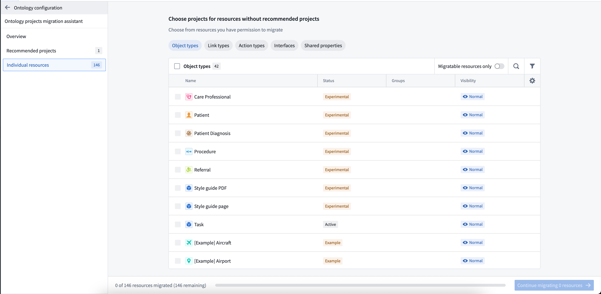
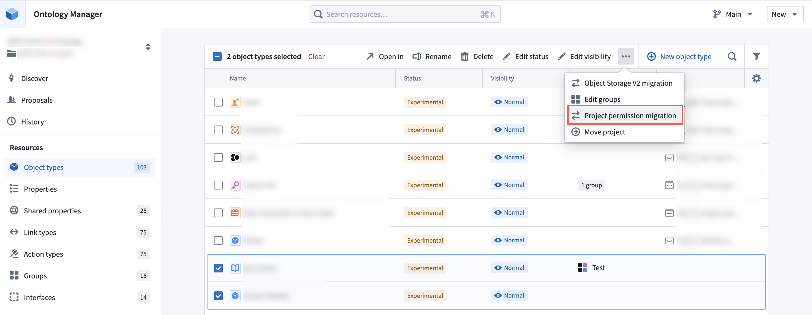
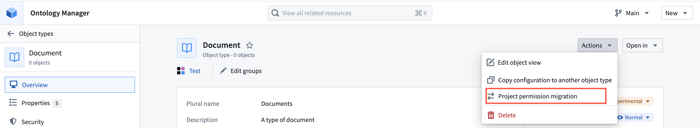

<!-- source: https://palantir.com/docs/foundry/ontology-manager/migrate-to-project-based-permissions/ · mirrored 2026-08-09 from Palantir Foundry docs -->

# Migrate to project-based permissions

Ontology resources, including object types, action types, link types, interfaces, and shared properties, can be saved within specific projects and automatically inherit permissions from those projects. Object and link instance permissions remain dependent on the backing datasource location. Once migrated permissions to view, edit, and manage ontology resources are managed through [Compass](/docs/foundry/compass/overview/), the Palantir platform's filesystem. [Project-based permissions](/docs/foundry/object-permissioning/ontology-permissions/) replaces the previous ontology roles and datasource-derived permissions models. This is the same permission model used for all other resource types.

You can migrate your existing ontology resources to [project-based permissions](/docs/foundry/object-permissioning/ontology-permissions/) using our migration tool. This tool suggests the placement of ontology resources into appropriate projects while ensuring they receive the correct permissions.

:::callout{theme="warning"}
Once a resource has been migrated to project-based permissions, it cannot be reverted to ontology roles or datasource-derived permissions.
:::

To turn on project-permissioning for new ontology resources, ontology owners can navigate to the **Ontology configuration** tab in Ontology Manager and toggle on **Require new ontology resources be saved in a project**. Once enabled, users will be prompted to choose a save location when creating new ontology resources.

## Limitations

Before starting, be aware of the following limitations:

* This feature is not yet available for Default ontologies. Contact Palantir Support if you are not sure of your ontology type.
* Ontology resource names must conform to Compass conventions. Forward slashes ("/") are not allowed, and duplicate names are not permitted. While aliases allow duplicate names to be rendered, the system removes duplicates by appending "(1)" to ensure unique paths.
  * Each ontology resource must have a unique name
  * Example: `common/utility-room` is invalid due to the forward slash
* An Ontology's resources must be saved in a project within the same space as the ontology itself.

## Approaches to migration

Before starting the migration, consider how you want to organize your ontology resources:

* **Save ontology resources alongside datasources or in use case projects:** Keeping ontology resources next to their corresponding datasources ensures consistent permissions across resources and instances. This approach lets you grant permissions to the entire use case in one place, ensuring the right users can view, edit, or manage all components together.

* **Save ontology resources in a dedicated project:** Create one or more separate projects specifically for ontology resources. Grant broad access to these projects to make ontology resources viewable to everyone who needs them.

* **Hybrid approach:** Save core ontology resources into a single project that everyone has permissions to view. Save use case specific resources in use case specific projects. This prevents ontology pickers and search screens becoming cluttered with use case specific ontology resources.

:::callout{theme="neutral"}
Ontology resources have separate permissions from object and link instances. This migration affects only ontology resource permissions. Object and link instances permissions remain based on the backing datasource location.
:::

### How migration changes Marketplace installs

Before you migrate to project permissioning, ontology resources live in the **Ontology service project**, a system-managed project that holds all ontology resources for an ontology under the legacy permission models. In the Ontology service project, every user has a default **Viewer** grant on ontology resources, and the resources do not carry file classifications. When you install a Marketplace product, the ontology resources are placed in this Ontology service project, while the non-ontology files are placed in the target project the installing user chooses:

After you migrate to project permissioning, the same product installs the ontology resources directly into the chosen target project alongside the rest of the files, and the project's role grants and classifications apply to them:

The Ontology service project gives every user a default Viewer grant and carries no classifications, so the target project's tighter role grants — along with any mandatory markings or maximum classification it enforces — can narrow the visibility of installed ontology resources compared to before migration. To keep the ontology resources at a different visibility from the other files in the product, split the product into two linked Marketplace products: one containing the ontology resources, installed into a more permissive project, and a second containing the remaining files, installed into a more restricted project.

## Use the migration assistant (recommended)

The migration assistant helps you quickly identify suitable projects and locations for your ontology resources.

**To access the migration assistant:** Select your ontology, navigate to the **Ontology configuration** page, and select **Proceed to migration** under the **Migrations** section.

Strong recommendations for where to move resources are preselected to accelerate your workflow, while weaker suggestions remain unselected for your review. After confirming your selections, proceed with the migration. Before finalizing, you can create necessary imports or cancel the operation.

These recommendations help you make faster, more informed decisions about resource placement. If no recommendations are available, you can manually select locations in the **Individual resources** tab of the migration assistant.

## Migrate resources directly

You can also migrate resources without using the assistant, which is useful when you know exactly where resources should go or want to migrate specific resources quickly.

* **Bulk migrate multiple resources:** Select your ontology, then choose a resource type from the **Resources** section in the left sidebar. Select the items to migrate, then use the dropdown menu to select **Project permission migration**.   
     

* **Migrate an individual resource:** Open an ontology resource and use the **Actions** dropdown menu on the **Overview** page to select **Project permission migration**.   
  
