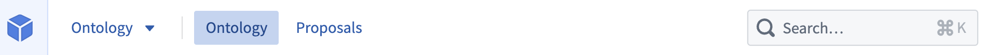
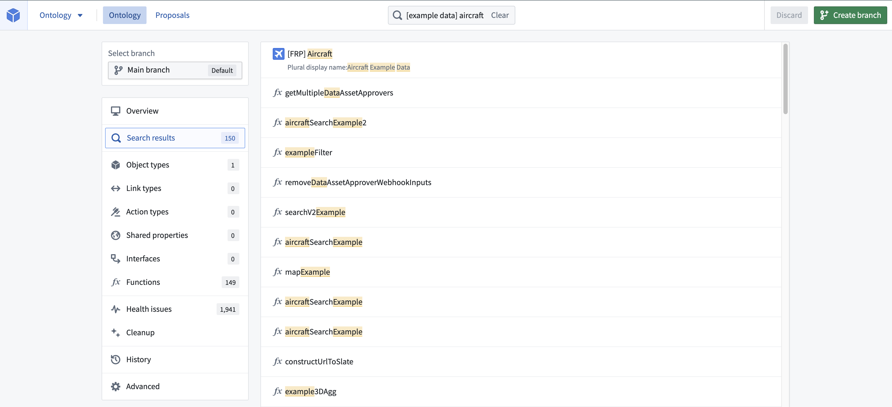
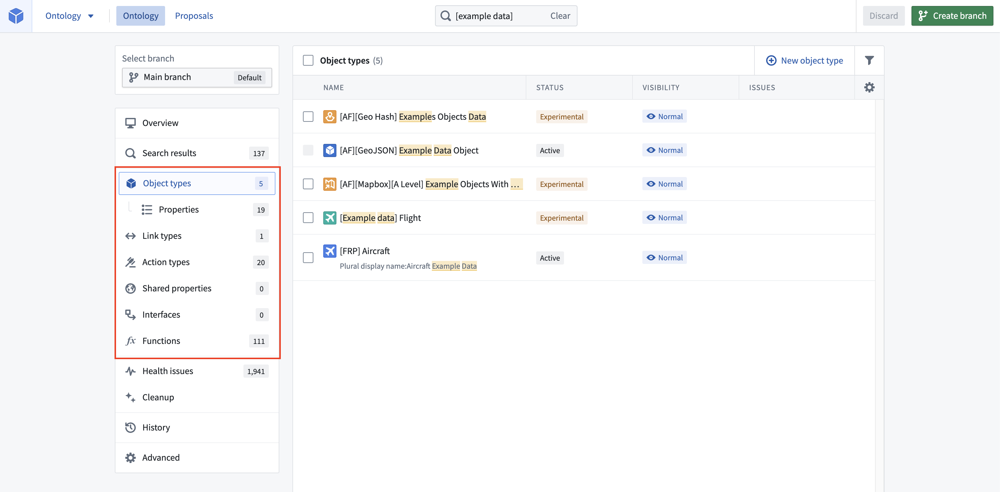
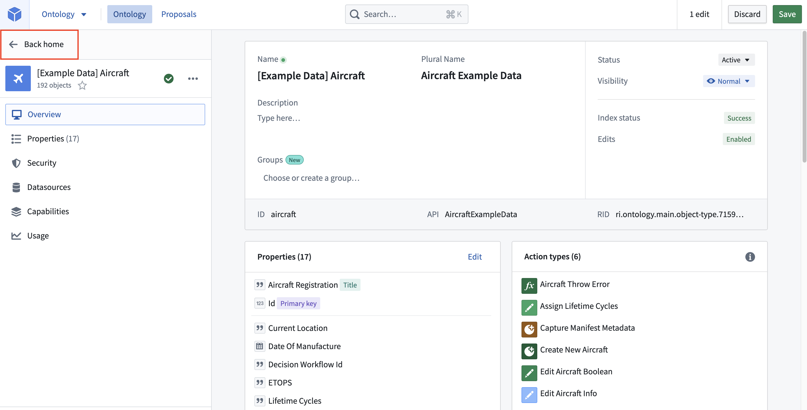
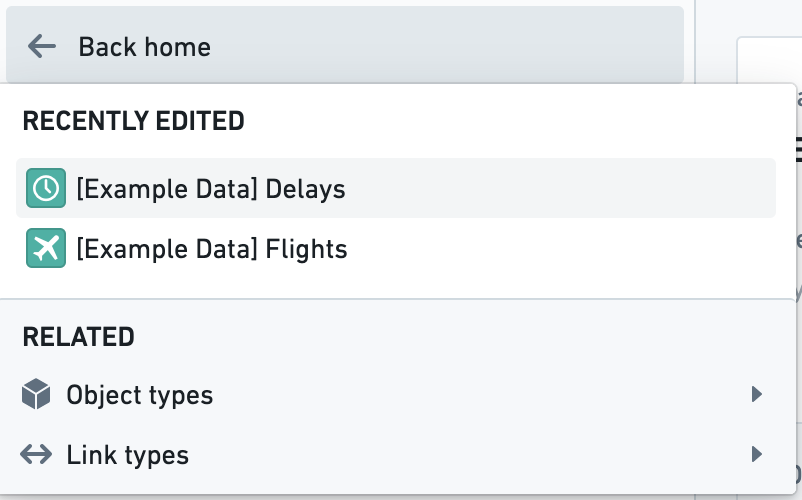

<!-- source: https://palantir.com/docs/foundry/ontology-manager/navigation/ · mirrored 2026-07-23 from Palantir Foundry docs -->

# Navigation

## Header search bar

In the middle of the header of the application is the **Search** bar. You can click into the **Search** bar or hold down `Cmd/Ctrl + K` to open the **Search** bar dialog.

Searching in the **Search** bar from the home page will update the home page with the list of resources that match the search. You can search for any object type, property, link type, action type, shared properties, interfaces, or functions you are interested in. The search results will highlight which field your search term matched on. You can use the up-arrow and down-arrow keys on your keyboard to move through search results and see previews for the selected results. You can select **Open** or use the Enter key to open the selected result.

## Home page filters

The **Object types**, **Link types**, **Action Types**, **Shared Properties**, **Interfaces**, and **Functions** pages can be selected from the home page sidebar. These pages allow for filtering object types and link types based on their visibility, development status, and indexing issues.

Object types whose backing datasources are unregistered or have failed to reindex into Object Storage v1 (Phonograph) will have red error messages in the issue column of the object type page.

## Navigation back from a selection

Once you’ve opened an object type, link type, or action type, you have the option to select **Back home** from the top left corner of the view’s sidebar.

Hovering over the **Back home** button will also bring up quick links to recently edited object types, link types, and action types, as well as all resources that are related to the one you are currently viewing.

