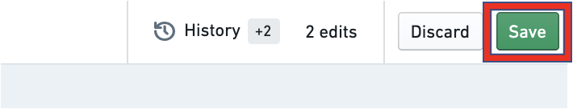
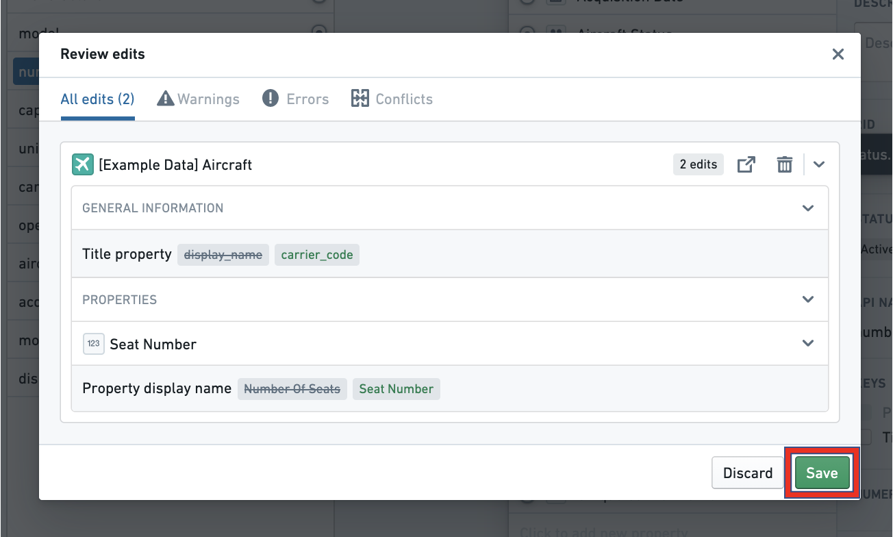
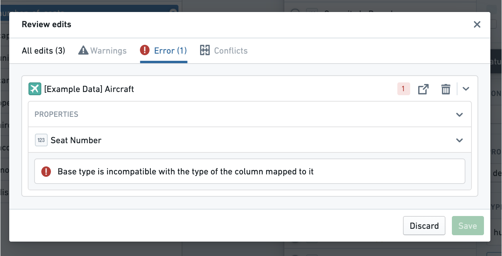
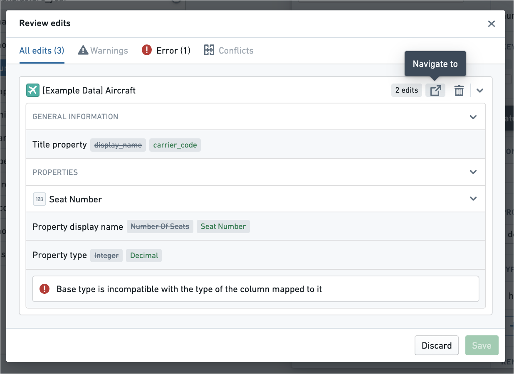
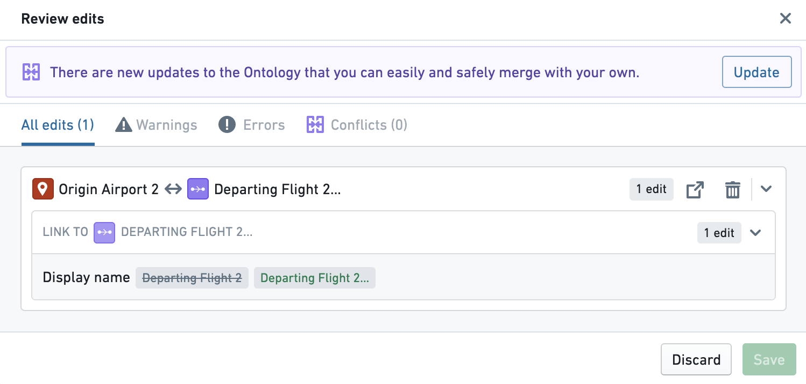
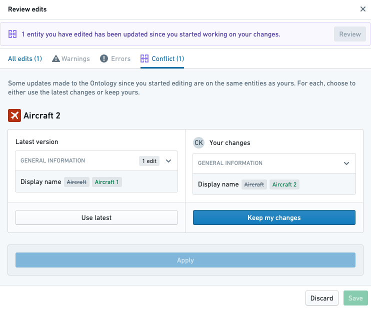
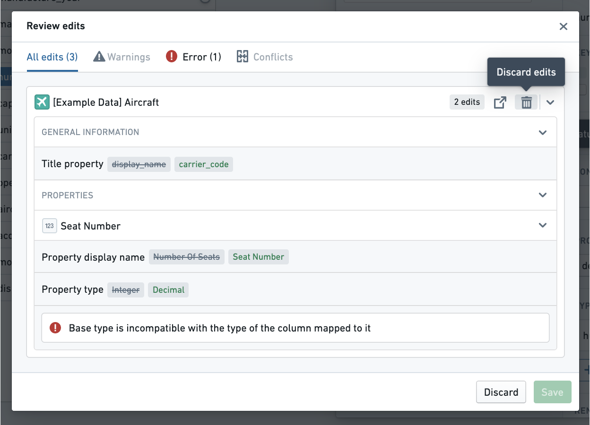
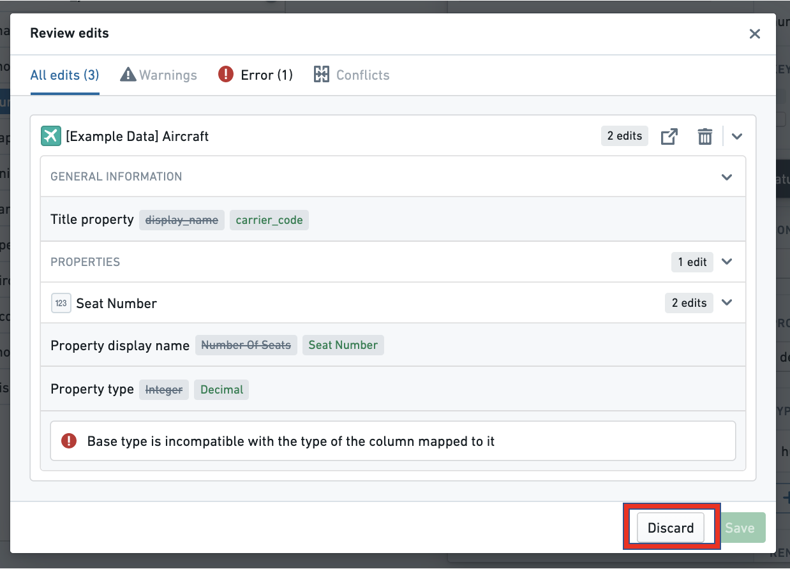
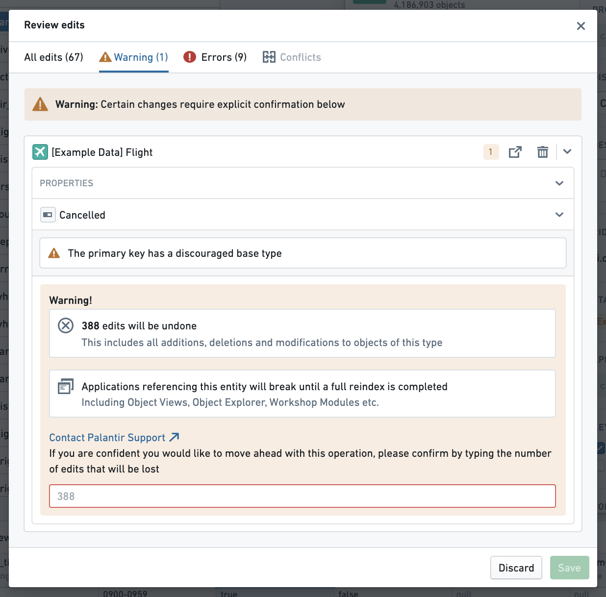
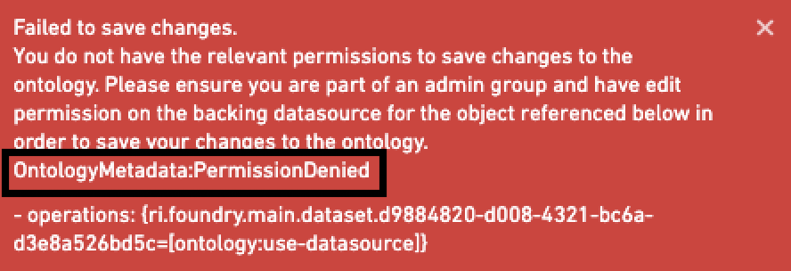

<!-- source: https://palantir.com/docs/foundry/ontology-manager/save-changes/ · mirrored 2026-08-22 from Palantir Foundry docs -->

# Save changes to the Ontology

## Save your changes

Any changes you make in the Ontology Manager are stored locally in a work-in-progress state. For these Ontology changes to be available for others and reflected in user-facing applications, you must save your changes. To save changes:

1. Select **Save** from the Application header at the top-right corner of the application.

2. Open the **Review edits** dialog to review all your changes.
3. Finally, select **Save** to update the Ontology.

## Handle errors and warnings

If the **Save** button is grayed out, you may have an error that is stopping you from saving. To resolve this, you can:

* Scroll through your changes and view the error messages in line, or
* Select the **Errors** tab at the top of the **Review edits** dialog to see the errors preventing you from saving.

The **Review edits** dialog will also show you warnings in-line and in the **Warnings** tab for changes you are encouraged to make. While errors need to be handled in order to save, warnings will not prevent you from saving.

If you receive an error, you can use the open shortcut to navigate to a resource you need to edit before saving.

:::callout{theme="neutral"}
Changes to Functions can only be made in the Functions repository, and not in the Ontology Manager. You can navigate to the Functions Repository from the Functions Entity view in the Ontology Manager.
:::

## Handle updates and merge conflicts

The **Save** button may also be grayed out if the Ontology has been saved by another user since you began making your changes. You will need to select **Update** from the top of the Review edits dialog to merge the other user’s changes with your own.

It is possible that there are merge conflicts between changes another user has made and the changes in your working state. You will be prompted to resolve them. You can choose between keeping the changes in the latest version of the Ontology or overriding them with the changes in your working state.

## Discard your changes

Each resource in the Ontology that you edit will have its own entry in the **Review edits** dialog. You can discard the changes you made to a resource by hovering over the entry in the **Review edits** dialog and selecting the trash icon.

You can discard all unsaved changes you made to the Ontology at any point by selecting the **Discard** button in the header at the top right of the application, or by selecting **Discard** at the bottom of the **Review edits** dialog.

## Respond to a warning message

As you review your changes in the **Review edits** dialog, you may get a warning message that prompts you to confirm the warning before saving.

Edits to object types and their properties can have an application-breaking impact on applications relying on those object types. Furthermore, if an object type has writeback enabled, extra caution should be taken when making edits to that object type to ensure that the history of edits made to objects of that type is not removed.

For a full description of which changes can be destructive, read more about [potential breaking changes](/docs/foundry/object-link-types/edit-object-type/).

Once you have read through the impact of your changes detailed in the warning message and understand the implications of those changes, you can type in the name of the entity you edited to proceed with saving.

## Troubleshooting when a save fails

If the backend services powering the Ontology encounter a problem when you save, you will receive an error message "toast" (pop-up), as in the image below. At the end of the text explaining why you cannot save, the name of the error message will be printed. The error message name will begin with the prefix `OntologyMetadata:` or `Phonograph2:`.

Throughout the Ontology documentation, there are references to the most common errors associated with different changes made to the Ontology. If you see an error message, search for it in the documentation to see if the error and its remediation are documented.
