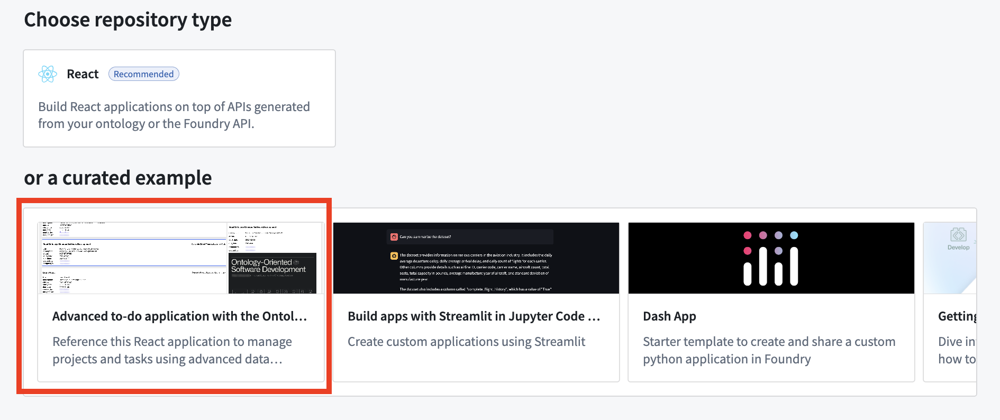

<!-- source: https://palantir.com/docs/foundry/ontology-sdk-react-applications/advanced-todo-application-architecture/ · mirrored 2026-08-16 from Palantir Foundry docs -->

# Architecture and configuration

The following overview for the advanced to-do application will explain the architecture, components, features, and pre-requisites necessary to build the application with the Ontology SDK (OSDK):

* [Getting started](#getting-started)
* [Application architecture](#application-architecture)
  * [React routing](#react-routing)
    * [Routing configuration](#routing-configuration)
  * [OAuth and OSDK client configuration](#oauth-and-osdk-client-configuration)
    * [The `OsdkProvider` component](#the-osdkprovider-component)
    * [Authentication configuration](#authentication-configuration)
    * [Usage in components](#usage-in-components)
* [Application configuration](#application-configuration)
  * [Environment files](#environment-files)
  * [Meta tag configuration in `index.html`](#meta-tag-configuration-in-indexhtml)
    * [Meta tag breakdown](#meta-tag-breakdown)
  * [Key configuration variables](#key-configuration-variables)
  * [Development vs. production configuration](#development-vs-production-configuration)
    * [Development environment](#development-environment)
    * [Production environment](#production-environment)
* [Key OSDK functions](#key-osdk-functions)
  * [1. Interfaces and polymorphic task types](#1-interfaces-and-polymorphic-task-types)
  * [2. Media content (media sets)](#2-media-content-media-sets)
  * [3. Runtime-derived properties](#3-runtime-derived-properties)
  * [4. Metadata-driven interface](#4-metadata-driven-interface)
  * [5. Real-time data with subscriptions](#5-real-time-data-with-subscriptions)
  * [6. Efficient user data handling](#6-efficient-user-data-handling)
* [Learn more](#learn-more)

## Getting started

To access and install the advanced to-do application example, open the Code Workspaces application and choose to create a **+ New Workspace**. Then, select **VS Code > Applications** and find the application in the curated examples list.

You can also search for the application in the platform **Examples (Build with AIP)** or by searching the Ontology SDK reference examples in Developer Console.



## Application architecture

The sections below describe the architecture of the advanced to-do application you can create, including routing, client configuration, and usage in components.

The application follows a modern React architecture that includes the following features:

* **Data service hooks:** Encapsulate OSDK interactions (`useProjects`, `useTasks`, and so on).
* **UI components:** Includes components focused on presentation and user interaction.
* **SWR (stale-while-revalidate) strategy for data management:** Handles caching, revalidation, and background updates.
* **Component-specific logic:** Each component has access to exactly the data it needs.

### React routing

The advanced to-do application uses [React Router ↗](https://reactrouter.com/home) for client-side routing. The routing configuration is set up in the main application entry point.

#### Routing configuration

The application uses `createBrowserRouter` from React Router with a simple configuration:

```tsx
const router = createBrowserRouter(
  [
    {
      path: "/",
      element: <Home />,
    },
    {
      path: "/auth/callback",
      element: <AuthCallback />,
    },
  ],
  { basename: import.meta.env.BASE_URL },
);

ReactDOM.createRoot(document.getElementById("root")!).render(
  <StrictMode>
    <OsdkProvider client={client}>
      <RouterProvider router={router} />
    </OsdkProvider>
  </StrictMode>
);
```

The following routes are used:

* **`/`:** The main application home page.
* **`/auth/callback`:** The route that handles OAuth authentication callbacks.

Authentication is managed through the OSDK OAuth client, which automatically redirects unauthenticated users to the login page.

### OAuth and OSDK client configuration

#### The `OsdkProvider` component

The advanced to-do application uses the `OsdkProvider` component from the `@osdk/react` package to provide authentication context and client access throughout the component tree. This strategy follows the React context pattern, making OAuth authentication and OSDK client operations available without prop drilling.

```tsx
import { OsdkProvider } from "@osdk/react";
import client from "./client";

// In the application's root
ReactDOM.createRoot(document.getElementById("root")!).render(
  <StrictMode>
    <OsdkProvider client={client}>
      <RouterProvider router={router} />
    </OsdkProvider>
  </StrictMode>
);
```

#### Authentication configuration

The client is configured in a separate `client.ts` file that handles the following:

1. **OAuth authentication setup:** Configures the authentication flow using the OSDK OAuth client.
2. **Client initialization:** Sets up the OSDK client with the authenticated user session.
3. **Configuration parameters:** Retrieves the Foundry URL, client ID, redirect URL, and other OAuth parameters from meta tags.

The OAuth client handles the following:

* Authentication redirect flows
* Token acquisition and refreshing
* Session management
* Determining appropriate scopes for API access

#### Usage in components

Components can access the authenticated OSDK client using the `useOsdk` hook:

```typescript
import { useOsdk } from '@osdk/react';

function MyComponent() {
  const { client } = useOsdk();

  const fetchData = useCallback(async () => {
    const tasksPage = await client(OsdkITask).where({
        projectId: { $eq: project.$primaryKey },
    }).fetchPage({
        $orderBy: { "dueDate": "desc", "status": "asc" },
    });
    // Process and return the data
  }, [client, project.$primaryKey]);

  // Rest of the component
}
```

This usage pattern ensures the following:

* Authentication is handled centrally at the application root.
* Components only access data that the authenticated user is authorized to view.
* OAuth token refresh occurs automatically.
* API requests include the proper authentication headers.

## Application configuration

The advanced to-do application uses environment variables for configuration, allowing for different settings between development and production environments. Configuration values are primarily applied through meta tags in the HTML, which are then read by the `client.ts` file.

### Environment files

The application uses the following environment files:

* **`.env`:** Base environment variables used in all environments.
* **`.env.development`:** Development-specific variables (used with `npm run dev`).
* **`.env.production`:** Production-specific variables (used with `npm run build`).

### Meta tag configuration in `index.html`

The application uses meta tags in `index.html` to dynamically configure the OSDK client. This approach avoids hardcoding sensitive information directly into JavaScript code:

```html
<meta name="osdk-clientId" content="%VITE_FOUNDRY_CLIENT_ID%" />
<meta name="osdk-redirectUrl" content="%VITE_FOUNDRY_REDIRECT_URL%" />
<meta name="osdk-foundryUrl" content="%VITE_FOUNDRY_API_URL%" />
<meta name="osdk-ontologyRid" content="%VITE_FOUNDRY_ONTOLOGY_RID%" />
```

#### Meta tag breakdown

* **`osdk-clientId`:** The OAuth client ID for authentication.
* **`osdk-redirectUrl`:** The URL for redirect after successful authentication.
* **`osdk-foundryUrl`:** The base URL of the Foundry API.
* **`osdk-ontologyRid`:** The resource identifier for the application's ontology.

### Key configuration variables

```
# Authentication settings
VITE_FOUNDRY_CLIENT_ID=your-client-id
VITE_FOUNDRY_REDIRECT_URL=http://localhost:3000/
VITE_FOUNDRY_API_URL=https://<my-foundry-instance>.palantirfoundry.com
VITE_FOUNDRY_ONTOLOGY_RID=ri.ontology.main.ontology.12345678-abcd-1234-efgh-1234567890ab
```

### Development vs. production configuration

#### Development environment

The development environment typically uses the following configuration:

* Local development server with [Hot Module Replacement ↗](https://reactrouter.com/explanation/hot-module-replacement).
* Integration with a development or staging Foundry instance.

Example `.env.development`:

```
VITE_FOUNDRY_CLIENT_ID=your-dev-client-id
VITE_FOUNDRY_REDIRECT_URL=http://localhost:3000/
VITE_FOUNDRY_API_URL=https://dev-foundry.palantirfoundry.com
VITE_FOUNDRY_ONTOLOGY_RID=ri.ontology.main.ontology.dev-12345
```

#### Production environment

The production environment uses the following configuration:

* A Foundry production instance.
* Optimized builds with minimized code.
* Stricter security settings.

Example `.env.production`:

```
VITE_FOUNDRY_CLIENT_ID=your-prod-client-id
VITE_FOUNDRY_REDIRECT_URL=https://your-production-domain.com/
VITE_FOUNDRY_API_URL=https://prod-foundry.palantirfoundry.com
VITE_FOUNDRY_ONTOLOGY_RID=ri.ontology.main.ontology.prod-67890
```

## Key OSDK functions

### 1. Interfaces and polymorphic task types

The advanced to-do application uses OSDK interfaces to implement the following polymorphic task types:

* **`ITask`:** The base interface for all tasks.
* **`osdkCodingTask`:** The implementation for coding-related tasks.
* **`osdkLearningTask`:** The implementation for learning tasks with media content.

```typescript
// The task details component decides which concrete implementation to render
if (task.osdkTask.$objectType === "osdkCodingTask") {
    return <TaskDetailsCoding task={task} />;
}
if (task.osdkTask.$objectType === "osdkLearningTask") {
    return <TaskDetailsLearning task={task} />;
}
```

### 2. Media content (media sets)

The application demonstrates working with binary content through media sets:

```typescript
// Fetching and displaying media content from media sets
const response = await learningTask.mediaReference.fetchContents();
const blob: Blob | undefined = await response.blob();
const mediaUrl = blob ? URL.createObjectURL(blob) : "";

// Getting media metadata
const mediaTypeResp = await learningTask.mediaReference.fetchMetadata();
```

Media rendering is handled dynamically based on the media type:

* PDF documents with embedded viewer.
* Images with responsive display.
* Videos with player controls.
* Links to external resources.

### 3. Runtime-derived properties

The application uses [runtime-derived properties](/docs/foundry/ontology/derived-properties/) to efficiently calculate aggregate statistics at the server level:

```typescript
.withProperties({
  "numberOfTasks": (baseObjectSet) =>
    baseObjectSet.pivotTo("osdkTodoTask").aggregate("$count"),
  "numberOfCompletedTasks": (baseObjectSet) =>
    baseObjectSet.pivotTo("osdkTodoTask").where({
      "status": { $eq: "COMPLETED" },
    }).aggregate("$count"),
  // Additional statistics...
})
```

The example above demonstrates the following:

* Calculating metrics server-side to minimize data transfer.
* Using relationship traversal with `pivotTo`.
* Applying filtering with `where` conditions.
* Performing aggregations with `aggregate`.

### 4. Metadata-driven interface

The application accesses and uses ontology metadata to create dynamic interfaces:

```typescript
const getObjectTypeMetadata = useCallback(async () => {
  const objectTypeMetadata = await client.fetchMetadata(OsdkITask);
  setMetadata(objectTypeMetadata);
}, []);
```

This metadata is used for the following:

* Displaying ontology-defined property names.
* Showing object type descriptions.
* Creating context-aware user interfaces.
* Supporting future ontology changes without code changes.

### 5. Real-time data with subscriptions

The application implements real-time updates using OSDK subscriptions:

```typescript
const subscription = client(OsdkITask)
  .where({ projectId: { $eq: project.$primaryKey } })
  .subscribe({
    onChange(update) {
      // Handle real-time updates
    },
    onSuccessfulSubscription() { /* ... */ },
    onError(err) { /* ... */ },
    onOutOfDate() { /* ... */ },
  });
```

This provides the following benefits:

* Live updates when tasks are created, modified, or deleted.
* Efficient updates that only refresh changed data.
* Error handling for subscription issues.

### 6. Efficient user data handling

The application also demonstrates batch fetching and caching of user data:

```typescript
const getBatchUserDetails = useCallback(async (userIds: string[]) => {
    const cachedUsers: UserDetails = {};
    const usersToFetch: string[] = [];

    userIds.forEach((userId) => {
      const cachedUser: State<unknown, unknown> | undefined = cache.get(`user-${userId}`);
      if (cachedUser && cachedUser.data) {
        cachedUsers[userId] = cachedUser.data as User;
      } else {
        usersToFetch.push(userId);
      }
    });

    if (usersToFetch.length > 0) {
      const usersRequest = await getBatch(client, usersToFetch.map((userId) => ({ userId })));
      Object.entries(usersRequest.data).forEach(([userId, user]) => {
        cachedUsers[userId] = user;
        mutate(`user-${userId}`, user, { revalidate: false });
      });
    }
    return cachedUsers;
  }, [cache]);
```

## Learn more

For more information about OSDK and the advanced features used in this application, review the documentation below:

* [OSDK documentation](/docs/foundry/ontology-sdk/overview/)
* [SWR documentation ↗](https://swr.vercel.app/)
* [React documentation ↗](https://reactjs.org/docs/getting-started.html)
