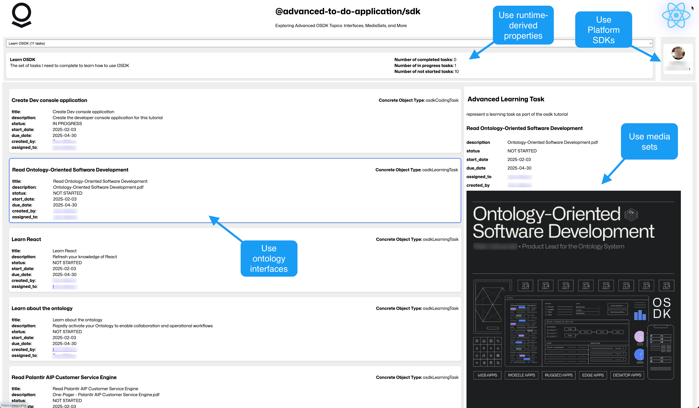

<!-- source: https://palantir.com/docs/foundry/ontology-sdk-react-applications/advanced-todo-application-overview/ · mirrored 2026-08-16 from Palantir Foundry docs -->

# Build an advanced to-do application with OSDK

The **advanced to-do application**, available in [VS Code workspaces](/docs/foundry/vs-code/overview/), demonstrates how to use advanced features of the Ontology SDK (OSDK) by building a to-do application as a practical example. You will learn about many OSDK features, including those discussed in the following documentation sections:

* [Ontology interfaces](/docs/foundry/interfaces/interface-overview/)
* [Media content handling with media sets](/docs/foundry/data-integration/media-sets/)
* [Runtime-derived properties ](/docs/foundry/ontology/derived-properties/)
* [Platform SDKs](/docs/foundry/dev-toolchain/overview/#platform-sdks)

The application reference documentation is divided into the following sections:

**[Architecture and configuration](/docs/foundry/ontology-sdk-react-applications/advanced-todo-application-architecture/):** The architecture and configuration overview provides a summary of the configurations, required installations, and application architecture of the advanced to-do application.

**[useProjects](/docs/foundry/ontology-sdk-react-applications/useprojects-hook/):** The `useProjects` hook provides a comprehensive interface for managing to-do projects within a React application. This hook leverages the Ontology SDK (OSDK) to interact with a backend service, offering functionality to fetch, create, and delete projects along with real-time statistics about the tasks within each project.

**[useTasks](/docs/foundry/ontology-sdk-react-applications/usetasks-hook/):** The `useTasks` hook is a custom React hook that manages tasks associated with a specific project in the to-do application. It leverages the OSDK to fetch task data, associate it with user information, and provide real-time updates through subscriptions. The hook is designed to work with the SWR (stale-while-revalidate) strategy for efficient data fetching, caching, and state management.

**[useCodingTask](/docs/foundry/ontology-sdk-react-applications/usecodingtask-hook/):** The `useCodingTask` hook is a custom React hook that provides functionality for fetching and managing coding task data in the to-do application. The hook enriches the basic task data with user information and metadata.

**[useLearningTask](/docs/foundry/ontology-sdk-react-applications/uselearningtask-hook/):** The `useLearningTask` hook is a custom React hook that provides functionality for fetching and managing learning task data in the to-do application. The hook enriches basic task data with user information, media content, and metadata.

**[useAdmin](/docs/foundry/ontology-sdk-react-applications/useadmin-hook/):** The `useAdmin` hook is a custom React hook that provides functionality for fetching and managing user data from the Foundry Admin API. It leverages the SWR (stale-while-revalidate) library for efficient data fetching and caching.
