<!-- source: https://palantir.com/docs/foundry/ontology-sdk-react-applications/development/ · mirrored 2026-08-16 from Palantir Foundry docs -->

# Development environment

This page will walk you through the development workflow when using an in-platform VS Code workspace to build OSDK React applications.

## Get started

To enable development in your code environment, you will need to [set up your Developer Console](/docs/foundry/developer-console/create-application/). During the setup process, you must select **Create client-facing application** to enable creation of code repositories from Developer Console.

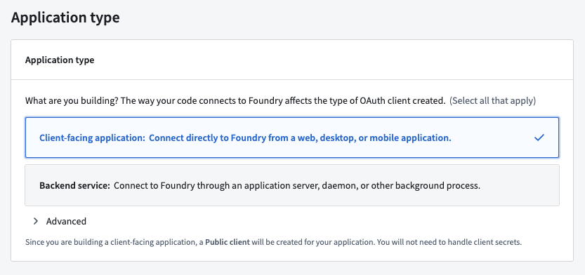

To use a VS Code workspace, open Developer Console and select **Create code repository** under the **Code Repository** section in the left side panel. This action will bootstrap your repository with the default React template. You can then select **Open in VS Code** to launch an in-platform workspace.

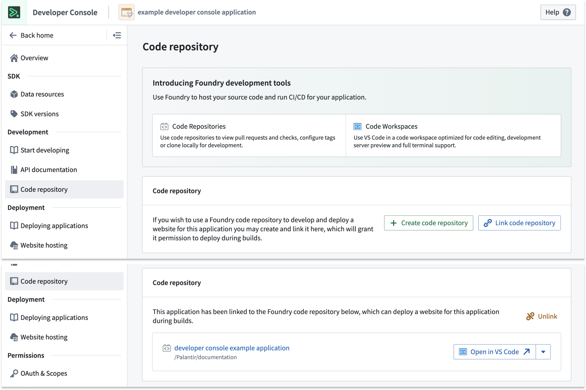

The repository template will include a basic React application integrated with authorization and the Ontology SDK.

## Development lifecycle

Once the VS Code Workspace is launched, you should see the code editor on the left and a live preview of your application on the right. You can start editing your code as if working in a local environment.

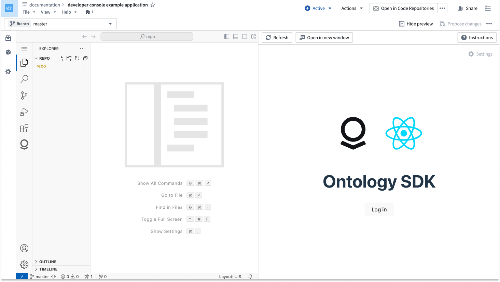

### Edit

You can now start building your React application. Be sure to edit and test your code after writing, then use git commands or the VS Code interface to commit and push your changes to make them visible to other developers in your project. In the terminal, run `npm run lint`, `npm run test`, and `npm run build` to ensure that checks will succeed.

You can also refer to the **Ontology** tab in the left side panel to view generated documentation and code snippets for your OSDK and return to Developer Console.

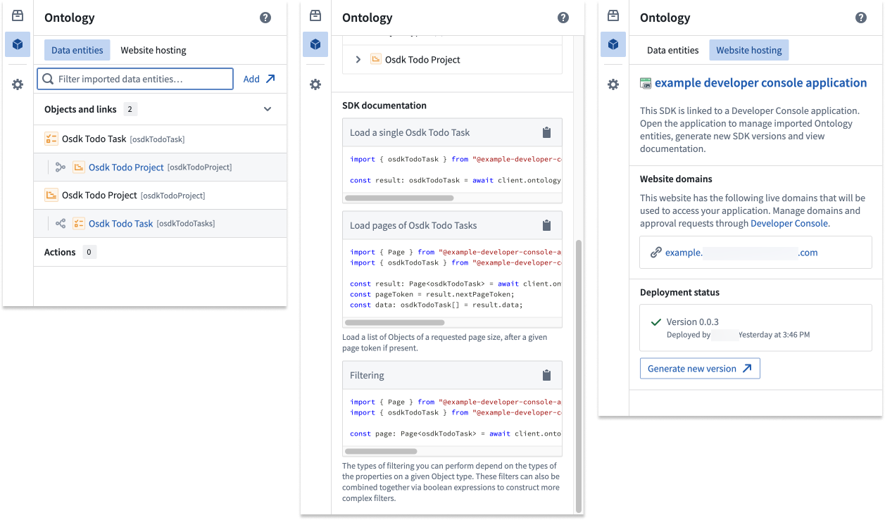

### Deploy

To deploy a React application, you must first cut a release. This is commonly done with the `git tag` command, where you can set the version number and then push it to your repository:

```bash
git tag <x.y.z>
git push origin tag
```

Alternatively, you can cut a release from within the Code Repositories interface by selecting **Open in Code Repositories** from the top right corner of the screen. Navigate to the **Version control** tab, the open the **Tags and releases** section to view previous releases and cut a new release.

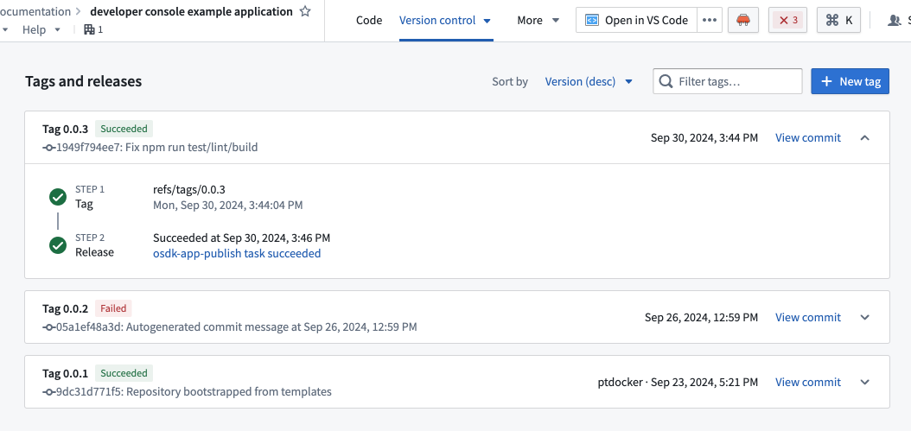

Once the release passes checks, you will be able to view your application in Developer Console.

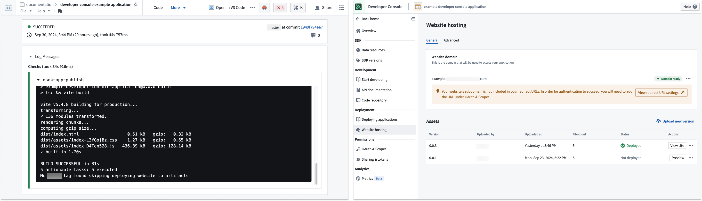

## Content Security Policy

By default, we apply a restrictive Content Security Policy (CSP). This means a request to non-Foundry URIs will fail and must be explicitly allowed.

To detect a CSP error, select `<F12>` and review logs inside the console. If you have CSP failures, you will see errors similar to those shown below:

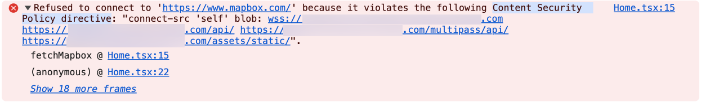

You can apply a temporary CSP to your VS Code workspace. For security reasons, this CSP will not apply to other users of this workspace and will expire when the workspace is paused or restarted.

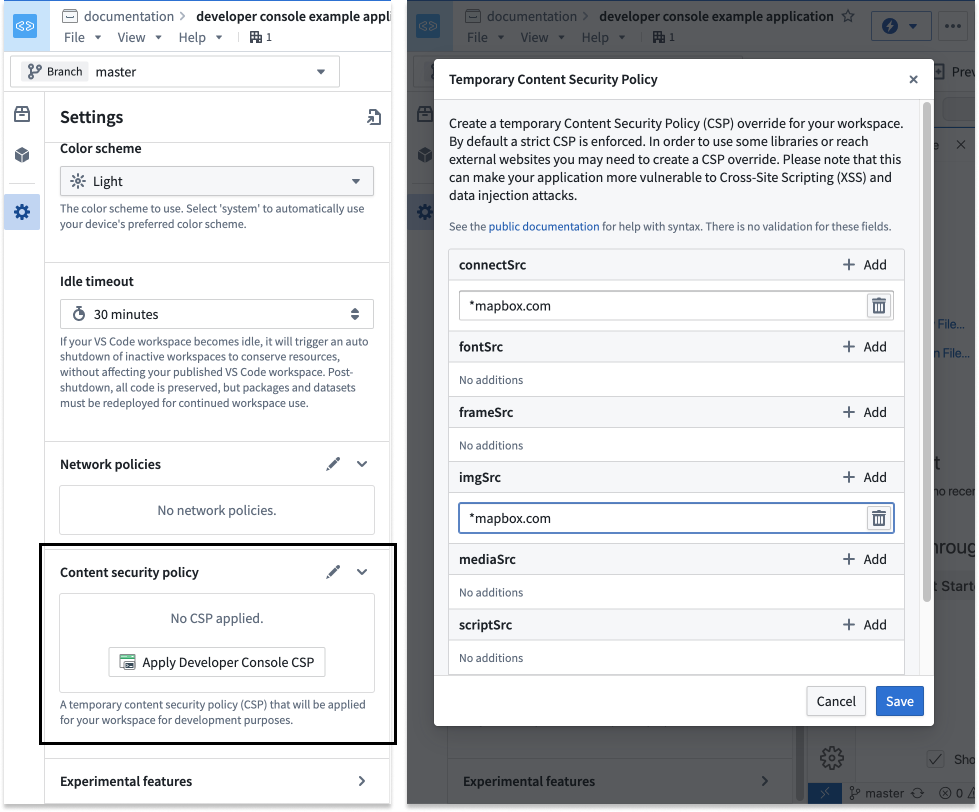

After testing your application inside the VS Code workspace, ensure that the CSP is updated for your Developer Console application.

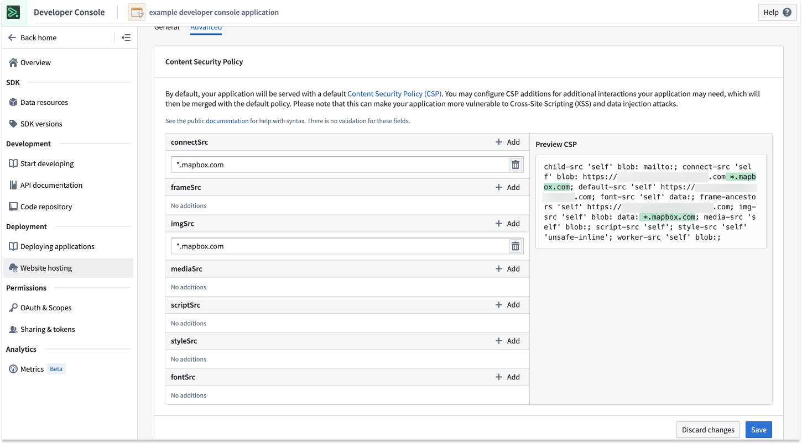

## Development tips

### To Do application tutorial

If you are new to Developer Console and OSDK, we recommend following one of our tutorials to get started. Navigate to the **Build with AIP** application in your enrollment and install one of our example workflows.

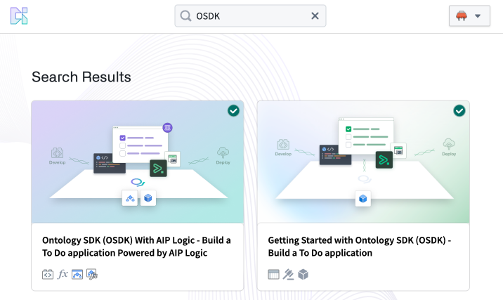

### Progressive Web Application (PWA)

For an optimized editing experience, you can choose to install your workspace as a Progressive Web Application (PWA). A PWA will accept some commonly used shortcuts, such as `Cmd+W` (macOS) to close a tab.

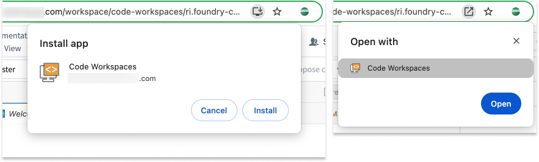

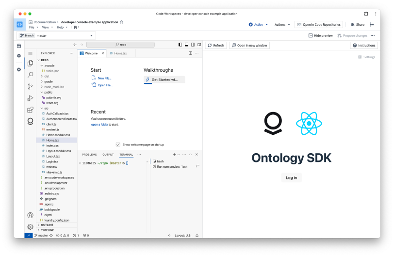

### Zen mode

For a nearly native VS Code experience, we recommend using Zen mode. Select **View > Activate Zen mode** to enable. Zen mode will hide the platform interface and make VS Code take up the entire browser window. To exit Zen mode, hover over the three dots **...** in the top center of your screen.

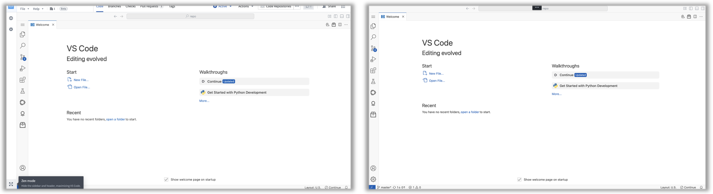

### Local development

Instead of working inside the platform, you can work locally on your machine in the following ways:

* Navigate to your repository in the Code Repositories application, then select **Work locally** in the top right corner of your screen to clone your repository and export the `FOUNDRY_TOKEN` to your local environment. <br><br>
  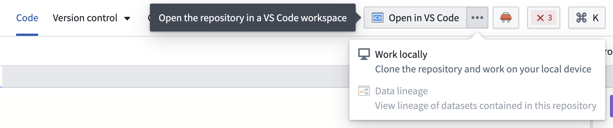 <br><br>

Refer to the `readme.md` file in the repository for more information.

:::callout{theme="neutral"}
You can store your repository outside the Palantir platform while still using the Developer Console to deploy the application. Learn mode in our documentation on [deploying an Ontology SDK application on Foundry](/docs/foundry/developer-console/deploy-custom-application-on-foundry/).
:::

### PR preview \[Beta]

:::callout{theme="warning"}
PR preview for React applications is in the [beta](/docs/foundry/platform-overview/development-life-cycle/) phase of development and may not be available on your enrollment. Functionality may change during active development.
:::

To add efficiency and easier collaboration to your projects, you can access a PR preview of changes to your React application before pushing updates. A PR (pull request) preview provides a working version of your React application based on the code committed in your pull request. You can preview any proposed changes to your application before it is merged into your main branch and production state, making it easier for you to check for any undesirable outcomes and verify user-facing workflows before changes make their way to production. Previously, builders, designers, and other members of an application team would need to create a development environment to view changes. The PR preview feature removes this requirement, allowing for quicker verification of production changes in design and functionality and a more efficient, collaborative process.

The PR preview feature is available for any OSDK React application that is hosted in a Foundry code repository using the Developer Console [web hosting capability](/docs/foundry/developer-console/deploy-custom-application-on-foundry/).

Follow the steps below to get started with PR previews:

1. First, generate an application in Developer Console.

2. Then, configure website hosting for that application. <br><br>
   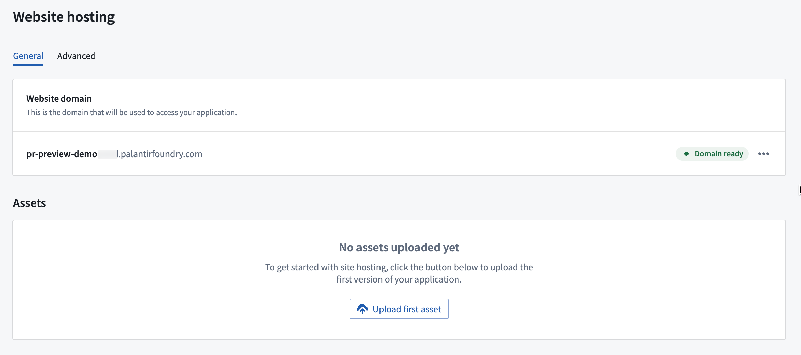 <br><br>

3. Choose to use a [VS Code workspace](/docs/foundry/vs-code/overview/) to take advantage of the developer features available in the [Palantir extension for Visual Studio Code](/docs/foundry/palantir-extension-for-visual-studio-code/overview/). You can also open your application code in [Code Repositories](/docs/foundry/code-repositories/overview/). From either environment, you can create branches in your repository, implement code changes with commits, and push updates. You can use the following terminal commands or your environment interface to make changes:
   1. Create a new branch: `git checkout -b myFeatureBranch main`
   2. Implement your code changes and commit your work: `git commit -am "implement UI change to show PR Preview"`
   3. Push your changes to the code repository: `git push —set-upstream origin myFeatureBranch`

4. Once you make your desired changes and all checks are complete, return to Code Repositories if you were working in a VS Code workspace.

5. Navigate to the **Version control** tab at the top of the screen and choose **Pull Requests**.

6. Choose the pull request you would like to preview, then select **Preview** in the lower right corner to open a preview version of your React application. <br><br>
   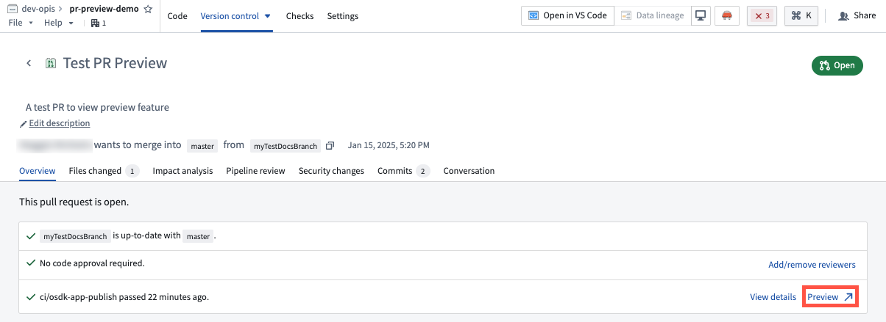 <br><br>

You can also find a PR preview link for every commit on your branch by navigating to the **Commits** tab of the pull request. Note that PR previews are only available within seven days of the creation of the pull request. After seven days, the preview will expire.

#### Preview permissions

To access the PR preview feature for React applications, users must have proper permissions for the application from Developer Console. To manage these permissions, open your application in Developer Console, then navigate to **Sharing** in the left sidebar.

To make changes, create pull requests for the application code, and share PR preview with other users, you must have either `Owner` or `Editor` permissions. To share a PR Preview with a user without granting permissions to edit your application code or configurations, add them as a `Viewer` under **Share hosted website**.

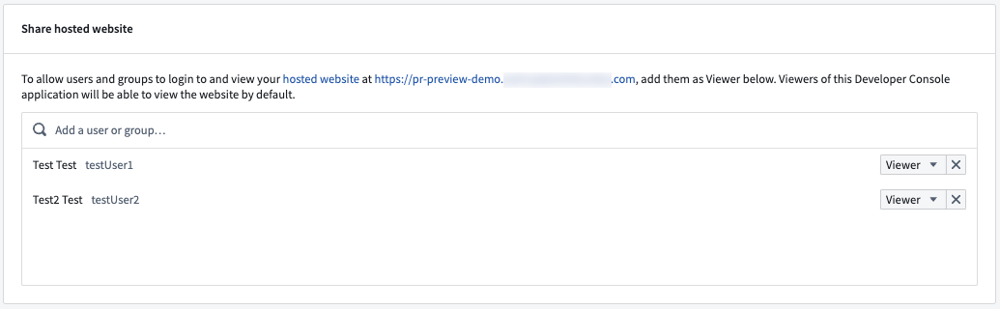
