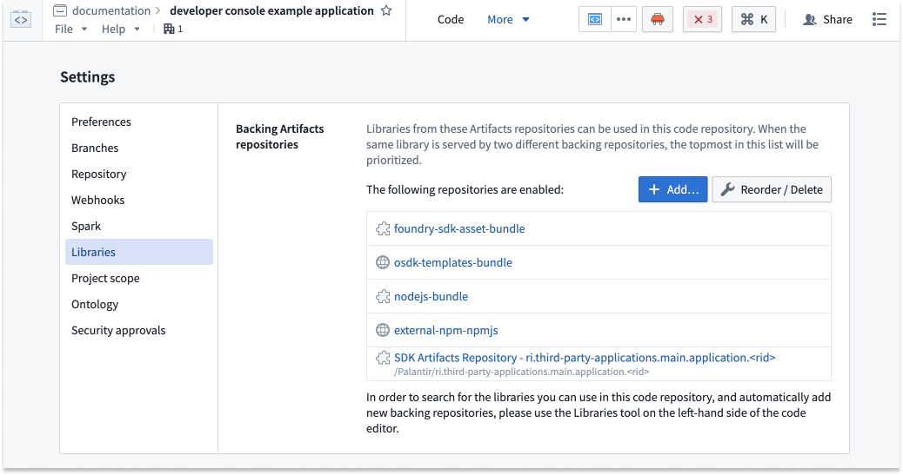
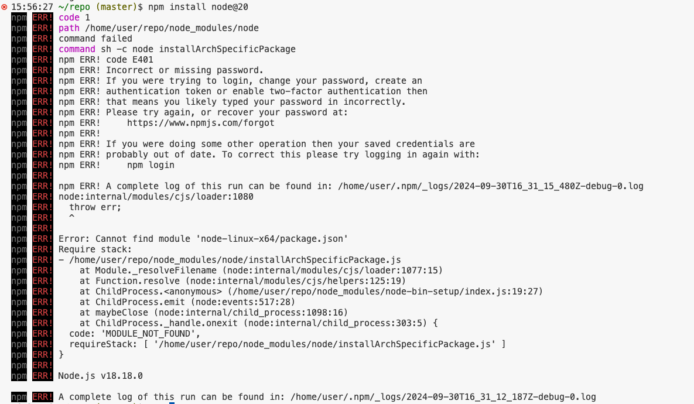

<!-- source: https://palantir.com/docs/foundry/ontology-sdk-react-applications/troubleshooting/ · mirrored 2026-08-16 from Palantir Foundry docs -->

# Troubleshooting

This page contains tips for troubleshooting errors that you may encounter while developing your OSDK React application. If you have other issues or are unable to resolve your issue with this guide, [report an issue](/docs/foundry/getting-help/issues/#report-an-issue) to Palantir Support.

## Workspace errors

If working from within the Palantir platform, you will be using a VS Code workspaces running on Palantir's Code Workspaces infrastructure. Further troubleshooting information can be found in the following documentation:

* [VS Code workspace troubleshooting](/docs/foundry/vs-code/troubleshooting/)
* [Code Workspaces troubleshooting](/docs/foundry/code-workspaces/troubleshooting/)

## npm troubleshooting steps

If you are having issues running your npm commands, try the following troubleshooting steps:

* Delete the lock file (`package-lock.json`) and the dependency folder (`node_modules/`), then re-run the failing command.
* Pause and resume the workspace.

### `NPM MODULE_NOT_FOUND` error: Adding new dependencies

Code Repositories requires your dependencies to be explicitly declared.

By default, we add the following npm repositories:

* Common OSDK dependencies: `foundry-sdk-asset-bundle`, `osdk-templates-bundle`
* [npmjs.com ↗](https://www.npmjs.com/) mirror: `external-npm-npmjs`
* Your OSDK:  `SDK Artifacts Repository - <rid>`

The `npm install <package>` command may fail if you try to add a package that is not present in any of the backing repositories. For example, if the package you try to install is private, you must ensure it is present as a repository Artifact. Review our [Artifacts documentation](/docs/foundry/code-repositories/artifact-repositories-overview/) for more information.

Example error:

:::callout{theme="neutral"}
The error `code E401 Incorrect or missing password` will be emitted by npm when **npmjs.com** is unreachable from within a VS Code workspace.
:::
