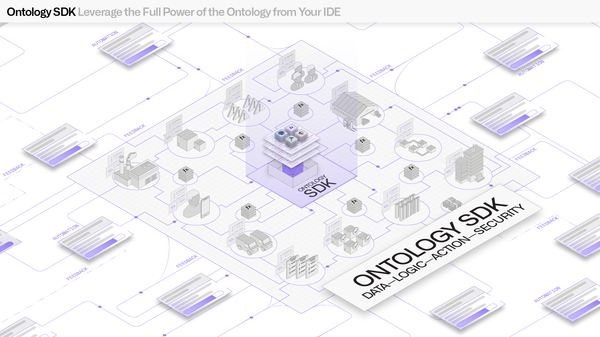
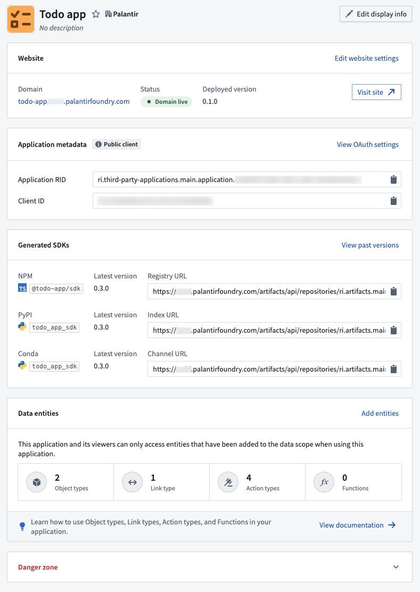
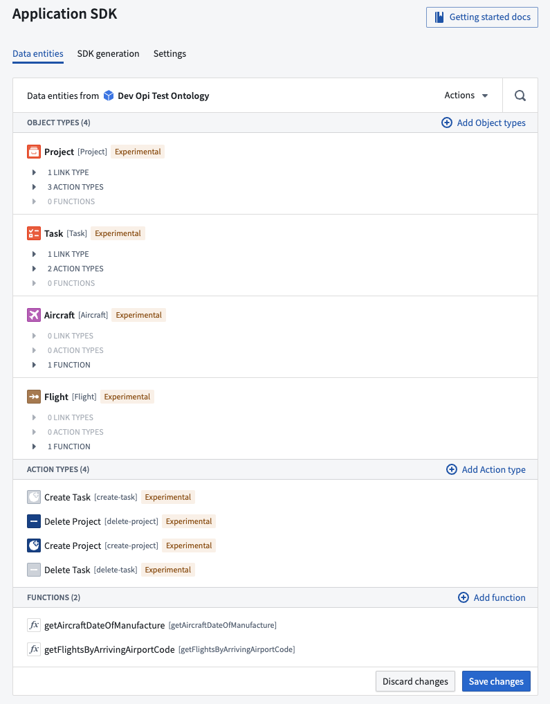

<!-- source: https://palantir.com/docs/foundry/ontology-sdk/ · mirrored 2026-08-22 from Palantir Foundry docs -->

# Ontology SDK (OSDK)

The Ontology Software Development Kit (OSDK) allows you to access the full power of the Ontology directly from your development environment. The OSDK supports NPM (Node Package Manager) for TypeScript, Pip or Conda for Python, Maven for Java, and OpenAPI spec for any other language.

By treating Foundry as your backend, you can leverage the Ontology's robust ability to perform high-scale queries and Foundry writeback alongside granular governance controls to accelerate the process of securely developing applications that can power your organization.

:::callout{theme="note"}
To create and manage OSDK applications, use [Developer Console](/docs/foundry/developer-console/overview/). This section covers SDK-specific reference documentation.
:::

:::callout{theme="note"}
If you define your Ontology in code rather than in the UI, consider creating a [SuperRepo](/docs/foundry/superrepo/overview/). A SuperRepo suits an Ontology and application that evolve together and that you want versioned and released as a single artifact. In a SuperRepo, your object types, links, and actions are declared with [Ontology-as-code](/docs/foundry/superrepo/core-concepts/#ontology-as-code) in the same repository as your [functions](/docs/foundry/functions/overview/) and frontend. The OSDK is generated locally and regenerated whenever those definitions change. This means you can extend the Ontology and consume the new types within a single edit-and-preview loop, without republishing an SDK version between each change.
:::

## OSDK benefits

The OSDK was built to provide several primary benefits:

* **Accelerated development:** With the OSDK, you can quickly start developing applications backed by the Foundry Ontology. By enabling ergonomic access to Ontology APIs, the OSDK allows you to read and write back to the Ontology with minimal code.
* **Strong type-safety:** The functions and types generated for the OSDK are based on just the subset of the Ontology relevant to you. Types and functions are generated from your Ontology, allowing you to query and explore your Ontology directly in your editor.
* **Centralized maintenance:** As the Ontology is built and managed centrally in Foundry, you can focus on application building and decrease the typical maintenance burden required to build a data foundation.
* **Secure by design:** The OSDK uses a token that is scoped only to the ontological entities you want your application to access, in addition to the user's own permissions to the data.

Additionally, TypeScript bindings for frontend development provide a convenient way for developers to quickly build React applications on top of Foundry.

The generated code uses metadata about your Ontology, including property names and descriptions. You can view this metadata directly in your editor.

## Getting started

To build an application with the OSDK:

1. [Create a new application](/docs/foundry/developer-console/create-application/) in Developer Console
2. Bootstrap your application using one of the language-specific guides:
   * [TypeScript](/docs/foundry/developer-console/how-to-bootstrapping-typescript/)
   * [Python](/docs/foundry/developer-console/how-to-bootstrapping-python/)
   * [Java](/docs/foundry/developer-console/how-to-bootstrapping-java/)
3. Optionally, [host your application on Foundry](/docs/foundry/developer-console/deploy-custom-application-on-foundry/)

## SDK references

This section contains language-specific API reference documentation:

* [Java OSDK](/docs/foundry/ontology-sdk/java-osdk/)
* [Python OSDK](/docs/foundry/ontology-sdk/python-osdk/)
* [TypeScript OSDK](/docs/foundry/ontology-sdk/typescript-osdk/)
* [TypeScript OSDK migration guide](/docs/foundry/ontology-sdk/typescript-osdk-migration/)
* [Python OSDK migration guide](/docs/foundry/ontology-sdk/python-osdk-migration/)
* [Generate OSDK for other languages](/docs/foundry/ontology-sdk/generate-osdk-for-other-languages/)

## Related documentation

* [Developer Console overview](/docs/foundry/developer-console/overview/): Create and manage OSDK applications
* [OSDK React applications](/docs/foundry/ontology-sdk-react-applications/overview/): Build React applications with OSDK
* [Development environment](/docs/foundry/ontology-sdk-react-applications/development/): Set up your development workflow
* [SuperRepo](/docs/foundry/superrepo/overview/): Define your Ontology, functions, and application in one pro-code repository, with the OSDK generated from your code definitions
