<!-- source: https://palantir.com/docs/foundry/ontology-sdk/deploy-osdk-application-on-foundry/ · mirrored 2026-08-22 from Palantir Foundry docs -->

# Host an OSDK application on Foundry

The web hosting feature in Developer Console adds the option for developers building frontend-only applications using the OSDK to host these applications on Foundry, removing the need for additional hosting infrastructure.

The web hosting feature only supports hosting static assets and does not support running a server, similar to GitHub Pages. This means you can host:

* HTML, CSS, and JavaScript files
* Single-page applications (React, Vue, Angular, etc.) that run entirely in the browser
* Images, fonts, and other static resources

You cannot use this feature to run server-side code such as Node.js backends, Python servers, or server-side rendering. Your application must make API calls to Foundry via the OSDK or other external services for any server-side functionality.

:::callout{theme="neutral"}
Website hosting is only available for applications configured as a **Client-facing application**. If your application is also configured as a **Backend service**, the website hosting option will not appear because this combination creates a confidential client intended for server-side applications.
:::

Each hosted website can be served from either a subdomain of your Foundry enrollment domain or a custom domain that you own. By default, you will choose a subdomain and your application will be served from `<YOUR-APPLICATION-SUBDOMAIN>.[YOUR-ENROLLMENT].palantirfoundry.com`. Alternatively, you can host your application on a custom domain such as `[your-organization].com`. See [Host your website on a custom domain](#host-your-website-on-a-custom-domain) for more details.

:::callout{theme="warning"}
If your Foundry enrollment is not served from a domain ending with `.palantirfoundry.com`, contact Palantir Support to help set up web hosting as additional coordination is required.
:::

:::callout{theme="warning"}
In IL5 and FedRAMP environments, website hosting may appear to be disabled in Developer Console. Enabling website hosting in these environments requires additional approvals and configuration for custom TLS certificates and hosted websites. Contact Palantir Support to begin this process and to coordinate the required changes with your network infrastructure team.
:::

## Prepare your application

The following section describes the steps required to host your Developer Console application on Foundry.

### Single-page application rendering

If you do not include a [custom 404 page](#custom-404-page) in your application, Foundry will assume this is a [single-page application ↗](https://en.wikipedia.org/wiki/Single-page_application) and will route any request to a path under this subdomain to the `index.html`.

### Updating the redirect URL

As part of the authentication flow, you will need to update the redirect URL to include your hosting domain followed by `/auth/callback`. If you are using an enrollment subdomain, this will be `<YOUR-APPLICATION-SUBDOMAIN>.[YOUR-ENROLLMENT].palantirfoundry.com/auth/callback`. If you are using a custom domain, this will be `<YOUR-CUSTOM-DOMAIN>/auth/callback`.
You must also add the same redirect URL to your application in Developer Console. Review [create a new OSDK](/docs/foundry/developer-console/create-application/) for more information.

:::callout{theme="warning"}
Always use `https://` (not `http://`) when configuring your redirect URL. The platform does not automatically upgrade `http` URLs to `https`, and using `http` can cause Content Security Policy violations and other security issues.
:::

### Prepare the asset

Compress the content of the directory containing a production build of your website files. **Do not** include the directory itself. The directory is typically `dist/` for common web frameworks.

If you include any directories in your compressed file, these directories will be included in the path to your website.

### Limits

The following limits apply when hosting websites on Foundry:

| Limit | Maximum |
| --- | --- |
| Number of files | 1,000 |
| Total upload size | 20 MB |

If your application exceeds these limits, you must reduce the number of files or their sizes before uploading. Consider bundling and minifying your assets, removing unused files, or compressing images to stay within these constraints.

### Check subdomain support availability

Before building features that depend on subdomain hosting, programmatically check whether it is enabled for your enrollment.

To check subdomain support status, use the enrollment subdomain API in Control Panel or the website hosting support status utility in Developer Console. Either approach returns whether subdomain and website hosting is supported for the given enrollment.

## Set up the domain

From within your application on Developer Console, choose **Website hosting** on the left side menu.

## Host your website on a subdomain

To host your website on a subdomain of your enrollment's domain, follow the steps below.

1. Select the subdomain for your application; this may be the application name or any other name you choose. Then, select **Request application domain**. In the example below, we are selecting `my-first-hosted-app.example.palantirfoundry.com`: <br><br>
   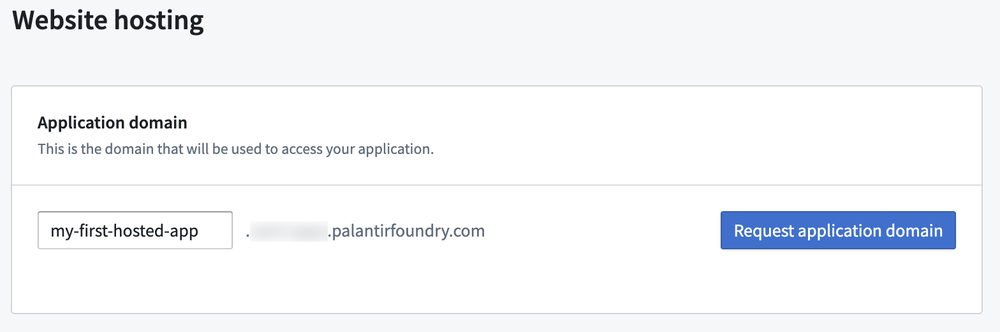 <br><br>

:::callout{theme="warning"}
You cannot edit a subdomain request after it has been submitted. If you need to change the subdomain name, you must cancel or close the existing request and submit a new request with the correct subdomain name.
:::

2. Request approval from an **Information Security Officer** in your enrollment, or approve it yourself if you have the necessary permissions by selecting **View request**. An enrollment administrator can manage enrollment permissions in Control Panel. <br><br>
   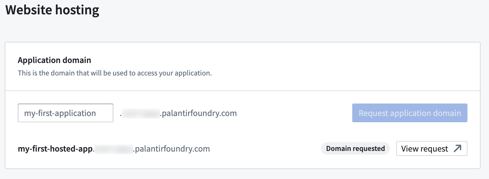 <br><br>

3. After the request is approved, refresh the page. At this point, **Domain ready** should now appear, indicating the domain is prepared for use. This may take a few minutes to complete. <br><br>
   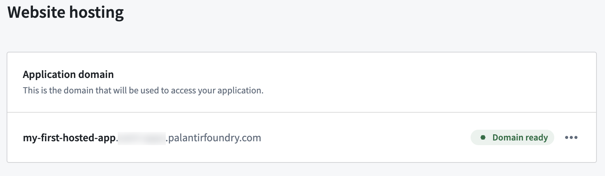 <br><br>

## Host your website on a custom domain

Instead of using an enrollment subdomain, you can host your application on a custom domain that you own, such as `[your-organization].com`. This is useful when you want your application to be accessible from a branded or public-facing domain.

:::callout{theme="neutral"}
Custom domain hosting may not be available on all enrollments. If the option does not appear in your Developer Console application, contact Palantir Support for assistance.
:::

### Prerequisites

Before requesting a custom domain for your application, ensure that a certificate covering your domain has been created in Control Panel. If no certificate exists for the domain, the approval request will not succeed. See [Configure domains and certificates](/docs/foundry/administration/configure-domains-and-certificates/) for instructions on creating certificates.

### Request a custom domain

From within your application on Developer Console, choose **Website hosting** on the left side menu.

1. Select **Request to host on a custom domain**. This option appears below the enrollment subdomain registration form. <br><br>
   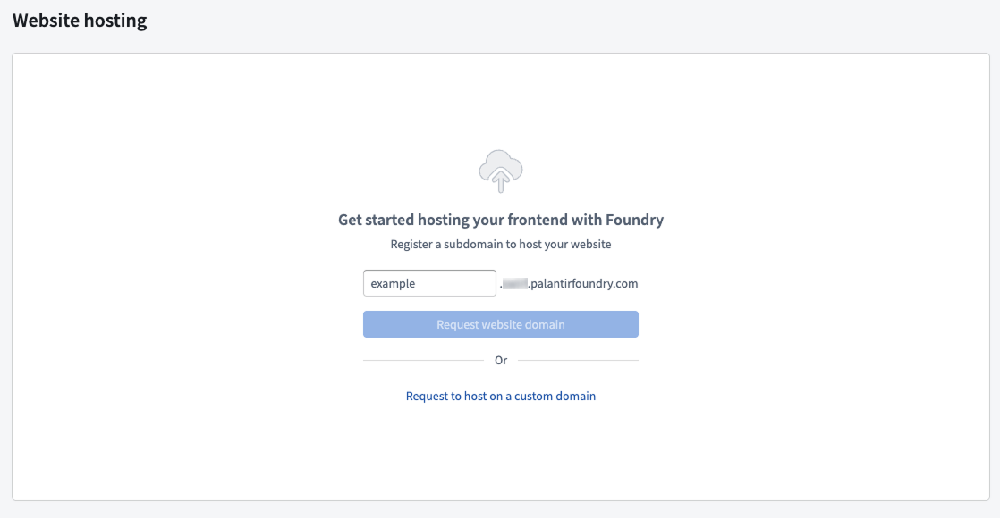 <br><br>

2. In the dialog that appears, enter your custom domain (for example, `[your-organization].com`), a request title, and an optional description. Then select **Request**. <br><br>
   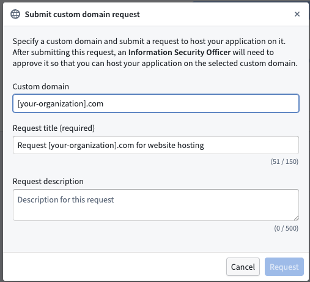 <br><br>

3. This creates an approval task that must be approved by an **Information Security Officer** in your enrollment. You can select **View** in the success notification to navigate to the approval request in Control Panel. <br><br>
   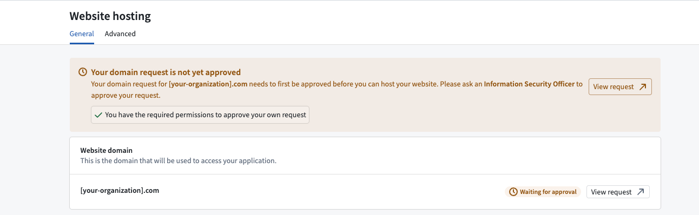 <br><br>

4. After the request is approved, the custom domain is associated with your application. You may need to refresh the page for the updated status to appear. Note that the domain you used to log into Foundry will be associated with the custom domain you have configured. In other words, network ingress and authentication provider configuration will be inherited from this domain. <br><br>
   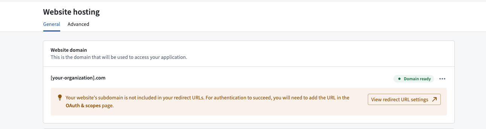 <br><br>

:::callout{theme="warning"}
You must also update the DNS settings for your custom domain to point to your Foundry environment. See [Configure domains and certificates](/docs/foundry/administration/configure-domains-and-certificates/#5-update-the-domain-name-server-dns) for guidance on updating DNS records.
:::

### Register subdomains under a custom domain

After your custom domain is approved and configured, you may want to register additional subdomains under that custom domain. To register a subdomain under a custom domain, you must be logged into Foundry via that specific custom domain. If you are logged in through a different domain—such as the default enrollment domain—the option to register subdomains under your custom domain will not be available in Developer Console.

For example, if you want to register `app.your-organization.com` as a subdomain under your custom domain `your-organization.com`, you must first navigate to and log into Foundry using `your-organization.com`, then request the subdomain from Developer Console.

## Website hosting on externally managed domains

Some Foundry deployments, particularly air-gapped or otherwise network-restricted environments, may not have wildcard DNS or certificates configured through the standard automated flow. In these cases, if your enrollment supports website hosting and your infrastructure team has configured:

* Custom DNS records pointing to your Foundry environment
* TLS certificates covering the desired subdomain
* Network ingress that routes subdomain traffic to your Foundry environment

Then contact Palantir Support to request that website hosting for externally managed domains is enabled on your enrollment.

Once website hosting is enabled, you can request and link a subdomain for your Developer Console application using the standard workflow described in [Host your website on a subdomain](#host-your-website-on-a-subdomain). The Developer Console configuration remains the same—the additional infrastructure configuration (ingress routing, TLS certificates, and DNS) must be coordinated with your network infrastructure team separately from the Developer Console setup.

:::callout{theme="neutral"}
This configuration is typically required for deployments not served from a domain ending with `.palantirfoundry.com`. Contact Palantir Support or your infrastructure team for assistance with this setup.
:::

## Upload your assets and deploy

As a developer, you can choose between uploading assets manually using the Developer Console website hosting user interface or by using the `@osdk/cli` command line tool.

* To learn how to upload using the Developer Console user interface, follow the guide [below](/docs/foundry/developer-console/deploy-custom-application-on-foundry/#upload-assets-using-the-developer-console).
* To learn how to upload assets using the command line interface, follow the **Deploying applications** guide in the platform, as shown in the screenshot below. You can find more details on the `@osdk/cli` command line tool in the [public npm repository ↗](https://www.npmjs.com/package/@osdk/cli). <br><br>
  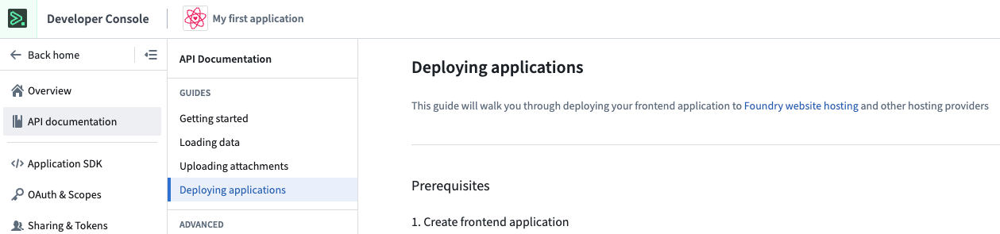 <br><br>

### Upload assets using the Developer Console

In the following step, we take the compressed asset created [earlier](/docs/foundry/developer-console/deploy-custom-application-on-foundry/#prepare-the-asset) and upload it to Foundry.

1. Select **Upload new asset** in the **Assets** section on the page.

2. Drop your zip archive file here, or choose from your computer and select **Upload**. <br><br>
   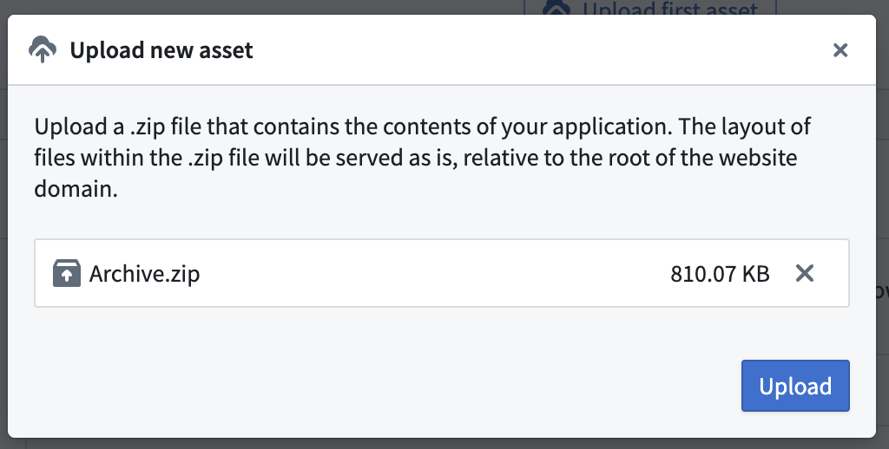 <br><br>

3. Once the upload is complete, use **Preview** to preview your site before deploying to production or use the **...** option to **Deploy to production**, as shown below. <br><br>
   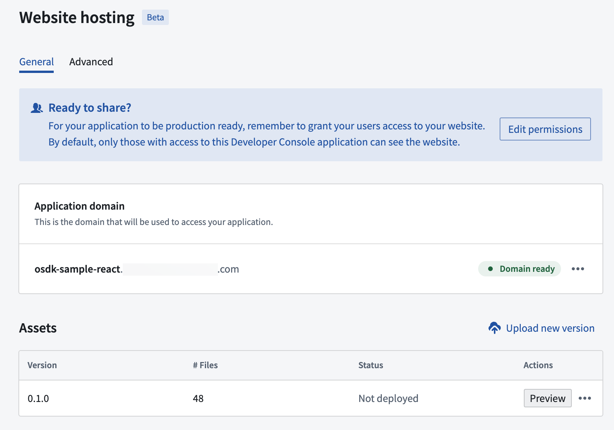 <br><br>

   Once you select **Deploy to production**, that version will serve all users. We recommend to first **Preview site**.

4. Now, select **View site** to visit the deployed site. <br><br>
   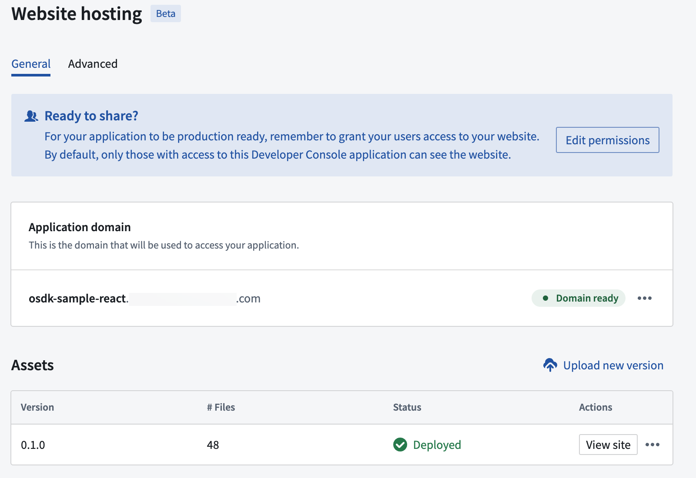 <br><br>

### Upload-only mode for asynchronous scanning

On some Foundry enrollments, site asset or vulnerability scanning runs asynchronously before a deployment can go live. If your enrollment enforces this scanning, deploying immediately after upload may fail because the scan has not yet completed.

Set `site.uploadOnly` to `true` in your `foundry.config.json`:

```json
{
  "site": {
    "uploadOnly": true
  }
}
```

With this setting, the publish step only uploads the new version without attempting an immediate production deployment. After the asynchronous scanning completes, you can manually deploy the desired version as the live version from the Developer Console.

:::callout{theme="warning"}
If `site.uploadOnly` is set to `false` (the default), the publish process will both upload and immediately attempt to deploy to production. On enrollments with asynchronous scanning enabled, this may result in a failed tag status even though the upload succeeded.
:::

## Grant website access

Websites hosted by Foundry will only be available for users with Foundry login credentials. By default, any user that has access to your Developer Console application will also have access to the deployed site, but this is likely to include only you and your development team.
To make your site accessible to other Foundry users, navigate to the **Sharing & Tokens** menu to the left. Add the names of the users under the **Share hosted website** section of the page, as shown below.

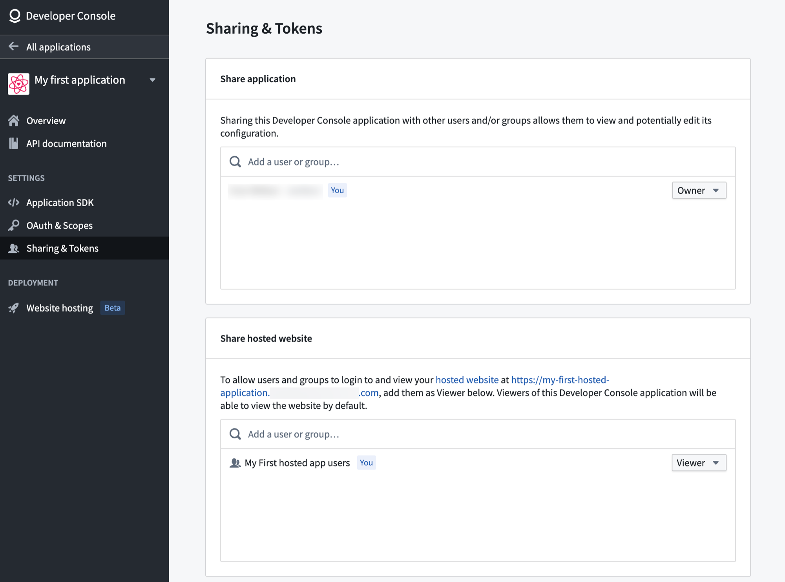

## Advanced configuration

You can find additional configuration options in the **Advanced** tab of the **Website hosting** page.

### Content security policy

By default, your application will be served with a restricted [Content Security Policy (CSP) ↗](https://developer.mozilla.org/en-US/docs/Web/HTTP/CSP) which only allows for loading resources from your subdomain. If needed, you can configure additional CSP rules for specific interactions within your application and they will be merged with the default policy. However, be aware that making these changes can increase your application's vulnerability to Cross-Site Scripting (XSS) and data injection attacks.

From within the **Content Security Policy** section, shown in the image below, you can control the CSP for your application. Updating the CSP is crucial when retrieving images or content hosted elsewhere and when making calls to external services.

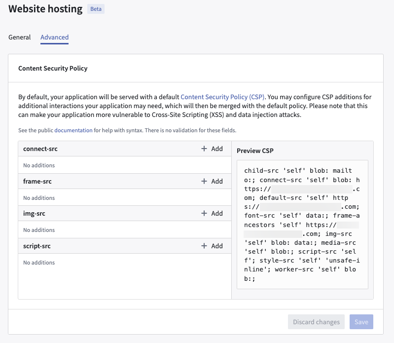

See [Mozilla's documentation ↗](https://developer.mozilla.org/en-US/docs/Web/HTTP/CSP) for help with syntax. There is no validation for these fields.

### Cross-origin resource sharing (CORS)

If your hosted application needs to load assets or make requests to another Foundry-hosted application—for example, in a micro-frontend architecture where a parent application fetches `remoteEntry.js` from a child application—you must configure CORS policies to allow these cross-origin requests.

You can configure CORS for Artifact website subdomains in Control Panel. To enable cross-origin requests between hosted applications:

1. Navigate to Control Panel and open the **CORS** tab.
2. Locate the subdomain of the application that needs to be accessed (the "child" application).
3. Add the origin of the requesting application (the "parent" application) to the allowed origins list.

For example, if `parent-app.example.palantirfoundry.com` needs to fetch assets from `child-app.example.palantirfoundry.com`, add `https://parent-app.example.palantirfoundry.com` as an allowed origin for the child application's subdomain.

For more information, see [Configure CORS](/docs/foundry/administration/configure-cors/).

## Route matching rules

Foundry supports serving HTML pages on routes both with and without extensions and trailing slashes.

Given the following layout of website files:

```
├── file.html
├── folder
│   └── index.html
├── both.html
└── both
    └── index.html
```

Foundry serves these HTML pages on the following routes:

| Route              | File               |
| ------------------ | ------------------ |
| /file              | /file.html         |
| /file/             | /file.html         |
| /file.html         | /file.html         |
| /folder            | /folder/index.html |
| /folder/           | /folder/index.html |
| /folder/index.html | /folder/index.html |
| /both              | /both.html         |
| /both.html         | /both.html         |
| /both/             | /both/index.html   |
| /both/index.html   | /both/index.html   |

Foundry does not redirect to a preferred route format such as enforcing trailing slashes or removing extensions from the route.

## Custom 404 page

You can add a `404.html` page to the root of the website to serve as a custom error page when routes are not matched. This will disable the default behavior to serve the root `index.html` page for unmatched routes described in [single-page application (SPA) rendering](#single-page-application-rendering).

## Troubleshooting

### Website hosting is unsupported for your environment

If you encounter issues when deploying a hosted frontend application—such as seeing "Page not found" when editing website settings, releases that hang indefinitely, or an explicit warning that "Website hosting is currently unsupported for your environment"—follow these steps to resolve the issue:

1. **Verify the application type:** Website hosting is only available for applications configured as a **Client-facing application**. If your application is also configured as a **Backend service**, the website hosting option will not be available because this combination creates a confidential client intended for server-side applications. Ensure that the OAuth client used by the application is a public client, not a confidential one.
2. **Confirm website hosting is enabled:** Website hosting for externally managed domains must be enabled on your enrollment. Contact Palantir Support to verify whether it is enabled and to request that it is enabled if necessary.
3. **Verify environment support:** Confirm that your enrollment supports website hosting. Some environments, particularly those with specific compliance requirements, may require additional configuration before website hosting can be used.

Once website hosting is enabled on your enrollment and your application uses a public OAuth client, you should be able to deploy your hosted frontend application successfully.

### `SiteAssetScanning:ScanningInProgress` error

When deploying an OSDK application for the first time, you may encounter a `SiteAssetScanning:ScanningInProgress` error. This error occurs because the site asset scan is still running and blocks the initial deployment.

To resolve this issue:

1. Wait for the asset scan to complete. You can monitor the scan status by querying the scan endpoint.
2. Once the scan has finished, retry the deployment.

Subsequent deployments should not encounter this issue once the initial scan has completed.
