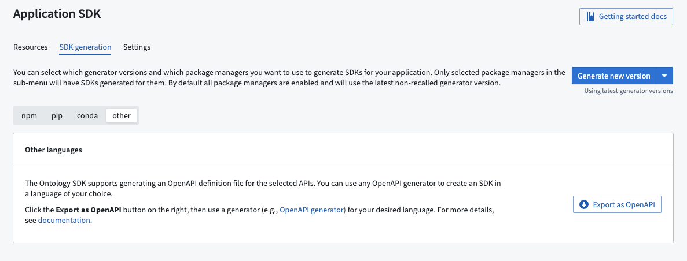

<!-- source: https://palantir.com/docs/foundry/ontology-sdk/generate-osdk-for-other-languages/ · mirrored 2026-08-06 from Palantir Foundry docs -->

# Generate OSDK for other languages

The Developer Console has built-in Java, Python, and TypeScript support for code generation using both pip and Conda but is not limited to these languages. Developer Console also supports exporting APIs in the industry-standard [OpenAPI format ↗](https://www.openapis.org/). You can use open source code generators to generate a client based on the downloaded OpenAPI spec in almost any language.

## Export an OpenAPI spec

Navigate to the **Application API** page in the Developer Console application and open the **SDK generation** tab. Then, choose **Other languages** and select **Export as OpenAPI**.

:::callout{theme="warning"}
As the exported file will include the name and the description of the resources included in the Developer Console application, ensure these fields do not contain sensitive information.
:::

## Generate clients and server in other languages

Once the OpenAPI file has been exported, you can generate a client and server using an open source generator. A list of OpenAPI generators can be found on the [OpenAPI generator web site ↗](https://openapi-generator.tech/docs/generators).
