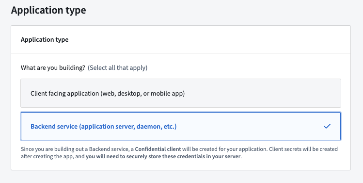
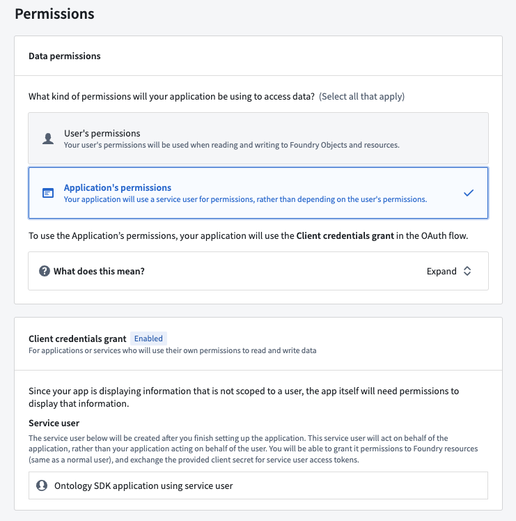
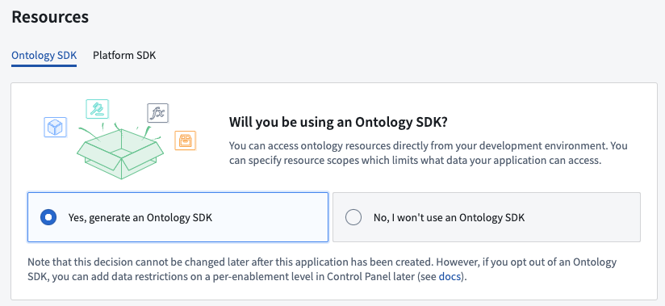
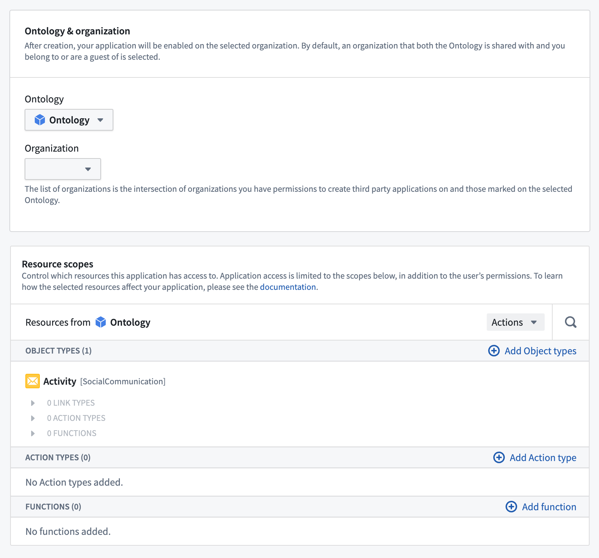
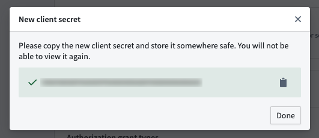

<!-- source: https://palantir.com/docs/foundry/ontology-sdk/how-to-bootstrapping-server-side-typescript/ · mirrored 2026-08-06 from Palantir Foundry docs -->

# Bootstrap a new OSDK TypeScript application with a service user

As explained in the [permission types](/docs/foundry/developer-console/permissions/#permission-types) section, the OSDK can be used to query data based on a service user's permissions rather than the end user's permissions. The following walkthrough shows how to use [Next.js© ↗](https://nextjs.org/) (external) to fetch data using the OSDK and a service user.

:::callout{theme="neutral"}
When developing on a service or application that uses a confidential client, a service user will be created along with your Developer Console application. If you plan to create the application using an Ontology that belongs to an Organization separate from your default Organization, you must complete the steps to [share and enable the application](/docs/foundry/developer-console/how-to-create-backend-service-app-different-org/).
:::

## 1. Create an OSDK package using Developer Console

[Navigate to Developer Console](/docs/foundry/developer-console/overview/) in your Foundry instance, then select **+ New application**.

:::callout{theme="neutral"}
If the **+ New application** button does not appear, you likely do not have the right permissions. Review the [permissions documentation](/docs/foundry/developer-console/permissions/#user-permissions) for more information.
:::

Follow the steps in the creation wizard and add the following details:

* On the **Application type** page, choose [**Backend service**](/docs/foundry/developer-console/permissions/).



* On the **Permission** page, choose [**Application's permissions**](/docs/foundry/developer-console/permissions/).



Developer Console will create a service user for this application based on the application name. In the example above, the name of the generated service user is **Ontology SDK application using service user**. In addition to the [submission criteria](/docs/foundry/action-types/submission-criteria/) for any action types, you must grant this service user the permissions required to [read the data of the object types](/docs/foundry/object-permissioning/overview/) you will select in the next step.

* On the **Resources** page, select **Yes, generate an Ontology SDK**.



* Select an Ontology to use.

:::callout{theme="warning"}
Note that once the Ontology SDK has been generated, the Ontology associated with it cannot be changed.
:::

* Select the object types and action types that you want the OSDK package to include. For this exercise, pick any object type available to you.



Review and confirm the information you entered, then select **Create application** to see the client secret for the new application. Copy and store the secret securely as this is the only time it is visible.



:::callout{theme="neutral"}
If you lose your client secret, you can rotate and obtain a new secret on the **Permissions & OAuth** page. Keep in mind that this will break existing applications using this service user and secret.
:::

Finally, select **Generate first version** to use your newly created OSDK.


## 2. Install the generated SDK package

Once the generation of the OSDK is complete, you will see a set of installation steps to guide you in installing the generated SDK in your code project.

## 3. Use the OSDK in your code project

In this walkthrough, we use [Next.js© ↗](http://nextjs.org). Next.js supports rendering code on the server side which is required for our service user example. To bootstrap a new Next.js project, follow the [Next.js© documentation ↗ ](https://nextjs.org/docs/getting-started/installation).

### Client and OAuth creation

Service user authentication is done through a confidential OAuth client that allows you to access the Ontology with a client secret instead of requiring user authentication.

Create a file named `client.ts` and enter the following code:

```typescript
import { createConfidentialOauthClient } from "@osdk/oauth";
import { createClient } from "@osdk/client";

export const auth = createConfidentialOauthClient(
    process.env.CLIENT_ID!,
    process.env.CLIENT_SECRET!,
    process.env.STACK_URL!,
);

export const client = createClient(
    process.env.STACK_URL!,
    <ONTOLOGY-RID>,
    auth
)
```

Create a `.env` file with the same variables. **Do not check in this file to your code repository**.

```bash
CLIENT_ID=<YOUR CLIENT ID>
CLIENT_SECRET=<YOUR CLIENT SECRET>
STACK_URL=<YOUR ONTOLOGY SERVER DOMAIN NAME> # for example, https://myfoundrystack.com
```

### Access the Ontology

The following code uses a `Country` object type with a `@serverside-osdk-example/sdk` package name. Replace the example package name and object type with the package you created, and the object type you selected, respectively. Lastly, replace `{country.countryName}` with a property from your object type.

Replace the code in the `page.tsx` with the following:

```typescript
import { Country } from "@serverside-osdk-example/sdk";
import { client, auth } from "./client";
import { Osdk } from "@osdk/client";

async function getCountries(): Promise<Osdk.Instance<Country>[]> {
    // Handle authentication
    await auth.signIn();
    // You need to give the service user read access to the ontology
    try {
        const resp = await client(Country).fetchPage();
        return resp.data;
    } catch (err) {
        console.log(err);
    }
    console.log("No countries found");
    return [];
}

export default async function Home() {
    const countries: Osdk.Instance<Country>[] = await getCountries();
    return (
        <main>
            <div>
                {countries.map((country: Osdk.Instance<Country>) => (
                    <span key={country.$primaryKey}>{country.countryName}</span>
                ))}
            </div>
        </main>
    );
}
```

To run a demo of your setup, first run the development server:

```bash
npm run dev
```

Then, navigate to [http://localhost:3000 ↗](http://localhost:3000) with your browser to view the result.
