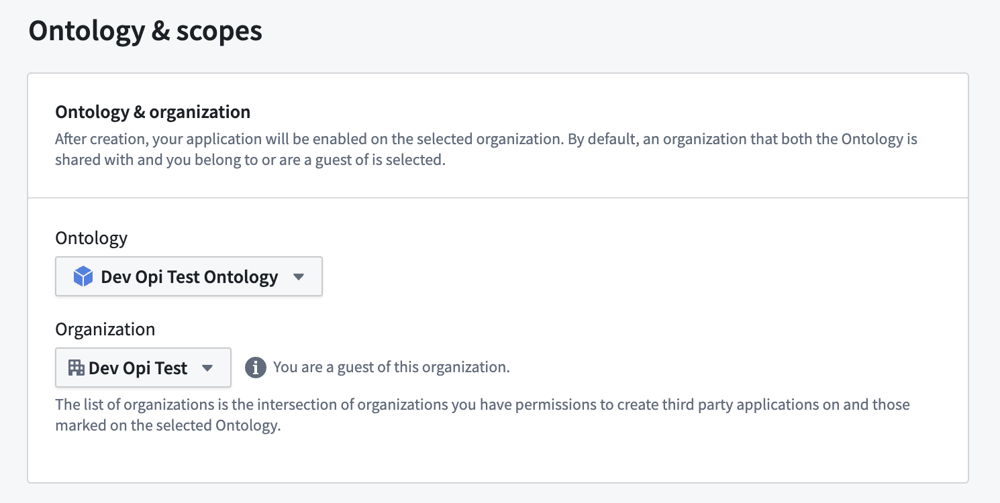
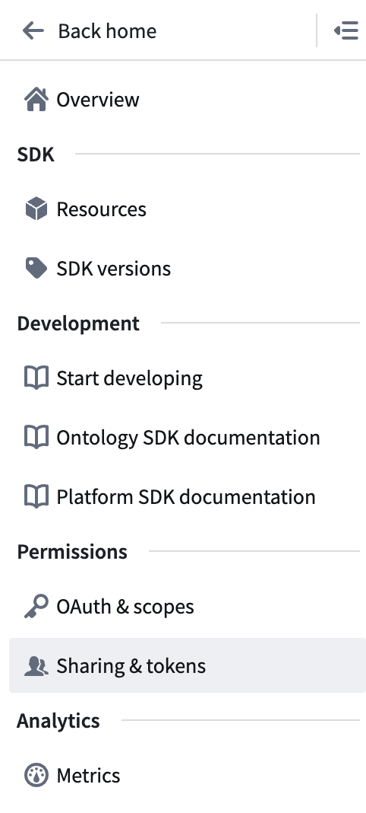
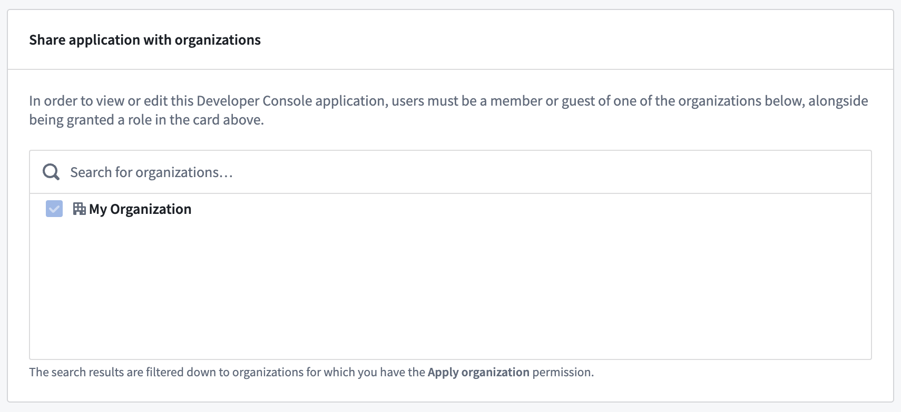
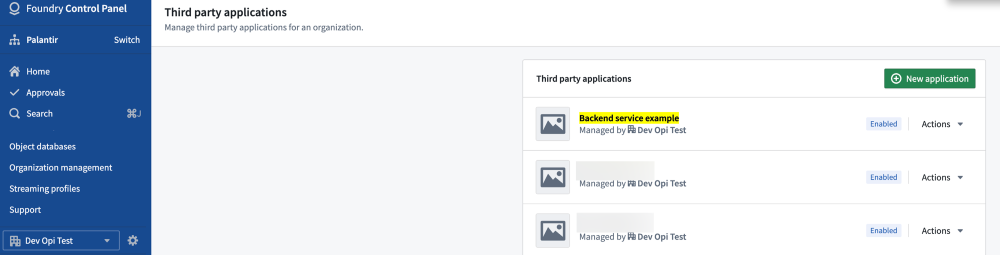
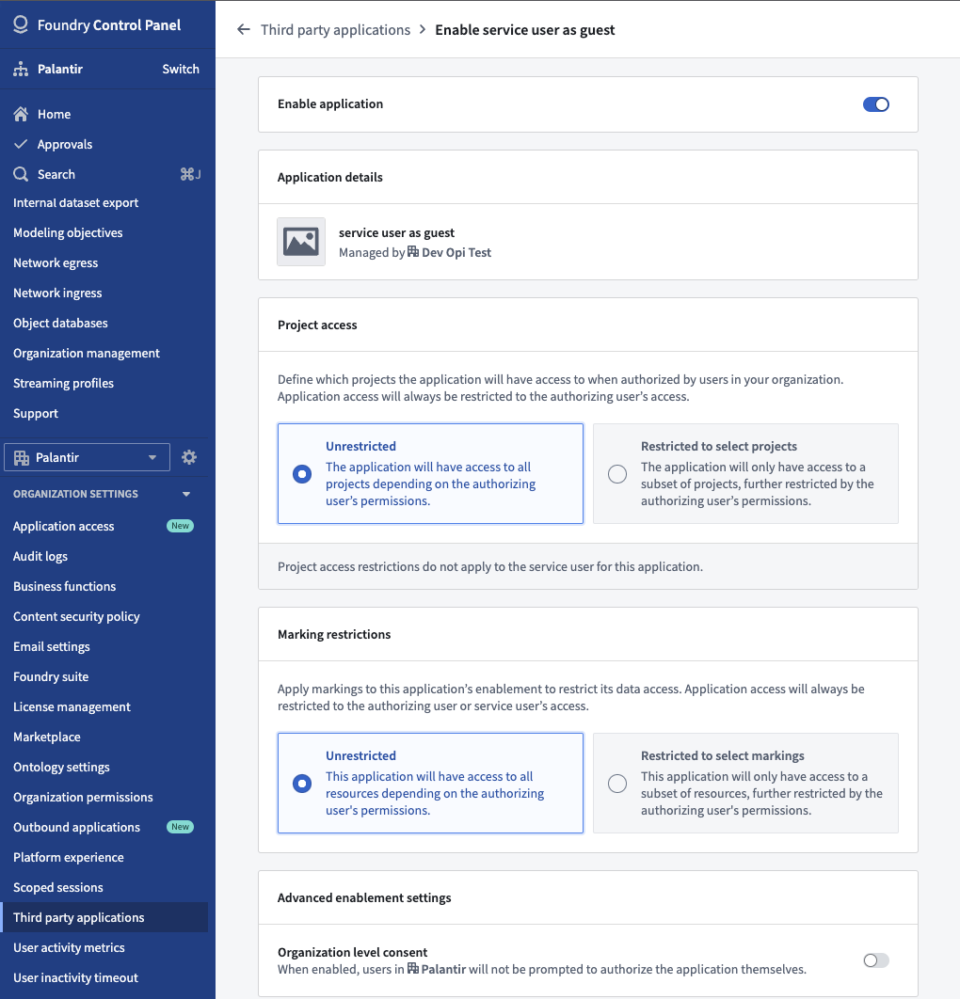

<!-- source: https://palantir.com/docs/foundry/ontology-sdk/how-to-create-backend-service-app-different-org/ · mirrored 2026-08-06 from Palantir Foundry docs -->

# Create an application using a different Organization

When developing a service or application in the Developer Console that uses a confidential client, a service user will be created along with your application. Once created, you must grant the service user any necessary permissions to read and write to the Ontology.

By default, the service user will be added as a guest of the organization that is selected in the Developer Console, as shown in the image below.

However, if that organization is different from your default organization, you will not be able to see that user or grant permissions to it until you complete the following two steps:

1. [Share the application with your organization](#share-the-application-with-your-organization)
2. [Enable the application on your organization](#enable-the-application-on-your-organization)

## Share the application with your organization

Prepare your application for use in your organization with the following steps:

1. In Developer Console, navigate to **Sharing & tokens** on the left sidebar.

2. Use the **Share application with organizations** interface to add your organization to the list and save your changes.

## Enable the application on your organization

Once you have shared the application with your default organization, you can switch back to your default organization and find the application again.

1. Open the **Third party applications** page in Control Panel and find your application.

2. Select **Actions**, then **Enablement settings**.
3. At the top of the page, toggle on **Enable application**.

Once you save your changes, the service user will be added as a guest to your organization and you will be able to grant any necessary permissions.
