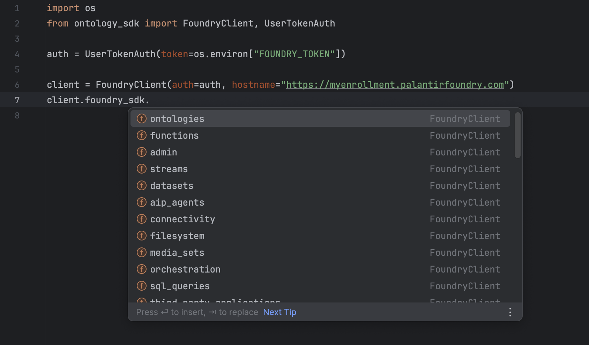
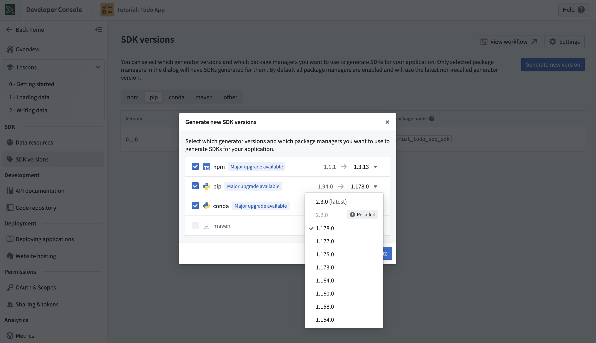

<!-- source: https://palantir.com/docs/foundry/ontology-sdk/python-osdk-migration/ · mirrored 2026-08-06 from Palantir Foundry docs -->

# Python OSDK migration guide (1.x to 2.x)

This guide is intended to help you migrate applications using Python OSDK 1.x to Python OSDK 2.x. The sections below explain the differences between the two versions and highlight relevant changes in syntax and structure.

:::callout{theme="neutral"}
Python OSDK documentation is also available in-platform in the Developer Console at `/workspace/developer-console/`. Use the version picker to select `2.x` for documentation on Python OSDK 2.x.
:::

## Why upgrade from Python OSDK 1.x to 2.x?

There are four main reasons to upgrade from Python OSDK 1.x to 2.x:

* [Shared client used for both Python Platform SDK and OSDK](#shared-client-used-for-both-python-platform-sdk-and-osdk)
* [Improved return types for queries, links, aggregations, and attachment uploads](#improved-return-types-for-queries-links-aggregations-and-attachment-uploads)
* [Ability to edit your client configuration](#ability-to-edit-your-client-configuration)
* [Beta features](#beta-features)

### Shared client used for both Python Platform SDK and OSDK

Developing with both the OSDK and Platform SDK no longer requires users to manage two separate clients. Both SDKs can now be accessed through a single client.



### Improved return types for queries, links, aggregations, and attachment uploads

* Queries can return objects, object sets, attachments, two-dimensional aggregations, three-dimensional aggregations, and map types.
  * In Python OSDK V1, function queries whose return types were objects, object sets, and attachments would return the object identifiers for each of these types. For example, if a query returns an object, in V1, the query would actually return the object primary key as opposed to an instance of the object. Now, queries return an instance of the type.
  * Python OSDK V1 did not support two-dimensional aggregations, three-dimensional aggregations, or map types. These are now supported in OSDK V2.
* Links return object sets or `Optional[Objects]`
  * One-to-many / many-to-many type links now return object sets and one-to-one / many-to-one type links return `Optional[Objects]`.
  * For one-to-one / many-to-one type links, users no longer need to use `.get` to retrieve the linked object. The link itself will be the object.
  * For one-to-many / many-to-many type links, all methods available to object sets (such as `.page`, `.where`, or `.group_by`) are now available to these links. In Python OSDK V1, only the methods `.iterate` and `.get` were available.
* Aggregations return an `AggregateObjectsResponse`
  * In Python OSDK V1, aggregation responses were of type `dict[str, Any]`, where the keys were fields such as excluded items, accuracy, data, and so on. With Python OSDK V2, aggregations now return an instance of `AggregateObjectsResponse`, whose fields are the same as the V1 dict type, but with improved type safety. The `AggregateObjectsResponse` in Python OSDK V2 has a `.to_dict` method, which will return the same response as in V1.
  * To perform a "group by range" in Python OSDK V1, you would need to input a list of dicts, where the keys of each dict were "start\_value" and "end\_value", and the values of each dict were the start and end of the range. In V2, the input type is now a set of tuples, where the first element of the tuple is inferred to be the "start\_value" and the second element the "end\_value".
* Attachment upload returns an `Attachment`
  * In Python OSDK V1, `client.ontology.attachments.upload(...)` returned an `AttachmentMetadata`. In V2, uploading an attachment returns an `Attachment`.

### Ability to edit your client configuration

In Python OSDK V1, there was no easy way to edit the client configuration when sending requests. For example, if a user wanted to edit the user-agent of their requests, they would have to access the reserved `._session` method on their client in order to do so. To avoid this issue, Python OSDK V2 provides a `Config` class that users can import and pass into their clients.

This new `Config` class has the following structure:

```python
class Config:

# Configuration for the HTTP session.


    default_headers: Optional[Dict[str, str]] = ...
    # HTTP headers to include with all requests.

    proxies: Optional[Dict[Literal["http", "https"], str]] = None
    # Proxies to use for HTTP and HTTPS requests.

    timeout: Optional[Union[int, float]] = None
    # The default timeout for all requests in seconds.

    verify: Optional[Union[bool, str]] = True
    # SSL verification, can be a boolean or a path to a CA bundle.

    default_params: Optional[Dict[str, Any]] = None
    # URL query parameters to include with all requests.

    scheme: Literal["http", "https"] = "https"
    # URL scheme to use ('http' or 'https'). Defaults to 'https'.
```

#### Python OSDK 1.x (legacy)

```python
from ontology_sdk import FoundryClient

client = FoundryClient()
client._session._user_agent += "something_new"
```

#### Python OSDK 2.x

```python
from ontology_sdk import FoundryClient, Config

config = Config(default_headers={"Content-Type": "application/json"})
client = FoundryClient(config=config)
```

### Beta features

Beta features have the potential to change, and their syntax, stability, and existence are not guaranteed. Stable releases of the Python OSDK V2 contain beta features, allowing you to try them out and provide feedback. To use a beta feature, you must import `AllowBetaFeatures` from `foundry_sdk_runtime` and either write your code within its context, or decorate your code with `@AllowBetaFeatures()`. When using Foundry Python functions, the `@function` decorator contains a `beta` boolean.

#### Use beta features with `AllowBetaFeatures`

```python
from foundry_sdk_runtime.decorators import AllowBetaFeatures

with AllowBetaFeatures():
    <your code>
```

#### Use beta features by decorating methods with `AllowBetaFeatures`

```python
from foundry_sdk_runtime.decorators import AllowBetaFeatures

@AllowBetaFeatures()
my_func():
    <your code>
```

#### Use beta features in Foundry Python functions

The following code is required for Python functions to accept ontology objects with beta properties.

```python
from functions.api import function

@function(beta=True)
def my_function():
    <your code>
```

Beta features in Python OSDK V2 include the following:

* [Derived properties](#derived-properties)
* [Nearest neighbor object set filtering](#nearest-neighbor-object-set-filtering)
* [New object property type: Markings](#new-object-property-type-markings)
* [New object property type: Media](#new-object-property-type-media)
* [New object property type: Vector](#new-object-property-type-vector)

#### Derived properties

[Derived properties](/docs/foundry/ontology/derived-properties/) are properties calculated at runtime based on the values of other properties or links on objects. With OSDK V2, you can create derived properties on your object sets.

```python
from foundry_sdk_runtime import AllowBetaFeatures
from ontology_sdk.ontology.objects import Object


with AllowBetaFeatures():
    derived_object_type = Object.object_type.derived

    my_object_set = client.ontology.object.with_properties(
        my_new_property=derived_object_type.linked_object.id.count()
    )

    result = my_object_set.take(1)

    print(result)
# Example output:
# Object(id=1, my_new_property=3.0)
```

#### Nearest neighbor object set filtering

In OSDK V2, you can filter object sets using `nearest_neighbors` to find the set of objects whose specified vector property is nearest to a provided query vector or text.

```python
from foundry_sdk_runtime import AllowBetaFeatures
from ontology_sdk.ontology.objects import Object


my_object_set = client.ontology.objects.Object

with AllowBetaFeatures():
    closest_objects = my_object_set.nearest_neighbors(
        query="my query",
        num_neighbors=3,
        vector_property=Object.object_type.vector_property
    )
    print(list(closest_objects))

# Example output:
# [
#     Object(rid=None, _score=None, id=1, embedding=None),
#     Object(rid=None, _score=None, id=2, embedding=None),
#     Object(rid=None, _score=None, id=3, embedding=None)
# ]
```

#### New object property type: Markings

Markings in the OSDK are a string that represents mandatory security controls used to restrict resource access to only those users who satisfy all applied marking criteria.

```python
from foundry_sdk_runtime import AllowBetaFeatures
from foundry_sdk_runtime.markings import Marking


my_object_set = client.ontology.objects.Object

with AllowBetaFeatures():
    my_object = my_object_set.get(1)

    print(my_object.marking_property)
# Example output:
# Marking("MyMarking")
```

#### New object property type: Media

A media property allows you to interact with their media types. You can get the content, metadata, and information on the media reference from media properties.

```python
from foundry_sdk_runtime import AllowBetaFeatures
from foundry_sdk_runtime.media import Media


my_object_set = client.ontology.objects.Object

with AllowBetaFeatures():
    my_object = my_object_set.get(1)
    print(my_object.media_property)
# Example output:
# Media("media_property")

    print(my_object.media_property.get_media_content())
# Example output:
# <_io.BytesIO object at 0x106ed32c0>

    print(my_object.media_property.get_media_metadata())
# Example output:
# MediaMetadata(
#     path='my_file.png'
#     size_bytes=1408
#     media_type='image/png'
# )

    print(my_object.media_property.get_media_reference())
# Example output:
# MediaReference(
#     mime_type='image/png'
#     reference=MediaSetViewItemWrapper(
#         media_set_view_item=MediaSetViewItem(
#             media_set_rid='ri.mio.main.media-set.00000000-0000-0000-0000-000000000000',
#             media_set_view_rid='ri.mio.main.view.00000000-0000-0000-0000-000000000000',
#             media_item_rid='ri.mio.main.media-item.00000000-0000-0000-0000-000000000000',
#             token=None
#         ),
#         type='mediaSetViewItem'
#     )
# )
```

#### New object property type: Vector

Vector properties are lists of floats. They can be used to perform nearest neighbor filtering.

```python
from foundry_sdk_runtime import AllowBetaFeatures
from foundry_sdk_runtime.vector import Vector
from ontology_sdk.ontology.objects import Object


my_object_set = client.ontology.objects.Object

with AllowBetaFeatures():
    my_object = my_object_set.get(
        1,
        properties=[Object.object_type.vector_property]
    )

    print(my_object.vector_property)
# Example output:
# Vector([0.014408838003873825, ..., -0.012173213064670563])
```

## How to upgrade from Python OSDK 1.x to 2.x

You can generate a new SDK version for an existing Developer Console application using the Python OSDK 2.x generator (accessed through the **Generate new version** option) in the **SDK versions** tab of your application.



Existing applications must also have the required dependencies to use the newly generated SDK. New applications created in Developer Console will generate SDKs using the Python OSDK 2.x generator by default. You can quickly get started by following the instructions in the **Start developing** tab.

## Syntax translations and return type changes from Python OSDK 1.x to 2.x

This section contains simple examples that illustrate how to map between Python OSDK 1.x and 2.x.

### Filtering

* You must include `.object_type` in the `where` expression when referencing the property that is being filtered on.
* `.is_member_of` has been renamed to `.in_`.
* `.starts_with` has been renamed to `.contains_all_terms_in_order_prefix_last_term`.

#### Filtering with Python OSDK 1.x (legacy)

```python
client.ontology.object.where(Object.id.is_member_of([1, 2, 3])).take(1)
```

#### Filtering with Python OSDK 2.x

```python
client.ontology.object.where(Object.object_type.id.in_([1, 2, 3])).take(1)
```

### Links

#### Return type changes

| Link type | V1 response | V2 response |
|---|---|---|
| One-to-one / many-to-one | ObjectLinkClass instance | Optional\[Object] |
| One-to-many / many-to-many | ObjectLinkClass instance | ObjectSet instance |

#### One-to-one or many-to-one links with Python OSDK 1.x (legacy)

In Python OSDK V1, use `.get` to retrieve the linked object.

```python
linked_obj: Optional[LinkedObject] = client.ontology.object.linked_object.get()
```

#### One-to-many or many-to-many links with Python OSDK 1.x (legacy)

In Python OSDK V1, the only methods available are `.iterate` and `.get`.

```python
linked_obj: ObjectLinkType = client.ontology.object.linked_object

linked_obj.iterate() → Iterable[LinkedObject]
linked_obj.get(1) → Optional[LinkedObject]
```

#### One-to-one or many-to-one links with Python OSDK 2.x

In Python OSDK V2, the link itself is a method that returns an instance of the linked object.

```python
linked_obj: Optional[LinkedObject] = client.ontology.object.linked_object()
```

#### One-to-many or many-to-many links with Python OSDK 2.x

In Python OSDK V2, any method available to object sets are now available on links, including `.take`, `.where`, and `.group_by`; this makes it easier to filter, aggregate, and iterate over links.

```python
linked_obj: LinkedObjectSet = client.ontology.object.linked_object()

# All V1 methods are available

linked_obj.iterate() → Iterable[LinkedObject]
linked_obj.get(1) → Optional[LinkedObject]

# Search, aggregation, and iteration is now available

from ontology_sdk.ontology.objects import LinkedObject

result: float = linked_obj.where(LinkedObject.object_type.id > 5).count().compute()
```

### Queries

Queries in OSDK V2 have changes to their return types, and all arguments to queries in V2 are keyword arguments.

#### Return type changes

| Return type | Object primary key (float, string) | Object instance |
|-------------|---|---|
| Object      | Object primary key (float, string) | Object instance |
| ObjectSet   | ObjectSet RID (string) | ObjectSet instance |
| Attachment  | Attachment RID (string) | Attachment instance |

#### Object queries with Python OSDK 1.x (legacy)

```python
result: float = client.ontology.queries.query_object_output(1)

print(result)
# Example output:
# 1.0
```

#### Object set queries with Python OSDK 1.x (legacy)

```python
result: str = client.ontology.queries.query_object_set_output(1)

print(result)
# Example output:
# "ri.object-set.main.object-set.e5c05475-8766-4804-9be0-66cf7854de5c"
```

#### Attachment queries with Python OSDK 1.x (legacy)

```python
result: str = client.ontology.queries.query_attachment_output(1)

print(result)
# Example output:
# "ri.attachments.main.attachment.2c1432f8-0378-45f2-8280-55d858cb71fc"
```

#### Object queries with Python OSDK 2.x

```python
result: Object = client.ontology.queries.query_object_output(object_id = 1)

print(result)
# Example output:
# Object(id = 1)
```

#### Object set queries with Python OSDK 2.x

```python
result: ObjectSet = client.ontology.queries.query_object_set_output(object_id = 1)

print(result)
# Example output:
# ObjectSet(object_set_definition=...)
```

#### Attachment queries with Python OSDK 2.x

```python
result: Attachment = client.ontology.queries.query_attachment_output(object_id = 1)

print(result)
# Example output:
# Attachment(rid="ri.attachments.main.attachment.2c1432f8-0378-45f2-8280-55d858cb71fc")
```

#### Two-dimensional aggregation queries with Python OSDK 2.x

```python
result: QueryTwoDimensionalAggregation = client.ontology.queries.query_two_dimensional_output()

print(result)
# Example output:
# QueryTwoDimensionalAggregation(
#     groups=[
#         QueryAggregation(key='1', value=2.0),
#         QueryAggregation(key='2', value=3.0)
#     ]
# )
```

#### Three-dimensional aggregation queries with Python OSDK 2.x

```python
result: QueryThreeDimensionalAggregation = client.ontology.queries.query_three_dimensional_output()

print(result)
# Example output:
# QueryThreeDimensionalAggregation(
#     groups=[
#         NestedQueryAggregation(
#             key='1',
#             groups=[
#                 QueryAggregation(key='ABC', value=2.0),
#                 QueryAggregation(key='DEF', value=4.0)
#             ]
#         ),
#         NestedQueryAggregation(
#             key='2',
#             groups=[
#                 QueryAggregation(key='GHI', value=1.0),
#                 QueryAggregation(key='JKL', value=1.0)
#             ]
#         )
#     ]
# )
```

#### Map type queries with Python OSDK 2.x

```python
result: dict[Object, int] = client.ontology.queries.query_map_output(object_id = 1)

print(result)
# Example output:
# {
#     Object(id=1): 1,
#     Object(id=2): 3
# }
```

### Aggregations

Aggregations that return more than a single value (that is, those derived from `.group_by` and `.aggregate`) return `AggregateObjectsResponse` as opposed to `Dict[str, Any]`. If you would like to return the Python OSDK V1 response, the `AggregateObjectsResponse` has a `.to_dict` method on it, which returns a dictionary representation of the response.

| V1 response | V2 response |
|---|---|
| Dict\[str, Any] | AggregateObjectsResponse |

#### Aggregations with Python OSDK 1.x (legacy)

```python
result: dict[str, Any] = client.ontology.objects.Object.aggregate({
                             "min_id": Object.object_type.id.min(),
                             "max_id": Object.object_type.id.max()
                         }).compute()

print(result)
# Example output:
# {
#     'accuracy': 'ACCURATE',
#     'data': [
#         {
#             'group': {},
#             'metrics': [
#                 {'name': 'min_id', 'value': 1.0},
#                 {'name': 'max_id', 'value': 99.0}
#             ]
#         }
#     ]
# }
```

#### Aggregations with Python OSDK 2.x

```python
result: AggregateObjectsResponse = client.ontology.objects.Object.aggregate({
    "min_id": Object.object_type.id.min(),
    "max_id": Object.object_type.id.max()
}).compute()

print(result)
# Example output:
# AggregateObjectsResponse(
#     excluded_items=None,
#     accuracy='ACCURATE',
#     data=[
#         AggregateObjectsResponseItem(
#             group={},
#             metrics=[
#                 AggregationMetricResult(name='min_id', value=1.0),
#                 AggregationMetricResult(name='max_id', value=99.0)
#             ]
#         )
#     ]
# )
```

### Attachments

In OSDK V1, when uploading an attachment, the return type is an `AttachmentMetadata`. In V2, the return type is an `Attachment`.

#### Upload attachment with Python OSDK 1.x (legacy)

```python
result: AttachmentMetadata = client.ontology.attachments.upload(
    file_path="file.json",
    attachment_name="myFile"
)
print(result)
# Example output:
# AttachmentMetadata(
#     rid='ri.attachments.main.attachment.00000000-0000-0000-0000-000000000000',
#     filename='myFile',
#     size_bytes=20,
#     media_type='*/*',
#     type='single'
# )
```

#### Upload attachment with Python OSDK 2.x

```python
result: Attachment = client.ontology.attachments.upload(
    file_path="file.json",
    attachment_name="myFile"
)
print(result)
# Example output:
# Attachment(rid=ri.attachments.main.attachment.00000000-0000-0000-0000-000000000000)

print(result.get_metadata())
# Example output:
# AttachmentMetadata(
#     rid='ri.attachments.main.attachment.00000000-0000-0000-0000-000000000000',
#     filename='myFile',
#     size_bytes=20,
#     media_type='*/*',
#     type='single'
# )

print(result.read().getvalue())
# Example output:
# b'My example file.\n'
```

### Group by

In OSDK V1, when grouping by ranges, the accepted input is a list of dicts, where the keys of each dict are `start_value` and `end_value`, and the values are the start and end of each range. In V2, the new input type is a set of tuples, where the first element of the tuple is the `start_value` and the second element is the `end_value` for each range.

#### Group by ranges with Python OSDK 1.x (legacy)

```python
from ontology_sdk.ontology.objects import Object

client.ontology.objects.Object.group_by(
    Object.object_type.int_property.ranges(
        [{"start_value": 1, "end_value": 2}, {"start_value": 3, "end_value": 4}]
    )
)
```

#### Group by ranges with Python OSDK 2.x

```python
from ontology_sdk.ontology.objects import Object

client.ontology.objects.Object.group_by(
    Object.object_type.int_property.ranges({(1, 2), (3, 4)})
)
```

## Property type changes from Python OSDK 1.x to 2.x

* **GeoTypes:** `Point` is renamed to `GeoPoint`.

## Error handling

Request exceptions are now imported directly from `foundry_sdk` instead of `foundry_sdk_runtime.errors`. This includes the following exceptions:

* PalantirRPCException
* NotAuthenticated
* EnvironmentNotConfigured

#### Error handling with Python OSDK 1.x (legacy)

```python
from foundry_sdk_runtime.errors import PalantirRPCException
```

#### Error handling with Python OSDK 2.x

```python
from foundry_sdk import PalantirRPCException
```

## Other differences

#### ActionResponse

* `ActionResponse` has been changed to `SyncApplyActionResponse`.
* `BatchActionResponse` has been changed to `BatchApplyActionResponse`.
* `ValidationResult` has been removed as an `enum`. It exists as a `Literal` and can be imported from `foundry_sdk.v2.ontologies.models`.

#### Actions with Python OSDK 1.x (legacy)

```python
from ontology_sdk.types import (
    ActionConfig, 
    ActionMode, 
    ReturnEditsMode,
    ValidationResult
)
from foundry_sdk_runtime.types import ActionResponse

response: ActionResponse = client.ontology.actions.action_example(
    action_config=ActionConfig(
        mode=ActionMode.VALIDATE_AND_EXECUTE,
        return_edits=ReturnEditsMode.ALL),
    parameter_example="value"
)
if response.validation.validation_result == ValidationResult.VALID:
    ...

print(response)
# Example output:
# ActionResponse(
#     validation=ValidateActionResponse(
#         result='VALID', 
#         submission_criteria=[], 
#         parameters={}
#     ), 
#     edits=EditsActionResponse(
#         type='edits', 
#         edits=[
#             EditObjectResponse(
#                 type='addObject', 
#                 primary_key='value', 
#                 object_type='ExampleObjectType'
#             )
#         ], 
#         added_objects_count=1, 
#         modified_objects_count=0, 
#         deleted_objects_count=0, 
#         added_links_count=0,
#         deleted_links_count=0
#     )
# )
```

#### Actions with Python OSDK 2.x

```python
from foundry_sdk_runtime.types import (
    ActionConfig,
    ActionMode,
    ReturnEditsMode,
    SyncApplyActionResponse
)

response: SyncApplyActionResponse = client.ontology.actions.action_example(
    action_config=ActionConfig(
        mode=ActionMode.VALIDATE_AND_EXECUTE,
        return_edits=ReturnEditsMode.ALL),
    parameter_example="value"
)
if response.validation.result == "VALID":
    ...

print(response)
# Example output:
# SyncApplyActionResponse(
#     validation=ValidateActionResponse(
#         result='VALID', 
#         submission_criteria=[], 
#         parameters={}
#     ), 
#     edits=ObjectEdits(
#         type='edits',
#         edits=[
#             AddObject(
#                 primary_key='value', 
#                 object_type='ExampleObjectType', 
#                 type='addObject'
#             )
#         ], 
#         added_object_count=1, 
#         modified_objects_count=0, 
#         deleted_objects_count=0, 
#         added_links_count=0, 
#         deleted_links_count=0
#     )
# )
```

#### Batch actions with Python OSDK 1.x (legacy)

```python
from ontology_sdk.types import BatchActionConfig, ReturnEditsMode
from ontology_sdk.ontology.action_types import ActionExampleBatchRequest
from foundry_sdk_runtime.types import BatchActionResponse

response: BatchActionResponse = client.ontology.batch_actions.action_example(
    batch_action_config=BatchActionConfig(return_edits=ReturnEditsMode.ALL),
    requests=[
        ActionExampleBatchRequest(
            parameter_example="value_1"
        ),
        ActionExampleBatchRequest(
            parameter_example="value_2"
        )
    ]
)

print(response)
# Example output:
# BatchActionResponse(
#     edits=EditsActionResponse(
#         type='edits', 
#         edits=[
#             EditObjectResponse(
#                 type='addObject', 
#                 primary_key='value_1', 
#                 object_type='ExampleObjectType'
#             ), 
#             EditObjectResponse(
#                 type='addObject', 
#                 primary_key='value_2', 
#                 object_type='ExampleObjectType'
#             )
#         ], 
#         added_objects_count=2, 
#         modified_objects_count=0, 
#         deleted_objects_count=0, 
#         added_links_count=0,
#         deleted_links_count=0
#     ) 
# )
```

#### Batch actions with Python OSDK 2.x

```python
from foundry_sdk_runtime.types import BatchActionConfig, BatchApplyActionResponse, ReturnEditsMode
from ontology_sdk.ontology.action_types import ActionExampleBatchRequest

response: BatchApplyActionResponse = client.ontology.batch_actions.action_example(
    batch_action_config=BatchActionConfig(return_edits=ReturnEditsMode.ALL),
    requests=[
        ActionExampleBatchRequest(
            parameter_example="value_1"
        ),
        ActionExampleBatchRequest(
            parameter_example="value_2"
        )
    ]
)

print(response)
# Example output:
# BatchApplyActionResponse(
#     edits=BatchActionObjectEdits(
#         type='edits',
#         edits=[
#             AddObject(
#                 primary_key='value_1', 
#                 object_type='ExampleObjectType', 
#                 type='addObject'
#             ), 
#             AddObject(
#                 primary_key='value_2', 
#                 object_type='ExampleObjectType', 
#                 type='addObject'
#             )
#         ], 
#         added_object_count=2, 
#         modified_objects_count=0, 
#         deleted_objects_count=0, 
#         added_links_count=0, 
#         deleted_links_count=0
#     )
# )
```
