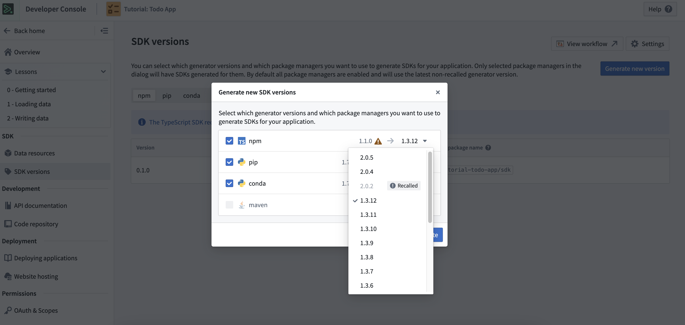

<!-- source: https://palantir.com/docs/foundry/ontology-sdk/typescript-osdk-migration/ · mirrored 2026-08-22 from Palantir Foundry docs -->

# TypeScript OSDK migration guide (1.x to 2.0)

This guide is intended to help you migrate applications using TypeScript OSDK 1.x to TypeScript OSDK 2.0. The sections below explain the differences between the two versions and highlights relevant changes in syntax and structure.

:::callout{theme="neutral"}
TypeScript documentation is also available in-platform in the Developer Console at `/workspace/developer-console/`. Use the version picker to select `2.0` for documentation on TypeScript OSDK 2.0.
:::

## Why upgrade from TypeScript OSDK 1.x to 2.0?

### Performance and scalability

TypeScript OSDK 1.x enables users to interact with the Ontology outside of the Palantir platform. However, this initial version had limited scalability:

* TypeScript OSDK 1.x generates full implementations of code for any object, Action, or other Ontology item. This means that the OSDK 1.x scales with the size of your entire Ontology, which could be very large.
* TypeScript OSDK 1.x closely couples the client to the generated Ontology.

TypeScript OSDK 2.0 provides a number of performance and usability improvements by overhauling the way the SDK is generated and how the Ontology is accessed.

* TypeScript OSDK 2.0 scales linearly with the shape and metadata of your Ontology instead of the actual Ontology. This significantly improves OSDK performance since the OSDK is no longer tied to all of the items in your Ontology. TypeScript OSDK 2.0 also supports lazy loading, meaning that applications only require what they use when they use it.
* TypeScript OSDK 2.0 separates the client from your generated code, which makes it easier to deploy rapid hotfixes by enabling quicker library dependency updates without requiring SDK regeneration. TypeScript OSDK 2.0 also exponentially increases the capability for code reuse through an OSDK codebase.
* TypeScript OSDK 2.0 provides streamlined code generation, which can significantly increase iteration speed when building against large ontologies.

For more details on major design differences between the two versions and the rationale behind them, review the [developer documentation ↗](https://github.com/palantir/osdk-ts/tree/main/dev-docs) in the open-source TypeScript OSDK repository.

### Support and features

The new TypeScript version of the OSDK increases interaction capabilities to the Ontology. Because of this, new feature releases such as [interfaces](/docs/foundry/interfaces/interface-overview/) and [media sets](/docs/foundry/data-integration/media-sets/#media-sets-unstructured-data) will require TypeScript OSDK 2.0.

:::callout{theme="warning"}
Palantir will maintain support for the TypeScript version 1.x of OSDK for at least one year after the release of TypeScript OSDK 2.0.
:::

## How do I upgrade from TypeScript OSDK 1.x to 2.0?

You can generate a new SDK version for an existing Developer Console application using the Typescript OSDK 2.0 generator in the **SDK versions** tab of your application. Existing applications must also have [the required dependencies](#initial-setup) to use the newly generated SDK. New applications created in Developer Console will generate SDKs using the Typescript OSDK 2.0 generator by default, and developers can quickly get started by following the instructions in the **Start developing** tab.



## Migrate from TypeScript OSDK 1.x to 2.0

1. Ensure you have installed [all newly required dependencies ](#initial-setup) in your project.
2. Instantiate a [new TypeScript OSDK 2.0 client](#clientauth).
3. Modify your project's [query calls](#queries), focusing on updating the syntax of calls and tweaking the handling of return types as needed.
4. Modify your project’s [Action calls](#actions). Apart from syntax, the major change here is updating code that may be looking at validation or Action edit responses.
5. Migrate [object types](#objects).
   1. Conduct a thorough review of how OSDK object types are used within your code.
      1. Identify where you rely on the object types generated by the 1.x version of the OSDK, and understand [how they differ](#objects) from the types used by the 2.0 version.
      2. Decide on an [optimal solution path](#solution-paths) for your codebase.
   2. Next, review your OSDK usage and modify object loads to use the new client. Follow the steps in the [objects syntax translation section](#syntax-translations) and note any changes in property types.
6. Review [other differences](#other-differences) between the two versions of the OSDK.

## Initial setup

Install the latest versions of the `@osdk/client` package from npm, or update your project’s `package-lock.json` accordingly.

```bash
npm install @osdk/client
npm install @osdk/oauth
```

## Client/Auth

### Creation

The client in TypeScript OSDK 2.0 is created using the `createClient` function. This function requires an additional parameter named `ontologyRid`. The `ontologyRid` parameter can be passed as a string, read from an environment variable, or dynamically read from the new `$ontologyRid` variable that is generated in your SDK package.

#### TypeScript OSDK 1.x (legacy)

```typescript
import { FoundryClient, PublicClientAuth } from "@your-generated-sdk";

//Public OAuth
const auth = new PublicClientAuth({
        clientId: FOUNDRY_CLIENT_ID,
        url: FOUNDRY_API_URL,
        redirectUrl: APPLICATION_REDIRECT_URL,
    });

const legacyClient = new FoundryClient({
    url: API_PROXY_TARGET_URL,
    auth: auth,
});
```

#### TypeScript OSDK 2.0

```typescript
import { createClient } from "@osdk/client";
import {
    PublicOauthClient,
    createConfidentialOauthClient,
    createPublicOauthClient
} from "@osdk/oauth";
import { $ontologyRid } from "@your-generated-sdk";

// Confidential OAuth
const auth = createConfidentialOauthClient(
    FOUNDRY_CLIENT_ID,
    FOUNDRY_CLIENT_SECRET,
    FOUNDRY_API_URL,
);

// Or

// Public OAuth
const auth = createPublicOauthClient(
    FOUNDRY_CLIENT_ID,
    FOUNDRY_API_URL,
    APPLICATION_REDIRECT_URL
);

const client = createClient(
    FOUNDRY_API_URL,
    $ontologyRid, // See note
    auth
);
```

:::callout{theme="neutral"}
If you install your Ontology’s OSDK through the CLI, your `$ontologyRid` will be exported from the root of the SDK package, which you can access as above. Otherwise, you need to pass in your known `ontologyRid` to where you construct the client. You can get this information from the Ontology Manager in Foundry. Select your desired ontology, navigate to the **Ontology configuration** tab, and copy your Ontology RID from the **Ontology metadata** section.
:::

### Usage and general syntax

#### TypeScript OSDK 1.x (legacy)

In TypeScript OSDK 1.x, you can access methods on the client through a nested object structure. For example:

```
 legacyClient.objects.legacyObject.fetchPage();
```

#### TypeScript OSDK 2.0

In TypeScript OSDK 2.0, the client is now directly invocable. This means you can interface with the client, passing in the objects or Actions you want to work with. The new usage pattern generally follows this syntax:

```
client(myObject).fetchPage()
client($Objects.myObject).fetchPage()
```

## Objects

The primary distinction between object types in TypeScript version 1.x and version 2.0 lies in the different types used to access an object's data. In the 1.x version, you could access an object's properties by interfacing with a `myObject` type. However, in version 2.0, similar functionality to the legacy object type is present in the wrapped type: `Osdk.Instance<myObject>.`

This is reflected in the method return types throughout the SDK. For example, the TypeScript OSDK 1.x page result type is `Page<myObject>`, whereas the TypeScript OSDK 2.0 page result type is `PageResult<Osdk.Instance<myObject>>`.

This creates several different compatibility problems you may face when converting your code.

#### Issue: `Osdk.Instance<myObject>` is not equivalent to `legacyMyObject`

There have been significant changes to the properties within two objects.

* TypeScript OSDK 1.x uses `GeoShape, GeoPoint` while TypeScript OSDK 2.0 uses `GeoJSON`
* TypeScript OSDK 1.x uses `Timestamp, LocalDate` while TypeScript OSDK 2.0 treats those types as `strings`

Imagine you want to replace your object load calls with the new client but do not want to change any of your helper functions that would expect object types from the legacy TypeScript OSDK 1.x. Assume that you are still importing object types from the legacy TypeScript OSDK 1.x; in this case, you will encounter errors due to the two types being incompatible.

```typescript
const objectResult: Result<legacyMyObject, GetObjectError> =
    await legacyClient.ontology.
    objects.legacyMyObject.fetchOne("<primaryKey");

const object = client(myObject).fetchOne("<primaryKey>");
   -> Returns Osdk.Instance<myObjectV2>

const locationName = getObjectLocation(object)

function getLocation(obj: legacyMyObject){...} : Unmodified
```

This is because `Osdk.Instance<myObjectV2>` is not compatible with `legacyMyObject`.

#### Issue: ObjectType ≠ Osdk.Instance<ObjectType>

In TypeScript OSDK 2.0, wrapping an object type in `Osdk.Instance<>` is crucial for accessing various properties. The `Osdk` wrapper elevates these properties to the top level of the type, making it more analogous to legacy types in TypeScript OSDK 1.x.

However, if you modify object type imports to come from TypeScript OSDK 2.0, an issue would occur. Without the `Osdk` wrapper, you would not have top level access to object properties, and the imports would be missing the other fields listed above.

```typescript
const object = client(myObjectV2).fetchOne("<primaryKey>");
    -> returns Osdk.Instance<myObjectV2>
const locationName = getObjectLocation(object)

function getLocation(obj: myObjectV2){ ... }
```

This is because `Osdk.Instance<myObjectV2>` is not compatible with `myObjectV2`.

#### Solution paths

Consider the following ways you can edit your code to use the new OSDK object types in TypeScript OSDK 2.0:

1. **Direct replacement:** Substitute all instances of the legacy object type in your codebase with the corresponding TypeScript OSDK 2.0 object type as you modify object retrievals. This is optimal for simple use cases, but challenging for codebases that heavily use TypeScript OSDK 1.x object types.
2. **Custom frontend types:** Prior to migrating objects to TypeScript OSDK 2.0, refactor your code to use custom frontend types instead of the built-in legacy TypeScript OSDK 1.x types. Then, develop a translator function that maps legacy TypeScript OSDK 1.x types to your custom types. When you commence the migration to TypeScript OSDK 2.0, you will only need to update the translator function, leaving the rest of your codebase intact.

### Syntax translations

This section contains simple examples that illustrate how to map between TypeScript OSDK 1.x and 2.0 clients. For more complex TypeScript OSDK 2.0 syntax examples, refer to the [OSDK examples on Palantir's public GitHub repository ↗](https://github.com/palantir/osdk-ts/blob/main/examples-extra/docs_example/src/osdkExample.tsx).

### Load single objects

#### TypeScript OSDK 1.x (legacy)

```typescript
const objectResult: Result<legacyObject, GetObjectError> =
    await legacyClient.ontology.objects.legacyObject.fetchOneWithErrors("<primaryKey>");
```

#### TypeScript OSDK 2.0

```typescript
const objectResult: Result<Osdk.Instance<myObject>> =
    await client(myObject).fetchOneWithErrors("<primaryKey>");
```

:::callout{theme="neutral"}
You can also use the `fetchOne` method to have the object returned without the result wrapper.
:::

### Load objects with paging

#### TypeScript OSDK 1.x (legacy)

```typescript
const objectResult =
    await legacyClient.ontology.objects.legacyObject.fetchPage({ pageSize: 30 });
```

#### TypeScript OSDK 2.0

```typescript
const objectResult = await client(myObject).fetchPage({ $pageSize: 30 });

const object = objectResult.data[0];
```

### Load all objects

#### TypeScript OSDK 1.x (legacy)

```typescript
const objects: legacyObject[]= [];

for await (const obj of client.ontology.objects.legacyObject.asyncIter()) {
    objects.push(obj);
}
const object = objects.value[0];
```

#### TypeScript OSDK 2.0

```typescript
const objects: myObject[]= [];

for await(const obj of client(myObject).asyncIter()) {
    objects.push(obj);
}
const object = objects.value[0];
```

### Links

#### TypeScript OSDK 1.x (legacy)

```typescript
const object = ...load ontology object with legacy client
const link = object.legacyObjectProperty.fetchPage({ pageSize: 100 });
```

#### TypeScript OSDK 2.0

```typescript
const object = ...load ontology object with new client
const link = object.$link.myObjectProperty.fetchPage({ $pageSize: 100 });
```

### Filtering

#### `WHERE` clauses

##### TypeScript OSDK 1.x (legacy)

```
legacyClient.ontology.objects.legacyObject
    .where(query => query.legacyProperty.startsWith("foo"))...
```

##### TypeScript OSDK 2.0

```
client(myObject).where({
        myObjectProperty: { $startsWith: "foo" }
    })...
```

#### `orderBy` clauses

Order-by clauses are now specified within the object passed to `fetchPage` rather than a separate filter clause.

##### TypeScript OSDK 1.x (legacy)

```
client.ontology.objects.legacyObject
    .orderBy(sortBy => sortBy.OntologyProperty.asc())
    .fetchPageWithErrors({ pageSize: 30 });
```

##### TypeScript OSDK 2.0

```
client(myObject).fetchPage({
        $orderBy: { "OntologyProperty": "asc" }
        $pageSize: 30
    });
```

### Aggregations

TypeScript OSDK 2.0 syntax allows you to pass in an argument for the ordering of your aggregations. This enables you to control the order in which results are returned when specifying a `groupBy` aggregation. The available options are `unordered`, `asc` (ascending), and `desc` (descending).

#### Return the count of objects

##### TypeScript OSDK 1.x (legacy)

```typescript
const aggResults = legacyClient.ontology.objects.legacyObject.where(...).count().compute();
if (isOk(aggResults)) {
    const count: number = aggResults.value;
}
```

##### TypeScript OSDK 2.0

```typescript
const aggResults = client(myObject).where(...).aggregate({
    select: { $count: "unordered" }
    })
const count: number = aggResults.$count;
```

#### Group by (`groupBy`)

##### TypeScript OSDK 1.x (legacy)

```
legacyClient.ontology.objects.legacyObject.where(...)
    .groupBy(legacyObject => legacyObject.imageId.exact)
    .groupBy(legacyObject => legacyObject.objectLabel.exact)
    .count().
    .compute();
```

##### TypeScript OSDK 2.0

```
client(myObject).where(...).aggregate({ $select: { $count: "unordered" },
    $groupBy: { imageId: "exact", objectLabel: "exact" }});
```

### Common aggregations

#### TypeScript OSDK 1.x (legacy)

```typescript
const aggResults = legacyClient.ontology.objects.legacyObject
    .aggregate(obj => ({
        legacyObject: obj.createdBy.approximateDistinct(),
    }))
    .compute();

//OR

const aggResults = legacyClient.ontology.objects.legacyObject
 .approximateDistinct((obj) => obj.legacyProperty)
 .count()
 .compute();

if (isOk(aggResults)) {
    const result = aggregationResults.value;
}
```

#### TypeScript OSDK 2.0

```typescript
const aggregationResults = client(myObject)
    .aggregate({
        $select: { "ObjectProperty:approximateDistinct": "unordered" },
    });

const result = aggregationResults.ObjectProperty;
```

## Actions

### Simple Actions

TypeScript OSDK 2.0's syntax for applying simple Actions is very similar to the legacy TypeScript OSDK 1.x syntax: in both, you call the `applyAction` function.

#### TypeScript OSDK 1.x (legacy)

```
await legacyClient.ontology.actions.createObject({ ...params });
```

#### TypeScript OSDK 2.0

```
await client(createObject).applyAction({ ...params });
```

### Batch Actions

Batch Actions will require a similar syntax change as with simple Actions.

#### TypeScript OSDK 1.x (legacy)

```
await legacyClient.ontology.batchActions.createObject({ ...params });
```

#### TypeScript OSDK 2.0

```
await client(createObject).batchApplyAction({ ...params });
```

### Action validations and edits

If you were validating inputs or receiving `ActionEdits` in OSDK 1.x, you can now define these by specifying `$returnEdits` and `$validateOnly` properties
in the `Options` object. It is not possible to return edits and validateOnly at the same time.

#### TypeScript OSDK 1.x (legacy)

```
await legacyClient.ontology.actions.createObject({ ...params },
    { mode: ActionExecutionMode.VALIDATE_AND_EXECUTE,
    returnEdits: ReturnEditsMode.ALL });

// If you only want to validate
await legacyClient.ontology.actions.createObject({ ...params },
    { mode: ActionExecutionMode.VALIDATE_ONLY });
```

#### TypeScript OSDK 2.0

```
// This call will throw on validation errors
await client(createObject).applyAction({ ...params }, { $returnEdits: true });

await client(createObject).applyAction({ ...params }, { $validateOnly: true });
```

## Queries

The change between TypeScript OSDK 1.x and 2.0 query syntax is very similar to the change for Actions. In TypeScript OSDK 2.0, you can call the `executeFunction` object on your client after you pass in the query that you want to execute.

#### TypeScript OSDK 1.x (legacy)

```
await legacyClient.queries.legacyQuery({ ...params });
```

#### TypeScript OSDK 2.0

```
await client(exampleQuery).executeFunction({ ...params });
```

## Other differences

### `DateTime` handling

The 1.x version of the TypeScript OSDK provided custom types for handling dates and times, such as `LocalDate` and `Timestamp`. TypeScript OSDK 2.0 does not provide concrete types for `DateTime`. Instead, for operations in the OSDK that return and accept `DateTime` values we instead use raw strings in the international standard of [ISO 8601 ↗](https://en.wikipedia.org/wiki/ISO_8601).

The OSDK expects properly formatted ISO 8601 strings when using `DateTime` properties. For example, when filtering an object set using a `where` clause using a `DateTime property`, you must provide a properly formatted string:

```
client(myObject).where({
    "dateTimeProperty": {
        "$gt": "2010-10-01T00:00:00Z",
    }
});
```

`DateTime` values from various OSDK methods will also be returned in this format. For example, when loading objects a DateTime property on an object will be returned with a datetime string.

### Common utilities

#### `OntologyObject`

The `OntologyObject` type is not present in the TypeScript OSDK V2. A contextually equivalent type is the `OsdkBase` type found in the `@osdk/api` package.

#### `IsOntologyObject`

`IsOntologyObject` is not present in TypeScript OSDK V2.
