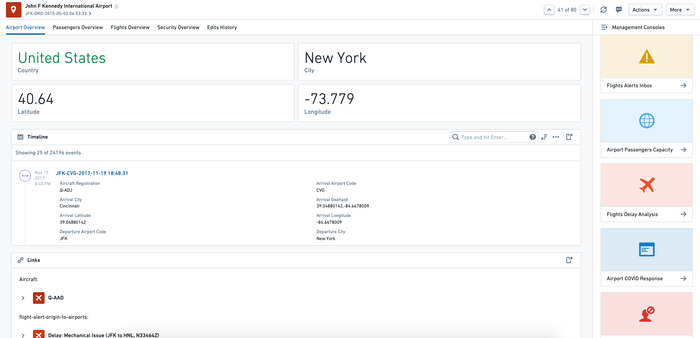
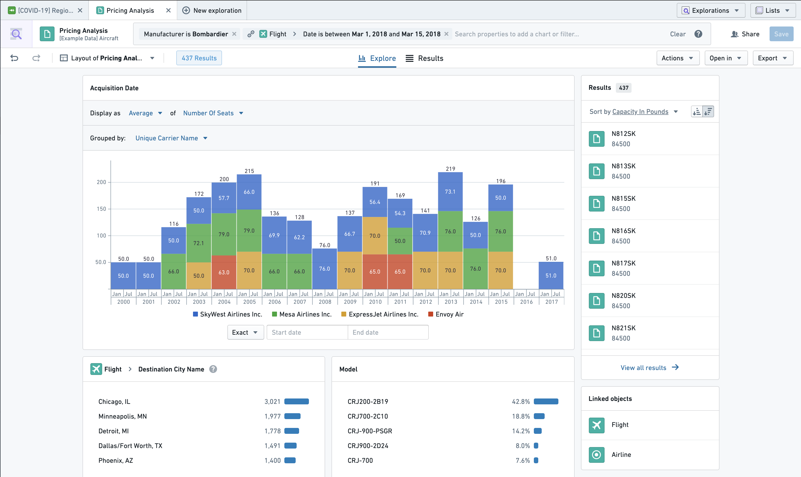
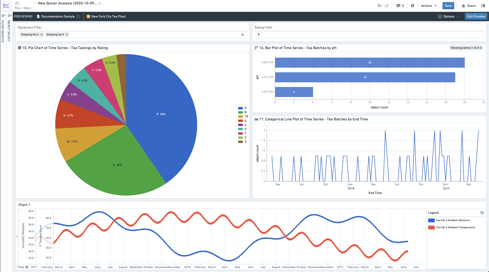
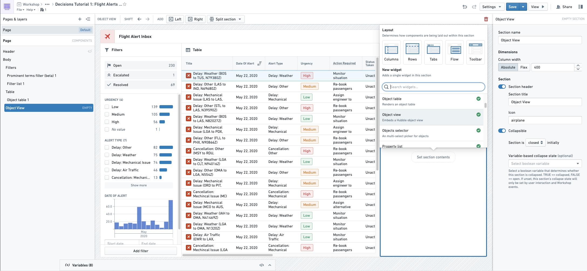
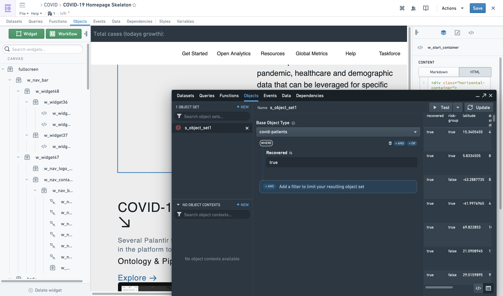
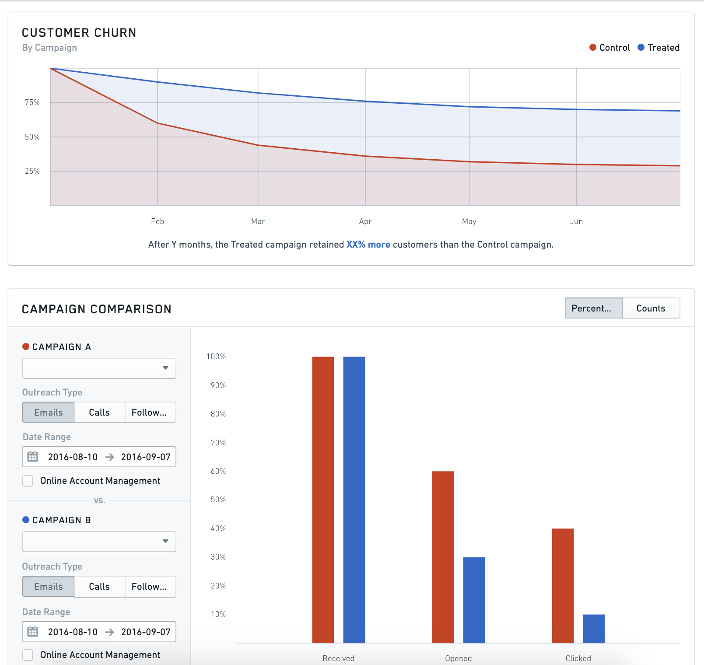
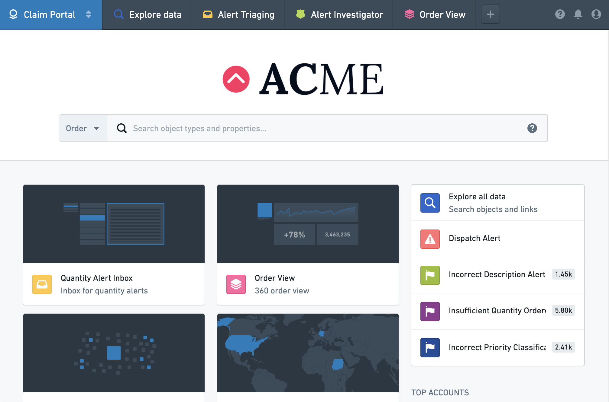
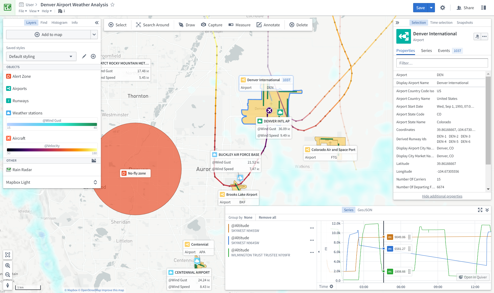

<!-- source: https://palantir.com/docs/foundry/ontology/applications/ · mirrored 2026-08-22 from Palantir Foundry docs -->

# Ontology-aware applications

Foundry contains a number of applications developed to operate natively on top of the Ontology. Together, these object-aware applications deliver a powerful analytical and operational platform that supports a range of use cases and user profiles.

To learn more about why setting up an Ontology and using object-aware applications is valuable, see [this page](/docs/foundry/ontology/why-ontology/).

This page provides a reference to the available applications, and explains when you should use each:

* [Application reference](#application-reference)
* [Application comparison](#application-comparison)

## Application reference

### Object Views

[**Object Views**](/docs/foundry/object-views/overview/) are a central hub for all information and workflows related to a particular object. This includes key "biographical data" about an object, any linked objects, key related metrics, and links to (or embedding of) key analyses, dashboards, and applications related to the object.

For example, the `Airport` object type object view might provide the following information for each `Airport` object:

* Biographical data such as `country`, `city`, `longitude`, `latitude`, etc.
* 360-degree view of all `Aircraft` objects and `Flight` objects linked to the `Airport`
* Embedded `Airport Covid Response` workflow
* Link to a `Root-Cause Analysis` of a `Flight delay` event related to the `Airport`

### Object Explorer

[**Object Explorer**](/docs/foundry/object-explorer/overview/) is a search and analysis tool for answering questions about anything in the Ontology layer. Users can visually compose search queries ranging from simple filters to Search Arounds to find objects of interest. From there, they can explore the resulting object sets using the exploration view or view them as a table of results. Additionally, users can compare and contrast object sets and take bulk Actions (for example, writeback) on the object set. Then, users can export the object sets or open them in compatible applications, such as Workshop.

The exploration view is a set of preset and configurable visualizations (such as charts or maps) that the user can further leverage to drill-down into specific subsets of objects. Object Explorer requires no pre-configuration and is geared towards less technical users.

### Quiver

[**Quiver**](/docs/foundry/quiver/overview/) enables advanced analytical workflows in the Ontology layer through a visual point-and-click interface and a powerful charting library. Quiver can be used to support anything from simple linear drill-down analyses to highly-branched and complex analyses with aggregations and statistical functions. Quiver also supports native time series analysis. Quiver analyses can be templatized into read-only dashboards for broader consumption.

### Workshop

[**Workshop**](/docs/foundry/workshop/overview/) enables point-and-click code-less application-building natively on the Ontology layer. Applications built in Workshop are more dynamic and interactive than typical dashboards created in other point-and-click tools.

By leveraging high-quality [Layouts](/docs/foundry/workshop/concepts-layouts/) and an easy-to-use but sophisticated [Events system](/docs/foundry/workshop/concepts-events/), Workshop applications aim to be as user-friendly and high-quality as custom React applications.

*Workshop Editor View*

*Final Workshop Module*

### Slate

[**Slate**](/docs/foundry/slate/overview/) is a flexible application builder for Foundry that requires more technical configuration and code than Workshop. Slate applications interact with the Ontology layer, but can also interact directly with Foundry datasets. Slate enables significant visual customization based on web development paradigms and has a wide range of available features, but also requires more technical knowledge to build and maintain applications than Workshop.

*Slate Editor View*

*Slate Application View*

### Carbon

[**Carbon**](/docs/foundry/carbon/overview/) enables combining multiple resources or applications in Foundry to create highly curated *workspaces* for operational users. By allowing you to combine analytical results such as dashboards, applications built in Workshop or Slate, and out-of-the-box capabilities such as Object Views and Object Explorer, Carbon enables workflow builders to perform the "last mile" of customization to create a highly tailored and usable experience for end users.

### Map

The [**Map**](/docs/foundry/map/overview/) application allows you to bring together and analyze objects and other data in a geospatial context.

## Application comparison

Each object-aware application varies on a few dimensions. Three particularly important dimensions are:

* the [primary use case(s)](#use-cases),
* the [workflow style](#workflow-style), and
* the [configuration model](#configuration-model) of the application.

| Foundry Application | [Primary use case](#use-cases) | [Workflow Style](#workflow-style) | [Configuration Model](#configuration-model) | Objects or Datasets |
| --- | --- | --- | --- | --- |
|[Object Views](#object-views) | Discovery | Workflow-specific | Walk-up usable | Objects |
|[Object Explorer](#object-explorer) | Discovery & Analysis | Exploratory | Walk-up usable | Objects |
|[Quiver](#quiver) | Analysis & Dashboards | Exploratory (for Analytical mode); workflow-specific (for Dashboard mode) | Walk-up usable (for Analytical mode); customizable (for Dashboard mode) | Objects |
|[Workshop](#workshop) | Applications & Dashboards | Workflow-specific | Customizable | Objects |
|[Slate](#slate) | Applications & Dashboards (complex) | Workflow-specific | Customizable | Objects (recommended) and Datasets |
|[Map](#map) | Geospatial | Exploratory or Workflow-specific | Walk-up usable | Objects |

### Use cases

The main use cases supported by object-aware applications are **Discovery**, **Analysis**, **Dashboards**, and **Applications**.

* **Discovery** enables users to find the right information or workflow. Discovery is primarily enabled through two core features: curated content hubs and search. Curated content hubs (sometimes called landing pages or "360 views") range from a comprehensive standard view for any user to targeted views for a specific set of users or use case. Search functionality supports discovery through free-text search of key words as well as more iterative search through link traversals or drill-downs.
* **Analysis** enables users to answer a broad range of questions. These range from the simple (*what is the average customer retention for a given product?*) to the very complex (*how do three different customer cohorts compare in terms of retention and overall revenue over time, across all products and for each individual product?*). The analytical path is exploratory, meaning that it is defined by the end user themselves and is often highly iterative; as the initial questions are answered, new questions are developed and incorporated into the analysis path.
* **Dashboards** are sets of pre-configured visualizations consumed primarily in a read-only fashion by a broader set of consumer users. Dashboards are often used to turn meaningful *Analyses* into recurring reporting or operational monitoring. Dashboards are characterized by a large number of charts and other visualizations, but are not as customizable or interactive as *Applications* (see below). Dashboards are often parameterized such that users can filter down the visualizations to different subsets of data.
* **Applications** are interactive custom operational interfaces intended for a specific user group to solve a specific problem. Applications are often more complex than dashboards and are oriented at enabling users to follow a specific and on-rails workflow. While the application may contain some curated analytical content (e.g. statistics, charts, graphs, etc.) required to perform a decision, it also typically has several workflow elements and often captures user input (for example, writeback).

### Workflow style

Object-aware applications are optimized for primary workflow styles.

* **Exploratory applications** do not need to be pre-configured by a "builder" user and are used out-of-the-box by end users as soon as data has been modeled into the Ontology. In exploratory applications, the end-user defines their analytical path, and can answer a wide range of questions that are not pre-determined. Exploratory applications typically contain a set of search, visualization, and transformation features to enable this. Object-aware applications that are primarily exploratory include Object Explorer and Quiver.
* **Workflow-specific applications** require pre-configuration by a "builder" user before an end user can actually use them. This is typical of Dashboards or Applications that have two primary user groups: (1) the builder group configuring the specific dashboard or application and (2) the downstream end users for whom the applications are built. Workshop and Slate modules both need to be pre-configured by a "Builder" user in edit mode.

Certain applications like Quiver accommodate both workflow styles because while their primary mode is exploratory, the outputs can be configured into a more broadly consumed workflow-specific artifact. While Quiver Analyses are highly exploratory, they can be published as Quiver Dashboards that are pre-configured analytical views accessible to a broader audience.

### Configuration model

The configuration model describes the extent to which the user interface must be configured before it can be leveraged by an end user.

* **Walk-up usable** applications can be employed effectively and immediately by users, with little to no configuration requirement or maintenance burden. For example, Object Explorer has minimal-to-no configuration requirement, making it immediately usable for end users once an Ontology is defined.
* **Customizable** applications require an upfront investment (often by a separate "builder" user) to implement an interface that solves a particular problem for an end user. It also implies a higher ongoing maintenance cost. However, the resulting application is typically a fit-for-purpose interface that exactly meets the need of the specific workflow. Workshop and Slate are examples of this type of customization.
