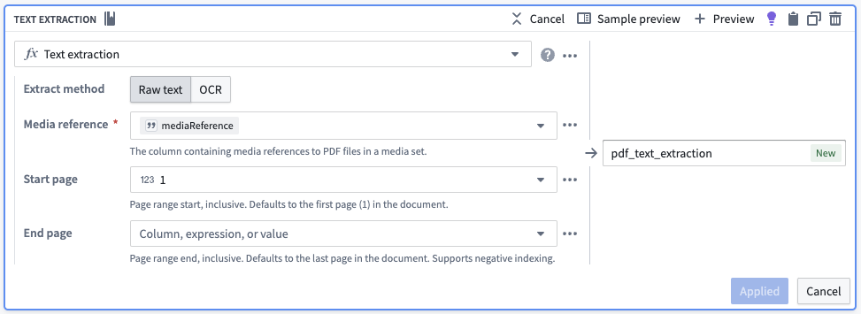
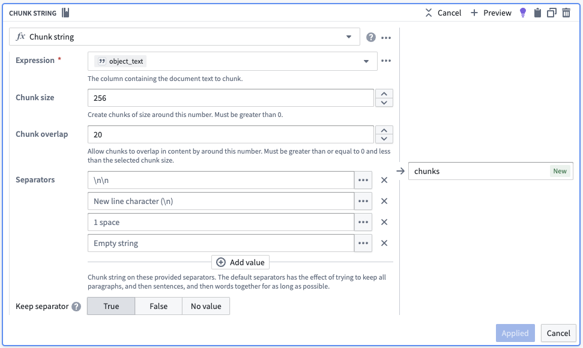
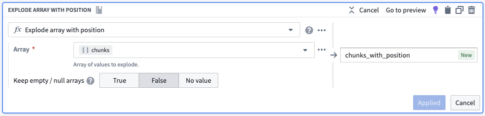
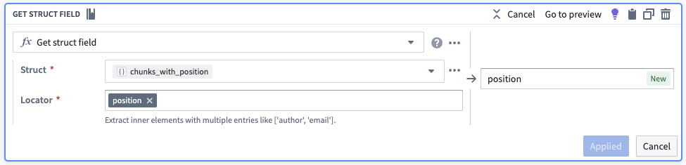
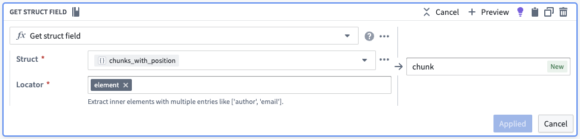
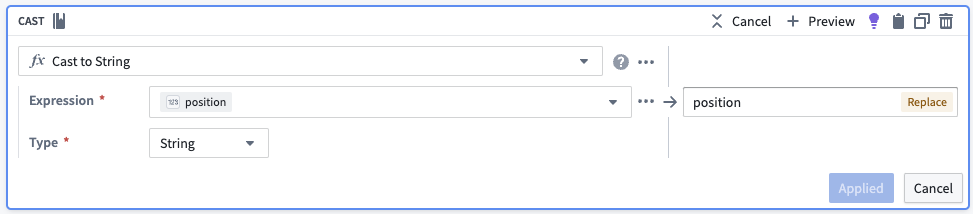
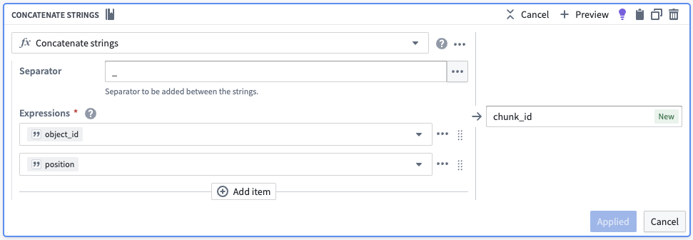

<!-- source: https://palantir.com/docs/foundry/ontology/document-processing/ · mirrored 2026-08-22 from Palantir Foundry docs -->

# Document processing

This page will discuss a few useful considerations for extracting data from a PDF document or image.

## Data extraction

This page offers a basic guide for using [Pipeline Builder](/docs/foundry/pipeline-builder/overview/) to parse PDFs for semantic search and includes a recommendation for presenting the information in a [Workshop](/docs/foundry/workshop/overview/) application when you just have text content.

Semantic search is a powerful tool to use with PDFs, particularly if the content is broken down into smaller "chunks" that are embedded separately, helping users and workflows find important information that might otherwise be hard to access. This is especially useful considering the vast amount of unstructured knowledge in PDFs that often goes unnoticed.

To use, simply upload your PDFs to Foundry, extract the text, chunk the same text, search for those chunks, and surface the results of that search with the corresponding PDF rendered on the side for source-of-truth cross-validation for the users.

Follow the steps outlined below to import PDFs and extract text from PDFs:

1. [Import the PDFs as a media set](/docs/foundry/data-integration/media-sets/).
2. [Add the media set to Pipeline Builder](/docs/foundry/pipeline-builder/datasets-add/#add-data-from-foundry-to-pipeline-builder).
3. Use the **Get Media References** board.

4. Use the **Text Extraction** board.

## Chunking

This page outlines how to incorporate a basic chunking strategy into your [semantic search](/docs/foundry/ontology/overview-semantic-search/) workflows. Chunking, in this context, means breaking up larger pieces of text into smaller pieces of text. This is advantageous because embedding models possess a maximum input length for text, and crucially, smaller pieces of text will be more semantically distinct during searches. Chunking is often used when parsing large documents like [PDFs](#data-extraction).

Primarily, the objective is to split long text into smaller "chunks", each with an associated Ontology object [linked](/docs/foundry/object-link-types/create-link-type/) back to the original object.

:::callout{theme="neutral" title="Where does chunking happen?"}
Chunking is performed by the **Chunk string** board in [Pipeline Builder](/docs/foundry/pipeline-builder/overview/). Add the board from the transform menu, then configure the following arguments:

* **Expression:** The text column you want to split into chunks.
* **Chunk size:** The approximate number of characters in each chunk.
* **Chunk overlap:** The number of characters each chunk shares with the previous chunk, which helps preserve context across chunk boundaries.
* **Separators:** An ordered, prioritized list of separators the board uses to split the text. The board splits on the highest priority separator first and only moves to the next separator when a chunk is still larger than the chunk size.

For the full argument reference, see the [Chunk string](/docs/foundry/pb-functions-expression/chunkStringV1/) function documentation.
:::

## Chunking example

As a starting point, we will show how a basic chunking strategy can be accomplished without using code in [Pipeline Builder](/docs/foundry/pipeline-builder/overview/). For more advanced strategies, we recommend using a [code repository](/docs/foundry/code-repositories/overview/) as part of your pipeline.

For illustrative purposes, we will use a simple two row dataset with two columns, `object_id` and `object_text`. For ease of understanding, the `object_text` examples below are purposefully short.

|object\_id|object\_text|
|---------|--------|
|abc|gold ring lost|
|xyz|fast cars zoom|

We initiate the process by employing the **Chunk String** board, which introduces an extra column containing an array of `object_text` segmented into smaller pieces. The board accommodates various chunking approaches, such as overlap and separators, to ensure that each semantic concept remains coherent and unique.

The below screenshot of a **Chunk String** board shows a simple strategy which you may alter for use toward your own use case. The below configuration would attempt to return chunks that are roughly 256 characters in size. Effectively, the board splits text on the highest priority separator until each chunk is equal to or smaller than the chunk size. If there are no more highest priority separators to split on and some chunks are still too large, it moves to the next separator until either all the chunks are equal or smaller than the chunk size or there are no more separators to use. Finally, the board will ensure that for each chunk identified, the chunk following has an overlap that covers the last 20 characters of the previous chunk.

|object\_id|object\_text|chunks|
|---------|--------|-------|
|abc|gold ring lost|\[gold,ring,lost]|
|xyz|fast cars zoom|\[fast,cars,zoom]|

Next we want each element in the array to have its own row. We will use the **Explode Array with Position** board to transform our dataset to one with six rows. The new column in each of the rows (as seen below) is a struct (map) with two key-value pairs, the position in the array and the element in the array.

|object\_id|object\_text|chunks|chunks\_with\_position|
|---------|--------|-------|----------------------------------|
|abc|gold ring lost|\[gold,ring,lost]|{position:0, element:gold}|
|abc|gold ring lost|\[gold,ring,lost]|{position:1, element:ring}|
|abc|gold ring lost|\[gold,ring,lost]|{position:2, element:lost}|
|xyz|fast cars zoom|\[fast,cars,zoom]|{position:0, element:fast}|
|xyz|fast cars zoom|\[fast,cars,zoom]|{position:1, element:cars}|
|xyz|fast cars zoom|\[fast,cars,zoom]|{position:2, element:zoom}|

From there, we will pull out the position and the element into their own columns.

|object\_id|object\_text|chunks|chunks\_with\_position|position|chunk|
|---------|--------|-------|----------------------------------|--|--|
|abc|gold ring lost|\[gold,ring,lost]|{position:0, element:gold}|0|gold|
|abc|gold ring lost|\[gold,ring,lost]|{position:1, element:ring}|1|ring|
|abc|gold ring lost|\[gold,ring,lost]|{position:2, element:lost}|2|lost|
|xyz|fast cars zoom|\[fast,cars,zoom]|{position:0, element:fast}|0|fast|
|xyz|fast cars zoom|\[fast,cars,zoom]|{position:1, element:cars}|1|cars|
|xyz|fast cars zoom|\[fast,cars,zoom]|{position:2, element:zoom}|2|zoom|

To create a unique identifier for each chunk, we will convert the chunk position in its array to a string and then concatenate it to the original object ID. We will also drop the unnecessary columns.

|object\_id|chunk|chunk\_id|
|---------|-----|--|
|abc|gold|abc\_0|
|abc|ring|abc\_1|
|abc|lost|abc\_2|
|xyz|fast|xyz\_0|
|xyz|cars|xyz\_1|
|xyz|zoom|xyz\_2|

Now, we have six rows representing six different chunks, each with the `object_id` (for linking), the new `chunk_id` to be a new primary key, and the `chunk` to be embedded as described in [semantic search workflow](/docs/foundry/ontology/using-palantir-provided-models-to-create-a-semantic-search-workflow/#generate-embeddings-and-create-object-type). This results in the table as follows:

|object\_id|chunk|chunk\_id|embedding|
|---------|-----|--|--|
|abc|gold|abc\_0|\[-0.7,...,0.4]
|abc|ring|abc\_1|\[0.6,...,-0.2]
|abc|lost|abc\_2|\[-0.8,...,0.9]
|xyz|fast|xyz\_0|\[0.3,...,-0.5]
|xyz|cars|xyz\_1|\[-0.1,...,0.8]
|xyz|zoom|xyz\_2|\[0.2,...,-0.3]
