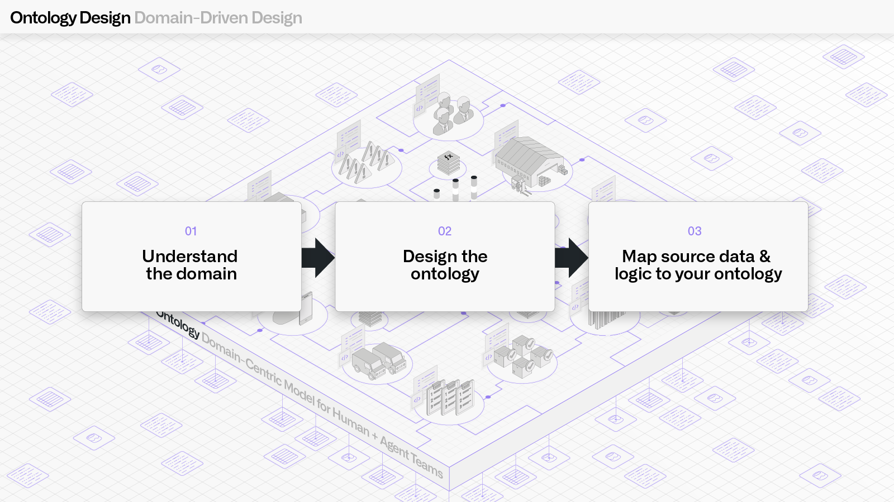
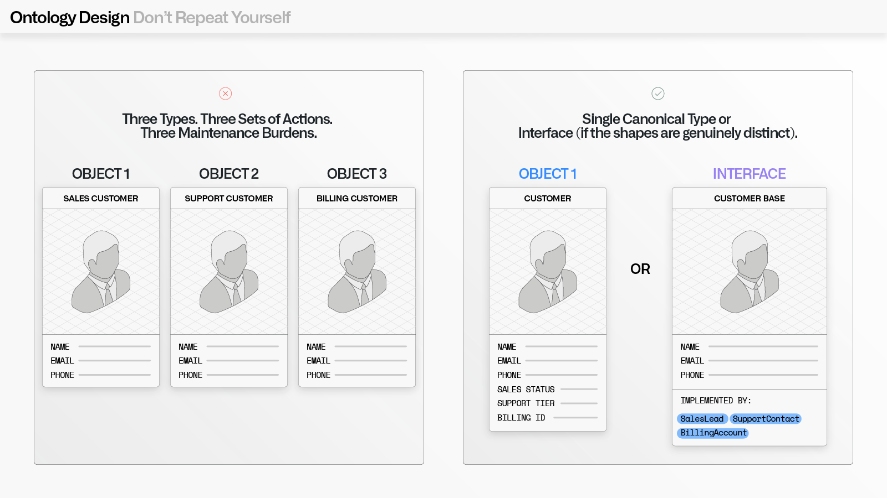
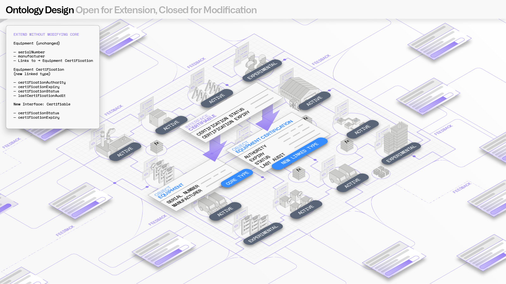
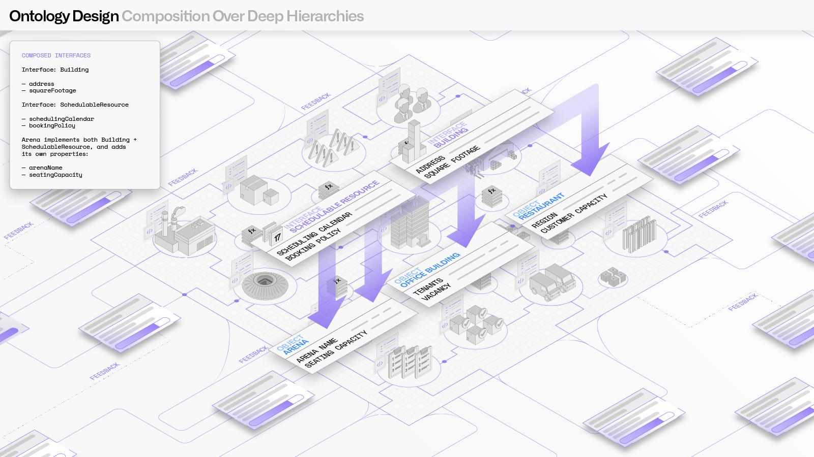

<!-- source: https://palantir.com/docs/foundry/ontology/ontology-best-practices-and-anti-patterns/ · mirrored 2026-08-22 from Palantir Foundry docs -->

# Ontology design: Best practices

A well-designed Ontology creates a unified, intuitive representation of your organization that enables seamless data integration, cross-functional collaboration, and powerful analytics. This section provides both a quick-reference set of design guidelines and a deeper treatment of the core design principles that underpin them.

## Design guidelines

The following guidelines are a practical checklist for Ontology design. Where applicable, each one is grounded in a [core design principle](#core-design-principles), [anti-pattern](/docs/foundry/ontology/ontology-anti-patterns/), or [structural recommendation](/docs/foundry/ontology/ontology-structural-guidance/).

1. **Model reality, not systems:** Object types should represent real-world entities, not individual source system or department representations.
   * **Design principle:** [Domain-driven design](#1-domain-driven-design)
2. **Curate intentionally:** Every property should have clear business or technical value.
   * **Structural recommendation:** [Normalization and derived properties](/docs/foundry/ontology/ontology-structural-guidance/#normalization-and-derived-properties)
3. **Collaborate across teams:** Ontology design should involve stakeholders from multiple departments or teams. Siloed teams are a leading cause of duplication.
   * **Design principle:** [Do not repeat yourself](#2-do-not-repeat-yourself-rule-of-three)
4. **Keep object types focused:** Each object type should represent one distinct entity.
   * **Design principle:** [Domain-driven design](#1-domain-driven-design)
5. **Choose the right tool:** Use action types for human or agentic decisions and pipelines for automated transformations.
   * **Anti-pattern:** [The Golden Hammer](/docs/foundry/ontology/ontology-anti-patterns/#anti-pattern-the-golden-hammer)
6. **Use interfaces for abstraction:** When entities share common characteristics, model the abstraction with interfaces rather than creating wide, sparse object types.
   * **Design principle:** [Composition over deep hierarchies](#4-composition-over-deep-hierarchies)
7. **Document your decisions:** Document object types, properties, and links in Ontology Manager.

## Core design principles

These four principles are derived from extensive field experience across government and commercial implementations. They are presented in priority order. In cases of conflict, higher-priority principles take precedence.

| Priority | Principle | Core idea |
|-------------|-------------|----------|
|1	|[Domain-driven design](#1-domain-driven-design)	|Model the real world, not the source data.|
|2	|[Do not repeat yourself](#2-do-not-repeat-yourself-rule-of-three)	|If you built the same thing three times, refactor.|
|3	|[Open for extension, closed for modification](#3-open-for-extension-closed-for-modification)	|Protect core models. Enable builders to extend them.|
|4	|[Composition over deep hierarchies](#4-composition-over-deep-hierarchies)	|Favor multiple inheritance via interfaces. Keep things pluggable.|

Practical considerations should always factor into any decision. Review the section on [pragmatism and tradeoffs](#pragmatism-and-tradeoffs) for more information.

### 1. Domain-driven design



**The Ontology models the real world, not the source data.**

Objects should represent semantically meaningful real-world concepts (such as a `Patient`, a `WorkOrder`, or a `Vessel`) not database tables, API responses, or spreadsheet tabs. Links should represent real relationships ("this patient visited this facility"), not join keys or foreign key artifacts.

When asked to "ontologize a dataset", resist the urge to map columns 1:1 to properties and consider the work complete. The [Kitchen Sink](/docs/foundry/ontology/ontology-anti-patterns/#anti-pattern-the-kitchen-sink) anti-pattern produces an Ontology that mirrors source system schema quirks rather than useful semantics. A well-designed Ontology should feel intuitive to use; a user, or an AI agent, should be able to navigate it without friction, because the structure matches how they already think about their domain.

#### Anti-patterns

* Object types mirror source system tables rather than domain entities
* Properties are mapped 1:1 from source columns without curation
* Names come from source system conventions (`dtLastInspMod`) rather than business language (`lastInspectionDate`)
* The object model was designed by looking at the data rather than understanding the domain
* A single source row containing multiple entities is modeled as a single object type

#### Example

A CSV with columns `order_id`, `customer_name`, `customer_email`, `product_sku`, and `quantity` describes at least three real-world entities, not one:

```
✗ Avoid                                    ✓ Prefer
────────────────────────────────────────   ────────────────────────────────────────
OrderData                                  Order
  - order_id                                 - order_id
  - customer_name                            - quantity
  - customer_email                →          - Links to → Customer, Product
  - product_sku
  - quantity                               Customer
                                             - name
(One object type mirroring the CSV)          - email

                                           Product
                                             - sku

                                           (Three object types modeling the domain)
```

#### Impact of anti-patterns

|Problem	|Impact|
|-|-|
|Unintuitive model	|Users and AI agents cannot navigate the Ontology naturally because the structure does not match how they think about the domain.|
|Fragile coupling to source	|Schema changes in source systems break Ontology consumers because the Ontology mirrors source structure rather than abstracting over it.|
|Missed relationships	|Entities embedded as columns (like `customer_name` on an order) cannot be linked, searched, or reasoned about independently.|
|Poor reuse	|Object types shaped by one system's schema are difficult for other teams or use cases to adopt.|

#### Best practices

1. **Identify real-world entities before looking at source schemas:** Work with domain stakeholders to define what concepts matter. A single dataset often describes multiple entities.
2. **Separate identity from observation:** If a row represents a measurement or event about an entity, the entity and the observation are likely different object types.
3. **Name things for humans:** API names should be intuitive and self-documenting. Prefer `person.children` over `person.linkedChildPersonObjects`. Prefer `equipment.lastInspectionDate` over `equipment.dtLastInspMod`.
4. **Model the domain, then map the data:** Understand the domain, then design the object model, then map source data into that model. Do not attempt to look at the data and replicate its shape.
5. **Mark non-semantic types as hidden:** When non-semantic types (types that serve a technical purpose rather than modeling real-world domain entities) are necessary for specific workflows, mark them as hidden to keep default views of the Ontology clean. They remain available for builders to leverage when building applications.

### 2. Do not repeat yourself (rule of three)



**If you built the same thing three times, refactor.**

Duplicated object types, redundant properties, and copy-pasted workflows are a maintenance burden and a context-management problem, for both humans and AI agents that need to reason about the Ontology. The goal is a single canonical representation for each concept, with a single canonical workflow for each operation on that concept. The rule of three is a practical trigger for applying this principle: one instance is a coincidence, two is a pattern, and three means it is time to refactor.

#### Anti-patterns

* Multiple object types share the same set of properties and similar links
* The same derived property logic or action logic appears across multiple types
* Different teams have created near-identical object types for slightly different purposes
* Copy-pasted workflows exist with minor variations across types

#### Example

Three teams have independently created customer-related object types with overlapping schemas:

```
✗ Avoid                                    ✓ Prefer
────────────────────────────────────────   ────────────────────────────────────────
Sales Customer                             Customer (single canonical type)
  - name                                     - name
  - email                                    - email
  - phone                                    - phone
                                             - salesStatus
Support Customer                   →         - supportTier
  - name                                     - billingAccountId
  - email
  - phone                                 — OR, if shapes are genuinely distinct —

Billing Customer                           Interface: CustomerBase
  - name                                     - name
  - email                                    - email
  - phone                                    - phone

(Three types, three sets of actions,       Implemented by: SalesLead, SupportContact,
 three maintenance burdens)                BillingAccount
```

#### Impact of anti-patterns

|Problem	|Impact|
|-|-|
|Maintenance burden	|Changes must be replicated across every duplicate. Missed updates cause drift between copies.|
|Ambiguous context	|Users and AI agents cannot determine which of several near-identical types is canonical.|
|Inconsistent behavior	|Duplicated action or derived property logic diverges over time, producing conflicting results.|
|Wasted development effort	|Teams re-build the same thing in slightly different forms instead of collaborating on one shared model.|

#### Best practices

1. **Audit for duplicates:** If multiple object types share a common shape (same properties, similar links, similar actions), evaluate whether they should be a single type with a distinguishing property or should implement a shared interface.
2. **Consolidate shared logic:** If the same derived property or action logic appears across multiple types, extract it into an interface or shared function.
3. **Unify team-specific copies:** When different groups have created near-identical object types, unify them into a single canonical representation with appropriate security or filtering.
4. **Apply the rule of three:** One duplicate can be acceptable. Two is a warning sign. Three means it is time to refactor.

### 3. Open for extension, closed for modification



**Protect core models. Enable builders to extend them.**

Once an object type, interface, or workflow is field-tested and in production, its core structure should be stable. Other developers and teams in the organization should be able to build on top of it, adding new object types that implement an interface or new workflows that consume existing objects, without needing to modify the core model.

#### Anti-patterns

* Frequent breaking changes to established object types that cascade across dependent applications
* New use cases require modifying existing core types rather than extending them
* Teams need to edit shared interfaces or actions to accommodate team-specific needs
* Security changes for one team's extension inadvertently affect other consumers

#### Example

A core `Equipment` object type and `Inspectable` interface are in production. A new team needs to track certification data for some equipment:

```
✗ Avoid                                    ✓ Prefer
────────────────────────────────────────   ────────────────────────────────────────
Modify the core Equipment type:            Extend without modifying core:

Equipment                                  Equipment (unchanged)
  - serialNumber                             - serialNumber
  - manufacturer                             - manufacturer
  - certificationAuthority   (new)   →       - Links to → Equipment Certification
  - certificationExpiry      (new)
  - certificationStatus      (new)         Equipment Certification (new linked type)
  - lastCertAudit            (new)           - certificationAuthority
                                             - certificationExpiry
(Four new properties, null for all           - certificationStatus
 non-certified equipment, existing           - lastCertificationAudit
 consumers must handle the change)
                                           New interface: Certifiable
                                             - certificationStatus
                                             - certificationExpiry

                                           (Core type untouched, new capability
                                            added via linked type and interface)
```

#### Impact of anti-patterns

|Problem	|Impact|
|-|-|
|Breaking changes	|Modifications to core types can break dependent applications, actions, and workflows across the organization.|
|Scope creep	|Core types accumulate properties and logic for every new use case, trending toward a [God Object](/docs/foundry/ontology/ontology-anti-patterns/#anti-pattern-the-god-object).|
|Entangled ownership	|Multiple teams modify the same core type, creating merge conflicts and unclear accountability.|
|Security leakage	|Extending a core type without clean boundaries can inadvertently widen data access.|

#### Best practices

1. **Identify what is essential:** Determine which properties and links are truly fundamental to the entity. Lock those down.
2. **Design for extension:** When creating core types and interfaces, anticipate that others will build on them. Leave room for linked extension types and new interface implementations.
3. **Extend rather than modify:** When adding to an existing model, consider if the addition belongs on the core type, or on an extension (a new linked object type, a new interface implementation, or a new property namespace).
4. **Enforce security boundaries:** Core data models should have well-defined security boundaries so that extending the Ontology does not inadvertently widen access.

### 4. Composition over deep hierarchies



**Favor multiple inheritance via interfaces. Keep things pluggable.**

Foundry's Ontology supports multiple inheritance through interfaces, so an entity can compose behavior from multiple focused abstractions instead of a single-inheritance chain.

#### Anti-patterns

* Deep single-inheritance chains where child types exist solely to combine parent capabilities
* "Combination" types like `SchedulableBuilding` or `InspectableVehicle` that merge two unrelated concepts into one type
* Workflows are tightly coupled to specific object types when they could operate on a shared interface
* Adding a new capability to an entity requires restructuring the inheritance chain

#### Example

An `Arena` needs to be both a building and a schedulable resource:

```
✗ Avoid                                    ✓ Prefer
────────────────────────────────────────   ────────────────────────────────────────
Deep single-inheritance:                   Composed interfaces:

Asset                                      Interface: Building
  └── PhysicalAsset                          - address
        └── Building                         - squareFootage
              └── SchedulableBuilding
                    └── Arena              Interface: SchedulableResource
                                             - schedulingCalendar
(Every new combination of capabilities       - bookingPolicy
 requires a new intermediate type.
 A SchedulableWarehouse would need         Arena implements both:
 yet another branch.)                        Building + SchedulableResource
                                             - arenaName
                                             - seatingCapacity

                                           (Adding SchedulableWarehouse only
                                            requires implementing the same two
                                            interfaces — no new hierarchy needed.)
```

#### Impact of anti-patterns

|Problem	|Impact|
|-|-|
|Combinatorial explosion	|Every new combination of capabilities requires a new intermediate type in the hierarchy.|
|Brittle hierarchies	|Changes to a parent type cascade unpredictably through all descendants.|
|Limited reuse	|Workflows built on a specific type deep in the chain cannot be reused for other types that share the same capability.|
|Semantic distortion	|Contrived parent types (like `SchedulableBuilding`) do not represent real-world concepts, violating the [domain-driven design principle](#1-domain-driven-design).|

#### Best practices

1. **Design interfaces around capabilities or roles:** Use focused interfaces like `Inspectable`, `Schedulable`, `Billable`, or `Depreciable` that capture a specific behavior or property set.
2. **Use taxonomic interfaces for aggregation:** Taxonomic identity interfaces (for example, `MilitaryAsset` implemented by `Aircraft`, `Vessel`, `GroundVehicle`) are particularly useful for drilldown investigations or similar aggregation workflows.
3. **Target interfaces in workflows:** When building actions, functions, and applications, target interfaces where possible. A workflow built on the `SchedulableResource` interface works for arenas, conference rooms, and vehicles without modification.
4. **Compose rather than inherit:** When an entity needs multiple capabilities, implement multiple interfaces rather than inserting it into a deep single-inheritance chain.

## Pragmatism and tradeoffs

**These principles are guides, not laws.**

Real-world constraints, including deadlines, legacy systems, partial platform support, and user skill levels, mean that the ideal Ontology design is not always immediately achievable. Use the following guidelines to navigate tradeoffs:

|Guideline	|Detail|
|-|-|
|Steer toward good design without being a roadblock	|If something needs to be working within a tight deadline, build something reasonable now with a clear path to improvement.|
|Name the tradeoffs explicitly	|When recommending a shortcut, explain what is being traded away and when it might matter. For example, a denormalization could work fine at your current scale, but if you grow past 10k objects, you may want to revisit.|
|Prefer incremental improvement over big-bang refactors	|A slightly imperfect Ontology that is in use and generating value is better than a theoretically perfect one that is still being designed.|
|Defend the critical invariants	|Naming quality, semantic clarity, and security design are hard to fix later. Cut corners on implementation details, not on these.|

The Ontology is the software that powers your organization. Treat it with the same care you would give to a production codebase, but prioritize business value over perfection.
