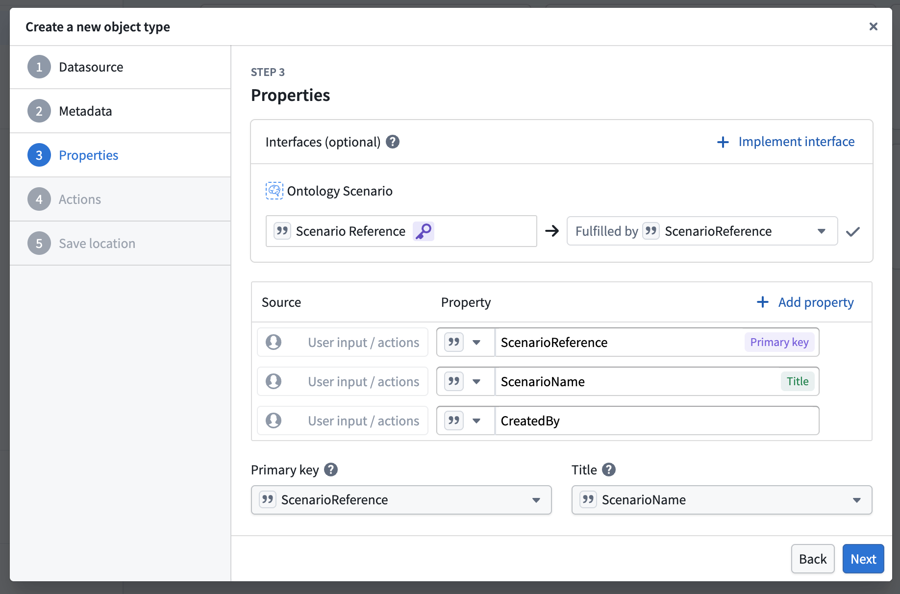
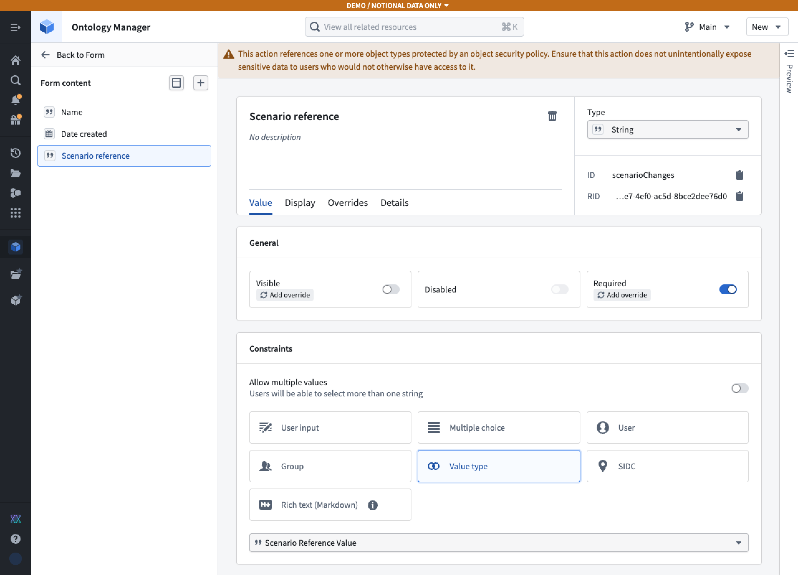
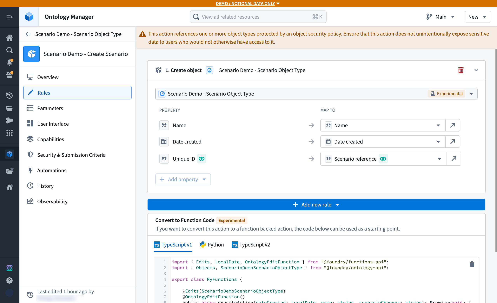
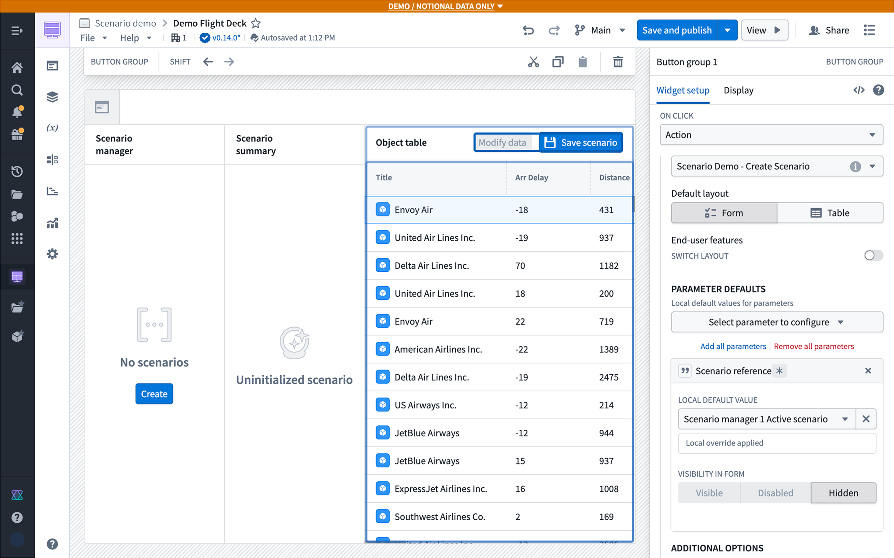
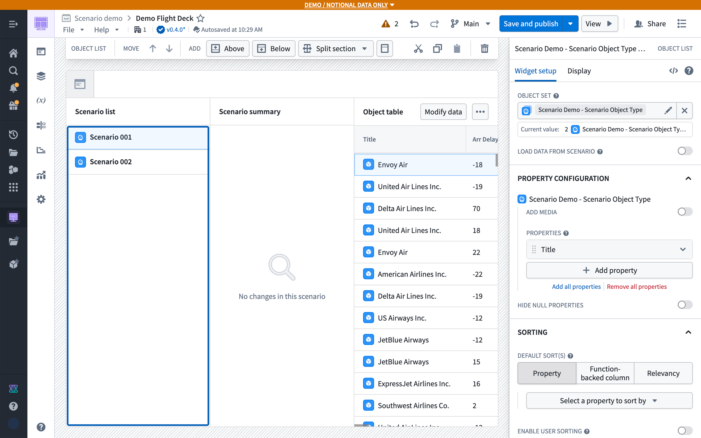
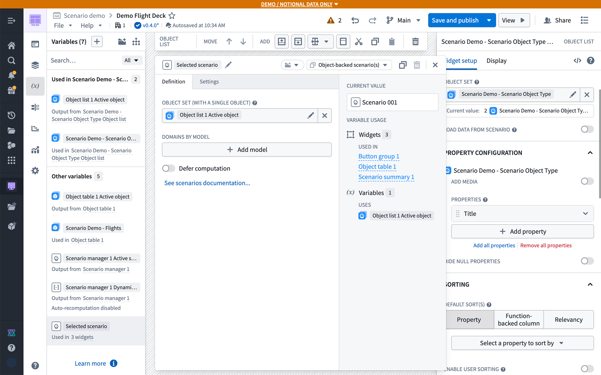
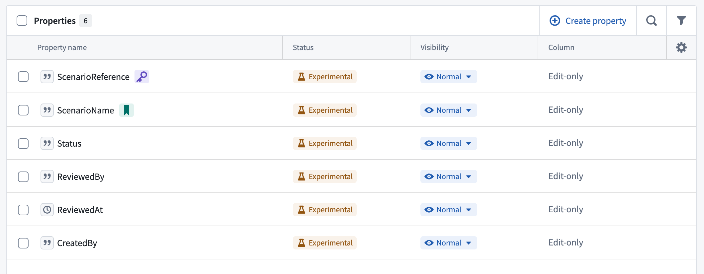
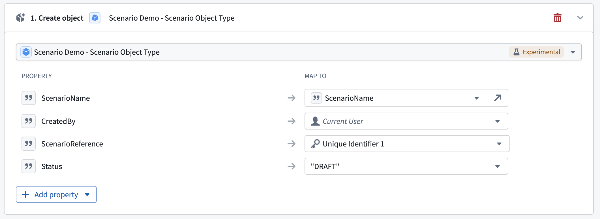
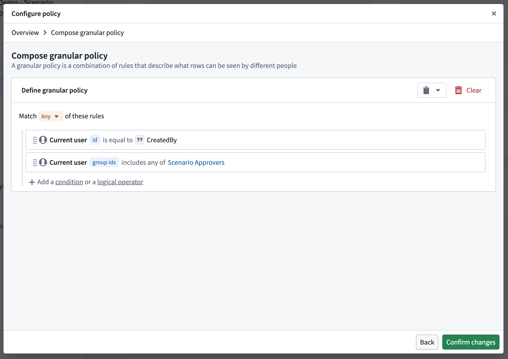

<!-- source: https://palantir.com/docs/foundry/ontology/persisted-scenario/ · mirrored 2026-09-04 from Palantir Foundry docs -->

# Store scenario metadata as objects

:::callout{theme="neutral" title="Beta"}
Ontology scenarios are in the [beta](/docs/foundry/platform-overview/development-life-cycle/) phase of development and may not be available on your enrollment. Contact Palantir Support for access to the Ontology scenario interface.
:::

You can define and store metadata of a scenario in the Ontology, where each object represents a scenario, to create a **persisted** scenario.

When stored in the Ontology, scenarios are shareable and collaborative. Teams can compare multiple persisted scenarios side-by-side, attach rich metadata including descriptions and authorship, and link scenarios to related objects for easy organization. Persisted scenarios inherit Foundry's permissions and governance model, ensuring proper access control, and create a durable audit trail of the decision-making process.

## Configure scenario object type

To configure the scenario object type in Ontology Manager, follow the steps below:

1. In Ontology Manager, navigate to the **Object types** tab and select **+ New object type**.

2. Follow the configuration wizard. At step 3 (**Properties**), choose to **Add** an interface, then search for the **Ontology Scenario** interface. Ensure that **Scenario Reference** is mapped to the primary key of your object type, then complete the remaining steps.   
      

3. Once the new object type is created, open the **Properties** tab and confirm that the **Primary Key** property has a value type of **Scenario Reference** assigned to it.

4. Optionally, add additional properties to store metadata about the scenario, such as **Created By** or **Description**. Save the configuration and wait for the initial sync to complete.

## Configure create/save action

1. In Ontology Manager, locate your Scenario Object Type. If you did not configure a **Create Object** action during the initial setup, select **+ New** in the **Action types** card to create one.

2. Within the **Create Object** action configuration, add an additional parameter of type **String**. In the **Constraints** card, set the value type to **Scenario Reference Value**. Then disable the **Visibility** toggle to hide the parameter from end users.   
      

3. In the **Rules** tab of the Action configuration page, ensure the **Unique ID** property is mapped to the new **Scenario Reference** parameter.   
      

## Persist an existing temporary scenario

Before proceeding, ensure you have completed the [temporary scenario configuration tutorial](/docs/foundry/ontology/temporary-scenario/). Once your first temporary scenario is in place, follow these steps in Workshop:

1. Add a **Button Group** widget to your application to handle saving the scenario.

2. Set the button's action to the **Create Object** action configured on your Scenario Object Type.

3. In the **Default Value** configuration, set the **Scenario Reference** parameter to be populated by the Active Scenario variable generated by the **Scenario Manager** widget.   
      

## Create new scenario object

Make the following adjustments in Workshop to display persistent scenarios:

1. In the **Create or Save Scenario** action, the **Scenario reference** parameter does not require a default value; it will be auto-generated upon action execution.

2. Replace the **Scenario Manager** widget with an **Object List** widget (or any other object display widget) configured to list your persisted Scenario objects.

3. Set the **Scenario Object Type** as the data source for the newly added widget.   
      

4. Replace the **Active Scenario** variable with an **Object-backed scenario** variable, and set its value to the **Active Object** from the **Object List** widget. You should update the variable selection in other widgets.   
      

## Control access to and govern persisted scenarios

To control who can view and edit persisted scenarios and to govern review workflows, use object properties, [object security policies](/docs/foundry/object-permissioning/object-security-policies/), and [action submission criteria](/docs/foundry/action-types/submission-criteria/). These controls are available because each persisted scenario is represented by an object.

For example, a team can configure a scenario approval workflow in which:

* Scenario owners can view their scenarios and submit drafts for review.
* Members of an [approvals group](/docs/foundry/security/users-and-groups/#groups) can view all scenarios and approve or reject scenarios that are in review.
* Other users cannot view the persisted scenario objects.

To do so:

1. In Ontology Manager, add the following properties to the scenario object type:

   * **Created By:** Identifies the scenario owner.
   * **Status:** Tracks whether the scenario is `Draft`, `In review`, `Approved`, or `Rejected`.
   * **Reviewed By:** Optionally records the reviewer.
   * **Reviewed At:** Optionally records when the review occurred.   
        
     In the **Create Object** action, use action rules to set **Created By** to **Current user** and **Status** to the static value `Draft`.   
        

2. Navigate to the **Security** tab on the scenario object type, and configure an object security policy that allows access when either of the following conditions is true:

   * The current user's ID matches the scenario object's **Created By** property.
   * The current user's group IDs include the approvals group.

   When defining the policy, reference the approvals group by its stable group ID rather than by its name, so the policy is unaffected if the group is renamed. Users must also have permission to view the scenario object type definition.   
      

3. Configure the scenario object type to **Only allow edits via actions**. Then create separate actions for each permitted status transition:

   | Action | Result | Submission criteria |
   | --- | --- | --- |
   | **Submit for review** | Change `Draft` status to `In review`. | The current user matches **Created By**, and the current status is `Draft`. |
   | **Approve scenario** | Approve the scenario, change `In review` status to `Approved`, and optionally populate **Reviewed By** and **Reviewed At**. | The current user's group IDs include the approvals group, and the current status is `In review`. |
   | **Reject scenario** | Change `In review` status to `Rejected`, and optionally populate **Reviewed By** and **Reviewed At**. | The current user's group IDs include the approvals group, and the current status is `In review`. |

   Optionally, for the **Approve scenario** action, add an **Apply Scenario** rule to the action so that approval and [merging the scenario](/docs/foundry/ontology/merge-scenario/) occur through the same governed action.
