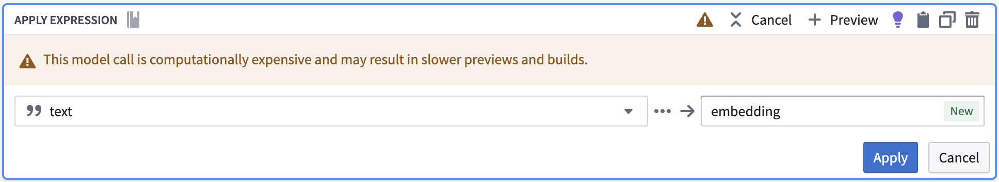
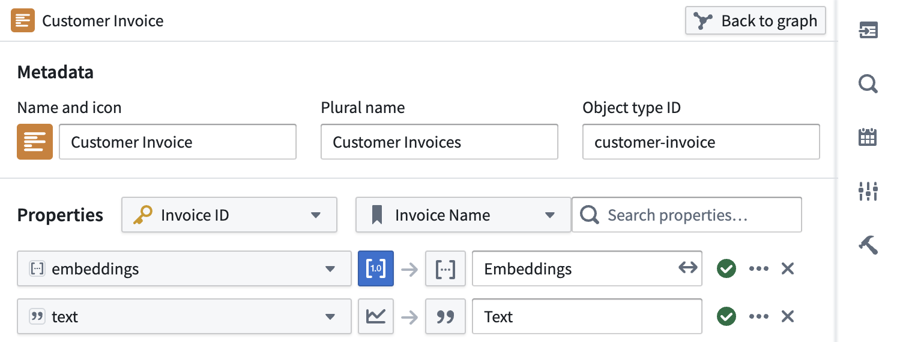
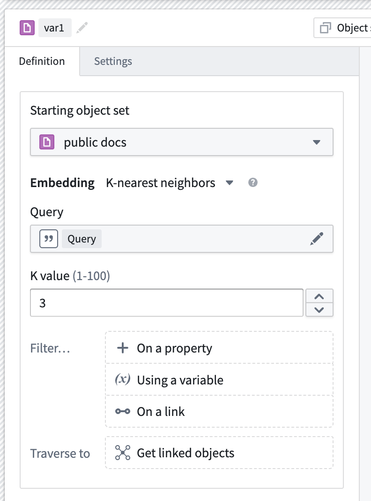
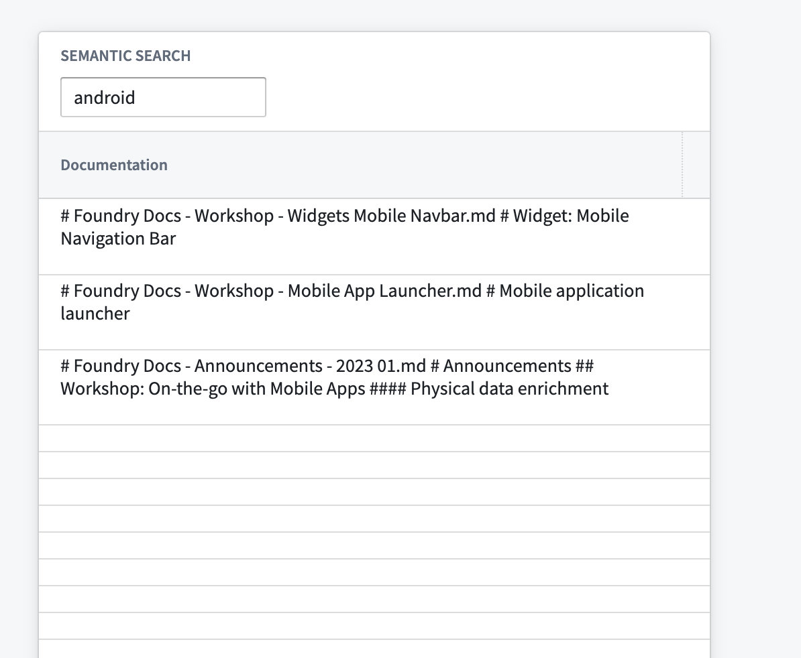
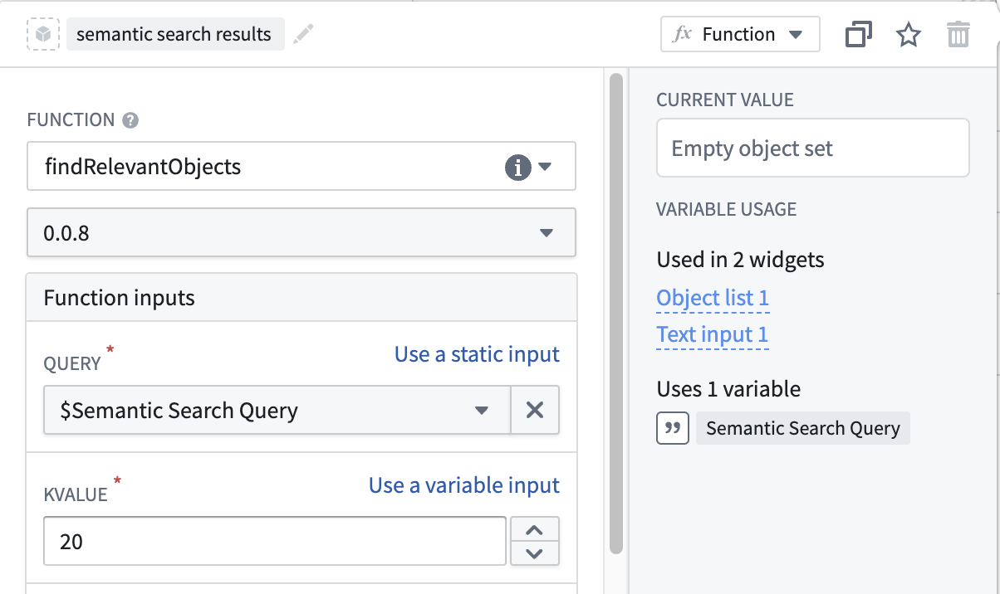

<!-- source: https://palantir.com/docs/foundry/ontology/using-palantir-provided-models-to-create-a-semantic-search-workflow/ · mirrored 2026-08-22 from Palantir Foundry docs -->

# Use Palantir-provided models to create a semantic search workflow

:::callout{theme="neutral"}
To use Palantir-provided language models, [AIP must first be enabled on your enrollment](/docs/foundry/aip/enable-aip-features/). You also must have permissions to use [AIP developer capabilities](/docs/foundry/platform-overview/aip-capabilities/). Using a custom model? Review [Using custom models to create a semantic search workflow](/docs/foundry/ontology/using-custom-models-to-create-a-semantic-search-workflow/) instead.
:::

This page illustrates the process of building a notional end-to-end semantic search workflow using a [Palantir-provided embedding model](/docs/foundry/aip/supported-llms/).

## Instructions

To begin, you need to generate embeddings and store them in an object type with a [`vector` type](/docs/foundry/object-link-types/property-metadata/#property-base-types-with-limited-support). Then, you can set up a semantic search workflow in [Workshop](/docs/foundry/workshop/overview/), build an [AIP Chatbot Workshop widget](/docs/foundry/workshop/widgets-aip-chatbot/) solution, or create a custom semantic search function for use in [Workshop](/docs/foundry/workshop/overview/) and [AIP Logic](/docs/foundry/logic/overview/).

Prerequisite:

* [Generate embeddings and create object type](#generate-embeddings-and-create-object-type)

Options:

* [Create a simple semantic search workflow within Workshop using a KNN object set (no-code)](#create-a-simple-semantic-search-workflow-within-workshop-using-a-knn-object-set-no-code)
* [Enable an AIP Chatbot to semantic search for objects (no-code)](#use-aip-chatbot-no-code)
* [Create a function to semantically search across objects for use in Workshop and/or AIP Logic](#create-a-function-to-semantically-search-across-objects-for-use-in-workshop-andor-aip-logic)

## Generate embeddings and create object type

We will use [Pipeline Builder](/docs/foundry/pipeline-builder/overview/) to embed text in the dataset as vectors with the [**Text to Embeddings** expression](/docs/foundry/pipeline-builder/pipeline-builder-aip/#text-to-embeddings). The expression takes a string and converts it to a vector using one of the Palantir-provided models; in our case, this is the `text-embedding-ada-002` embedding model.



These embeddings can then be added to the Ontology as a vector property.



If you would like more control around the generation of embeddings using Palantir-provided models, see [Language models within Python transforms](/docs/foundry/transforms-python-spark/palantir-provided-models/#embeddings).

## Create a simple semantic search workflow within Workshop using a KNN object set (no-code)

:::callout{theme="neutral"}
The KNN object set cannot be sorted by relevancy. If you need ordered results, use the [function approach](#create-a-function-to-semantically-search-across-objects-for-use-in-workshop-andor-aip-logic).
:::

Configuring a [KNN object set](/docs/foundry/functions/api-object-sets/#k-nearest-neighbors-knn) within [Workshop](/docs/foundry/workshop/overview/) is an easy no-code way to build a semantic search workflow.

1. Create an object set [variable](/docs/foundry/workshop/concepts-variables/) and select the object type that contains an embedding property.
2. Select the filter `+ On a property` option, then from the list of properties in the menu, select your embedding property.
3. Once selected, the K-nearest-neighbors configuration should appear. If this configuration does not appear, verify that the property you selected is an embedding property.



Within this panel, you can configure:

* **K-value:** A number between 1-100 for how many objects to return in the semantic search.
* **Query:** The string variable to use as a query when performing the semantic search.

4. Next, create a [text input](/docs/foundry/workshop/widgets-text-input/) widget and add its output variable to the KNN query option seen above.
5. Lastly, add an [object table](/docs/foundry/workshop/widgets-object-table/) widget and configure its input variable to be the newly created [KNN object set](/docs/foundry/functions/api-object-sets/#k-nearest-neighbors-knn).



For more customized semantic search logic, see the [section on functions](#create-a-function-to-semantically-search-across-objects-for-use-in-workshop-andor-aip-logic).

## Use AIP Chatbot (no-code)

AIP Chatbots (formerly AIP Agents) created in [AIP Chatbot Studio](/docs/foundry/chatbot-studio/overview/) are good for beginning semantic searches across your objects because they do not require any code. Learn more about [incorporating semantic search with more control over the functionality](#create-a-function-to-semantically-search-across-objects-for-use-in-workshop-andor-aip-logic).

Follow the instructions on the [getting started](/docs/foundry/chatbot-studio/getting-started/) guide to create an AIP Chatbot and either add [Ontology context](/docs/foundry/chatbot-studio/retrieval-context/#ontology-context) or an **Ontology semantic search** [tool](/docs/foundry/chatbot-studio/tools/#types-of-tools). This initial setup will enable you to ask the AIP Chatbot to semantically search the objects.

## Create a function to semantically search across objects for use in Workshop and/or AIP Logic

We can [create a typescript repository](/docs/foundry/functions/getting-started/) and create a function to query our object type. The overall goal is to be able to take some user input, generate a vector using the same Palantir-provided model [used earlier](#generate-embeddings-and-create-object-type), and then do a [KNN search](/docs/foundry/functions/api-object-sets/#k-nearest-neighbors-knn) over our object type. For more information on how to import Palantir-provided models, review [Language models within Functions](/docs/foundry/functions/language-models/#embeddings).

:::callout{theme="success" title="Substitutions"}
In the code snippet below, replace every instance of `ObjectApiName` for your unique ObjectType. Note that the identifier may sometimes appear as `objectApiName` with the first letter in lowercase.
:::

:::callout{theme="warning" title="Enabling vector properties for functions"}
Before proceeding, ensure that the entry `"enableVectorProperties": true` is present in the `functions.json` file in your Functions code repository. If this entry is not present, add it to `functions.json` and commit the change to proceed. Contact your Palantir representative if you need further assistance.
:::

### functions-typescript/src/index.ts

```typescript
import { Function, Integer } from "@foundry/functions-api";
import { Objects, ObjectApiName } from "@foundry/ontology-api";
import { TextEmbeddingAda_002 } from "@foundry/models-api/language-models"

export class MyFunctions {
    @Function()
    public async findRelevantObjects(
        query: string,
        kValue: Integer,
    ): Promise<ObjectApiName[]> {
        if (query.length < 1) {
            return []
        }
        const embedding = await TextEmbeddingAda_002.createEmbeddings({inputs: [query]}).then(r => r.embeddings[0]);

        return Objects.search()
                    .objectApiName()
                    .nearestNeighbors(obj => obj.embeddings.near(embedding, {kValue: kValue}))
                    .orderByRelevance()
                    .take(kValue);
    }
}
```

At this point, we have a function that can run semantic search to query objects with natural language. Remember to [publish the function](/docs/foundry/functions/getting-started/#publish-your-functions) so the function can be used anywhere within Foundry.

### Use semantic search functions in Workshop

1. Start by [creating a Workshop application](/docs/foundry/workshop/getting-started/).
2. Add a [text input widget](/docs/foundry/workshop/widgets-text-input/), which will be used as an input to the published KNN document fetch function.
3. Add an [object list widget](/docs/foundry/workshop/widgets-object-list/) with an input [object set generated from the function](/docs/foundry/workshop/functions-use/#function-backed-variables-in-workshop) and the selected inputs as shown below:



4. Set the `kValue` to however many results you want returned, subject to the [specified limits](/docs/foundry/functions/api-object-sets/#k-nearest-neighbors-knn).

### Use semantic search functions in AIP Logic

Add the published function as a [tool](/docs/foundry/logic/getting-started/#use-a-logic-function) within AIP Logic. Instruct the language model to use the tool with a prompt similar to this:

> Use the fetchRelevantObjects tool with a kValue of 5 to find the most related objects. Remember to add quotes around query when using the tool.
