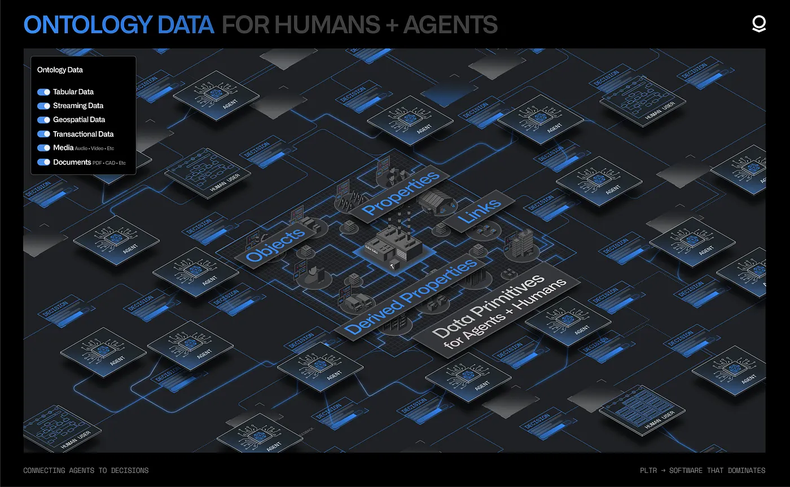
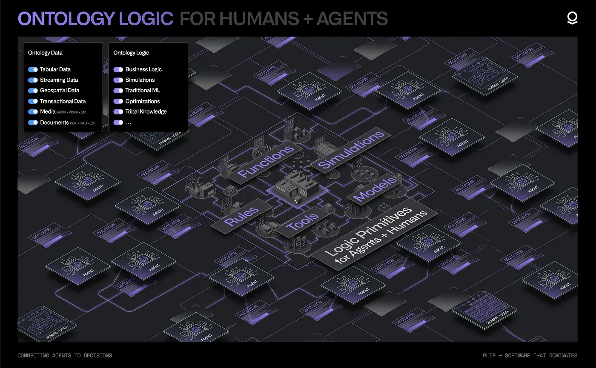
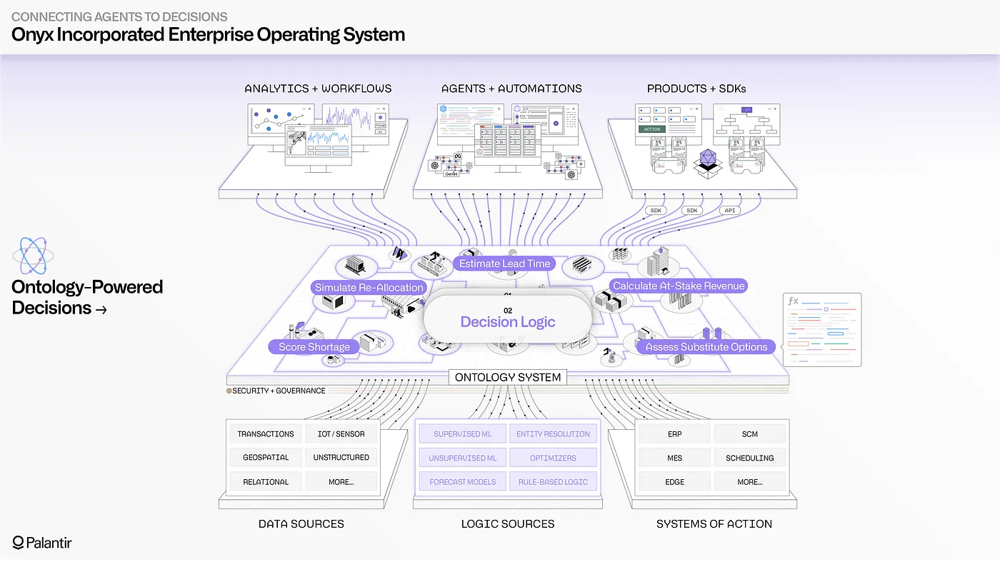
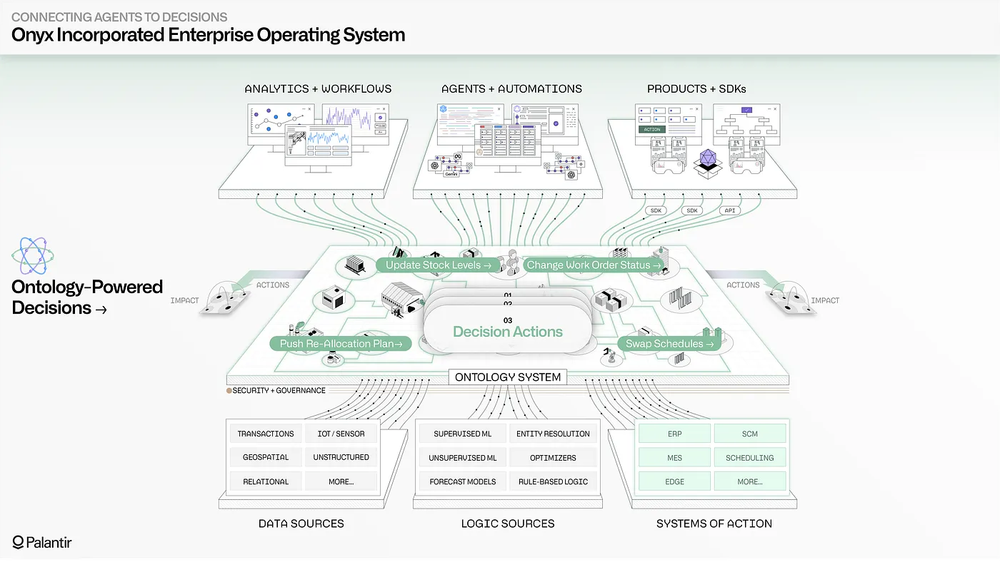
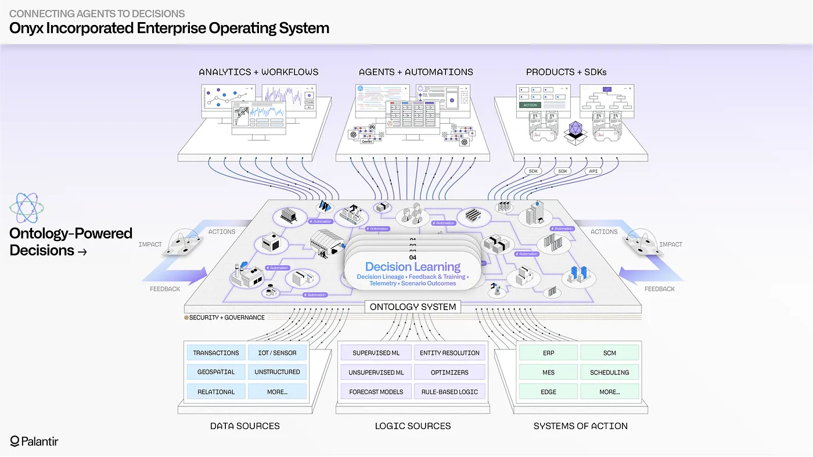

<!-- source: https://palantir.com/docs/foundry/ontology/why-ontology/ · mirrored 2026-08-22 from Palantir Foundry docs -->

# Why create an Ontology?

The Palantir platform powers real-time, human-agent decision-making in the most critical commercial and government contexts around the world. The Ontology is the central system that enables customers to safely, securely, and effectively leverage AI in their enterprises and drive operational transformation.

The Ontology represents the *decisions* in an enterprise, not simply the data. With the Ontology, organizations can make the best possible decisions, often in real time, based on constantly changing internal and external conditions. Traditional data architectures do not capture the reasoning that goes into decision-making or the actions that follow, and therefore limit learning and the incorporation of AI. Conventional analytics architectures do not contextualize computation in lived reality, and remain disconnected from operations. In contrast, the decision-centric Ontology connects humans and agents directly to operations to face and overcome an organization's toughest challenges.

## Understanding the value of the Ontology

Palantir models each operational decision as comprising four components:

* **[Data](#data):** The information leveraged to make the decision.
* **[Logic](#logic):** The heuristics and computational processes that evaluate a decision.
* **[Action](#action):** The orchestration and execution of the chosen decision.
* **[Security](#security):** The assurance that the decision complies with operational policies.

The Ontology integrates these four elements into a scalable, dynamic, collaborative resource which enables decision-making, informed by the ever-changing conditions and needs of your organization.

### Data

The Ontology includes not only the many sources of enterprise data — structured data, streaming and edge sources, unstructured repositories, imagery data, and more — but also the data generated by end users and agents as decisions are being made. This "decision data" contains the context surrounding a given decision, the different options evaluated, and the downstream implications of the committed choice. Integrating the full range of enterprise data alongside decision data requires a different architecture than a classical database management solution optimized for reporting and analytics.

The Ontology integrates this data into a full-scale, full-fidelity semantic representation of the enterprise. The wide range of operational data sources (such as ERPs, MES, and WMS) can be synchronized and contextualized alongside data streams from IoT and edge systems, the relevant sections of unstructured data repositories, geospatial data stores, and more. The Ontology unites these data sources in the form of objects, properties, and links which evolve in real-time, and are designed to be embedded directly into decision-making workflows.

The Ontology safely captures the decision data produced by operational users as they carry out daily work, whether in supply chains, hospital systems, customer service centers, or elsewhere. This includes decisions made at the edge, captured through the lightweight [Embedded Ontology ↗](https://blog.palantir.com/osdk-and-mobile-applications-building-with-the-embedded-ontology-668432da6572). The end-to-end "decision lineage" of when a given decision was made, atop which version of enterprise data, and through which application, is automatically captured and securely accessible to both human developers and agents. Together, these data resources can power AI-driven learning at scale and continuously refine short-term and long-term agentic memory.

### Logic

The data stored in the Ontology is complemented by the reasoning, or logic, that determines when and how to make a given decision. Examples of decision logic include a simple piece of business logic within a core business system, a forecast model maintained using a cloud data science workbench, or an optimization model that uses several data sources to produce an operational plan.

With the advent of agentic orchestration, it is critical that AI-driven reasoning can leverage these logical assets in the same way that humans have historically. Deterministic functions, algorithms, and conventional statistical processes can serve as operational tools which complement the non-deterministic reasoning of LLMs and multi-modal models.

The Ontology enables the full set of logic assets — the calculations and processes that dictate *how* decisions are made — to be connected and contextualized for both human and agents. This includes business logic related to customer interactions, often found in CRMs and ERPs; the modeling logic that drives conventional machine learning, which is spread across data science environments; and the planning, optimization, and simulation algorithms that are often associated with domain-specific tools.

The Ontology’s flexible "logic binding" paradigm provides a consistent interface for constructing workflows that incorporate and combine heterogeneous logic assets from different environments (such as on-premises data centers, enterprise cloud environments, SaaS environments, or the Palantir platform itself). This enables the introduction of agent-driven reasoning into decision-making contexts with diverse sets of logic, which were previously the exclusive domain of human users.

### Action

With both information (the data) and reasoning (the logic) incorporated into a shared representation, the next piece is the execution and orchestration of the decision itself (the action). Closing the action loop as decisions are made in real-time is what distinguishes an operational system from an analytical system.

The Ontology natively models actions within a cohesive, decision-centric model of the enterprise. If the data elements in the Ontology are “the nouns” of the enterprise (the semantic, real-world objects and links), then the actions can be considered “the verbs” (the kinetic, real-world execution). With every Ontology-driven workflow, the nouns and the verbs are brought together into complete sentences through human- and/or AI-driven reasoning, which incorporates various pieces of logic.

Uniting data within a semantic model and combining it with the logic required to evaluate decisions is valuable, but ultimately limited unless the executed decisions can be synchronized with operational systems in a way that *compounds*, with each decision informing the next in a shared lineage. The Ontology enables human and agent actions to be safely staged as scenarios, governed with the same granular access controls as data and logic primitives, and securely written back to every enterprise substrate (transactional systems, edge devices, custom applications, and so on).

### Security

In an operational setting, human-agent interaction requires rigorous security and governance capabilities that can go beyond conventional role-driven policies on buckets of data. Palantir provides a security architecture that combines:

* Marking-, purpose-, and role-based policies;
* Dynamic lineage that flows across data, logic, action, and application artifacts; and
* A full suite of integrated change and release management tools that apply across both human-driven and agentic workflows.

Granular policies can constrain both agentic and human access to sensitive or context-dependent information across the Ontology. These policies are dynamically computed at runtime for every interaction, combining row- and column-level restrictions that have been applied to underlying datasets, attributes of particular user groups (including those that flow via SSO), security markings that propagate across underlying data pipelines, and more.

Tool usage is dynamically enforced through the same security architecture that governs data access and all forms of memory. This ensures, at minimum, that any tool invocations are dependent on access to the underlying objects, properties, and links in the Ontology. Tools can also contain runtime validations that are dependent on granular submission criteria.

Every agentic or human action depends on precise authorization grants that explicitly dictate the set of allowable operations, safeguarding against unexpected invocations (such as querying data that exists across organizational boundaries, or tools that connect to unspecified external systems) and other forms of privilege escalation.

As detailed telemetry is generated by agents, the security and transmission of the logs is a critical last-mile concern. Palantir enables administrators to control how logging is accessible across specific projects, workflows, and agents. Data markings and other active security primitives govern log access, in the same manner that they govern access to the underlying data, logic, and action primitives.

The Ontology brings together data, logic, action, and security into a decision-centric model of the enterprise, which can be jointly leveraged by both humans and agents. From data integration to application building to end user workflows, the platform's modular architecture enables human users and agents to query, reason, and act across a shared operational foundation.

## Example of an operational workflow

This section provides a notional example of how the Ontology can enable human-agent workflows in an organization.

### Background

In this scenario, Onyx Incorporated, a fictional manufacturer of medical equipment, produces a range of finished goods, from syringes to surgical masks, each of which requires moving a precise set of materials through an associated manufacturing process. A diverse set of teams manages everything from supplier relations, to warehouse operations, to production of the finished goods, to distribution to end customers; decisions are interdependent, and constantly adapting to changing circumstances.

Imagine that Onyx is faced with an unexpected disruption with one of their major suppliers, which provides the key raw materials needed to produce surgical masks. Given the tight production schedules across Onyx’s manufacturing plants and the escalating demand from customers for surgical masks, this disruption could create serious issues with fulfilling outstanding customer orders. To respond, Onyx’s operational teams have decided to use Palantir's [AI FDE](/docs/foundry/ai-fde/overview/) to connect a wide array of data sources, logic assets, and systems of action into their enterprise ontology.

### Gaining visibility into the problem

Onyx will start by assessing the immediate impact of the supplier shortage, and will then employ AI to assess possible reallocation strategies across production lines, before finally translating their decisions into a set of connected actions that will simultaneously update warehouse processes, production schedules, and fulfillment routes.

Onyx’s ontology provides real-time, end-to-end visibility into the operations happening across each interdependent part of the business. This enables both leadership and on-the-ground teams to quickly understand the supplier disruption. Vital data systems related to supplier management, warehouse operations, production activity within plants, distribution center processing, and customer fulfillment are all synthesized into semantic objects and links, which reflect the language of the business. Using the Palantir platform, an operations leader can rapidly pinpoint the surgical mask production at risk due to the raw material shortage, and through the connections in their ontology, navigate to every outstanding customer order that is now also at risk. The Ontology’s granular security model ensures that more sensitive data elements (such as financial metrics) are automatically hidden by default, as the response widens to include more teams across the enterprise.

While operational users can easily navigate the Ontology through [Workshop](/docs/foundry/workshop/overview/)- and [SDK](/docs/foundry/ontology-sdk/overview/)-driven applications, the inclusion of agentic capabilities is a force multiplier for Onyx Incorporated. Agents leveraging both open-source and proprietary LLMs can navigate across supplier information, stock levels, real-time production metrics, shipping manifests, and customer feedback all contained within the organization’s ontology. Importantly, all agentic activity is controlled with the same security policies that govern human usage, ensuring that Onyx engineers always have precise control over what the LLMs can query, recommend, and act upon. Each constructed and deployed agent can be treated like a new team member that is gradually granted a wider purview as Onyx team members gain confidence in its performance.

### Building simulations and designing solutions

Situational awareness is only the tip of the ontological iceberg. Onyx needs to rapidly identify *solutions* to deal with the supplier disruption, and explore the tradeoffs inherent with each possible decision.

Since the diverse set of forecast models, allocation models, production optimizers, and other logic assets have been connected into Onyx’s ontology (alongside the aforementioned data sources), Onyx supply chain analysts can quickly run a battery of simulations that detail the consequences of the different possible material substitutions. The connected, real-time nature of the Ontology is key at this stage, since substituting raw materials will potentially have downstream implications for the other products (like syringes and gloves) being produced from the same materials. As the simulations are run, the simulated outputs are staged as ontology scenarios, which safely package the proposed changes into a sandboxed subset of the Ontology — enabling teams to safely explore and analyze the implications of the decision before committing to it.

Even more valuable for the Onyx team is that fleets of agents can securely leverage the full range of logic assets and the same scenarios framework. The Ontology enables agents to go beyond the data-centric limitations of retrieval-augmented generation, and instead interface with the interconnected data, logic, and action primitives in the Ontology through an extensible tools paradigm. As Onyx’s analytics and data science teams create new machine learning models in their cloud workbenches, tune optimization algorithms within enterprise systems, and fine-tune LLMs using Palantir’s open model building framework, the Ontology can securely surface these logic assets as AI-ready tools.

In this case, Onyx has created a tuned agent, "Disruption Bot", that can use a set of Ontology-driven tools to scan across the full range of enterprise data sources, the after-action reports on prior courses of action taken in similar situations, and the potentially applicable material reallocation models. Thanks to the rich, dense context provided through the Ontology, Disruption Bot is able to surface a novel reallocation plan, which uses a newer model that the supply chain analysts had not yet considered. With the consequences of the plan safely staged in a scenario, the agent’s proposed decision is handed off to a human analyst for final review.

### Executing decisions and taking action

With a viable plan to address the material shortage identified, Onyx needs to rapidly and safely push the decision to the operational systems that run the constituent processes. Given that the enterprise has grown through acquisition, and contains a diverse and delicate mix of critical operational systems, the Onyx IT team is vigilant about which processes can write back to these systems, and under which conditions. Fortunately, the Ontology applies the same rigorous control and validation to actions as it does to data and logic; enabling fine-grain control over who can invoke a given action, test-driven frameworks for publishing changes, the ability to stage and review changes in batch, and detailed logging for every event. In this case, the execution of the material reallocation plan automatically orchestrates a set of writeback routines, each tuned for the receiving system: the warehouse management system receives an API-driven update; the three ERP systems each receive updates via native Ontology-driven connectors, which abide by the safeguards in each system; and the production planning system receives a consolidated flat file, which it ingests asynchronously. As actions are executed, the Onyx IT team can monitor system responses and can always audit past activity.

The Ontology provides the guardrails needed for AI to safely take action within permitted boundaries. Alongside data and logic, actions can be automatically surfaced as tools for all types of agents. The scope of an action can be limited to simply reflecting a given change (such as an edit to an object or the creation of a new object) in the Ontology itself; or can write back to single or multiple systems. In this case, Onyx has granted Disruption Bot and a few other production AI agents access to a small set of actions. In the default case, these actions (like changing the status of a work order or pushing a reallocation plan) can only be staged by the AI, before being handed off to a human for final review. However, with the granular logging and operational instrumentation provided by the Ontology (and the wider Palantir platform), Onyx is able to carefully choose whether any trusted, well-tested AI processes can automatically close the action loop without human review. As conditions evolve, the latitude given to AI can be expanded or contracted, with any change instantly reflected across all Ontology-driven workflows.

### Learning from decisions

What comes after the immediate crisis is past? With data, logic, action, and security all connected into Onyx’s ontology, the organization can conduct powerful decision-centric learning. The human-agent teaming that produced a specific solution to the material shortage also revealed generalizable workflows, which the organization will want to memorialize and surface in the future. Every data element, logic asset, and action assessed is captured in an end-to-end decision lineage, which serves as rich, contextual fuel for optimizing the performance of AI. The aggregate decisions made by thousands of users and agents throughout Ontology can be securely leveraged as training data when fine-tuning models, and can be distilled into targeted principles that are called upon during agent prompting. The tribal knowledge that has been traditionally trapped in the seams of workflows can be illuminated by AI to improve the operation of the entire enterprise.

## Onward with the Ontology

The Ontology allows organizations to implement and scale human-agent operations, as well as precisely control how and when agent-driven recommendations, augmentations, and automations can be used in frontline contexts. This is possible because the Ontology is decision-centric, not simply data-centric, bringing together the constituent elements of decision-making — data, logic, action, and security — in a single software system.

With the Ontology, new data can be rapidly integrated into a full-fidelity semantic representation; new algorithms and business logic can be seamlessly surfaced for both human and AI users; and robust action integration can be achieved through real-time connections with the full range of operational systems. Each organization’s ontology is a real-time representation of the changing conditions, goals, and decisions being made across teams, which ensures that AI usage remains anchored in the reality of the enterprise.

To learn more, explore our documentation on the Ontology’s underlying decision-centric [architecture](/docs/foundry/architecture-center/ontology-system/); the extensibility provided through the [Ontology SDK](/docs/foundry/ontology-sdk/overview/); and the [Global Branching](/docs/foundry/global-branching/overview/) framework that allows for safe and zero-downtime evolution of the Ontology.
