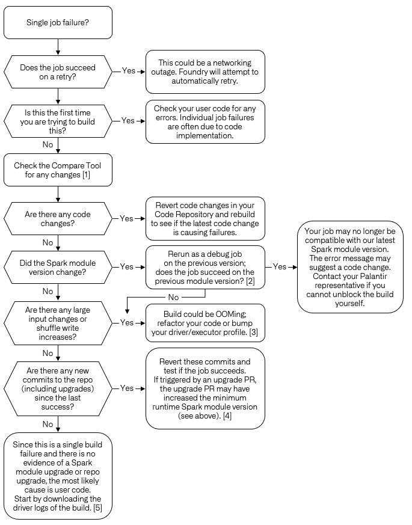
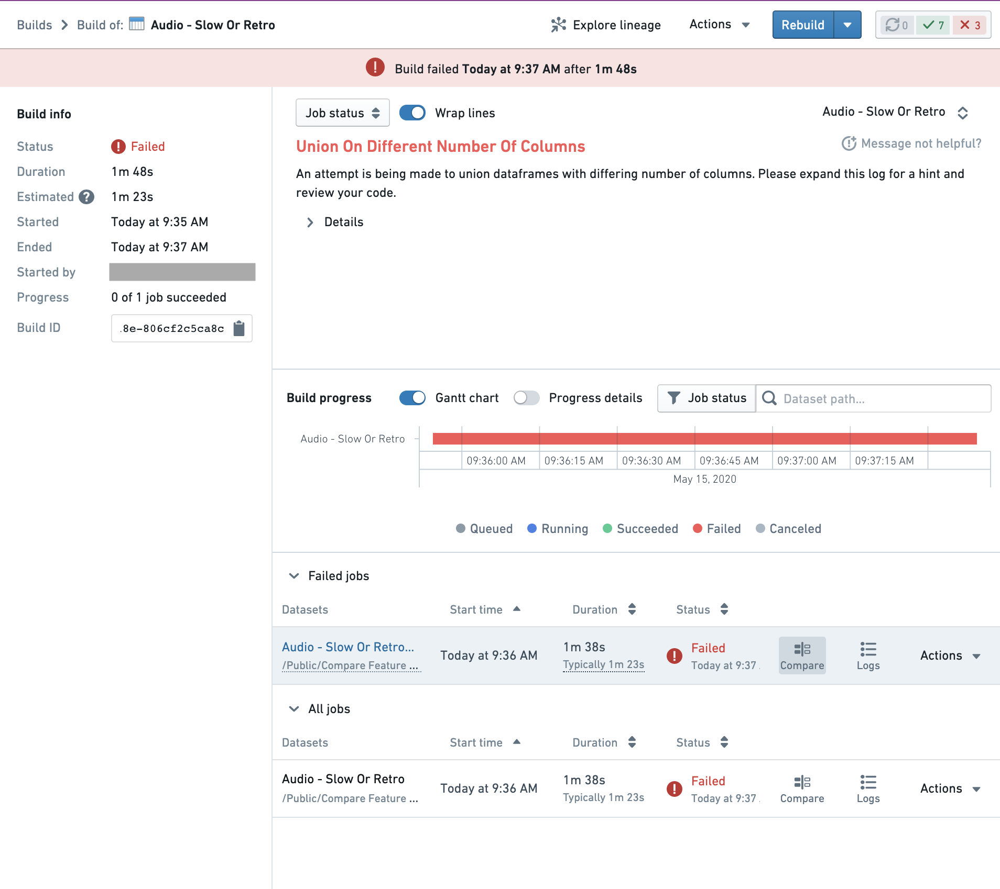
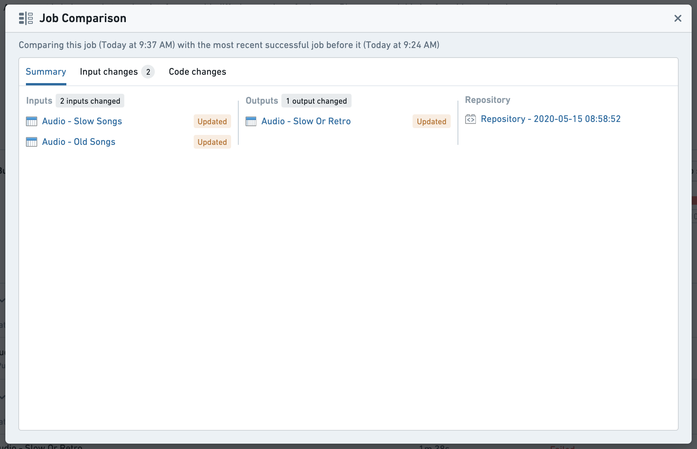
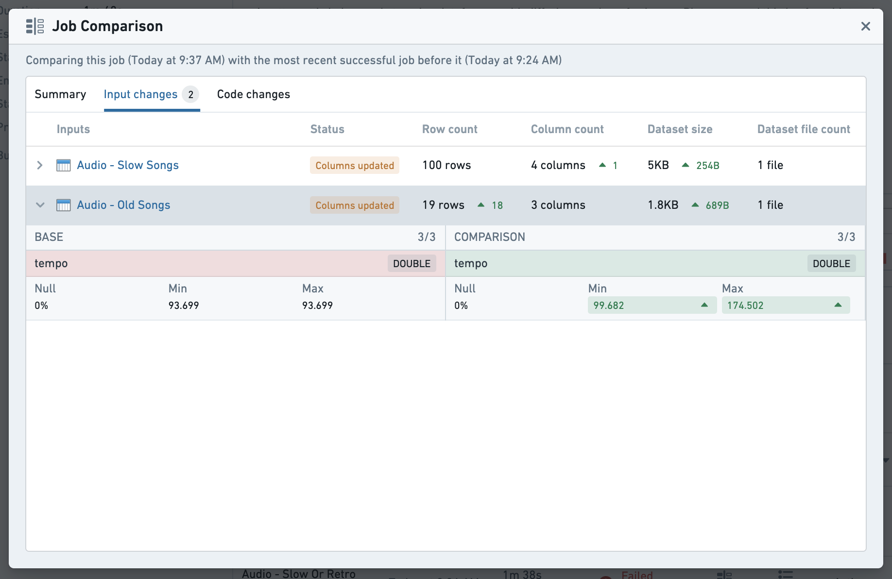
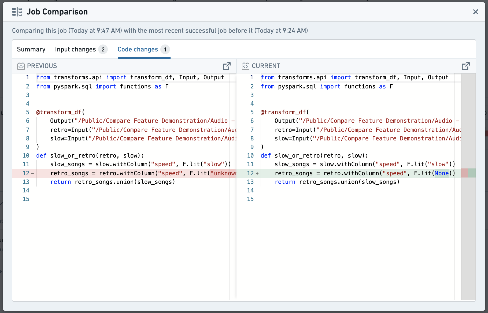

<!-- source: https://palantir.com/docs/foundry/optimizing-pipelines/debug-job/ · mirrored 2026-08-14 from Palantir Foundry docs -->

# Debug a failing job

As you author data transformation code in Foundry, you will likely run into cases where a job fails, either from the beginning or after some time. This page documents a suggested workflow for debugging failing jobs, as well as tools available in Foundry to help you understand why a job may have started failing.

## Suggested workflow

The following graph gives a suggested workflow for debugging transforms job failures.

* \[1] Using [Job Comparison](#compare-jobs) as documented below.
* \[2] You can test your build with a specific module version by navigating the job report, then selecting **Actions** > **Rerun as Debug job** > Select the module version of the previously successfully build.
* \[3] [Troubleshooting OOM Errors](/docs/foundry/optimizing-pipelines/troubleshoot-ooms/).
* \[4] [Repository upgrades](/docs/foundry/code-repositories/repository-upgrades/).
* \[5] You can download driver logs for your job by navigating to the job report and selecting **Logs** > `_driver.log` > **Download**.

## Compare jobs

The Job Comparison tool allows you to compare the current job with the previous successful job run. It is useful for investigating change and troubleshooting build issues. It is accessible from the build report page in the Builds application for any job that has output transactions. In order to access the Job Comparison tool, click the "Compare" button on any job row:

### Comparison Summary

This tab provides an overview of the changes that occurred during a job. Clicking any dataset will open a new tab exploring the transactional changes in the Dataset app's Compare tool. Clicking the repository will redirect your browser to the source repository at the commit that the job occurred, allowing exploration of the whole repository rather than just the file associated to the output of this job.

### Input Changes

This tab provides a high level overview of the changes in the input datasets, highlighting changes in metadata, schema and statistics. If a dataset has any notable column changes, selecting the row will expand a summary of those changes. To explore changes in detail, selecting any dataset will redirect to the Dataset app for further comparison.

### Code Changes

Code changes will highlight any changes in code between this job run and the previous successful run in the file where the outputs are defined. For further detail, buttons are provided to redirect to the source repository at commit (only available when the source is Code repositories). Code differences are available for any job based on a code repository or code workbook.

## Hanging builds

If your build is hanging, follow the workflow above. If this is the first time running this job, it is most likely that the build is hanging due to user code.

One important distinction to failed jobs is that Driver logs are lost when builds are cancelled. Download the streamed driver logs before canceling the build by selecting **Logs** > `_driver.log` > **Download**. You can also take a snapshot of a running build in the [Spark details](/docs/foundry/optimizing-pipelines/understand-spark-details/#executors-tab), under **Executors** > **Snapshot**. These will allow you to troubleshoot the hanging build once it has been canceled.

## AI error enhancer (AIP)

If AIP is enabled on your stack, the [AI error enhancer widget](/docs/foundry/code-repositories/aip-features/#ai-error-enhancer) complements the detail view of a failed job to help you better understand and resolve issues that arise.

