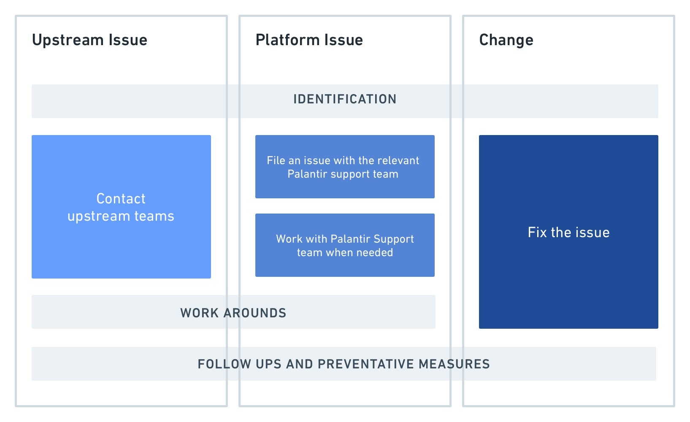
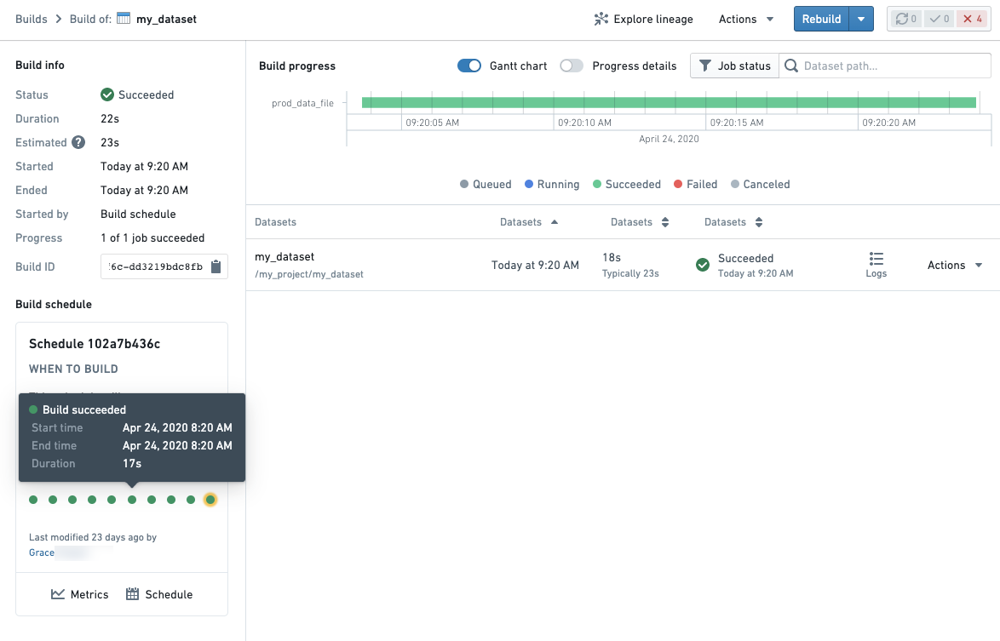
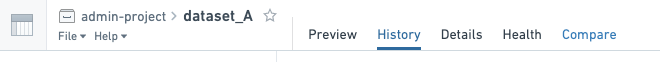
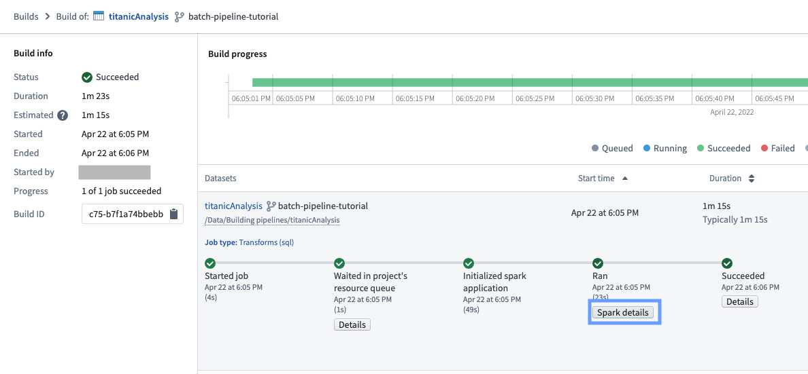

<!-- source: https://palantir.com/docs/foundry/optimizing-pipelines/debug-pipeline/ · mirrored 2026-08-14 from Palantir Foundry docs -->

# Debug a failing pipeline

The ability to debug and resolve pipeline problems quickly is a core part of pipeline maintenance work. It ensures production pipelines feeding important organizational workflows remain reliable and meaningful.

This page provides a framework which you can use as the basis of a standard operating procedure (SOP) when receiving a notification for a health check failure during an on-call rotation as a pipeline maintainer.

## Prerequisite knowledge

This page assumes you are familiar with a variety of Foundry tools and workflows. Links will be provided in the relevant sections:

* [Code Repositories](/docs/foundry/code-repositories/overview/)
* [Builds application](/docs/foundry/data-integration/application-reference/#builds)
* [Scheduling](/docs/foundry/building-pipelines/scheduling-overview/) and [schedule metrics](/docs/foundry/building-pipelines/view-modify-schedules/#view-metrics)
* [Data Lineage](/docs/foundry/data-lineage/overview/)

It also assumes that your pipeline maintainer team records an incident log or other documentation for recurring issues in your pipeline. This is a best practice and should be implemented if there is not currently such a document.

## Debugging framework overview

Always begin by asking the following three questions, in order:

1. **Mitigation:** Can I mitigate this problem as soon as possible? Some examples would be to:
   * Rebuild the schedule. We recommend rebuilding a schedule rather than a single dataset or failing job, as this will appear in your schedule history. Schedule history allows you to track the history of your pipeline, rather than the history of an individual dataset.
   * If there’s too much queuing, seeking out and canceling overlapping or intensive schedules.
   * If a manual upload is broken, revert the transaction to a known stable version.
2. **Classification:** What is the problem category?
   * The reason we classify a problem is to assist in root cause identification and to determine if the resolution will require involvement from another team.
   * More details on how to think about problem categories and identify them [below](#problem-category-classification).
3. **Broader impact:** Could this problem be affecting other parts of the platform?

:::callout{theme="success" title="Tip"}
Read your pipeline’s documentation! Perhaps this problem has previously been solved. Or there may be warnings of what not to do during mitigation. For example, some builds can be very expensive and may impact the performance of your environment during peak usage times. These kinds of details should be well-documented for your whole team.
:::

## Problem category classification

After attempting to mitigate the problem, as a pipeline maintainer you will need to go deeper to understand and remedy the root cause. The reason classifying a problem is helpful during debugging, is that it helps us identify the root cause and most importantly, helps you quickly identify whether you can fix the issue or whether you’ll need to contact another team.

There are three categories of problems:

* **Upstream issues:** related to infrastructure or artifacts managed by others
  * **Outside of Foundry:** Issues with upstream data sources
  * **Within Foundry:** Issues caused by datasets/projects upstream of the pipeline in question
* **Platform Issues:** issues caused by the Foundry Platform services not working as expected.
* **Change:** anything that’s changed *within the scope of the pipeline that you are responsible for monitoring.* This is the most common category of problem and is often caused by user changes. Some examples include:
  * Code changes
  * Schedule changes
  * Increased data size in pipeline

### Steps to issue resolution by category of problem:

In detail, the steps highlighted above are:

* **Identification:** When going through the steps above, it is important to identify very precisely what is broken. Answer questions like:

  * When did the issue begin?
  * At what step in the pipeline did something fail?
  * What health checks are failing?
  * Did something in the pipeline change to cause this broken state?

  This allows you to communicate effectively with other teams if needed for upstream issues and platform issues and reduces resolution time. It also improves debugging skills in the platform.

* **Action:**
  * **Upstream issue:** Once you’ve confirmed the issue is indeed caused by delayed, missing or incorrect data from a project or datasource upstream from your pipeline, contact the team responsible for the upstream data.
    * **Tip:** It’s helpful before you begin monitoring that you document the contact details of the upstream team. This makes it easy for the on-call person to contact them.
  * **Platform issue:** if you’ve identified unexpected behavior from Foundry and ruled out any user-change in your pipeline, contact your Palantir representative. Provide them with as much specific information about the problem as you can, including the details of any changes that were observed. See the section [below here](#identifying-platform-issues) for some tips on how to spot these.
  * **Change:** After identifying something has changed within the monitored pipeline, you are usually able to take an action to fix it. In some cases, it may be necessary to reach out to whoever has made the change for more information. See the next section for help identifying if something has changed in your pipeline.

* **\[Optional] Downstream user communications:** A step not mentioned in the above diagram is that when an issue has been classified and further root caused, it may be appropriate to notify downstream consumers of the pipeline. This depends on the problem impact, scope, duration and the use case of the pipeline.

* **Workarounds:** if a fix from another team or from a user is going to take some time, it may be useful to implement medium-term workarounds to ensure the healthy part of your pipeline continues to run for downstream consumers. The exact temporary fix depends on the issue and needs of your users. Examples include:
  * Isolate the problem by removing the broken dataset or pipeline branch from your schedule.
  * Pinning another python library version if this is the root cause of issues. This can be done in the [meta.yml](/docs/foundry/transforms-python/project-structure/#metayaml) by specifying an explicit version number next to the library name.

### Identifying change in your pipeline

The most common issues that arises for a pipeline maintainer result as an unintended consequence of something changing within a pipeline you monitor. It is also the category where, as a pipeline maintainer, you have the most control and are able to fix the problem directly without needing to rely on another team.

In more detail, the steps to take are:

1. Track down precisely where the issue is coming from in your pipeline as best you can. For example, try and identify the schedule, the dataset, the transaction, the code change, and so on.
2. Compare a healthy previous run to the current broken state to identify what changed.
   It can be useful to have a mental checklist of questions. Below is an example set of questions, along with some example tools that could help you find an answer:

   * Slower than usual? Is this caused by queuing or is the build actually taking longer to compute?
   * Changes to file/data size?
   * Code changes? Schema changes?
   * Schedule changes?
   * Ongoing platform incidents?

### Tools

If you are not familiar with the tooling in Foundry used to answer some of the above questions, the list below provides examples of the most common patterns to use during your investigation. This list does not cover all possibilities but rather serves as a starting guide:

**Is my job/build slower than usual?**

* [Builds application](/docs/foundry/data-integration/application-reference/#builds) for comparing jobs for a given dataset. The progress details toggle in the top-right of a Build overview will allow you to see the progress of your build by queuing time vs compute time.
  * If a failed job was built as a part of a schedule, a schedule card will be shown in the bottom left of your Build details page. You can open a previous run of a schedule by clicking on a dot representing a previous build.   
       

* [Schedule metrics](/docs/foundry/building-pipelines/view-modify-schedules/#view-metrics) which allows you to see historical runs of a schedule as well as metrics and graphs to compare runs

**Are there any changes to the size of my dataset? Is my transform running with more data?**

* [Dataset Preview](/docs/foundry/dataset-preview/overview/): the history and compare tab of any Foundry dataset provides an overview of the history of a dataset as well as the ability to compare to previous transactions of your dataset to get an overview of what changed.   
     

* [Contour](/docs/foundry/contour/overview/) provides access to the historical view to compare row number using the [summary board](/docs/foundry/contour/change-dataset-version/) or if you have a column that represents the date that data was added/created, you can create charts to compare the number of rows against the date added.

* [Spark details](/docs/foundry/optimizing-pipelines/understand-spark-details/): By clicking on the Spark details button (see below) on any job, you will be able to see information that can help indicate if there is more data in your pipeline such as the `count of tasks` metric.   
     

**Has the code changed in my pipeline?**

* Dataset Preview’s **Compare** tab allows you to see code changes on the direct transform file when comparing the historical transactions on a dataset.
* Within Code Repositories, the **File changes** (commit history) helper in the [Code tab](/docs/foundry/code-repositories/navigation/#code-tab) allows you to see code changes.
* The [Data Lineage](/docs/foundry/data-lineage/overview/) tool allows you to get a quick overview of schemas across your pipeline. The side panel **Properties & Histogram** can be especially useful to track which datasets across your pipeline contain a particular column.

:::callout{theme="neutral"}
Code changes may occur in imported libraries in a transform if using a language that supports this such as [Python](/docs/foundry/transforms-python/use-python-libraries/) or [Java](/docs/foundry/transforms-java/share-code/). If you don’t see a change on your transform, consider checking if there was a logic change in a library function.
:::

**Has my schedule been altered?**

* The schedule card in various parts of the platform will allow you to see when the schedule was last changed.
* The [schedule versions tab](/docs/foundry/building-pipelines/view-modify-schedules/#view-schedule-edit-history) on the schedule's metrics page will allow you to identify exactly which changes were made to a schedule configuration.

## Identifying platform issues

Checking for similar symptoms in other jobs, builds or related platform components can be a useful investigation path if you’re not sure what the problem is based on the symptoms you see.

In particular, you should look for answers to these questions:

* Is it **reproducible**?
  * Does this issue happen consistently?
  * Does it follow a pattern? For example, does it fail on Monday at 9am after the weekend each week?
* What’s the **scope**?
  * If your job is slow or failing, are you seeing this with other transforms jobs? Or perhaps other Python jobs only?

Using [Builds application](/docs/foundry/data-integration/application-reference/#builds) to filter down job history across the platform can help you answer the above questions.

The ability to debug and resolve pipeline problems quickly is a core part of a pipeline maintainer’s work. It ensures production pipelines feeding important organizational workflows remain reliable and meaningful. If you find yourself following the guidelines outlined on this page and are unable to still identify the issue at hand, contact your Palantir representative.
