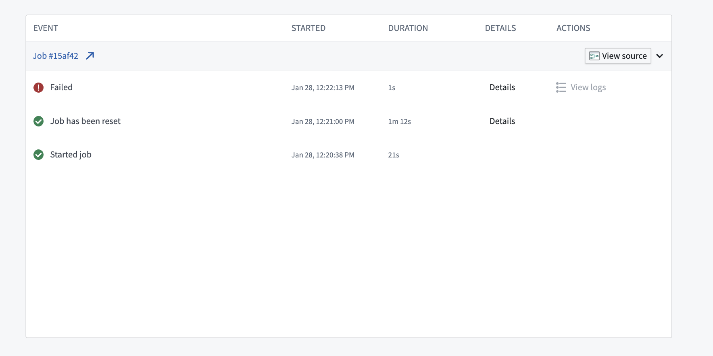
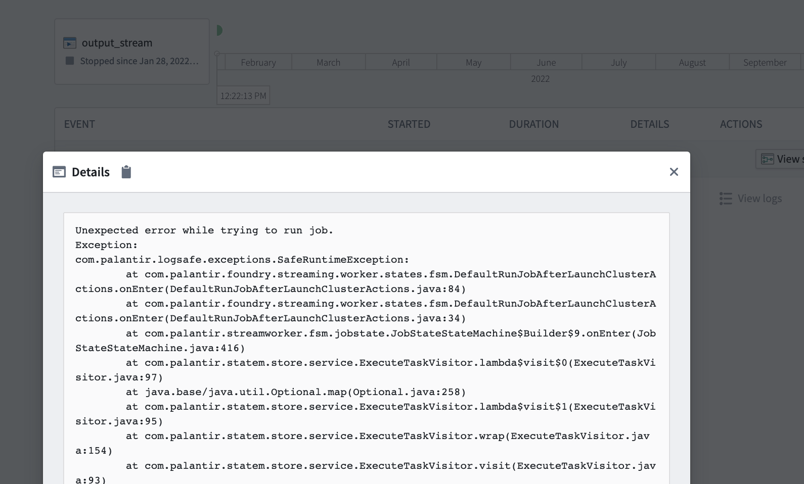
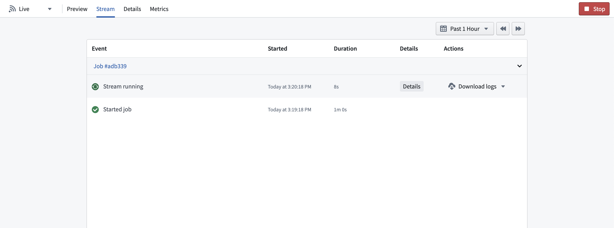
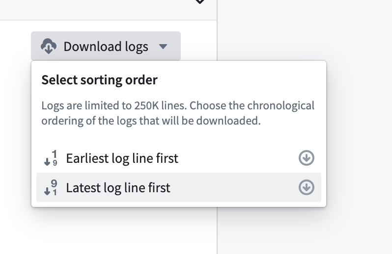
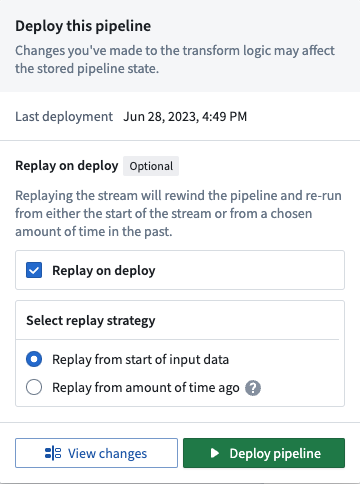

<!-- source: https://palantir.com/docs/foundry/optimizing-pipelines/debug-stream/ · mirrored 2026-08-14 from Palantir Foundry docs -->

# Debug a failing stream

As you author streaming pipelines, you may encounter streaming failures. This page offers suggested workflows for debugging failing streams and discusses the tools available in Foundry to help you understand why a stream failed.

## Types of failures

Failures can be classified into failure types, and each failure type can point to a different underlying cause. Below are some of the most common failure types and the reasons why they may occur.

* **Immediate failure:** A stream fails within 5 minutes of starting.
* **Transient failure:** A stream runs for some time, fails once, then restarts successfully and continues running.
* **Persistent failure:** A stream runs for some amount of time and then has a series of immediate failures that each happen within 5-10 minutes of the stream restarting.

### Immediate failures

Streams that fail quickly usually have problems with the user-authored logic. For example, the failure could come from invalid casts, parsing exceptions, or other issues that prevent the streaming cluster from starting up successfully.

If a previously successful stream now fails, inspect any changes to the logic and upstream streams to find potential issues.

To determine the root cause of these issues, follow the steps outlined in the [Check streaming cluster logs](#check-streaming-cluster-logs) workflow below.

### Transient failures

Failures on a stream that previously ran successfully but runs again after a restart usually points to infrastructure issues caused by networking outages. Outages are often caused by the cloud provider on which your Foundry instance is running (e.g. an AWS, Azure, or GCP outage). Applying a schedule to your streams will enable Foundry to automatically rerun your stream and continue processing from where it left off.

### Persistent failures

Failures on a stream that previously ran successfully but now fails repeatedly without any logic changes are usually the most difficult to identify. However, they are generally caused by one of two factors: new input data to the stream is preventing the stream from making progress (e.g. invalid types, corrupt data, etc), or there is a persistent infrastructure issue (AWS outage, etc).

To check if the error is caused by the logic in the pipeline, follow the steps outlined in the [Check streaming cluster logs](#check-streaming-cluster-logs) workflow below.

## Common debugging workflows

Below, we outline a handful of workflows you can use to solve common streaming issues. These checks do not need to be done in a specific order.

### Check streaming cluster logs

Follow the steps for [Retrieve stream logs](#retrieve-stream-logs) and search the logs for any exceptions, errors, or “throwables”. These logs will usually provide a description of a potential underlying issue through keywords like “ERROR”, “throwable”, or “Exception”.

### Check pipeline logic

Changes to pipeline logic can often cause breaks due to bugs in the user-authored code. Usually, the exception from the logs attained in the prior step will point to specific code that is causing the problem. If so, you can attempt to roll back any changes back to see if that fixes the problem.

### Check input data

Occasionally, logic in your streaming pipeline can throw exceptions if it encounters unexpected data. An example of this behavior would be if the pipeline divides two columns by each other and returns a value with the divisor being `0` or `null`. Check the records from the end of the input stream to see if the data has changed in a way that could cause issues for the streaming pipeline. If you find changed data, consider adding filters or logic to clean the data or remove it.

### Check stream details

Foundry detects common exceptions when streams fail and surfaces them in the stream details page. Check the details to see if any errors appear there.

:::callout{theme="neutral"}
You can sometimes find more information about errors in the stream logs than in the details page. We recommend checking both locations for information about failures in your stream.
:::





## Retrieve stream logs

You may encounter a failure during your stream and need to access logs from a build to identity the cause. Build logs are often the best place to determine the cause of different types of stream failures.

To retrieve logs for a streaming job, first navigate to the stream details page in [Dataset Preview](/docs/foundry/dataset-preview/overview/).

Next, find the job you want to review, then click **Download logs** .



Choose whether you would like to download the logs with the earliest or latest log lines first.



## Stream errors

### Job repeatedly fails with unrecoverable error

```
Caused by: com.palantir.logsafe.exceptions.SafeIllegalStateException: Start transaction rid is not part of the current view.
```

This error is typically caused by a new snapshot of the input dataset being run in streaming.

Streaming sends records downstream as soon as the records are received, which makes records irreversible. When a new snapshot is created, a streaming job ignores previous transactions and uses only the new transaction. To discard old records in favor of a new snapshot, run a manual replay.

This issue is fixed by executing a new deploy of the pipeline that replays the stream by selecting the **Replay on deploy** option in the **Deploy pipeline** wizard.


