<!-- source: https://palantir.com/docs/foundry/optimizing-pipelines/projections-setup/ · mirrored 2026-08-14 from Palantir Foundry docs -->

# Set up a projection

The following information will guide you through the process of enabling, configuring, and building a dataset projection.

:::callout{theme="neutral"}
*Noho* is a service that manages dataset projections.
:::

## Enable projections for your dataset

Projections are enabled in a dataset's schema by configuring `noho: true`.

You can configure a dataset's schema when writing the dataset from a transform or by manually modifying the schema in the **Details** tab.

```python
from transforms.api import transform, Input, Output

@transform(
    output_dataset=Output('/examples/example_output')
    input_dataset=Input('/examples/example_input'),
    
)
def compute(output_dataset, input_dataset):
    input_dataset = input_dataset.dataframe()
    output_dataset.write_dataframe(input_dataset, options={"noho": "true"})
```

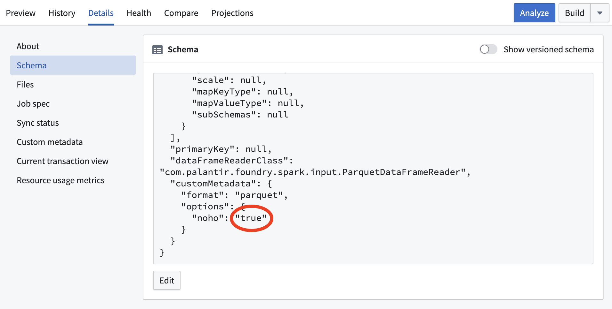

## Navigate to the Projections tab

You will see a **Projections** tab when viewing a dataset if it has `noho: true` configured in the schema and you have permission to edit the dataset.

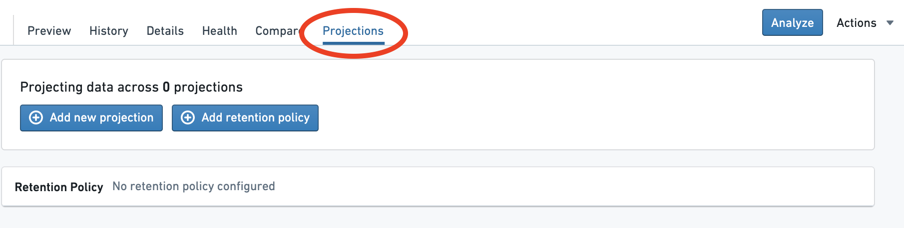

## Open the creation dialog

Select `Add new projection`.

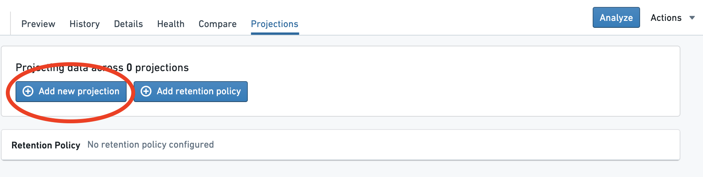

## Choose the projection columns

Choose the columns to include in the projection.

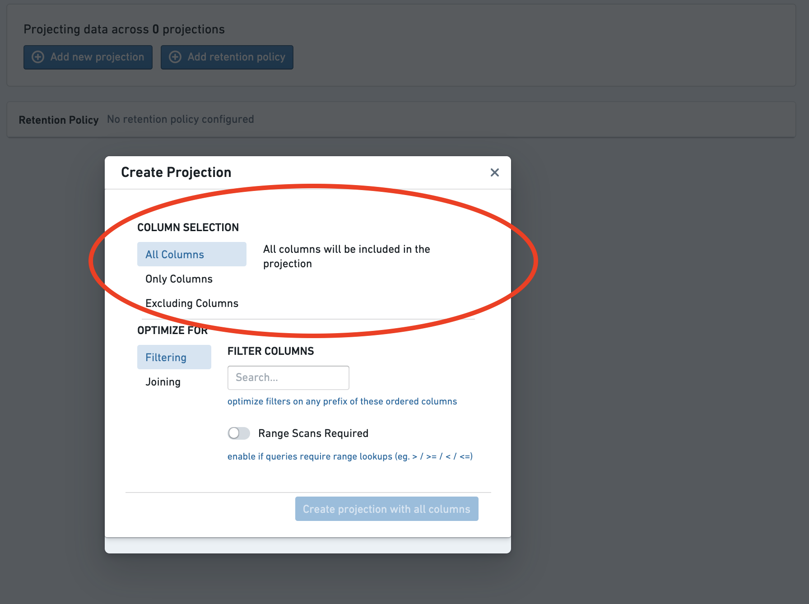

In most cases, `All columns` is appropriate. However, you can adjust this if you know that a query will only select a subset of the columns.

## Choose the projection type

Chose the type of the projection.

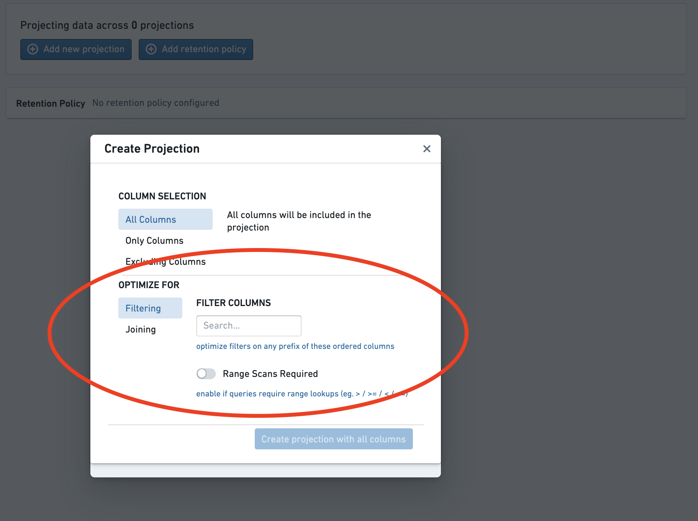

* For [filter-optimized projections](/docs/foundry/optimizing-pipelines/projections-overview/#filter-on-a-list-of-columns), select the columns to filter on.
  * The order matters, as the projection will only speed up queries on a prefix of this list.
* For [join-optimized projections](/docs/foundry/optimizing-pipelines/projections-overview/#join-on-a-set-of-columns), select the join columns and bucket count.
  * Joins will be sped up only on this exact set of columns.
  * When joining to an explicitly bucketed dataset or another join-optimized dataset, the bucket counts must be
    equal.

## Create the projection

Select the `Create projection` button.

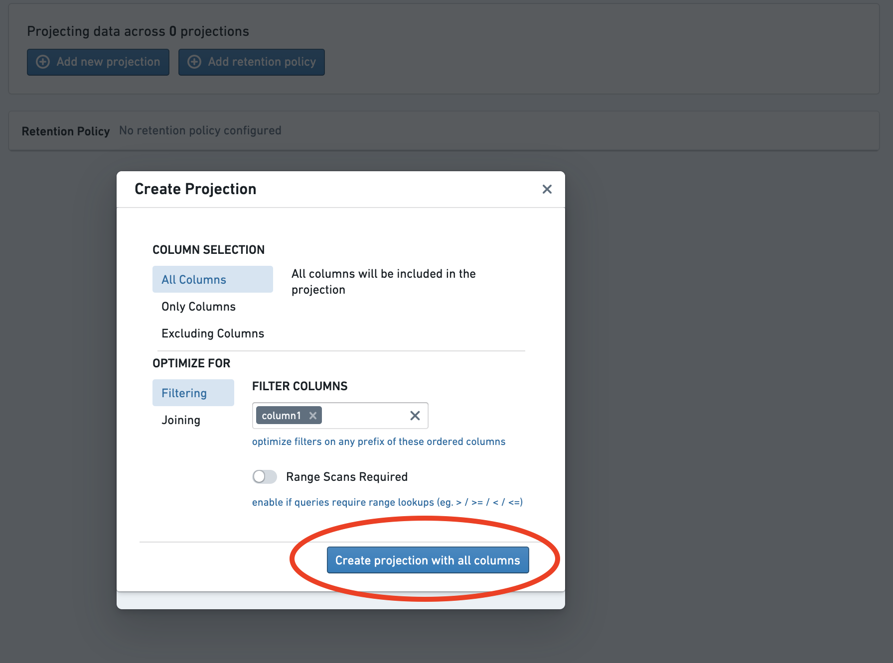

The projection now exists but contains no data. This is denoted by the red warning icon next to the projection. To use the projection in a query, it must first be built by following the next steps.

## Set up a build

To give you more control over resource usage, the internal builds that maintain projections are not scheduled automatically; you will need to set one up explicitly.

First, toggle the switch `Enable projection builds on the current branch`. This allows builds to run on the **current** branch.

Then, configure a schedule for the build. If you want to schedule
a build on a different branch, you will need to navigate to that branch and repeat the process.

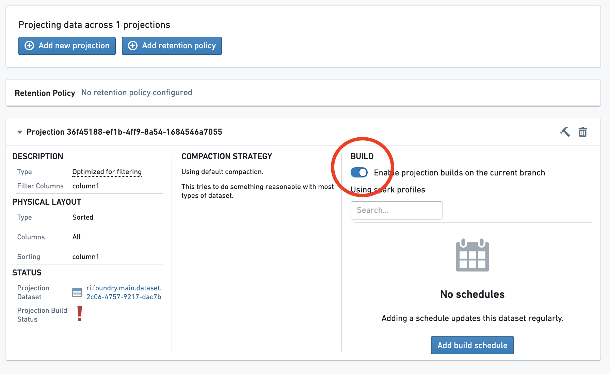

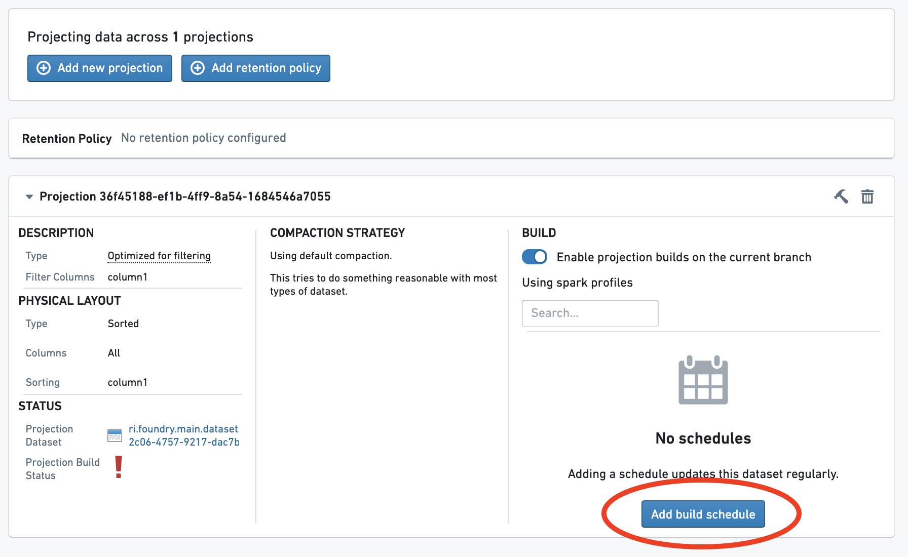

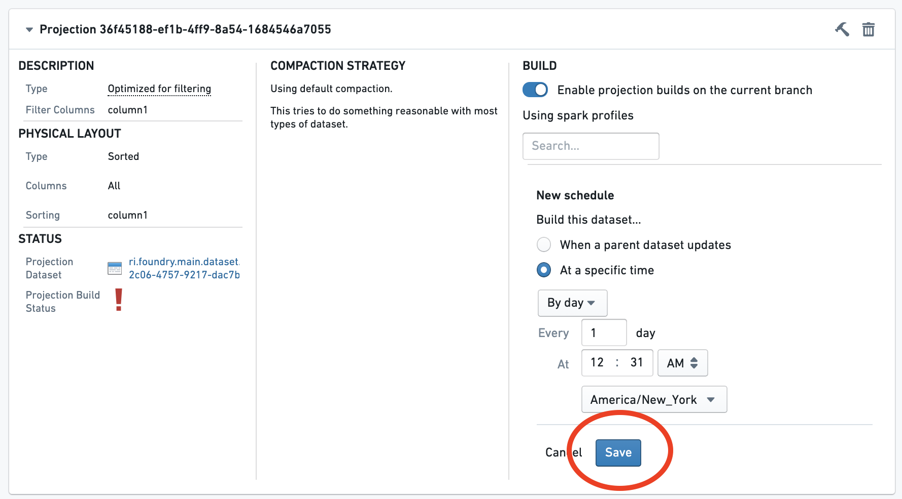

## (Optional) Build the projection

If you do not want to wait for the build, explicitly build the projection by selecting the **Build** button.

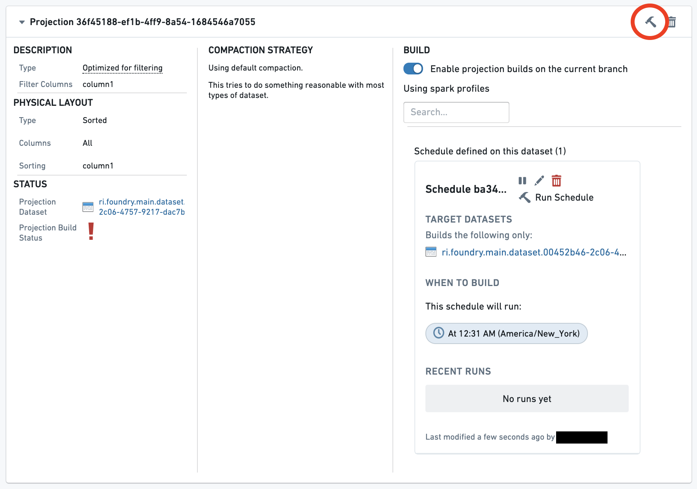

Now, wait for the build to complete. Multiple builds may run before the projection is up to date. A green check next to the `Projection Build Status` line indicates that the projection is now fully up-to-date.

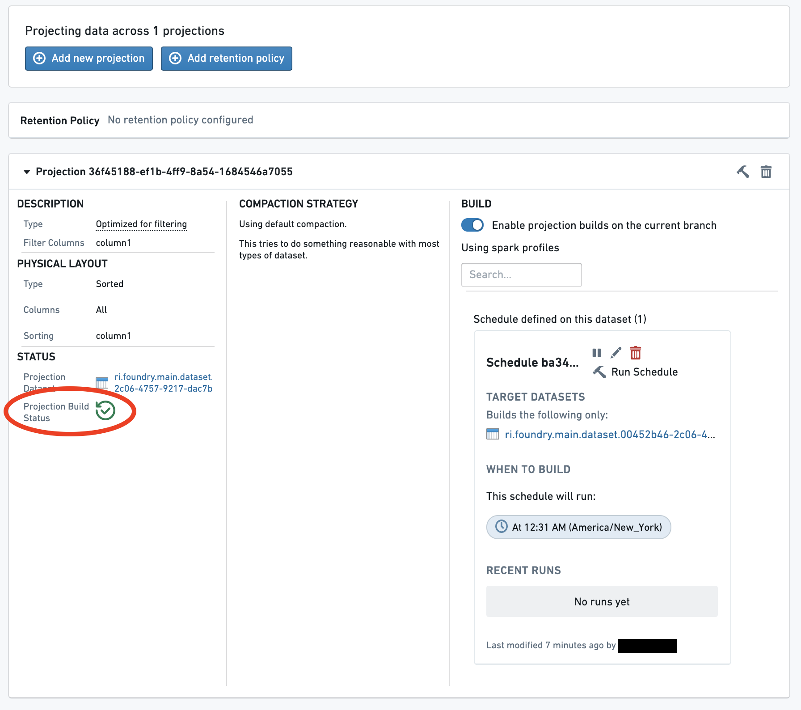

The projection is now up-to-date and will be used for reads on the dataset.
