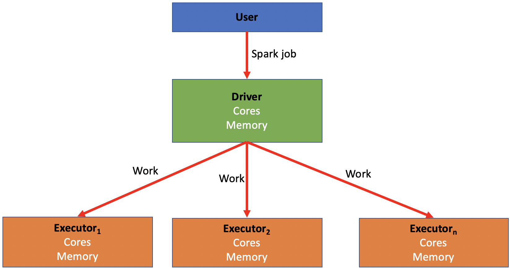
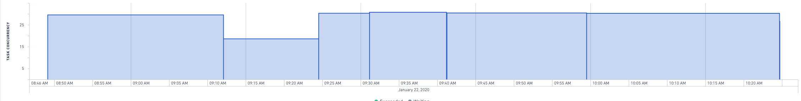

<!-- source: https://palantir.com/docs/foundry/optimizing-pipelines/spark-concepts/ · mirrored 2026-08-14 from Palantir Foundry docs -->

# Spark concepts

## Introduction to Spark

**What is Spark?**

Spark is a distributed computing system that is used within Foundry to run data transformations at scale. It was originally created by a team of researchers at UC Berkeley and was subsequently donated to the Apache Foundation in the late 2000s. Foundry allows you to run SQL, Python, Java, and Mesa transformations (Mesa is a proprietary Java-based DSL) on large amounts of data using Spark as the foundational computation layer.

**How does Spark work?**

Spark relies on distributing jobs across many computers at once to process data. Unlike the disk-based, two-phase MapReduce model used by Hadoop, Spark uses a Directed Acyclic Graph (DAG) execution engine and prioritizes in-memory computation, which allows simultaneous jobs to run quickly across users and projects. These computers are divided into drivers and executors.

* A **driver** is like the “conductor” for your Spark job. The driver is responsible for distributing the work of a job to the executors.
* An **executor** is like a “worker bee” for your Spark job. An executor is responsible for performing the computation for the portion of the job allocated to it by the driver. This work is split into a number of “partitions”, and each executor is given some partitions to run your code against. Once the executor completes this task, it will go back to the driver and ask for more work until the job has been completed.
* Every Spark job has a number of variables associated with it that can be manipulated in order to create a Spark profile best suited to run the transform.
  * There is a balance that needs to be struck within every Spark job between quickly and easily executing a job and the cost and resources associated with running that job.
  * As a rule of thumb, more executors and more memory should decrease running time while also increasing cost.
  * Based on the characteristics of the job, some combinations and configurations of drivers and executors perform better than the others. This is discussed in more detail in the section on [tuning Spark profiles](#tuning-spark-profiles).
  * A Spark profile is the configuration that Foundry will use to configure said distributed compute resources (drivers and executors) with the appropriate amount of CPU cores and memory.
* Five configurable variables are associated with every Spark job:
  * **Driver cores:** Controls how many CPU cores are assigned to a Spark driver.
  * **Driver memory:** Controls how much memory is assigned to the Spark driver.
    * Only the JVM memory is controlled. This does not include “off-heap” memory that’s needed for external non-Spark tasks (such as calls to Python libraries)
  * **Executor cores:** Controls how many CPU cores are assigned to each Spark executor, which in turn controls how many tasks are run concurrently in each executor.
  * **Executor memory:** Controls how much memory is assigned to each Spark executor.
    * This memory is shared between all tasks running on the executor.
  * **Number of executors:** Controls how many executors are requested to run the job.
* A list of all built-in Spark Profiles can be found in the [Spark Profile Reference](/docs/foundry/optimizing-pipelines/spark-profiles-reference/).

## Tuning Spark profiles

* You may encounter issues running transforms which will require you to adjust Spark profiles to create a custom, non-default configuration that enables your specific job. For example:
  * Your job may require more memory.
  * Your job may run slower than what is needed for the use case.
  * You may encounter errors that cause a job to fail entirely.
* To use a non-default Spark profile in Code Repositories, the profile first needs to be imported into the repository containing your transform. This process is described in the documentation on [Spark profile usage](/docs/foundry/code-repositories/spark-profiles/).
  * Once imported, a Spark profile can be assigned to a specific transform following the guidance in the [Apply Transforms Profiles](/docs/foundry/optimizing-pipelines/apply-spark-profiles/) documentation.
* The Spark profiles used in Pipeline Builder batch pipelines are controlled via the pipeline's [build settings](/docs/foundry/pipeline-builder/management-build-settings/#batch-compute-profiles).

### When to modify your Spark profile from the default

* As a rule of thumb when editing a Spark profile, only increase one variable at a time and only bump up by one level each time.
  * For example, start by only adjusting executor memory and bumping it from `EXECUTOR_MEMORY_SMALL` to `EXECUTOR_MEMORY_MEDIUM`, then run the job again before adjusting anything else. This helps prevent incurring unnecessary costs by over-allocating resources to your job.
* While backend defaults do not always map to specific Spark profiles, they are typically approximated by the built-in profiles labeled `SMALL`.
  * The right defaults (for non-Python Transforms) are `EXECUTOR_CORES_SMALL`, `EXECUTOR_MEMORY_SMALL`, `DRIVER_CORES_SMALL`, `DRIVER_MEMORY_SMALL`, `NUM_EXECUTORS_2`.
  * Python may need more non-JVM overhead memory when it makes calls to Python libraries that run outside the JVM.
* If you are experiencing any problems with your Spark job, the first step is to optimize your code.
  * If you have optimized as much as possible and are still having problems, read on for specific recommendations.
* If your job succeeds but is running slower than needed for your use case:
  * Try increasing executor count; increasing executor count increases the number of tasks that can run in parallel, therefore increasing performance (provided the job is parallel enough) while also increasing cost with the use of more resources.
    * You can view the Builds application page for a given build for a chart that will help you identify if increasing the executor count can help improve the speed of your job. If the task concurrency does not get close to the executor count, increasing the number of executors is most likely not going to help improve run time.
    * 
  * If doubling the executor count does not reduce run time by more than 1/3, then you probably have inefficient code (for instance, reading a lot from Catalog or writing a lot to Catalog).
    * For example, if you double the executor count for the transform generating a 6 minute job, the job should run in 4 minutes or less.
    * If halving your executor count slows your job down by less than 50% (for example, 4 minutes to 6 minutes), you should drop down to the lower executor count to save money unless runtime is critical.
  * Limits can be imposed on large profiles (such as 128 or more executors) in order to ensure only approved use cases can use significant resources. If you reach a limit and need to go higher, contact your Palantir representative.
  * Executors tend to accrue to a driver at a rate of around 10 per minute during start-up. This means that short jobs with high executor counts should probably use lower executor counts to reduce thrashing in the system. For example, any 64-executor job that takes less than 10 minutes should probably be dropped to 32 executors, as by the time the job has acquired all its computing resources, it is almost finished.
* If your job is failing and you’re receiving OOM (out of memory) errors or a “Shuffle stage failed” error which is not linked to a code-logic-based failure cause:
  * Try increasing executor memory from `SMALL` to `MEDIUM`. This should help if you are processing large amounts of data.
    * If you think you need to adjust from `MEDIUM` to `LARGE`, consult an expert for help. Consider simplifying your transform if possible, as described in the [troubleshooting guide](/docs/foundry/optimizing-pipelines/troubleshoot-ooms/).
* If collecting large amounts of data back to the driver or performing large broadcast joins:
  * Try increasing driver memory.
* If you see errors like “Spark module stopped responding” and the input dataset has many files:
  * Try increasing the driver memory first.
  * If the error persists after increasing driver memory, increase the number of driver cores to 2.
* If you have transforms that read many files and run into GC (Garbage Collection) problems:
  * Try increasing driver cores to 2.

## Recommended best practices

### For administrators

* When a use case ends, delete all custom profiles that were created for this use case.
  * This reduces clutter and avoids creating too many custom profiles that lead to confusion.
* Set up permissions such that resource-intensive profiles are accessible only after an administrator grants explicit permission.
  * For example, `NUM_EXECUTORS_32` and `EXECUTOR_MEMORY_LARGE` (and above) should be available only upon request and approval of that request.
  * All executor core values except `EXECUTOR_CORES_SMALL` should be heavily controlled (because this is a "stealth" way to increase computing power and it is preferable to funnel users to `NUM_EXECUTORS` profiles in almost all cases).

### For adjusting Spark profiles

* Try to use the default profile (that is, no profile) when possible.
  * This will reduce costs and clutter.
* If you cannot use the default profile, try to use the built-in profiles.
* When setting up a new profile configuration, save it with your name or use case’s name.
  * This will improve organization and also ensure that this profile is not used by other users or projects without your knowledge.
  * Otherwise, you can get a list of too many profiles with no idea which profile was set up for which use.
* When increasing memory, anything that goes beyond 8:1 resources (indicated by a combination of `EXECUTOR_CORES_SMALL` and `EXECUTOR_MEMORY_MEDIUM`) should be approved by an administrator. Block off `EXECUTOR_CORES_EXTRA_SMALL` and `EXECUTOR_MEMORY_LARGE`. If a user is asking for these, it usually indicates either subpar optimization or a critical workflow.
* Profiles should be separable. Each profile should affect only one Spark variable (or one logical combination of Spark variables).
  * For example, in creating a new profile, only change the executor count and then try that out without also changing other variables like executor memory or driver memory.
* Except in special cases when many Spark jobs are running concurrently in the same Spark module, the default configuration for driver cores should not be overridden.
* The default executor cores configuration should rarely be overridden.
* Any job that takes less than 15 minutes to run should not use 64 executors.
  * This many executors will spend most of that time simply ramping up.
* Whenever creating a custom profile and running it, check the performance after the fact in [Spark details](/docs/foundry/optimizing-pipelines/understand-spark-details/).
  * Spark details will track how quickly a job performs and details the concurrent jobs.
