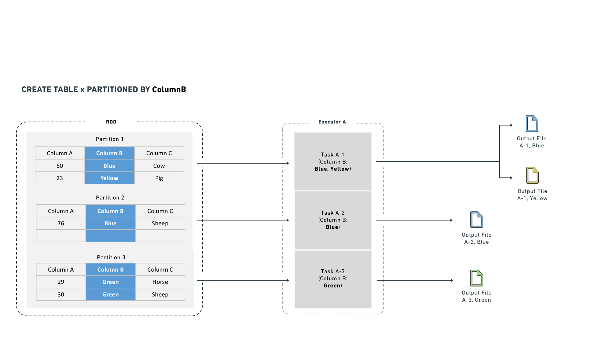
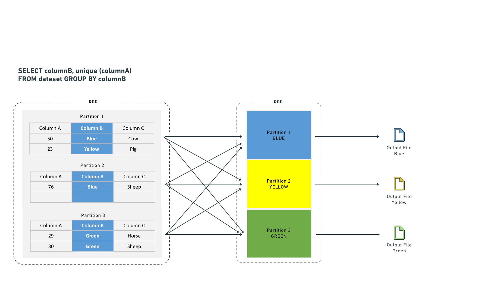
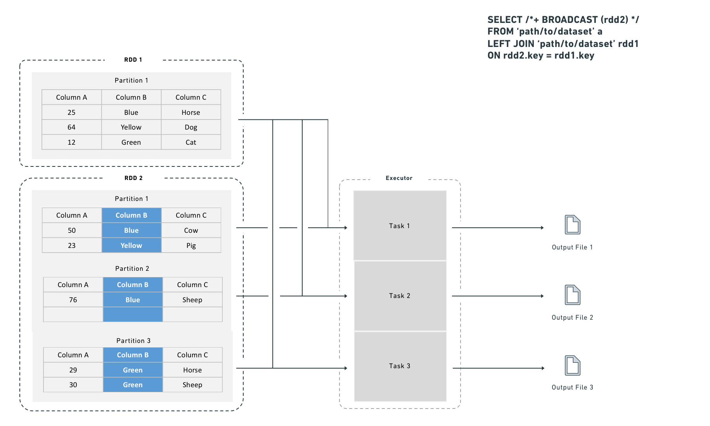
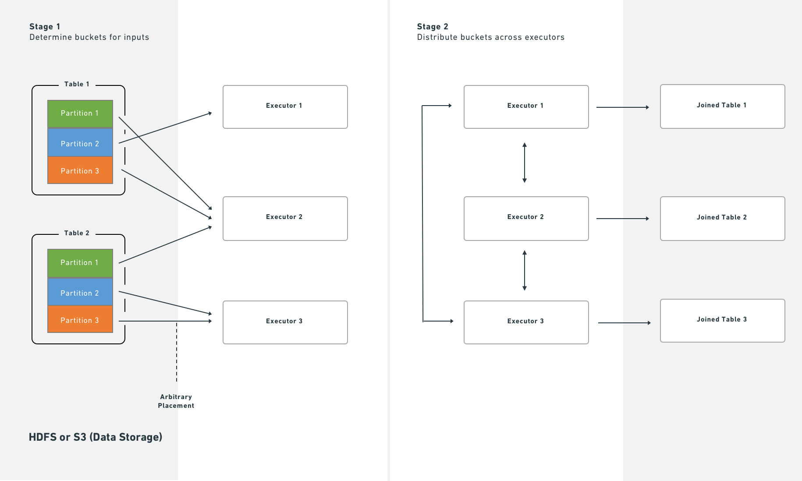
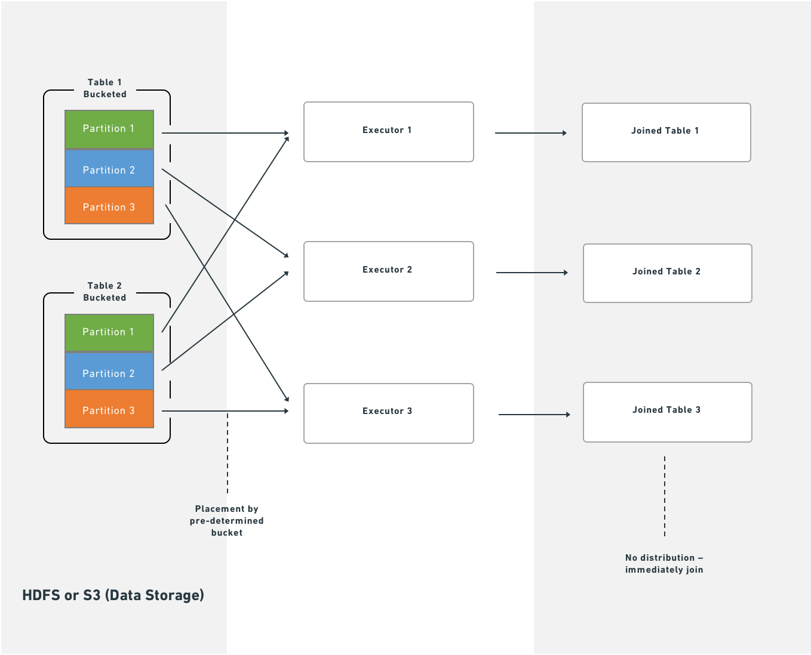

<!-- source: https://palantir.com/docs/foundry/optimizing-pipelines/spark-optimization/ · mirrored 2026-08-14 from Palantir Foundry docs -->

# Spark optimization

This page explains strategies and best practices for optimizing Spark pipelines. It covers both foundational and advanced concepts for building efficient pipelines on the Palantir platform.

## Basic optimization

Three core principles guide basic Spark optimization:

| Concept | Description |
| --- | --- |
| Reduce the data volume | Filter out unneeded rows early and drop unused columns. Keep filter expressions simple and specific. |
| Repartition | Balance the number of partitions against the number of executors by adjusting how files or partitions split. |
| Clean the data | Standardize values before processing. For example, normalize `Spark` and `spark` to a single casing. Spark treats differently cased strings as distinct values. |

### Reduce the data volume

A straightforward way to improve Spark performance is to remove unneeded data as early as possible. Two techniques help:

1. Reorder operations so that filters, ordering steps, and inner joins execute in earlier stages.
2. Drop columns that downstream logic does not require.

:::callout{theme="warning"}
Spark executes operations exactly as written. To avoid unexpected behavior, ensure your data is cleaned and standardized and that filters target precise values.
:::

Splitting or sorting on Parquet metadata (which Spark applies automatically) only benefits downstream performance when the input data is already clean and filtered.

:::callout{theme="neutral"}
What are some examples of inefficient filters?
Using a user-defined function (UDF) in DataFrames when an equivalent DataFrame API method already exists.
:::

### Why reducing data volume matters

Filtering early and dropping unused columns reduces the network I/O and disk I/O that each task performs, which improves overall job runtime.

**Operation order matters.** If you defer dropping unneeded data until a late stage, Spark processes that data through every preceding stage. Dropping it first eliminates that overhead. Note that the cost-based optimizer handles this reordering automatically when enabled.

For example, if `D` is a dataset that you inner join to datasets `SMALL` and `BIG`, this query:

```sql
SELECT * FROM D JOIN SMALL ON SMALL.key = D.key JOIN BIG ON BIG.key2 = D.key2
```

performs better than:

```sql
SELECT * FROM D JOIN BIG ON BIG.key2 = D.key2 JOIN SMALL ON SMALL.key = D.key
```

Restricting the column set on `D`, `BIG`, and `SMALL` improves performance further. Note that when Spark knows the sizes of `SMALL` and `BIG`, it attempts to keep the larger dataset in place automatically.

### Blind optimization

Blind optimization aims to improve Spark performance regardless of the specific operation. The general goal is to match the number of input splits to the number of executors. The correct executor count depends on your available resources and the workload.

Use the following approximations for the number of splits:

| Structure | Splits |
| --- | --- |
| Input files are split-compatible, not partitioned | number of splits = number of executors = (file size / HDFS block size) |
| Input files are split-compatible, partitioned | number of splits = number of executors = number of partitions |
| Input files are *not* split-compatible | number of splits = number of executors = number of input files |

In the last case, when input files are not split-compatible, Spark must fetch all blocks that compose a file *before* processing it. The read overhead therefore exceeds that of reading a single file under `BLOCK_SIZE`.

At worst, blind optimization can assign more data per node than that node can handle, which aborts the job. In that case, increase the number of tasks. Keep in mind that joins can produce output larger than the sum of the input datasets (when join keys match multiple rows). Matching input splits to executors can also cause problems when you aggregate and join, because the operation can produce groups that exceed available memory.

When you know the operation that will run, you can apply operation-aware optimizations. These let you control the number of **partitions** (or **input splits**) to reduce shuffling during computation. The two operation-aware optimizations are: 1) bucketing and 2) partitioning.

### Clean data

Spark does not infer intent from string content. Internally, Spark converts each unique string to a numeric identifier, and any difference in the string—including casing—produces a separate identifier. For example, Spark assigns `'filter'` one integer and `'Filter'` a different integer, which prevents it from recognizing that both represent the same value. To avoid this problem, make string filters case-sensitive (for example, filter for both `'filter'` and `'Filter'`) and clean data before processing (for example, normalize all variants to a consistent case without extra characters).

## Advanced optimization

The basic methods above are the minimum steps you should take for every pipeline. When they are not sufficient, the techniques in this section can help. Four goals guide advanced optimization:

1. Distribute data across multiple executors (partition) either evenly or by the correct key.
2. Keep task inputs small enough to fit in executor memory.
3. Reduce network I/O and disk I/O, which means limiting file count.
4. Reduce the number of tasks, because each task adds scheduling overhead.

Seven data-formatting methods address these goals. Which methods apply depends on your workload and priorities.

| Method | Alternative terms | Description | Affected step | When to use | When *not* to use |
| --- | --- | --- | --- | --- | --- |
| [Basic partitioning: Coalesce](#basic-partitioning-coalesce-changing-partition-count) | Coalesce, changing partition count, DataFrame partitioning, data formatting, repartitioning | Decrease the number of partitions between tasks, which reduces the total task count. | Step 2 (RDD to Executor) | After a task completes and you want fewer output partitions. | When the task does not significantly change the data volume. |
| [Basic partitioning: Repartition by value](#basic-partitioning-repartition-by-value) | Repartition, DataFrame partitioning, data formatting, partitioning by key | After computation, redistribute rows into new partitions based on a specific column value (for example, name or ID). | Step 2 (RDD to Executor) | When the partition column has a small number of distinct values (low cardinality). | When the partition column has many distinct values (approximately greater than 1,000). |
| [Hash partitioning](#hash-partitioning-bucketing-and-sorting) | Bucketing (and sorting) | Create sorted partitions in the RDD based on metadata. Output files use bucket identifiers (`output.bucket1.parquet`) rather than value names. | Step 3 (Executor to Output File) | When downstream computations match row keys (aggregates, joins) or when pre-sorting benefits multiple use cases. | When there is no clear downstream benefit. Use bucketing only when you have a specific performance goal. |
| [Hive partitioning](#hive-partitioning) | Dynamic partitioning, partitioning | After computation, split results into output files organized by a partition key, stored in subdirectories named for each key value. | Step 3 (Executor to Output File) | Large datasets with low-cardinality columns where filter pruning provides significant benefit. | When the result would be too many small files. |
| [Joins and aggregates](#joins) | — | Materialize a joined or aggregated dataset so that downstream transforms and services reuse it instead of recomputing the join. | N/A | When multiple downstream consumers repeatedly join these datasets (for example, in Contour). | When the unfiltered, joined dataset is too large, or when the join runs infrequently and the additional pipeline step harms overall performance. |
| [Split the transforms](#splitting-the-transform) | — | Break a single transform into multiple transforms to isolate intermediate steps. | N/A | When other techniques have failed, or when separate steps improve ease of debugging and manageability, or when you need to persist intermediate state. | When the techniques above already provide adequate performance. |
| [Increase resources](#increase-resources) | — | Allocate additional Foundry resources to your transform. Increasing resources for one transform adds load to the cluster and can reduce performance for other services. | All steps | As a last resort, only when no other option produces acceptable performance and you have an urgent need. | In all other cases. |

### Basic partitioning: Coalesce (changing partition count)

Coalesce accepts a target partition count and processes multiple input partitions sequentially within a single task.

**Advantage:** Coalesce works well when you have a large volume of roughly well-distributed data (for example, terabytes). It avoids the cost of redistributing data across the cluster.

**Disadvantage:** Coalesce does not redistribute data, so output tasks can remain unevenly sized.

```java tab="Java"
df.coalesce(N);
```

```python tab="Python"
df.coalesce(N)
```

SQL does not support this operation.

### Basic partitioning: Repartition by value

Repartitioning by value resembles coalesce, but it hashes each row and redistributes data evenly across the cluster.

**Advantage:** Produces evenly distributed data, which results in more predictable file sizes.

**Disadvantage:** Spark writes the dataset to scratch space and transfers it over the network. This cost grows with dataset size, so avoid repartitioning large datasets when the redistribution overhead outweighs the benefit.

```java tab="Java"
df.repartition(N);
```

```python tab="Python"
df.repartition(N)
```

SQL does not support this operation.

In SparkSQL, you can also repartition by a given set of columns, which hashes those columns instead of the entire row. This technique is discussed in later sections. Note that column-based repartitioning does *not* inform the Spark query planner when it reads the output files.

```java tab="Java"
df.repartition(N, "column1");
```

```python tab="Python"
df.repartition(N, "column1")
```

```sql tab="SQL"
DISTRIBUTE BY column1
```

### Hash partitioning (bucketing and sorting)

The basic partitioning methods above are the first techniques to try for improving pipeline performance. However, because Palantir uses SparkSQL throughout, you can extend optimization further by writing datasets in a format that benefits the SparkSQL query planner. SparkSQL lets you write metadata that describes how a dataset is partitioned and the sort order within each partition, which it can then use to skip expensive operations downstream. Two methods provide this: 1) bucketing (and sorting) and 2) Hive partitioning.

**Bucketing** groups rows by key into output files, which accelerates computations that match keys across rows (joins, group-by operations). When you have multiple inputs, bucket all of them for the best results. Bucketing resembles partitioning but places multiple values per partition rather than a single value. Choosing the right bucket count requires balancing several constraints—the goal is to create files that:

* Fit on each node (to use available space) without exceeding node capacity (to avoid crashes)
* Are no smaller than the HDFS block size
* Follow the one-to-one principle of partitions to tasks to executors (unless doing so contradicts the previous constraints)

:::callout{theme="neutral"}
Bucketing and sorting benefit large datasets, but you must understand or control your data distribution before applying them. Bucketing alone helps, but combining bucketing with sorting yields the best results.
:::

The general recommendation is to target output files (buckets) of 128–512 MB. If you perform numerous large joins, you may need to adjust these targets.

Even when an input partition is 128 MB, computation can expand the data. A 128 MB input partition can produce a 512 MB output file.

#### Bucketing with SparkSQL

:::callout{theme="neutral"}
SQL statements that use `CREATE TABLE`—including the bucketing and sorting operations described below—cannot run in Code Workbook. To bucket with SQL, use a Code Repository with the syntax below.
:::

```sql
CREATE TABLE `/path/to/output` USING parquet
CLUSTERED BY (a)
SORTED BY (a)
INTO 200 BUCKETS AS (
SELECT a, b, c
FROM `/path/to/dataset`
CLUSTER BY a
)
```

The query above uses two separate SQL commands that serve different purposes:

* `CLUSTERED BY` (and `SORTED BY`) modify the `CREATE TABLE` statement to specify the physical layout of the table. These keywords control the actual bucketing into separate files.
* `CLUSTER BY` is a data operation that triggers a shuffle so that tasks within the cluster group data by the specified key. This step is generally necessary because each Spark task and executor operates independently. Without `CLUSTER BY`, each task buckets only the data in its own executor memory.

**Example: why `CLUSTER BY` matters**

Consider a case with 200 final tasks, bucketing by a key that has 200 possible values. Without `CLUSTER BY`, those 200 values spread evenly across all 200 tasks. Each task creates one file per key value it encounters, producing 200 × 200 = 40,000 files. This file count causes the read overhead for the next pipeline step to increase sharply.

You can omit `CLUSTER BY` if you know that each task already owns data with a nearly one-to-one relationship to the bucketing key (for example, after a `GROUP BY`). Omitting it saves a shuffle, but monitor the number of output files carefully.

**Note:** The SQL interface to Spark does not always produce the expected result (that is, one file per bucket). If you cannot adjust the SQL to achieve the desired output, use Python instead.

`numPartitions` controls the number of output files. The `shuffle` parameter forces a rebalance of data across files. If your input is already well-balanced, set shuffle to `false` to improve performance. If your input is unbalanced—or if the transformation creates imbalance (for example, a filter that only matches rows in some input files)—set shuffle to `true`.

In Python, two methods correspond to the shuffle/no-shuffle options. The no-shuffle equivalent (`shuffle: false`):

```python
df.coalesce(N)
```

The shuffle equivalent (`shuffle: true`):

```python
df.repartition(N)
```

#### Example: Bucketing a claims dataset

You have a `claims` dataset, and most of your analysis involves window functions over a given `patient_id`, joins on `patient_id` to bring in reference data, or aggregations.

By default, this query:

```sql
SELECT claims.patient_id, age FROM claims LEFT JOIN patients on claims.patient_id = patients.patient_id
```

Produces this physical plan:

```text
== Physical Plan ==*Project [patient_id#50, age#52]+- SortMergeJoin [patient_id#50], [patient_id#51], LeftOuter:- *Sort [patient_id#50 ASC NULLS FIRST], false, 0:  +- Exchange hashpartitioning(patient_id#50, 200):     +- *FileScan parquet default.claims[patient_id#50] Batched: true, Format: Parquet, Location: InMemoryFileIndex[file:/Volumes/git/spark/spark-warehouse/claims], PartitionFilters: [], PushedFilters: [], ReadSchema: struct<patient_id:string>+- *Sort [patient_id#51 ASC NULLS FIRST], false, 0+- Exchange hashpartitioning(patient_id#51, 200)+- *FileScan parquet default.patients[patient_id#51,age#52] Batched: true, Format: Parquet, Location: InMemoryFileIndex[file:/Volumes/git/spark/spark-warehouse/patients], PartitionFilters: [], PushedFilters: [], ReadSchema: struct<patient_id:string,age:int>
```

The `Exchange` after each `FileScan` indicates that Spark shuffles the table by `patient_id` into 200 partitions, sorts each partition by `patient_id`, and then performs the `SortMergeJoin`. With 100 GB of claims and 1 GB of patients, this produces a resource-intensive job because Spark must redistribute all of that data across the cluster.

You can trade write-time cost for faster read-time by rewriting both `claims` and `patients` with bucketing metadata:

```java tab="Java"
DatasetFormatSettings format = DatasetFormatSettings.builder()
.numBuckets(200)
.addBucketColumns("patient_id")
.addSortColumns("patient_id")
.build();

output.getDataFrameWriter(df)
.setFormatSettings(format)
.write();
```

```python tab="Python (Code Repository)"
output.write_dataframe(df,bucket_cols=["patient_id"],bucket_count=200,sort_by=["patient_id"])
```

```python tab="Python (Code Workbook)"
from vector.api import DataFrameReturn

def my_vector_node(my_input):
  return DataFrameReturn(my_input,
     bucket_cols=["patient_id"],
     bucket_count=200,
     sort_by=["patient_id"])
```

```sql tab="SQL"
CREATE TABLE `claims` USING parquet
CLUSTERED BY (patient_id)
SORTED BY (patient_id)
INTO 200 BUCKETS AS
SELECT ...
```

The same query now produces this physical plan:

```text
== Physical Plan ==*Project [patient_id#72, age#73]+- SortMergeJoin [patient_id#72], [patient_id#75], LeftOuter:- *FileScan parquet default.claims[patient_id#72,age#73] Batched: true, Format: Parquet, Location: InMemoryFileIndex[file:/Volumes/git/spark/spark-warehouse/claims], PartitionFilters: [], PushedFilters: [], ReadSchema: struct<patient_id:string,age:int>+- *FileScan parquet default.patients[patient_id#75] Batched: true, Format: Parquet, Location: InMemoryFileIndex[file:/Volumes/git/spark/spark-warehouse/patients], PartitionFilters: [], PushedFilters: [], ReadSchema: struct<patient_id:string>
```

Because Foundry stores metadata about bucketing and sorting, Spark starts the join immediately after fetching data from HDFS or S3. This eliminates the shuffle and sort stages, which reduces job runtime. No local disk writes occur and no additional network traffic beyond the initial fetch is required.

#### How bucketing affects the write side

Bucketing and sorting do not change the transformation itself—they only control how the final tasks of the job write output. Using the claims example: instead of writing output data sequentially to a single file, Spark creates a temporary column, `bucket`, defined as `hash(patient_id) % 200`, and then sorts within the partition by `(bucket, patient_id)`. If your input data looks like this:

```text
A
C
A
A
B
C
```

Spark formats it as follows (assuming A and B hash to 0 and C hashes to 1):

```text
0 A
0 A
0 A
0 B
1 C
1 C
```

Spark then scans through the partition and writes a separate file for each bucket value—two files in this case.

If you run `repartition(200, "patient_id")` immediately before writing, each task produces a single file because the bucket value is constant within each task. However, with evenly distributed data, the worst case is that each task writes 200 individual files. With 200 output tasks, that produces 40,000 output files, which degrades both write and read performance. A high file count also affects Foundry Catalog and Cassandra performance, so limit the number of output files as much as possible.

### Hive partitioning

"Partitioning" is an overloaded term in Spark. Documentation typically distinguishes this variant with the labels "Hive-style," "directory," or "dynamic" partitioning.

**Hive partitioning** occurs in step three. Apache Hive is a system for storing, querying, and analyzing large datasets in a distributed computing environment.

Hive partitioning writes data in the same way as bucketing, but adds a partition column to the output sort. Spark uses this column to organize data into subdirectories—it produces at least one output file for each unique value in the partition column. Because of this, use Hive partitioning for low-cardinality columns (columns with many repeated values) where filter pruning provides measurable benefit.

:::callout{theme="neutral"}
As with bucketing, Hive partitioning can produce too many small files if you are not careful.
:::

:::callout{theme="neutral"}
Both bucketing and Hive partitioning break the one-to-one principle. They either output a different number of files than tasks or rearrange which data each task writes, so the result is not necessarily one output file per task.
:::



Hive partitioning optimizes partition pruning, filter pushdown, and shuffles. It works best on low-cardinality columns and writes one output file per unique value in each task.

Hive partitioning also integrates with the query planner to make filtering more efficient by reducing the number of files Spark reads. It organizes data into directories named by partition column value. Filter queries can then examine the directory structure to prune files rather than reading data from disk.

For example, if you partition by "year" and "month," Spark lays data out as `/path/to/dataset/year=2017/month=09`.

This layout allows Spark to read only the files that match a filter (for example, a `WHERE` clause in SQL). While Hive partitioning can reduce filter-dependent overhead significantly, it also increases the number of output files (at least one per partition). Non-filter operations become less efficient because Spark must read from many files.

#### Hive partitioning with SparkSQL

:::callout{theme="neutral"}
SQL statements that use `CREATE TABLE`—including the Hive partitioning operation described below—cannot run in Code Workbook. To use SQL, work in a Code Repository with the syntax below.
:::

```sql
CREATE TABLE `/path/to/output` USING parquet
PARTITIONED BY (a) AS (
SELECT a, b, c
FROM `/path/to/dataset`
CLUSTER BY a
)
```

The `CLUSTER BY` command is still necessary, for the same reasons described in the bucketing section.

You can combine `CLUSTERED BY` and `PARTITIONED BY`, which generates both subdirectory separation and file-level bucketing. Use caution when combining these options, because the combination can produce a large number of output files.

#### Example: Partitioning log data

You have log data arriving daily and most queries are time-bounded, so you partition by date:

```text
date=2017-01-01/my_parquet_file0
date=2017-01-02/my_parquet_file1
...
date=2017-01-30/my_parquet_file30
```

If you query:

```sql
SELECT * FROM logs WHERE date < to_date('2017-01-03')
```

Spark touches only the files under the `2017-01-01` and `2017-01-02` directories. This reduces both the total data read and the number of tasks. The physical plan for a correctly partitioned query looks like this:

```text
*FileScan parquet default.logs[content#158,date#159] Batched: true, Format: Parquet, Location: PrunedInMemoryFileIndex[], PartitionCount: 2, PartitionFilters: [isnotnull(date#159), (date#159 < 17169)], PushedFilters: [], ReadSchema: struct<content:string>
```

`PartitionCount` shows the number of Hive partitions that passed the `PartitionFilters`. These partitions become the input to the `FileScan`.

As noted above, Hive partitioning uses the same write mechanism as bucketing:

```java tab="Java"
DatasetFormatSettings format = DatasetFormatSettings.builder()
.addPartitionColumns("date")
.build();

output.getDataFrameWriter(df)
.setFormatSettings(format)
.write();
```

```python tab="Python"
output.write_dataframe(df, partition_cols=["date"])
```

```sql tab="SQL"
CREATE TABLE `logs` USING parquet
PARTITIONED BY (date) AS
SELECT ...
```

:::callout{theme="danger"}
Mesa datasets that consume Hive-partitioned data cannot read Hive partition columns correctly; these columns become null values. Do not use Hive partitioning if a direct consumer is a Mesa Transforms dataset.
:::

### Joins

Certain computations require executors to shuffle data so that rows with the same key are co-located. Shuffles consume network I/O and disk I/O, which degrades performance. You can reduce this cost by materializing the join or aggregate as a separate dataset. This approach computes the join once, and subsequent transforms or Contour services reuse the result instead of recomputing it, which avoids repeated shuffle costs.



Executors shuffle data to co-locate rows by key for certain computations. Shuffles consume network I/O and disk I/O. Joining and aggregating (then sorting) before computation eliminates the need to shuffle data. This resembles Hive partitioning, but occurs before the task starts rather than after it completes.

Spark supports two join strategies:

* **Sort-merge join (default):** Spark shuffles both sides by join key, sorts each partition, and then merges. This requires both a shuffle and a sort. You can improve sort-merge join performance by bucketing the inputs by join key.
* **Broadcast join:** Spark copies the right-side dataset to every executor before executing the join. Because no row-level shuffle is required, broadcast joins perform faster. However, broadcast joins duplicate the entire right-side dataset to every executor, which increases total memory consumption across the cluster.

A broadcast join copies the right-side dataset to every specified executor before executing the join:



#### Choosing between a shuffle join and a broadcast join

Use a broadcast join when the smaller dataset fits in executor memory (for example, fewer than one million rows). Spark applies broadcast joins automatically based on the `autoBroadcastJoinThreshold` setting, which defaults to 10 MB on disk and is user-configurable. You can also provide explicit hints, which are useful for intermediate results that you know are small (for example, after an aggressive filter or a join that reduces row count).

#### Broadcast join syntax

```python tab="Python"
from pyspark.sql import functions as F

df_a.join(F.broadcast(df_b), df_a["key"] == df_b["key"], "left")
```

```sql tab="SQL"
SELECT /*+ BROADCAST (b) */ *
FROM `path/to/dataset` a
LEFT JOIN `path/to/dataset` b
ON a.key = b.key
```

Depending on configuration, Spark may convert a join to a broadcast join automatically for small datasets, even without the hint above.

Without bucketing, joins require an extra distribution stage:



With bucketing, Spark executes joins immediately after reading partitions from HDFS or S3:



### Splitting the transform

If bucketing, partitioning, and join materialization do not resolve performance issues, consider splitting a single transform into multiple transforms. This approach can clarify the minimal intermediate datasets needed and the most efficient partitioning and bucketing for each step. Note, however, that splitting jobs introduces scheduling and orchestration overhead, so expect some performance penalty.

### Increase resources

**As a last resort**, you can request that Foundry allocates additional resources to your transform. Use [transform metrics](/docs/foundry/transforms-python/metrics/) to measure and monitor the performance of your pipelines before and after making changes. Exhaust the techniques above before requesting more resources, because:

* Additional resource allocation increases the load on the cluster.
* Spark uses a "fair share" mechanism to reclaim unused resources from other jobs. If multiple transforms over-allocate, they reclaim each other's resources continuously, which adds overhead and reduces performance for all services on the cluster.

Some transformations on large datasets cannot complete in acceptable time without additional resources. If you determine that more resources are necessary, contact Palantir Support to obtain the correct allocation.
