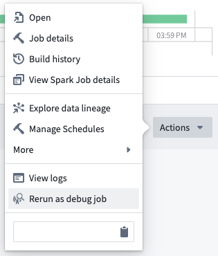
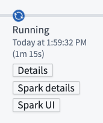
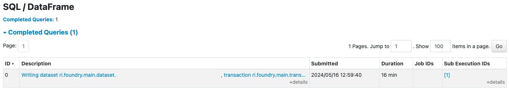
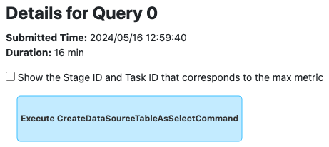
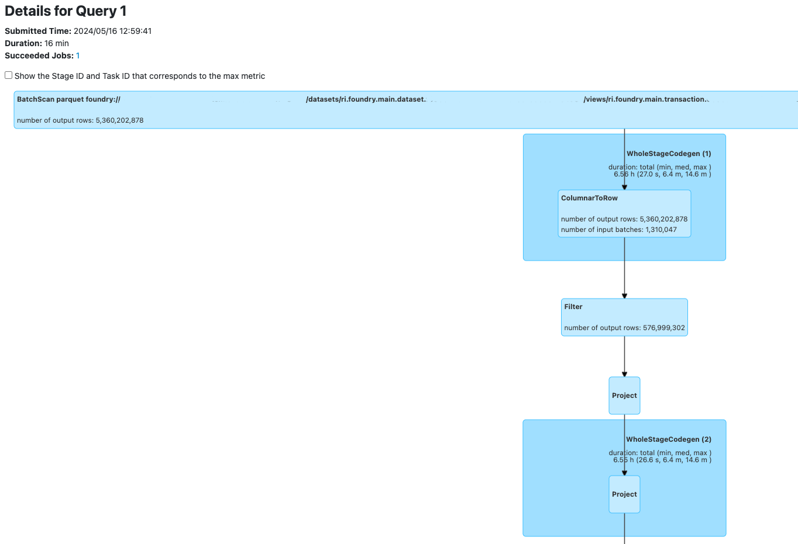
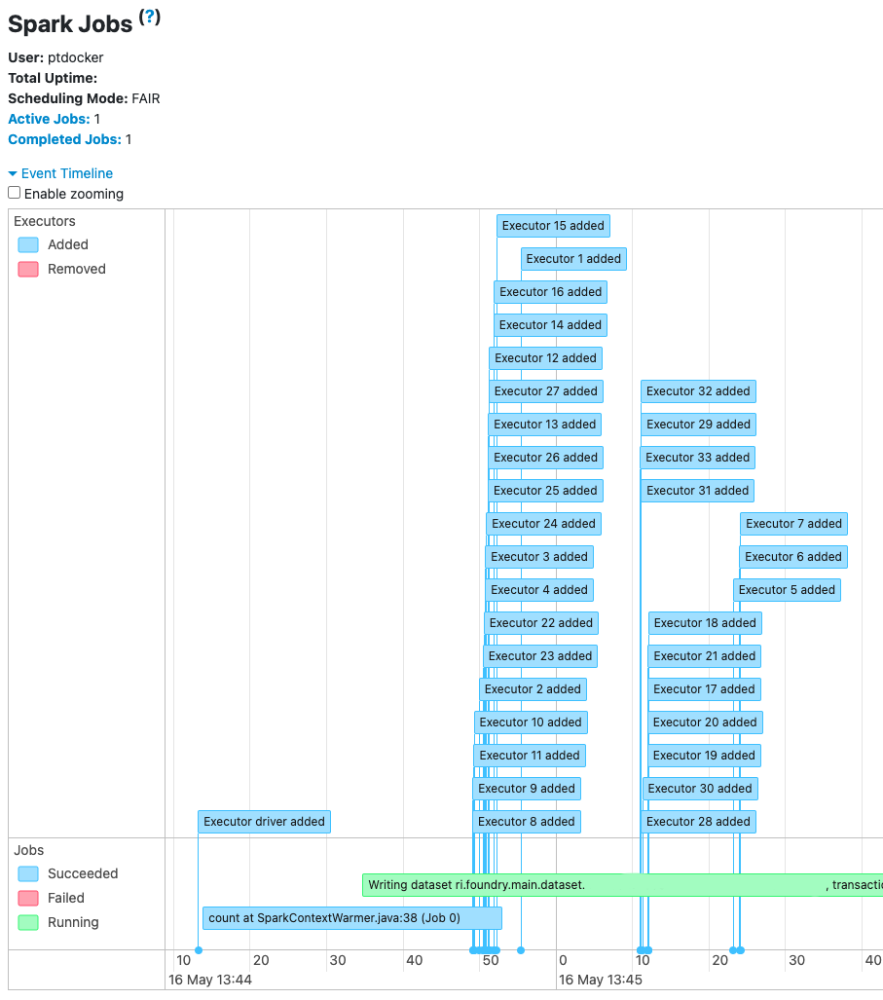

<!-- source: https://palantir.com/docs/foundry/optimizing-pipelines/spark-ui/ · mirrored 2026-08-14 from Palantir Foundry docs -->

# Spark UI

Spark has its own [Web UI ↗](https://spark.apache.org/docs/latest/web-ui.html) which complements Foundry's [Spark details](/docs/foundry/optimizing-pipelines/understand-spark-details/) page with additional information, including:

* Executor lifecycle information, such as executor launch and shutdown.
* Larger samples of task and executor metrics, including peak memory usage.
* All Spark configs used during execution.

## Viewing Spark UI

To view the Spark UI for a Transforms job, re-run the job as a [debug job](/docs/foundry/transforms-common/transforms-versions/#debug-jobs). You will see a **Spark UI** button; selecting this will open Spark's Web UI.

:::callout{theme="neutral"}
Spark events appear in the Spark UI after a delay of 1-2 minutes.
:::

## Spark UI in Foundry usage

Spark's Web UI is rich in detail but does not present information in a manner tailored for Foundry. Below, we provide advice on navigating Spark's Web UI for Foundry jobs.

### SQL execution

Spark can break up SQL queries into a main query and one or more subqueries. In some cases, a subquery is more interesting than the main query. This is true for many dataset writes in Foundry.

When viewing a *"Writing dataset ..."* SQL execution in the Spark UI, you can find the query graph for the write linked under **Sub Execution IDs**.

### Context warming

The **Jobs** tab in the Spark UI shows that Transforms jobs trigger an initial `count` job. The purpose of the `count` job is to request executor allocations early, while the runtime performs additional setup (including installing dependencies). This increases the likelihood of executors being available by the time the Transform is ready to run.

